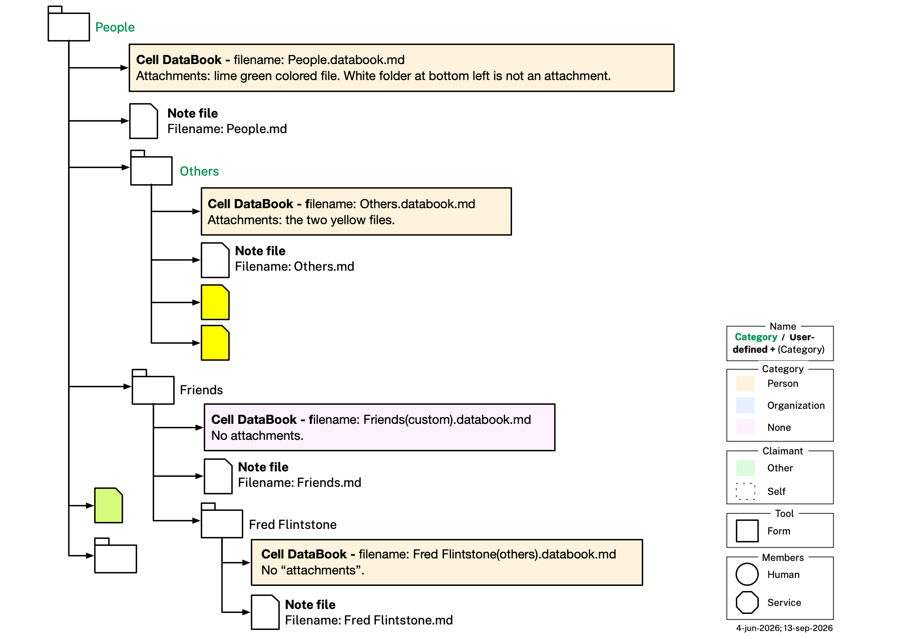

# Cellula App Behavior

This file continues [README.md](README.md) and [EXAMPLE.md](EXAMPLE.md), which describe the Category, Cell, Topic, Persona, and Organization ontologies and illustrate them with a worked example. This file documents how the app behaves *on top of* that data — cell lifecycle, storage, sharing, permissions, naming/renaming, how a cell maps onto an actual filesystem folder, and what happens when a shared cell arrives somewhere new. Nothing in this file changes any `.ttl` file or DataBook triple — every rule here is app-level behavior, not an ontology rule.

## Cell Management

Everything in this file, so far, is about how the app manages a **cell** specifically — its lifecycle, storage, membership, permissions, naming, filesystem mapping, and what happens when one is shared. A future non-cell app-behavior topic would get its own top-level section alongside this one.

### Lazy Instantiation

Cells for most `cat:Category` subclasses are not pre-created ahead of time. A cell is not created until the user wants one. When a cell matching a templated class (one carrying a `cat:templateCell` value) is first created, the app clones that class's `c:TCell` template into the new cell: whatever `c:templateShape` value the template carried is copied into the new cell's `c:shape`, and the clone is given real member-classified content — typed with a concrete `c:ACell` subclass (e.g. `c:OneMember`) — rather than staying purely a template.

### Storage

Cells are stored on the user's device(s) or, for organizations, on Personal Data Network (PDN) nodes hosted by that organization. No cell is ever stored by any cloud provider, or any third party of any kind, including The Mee Foundation. When a cell is shared, changes to its contents — including its own name, for a `c:OneMember` or `c:ThreePlusMember` cell — propagate to every member over the PDN; see [Naming, Renaming, and Sharing](#naming-renaming-and-sharing) below for what stays independent per member instead.

### Number of Members

A cell can have just one member (the user) or several. We don't yet know how many members a cell can support, but the number is almost surely well under 100.

### Write Permissions

Notes, files, and chat are all freely readable and editable by anyone in the cell. The permissions on who can write/edit which info fields vary.

### Naming, Renaming, and Sharing

For a `c:OneMember` or `c:ThreePlusMember` cell, any member of the cell — not just its creator — can rename it, and the new name propagates to every member. The app's cell model has no creator/admin-only privilege tier for this or any other content action, matching [Write Permissions](#write-permissions) above, where notes, files, and chat are already freely editable by anyone in the cell. This mirrors how **Slack** and **Notion** handle renaming by default: any member/editor can rename a channel or page, and the new name propagates to everyone. It's a deliberate contrast with **Microsoft Teams** (channel owners only, by default), **Discord**, and **GitHub**, which restrict renaming to a privileged admin/Manage-Channels/owner role — a distinction the app's cell model doesn't have to begin with. A `c:TwoMember` cell does *not* follow this rule — see the exception below.

A cell's name must be unique among its sibling cells — the cells directly nested under the same parent. When a user renames a cell — e.g. to give it a name of its own choosing, different from its origin category's label, the same convention followed by other PKM tools — to a name that already belongs to one of its siblings, the app doesn't prompt or reject the input: it silently appends the next available integer suffix (`"1"`, `"2"`, ...) to make the name unique. The same rule applies when creating a brand-new cell whose default name (e.g. copied verbatim from its origin category's own label) would otherwise collide with an existing sibling.

This same uniqueness rule applies on **receipt** of a shared cell — for both `c:TwoMember` and `c:ThreePlusMember` cells alike — and, once a `c:TwoMember` cell's name goes independent per member (see the exception below), on every later rename by either member too: if the incoming or renamed name collides with a cell the recipient already has at that position in their own tree, the app appends the next available suffix to it rather than overwriting the existing cell or rejecting the incoming/renamed one.

**Exception: `c:TwoMember` cells.** A two-member cell's name is never shared, synced content between its two members, in contradiction to the general rule above — each member is independently responsible for the name on their own side. This is because, unlike a `c:ThreePlusMember` cell (a genuine group identity with no single "other side" to name from), a two-member cell is an asymmetric dyad: each member's name for it naturally reflects their own perspective on the *other* party, and there's no single name that fits both. The creator's name for their own copy is simply whatever they set it to — chosen and renamed exactly as for any other cell, subject only to the sibling-uniqueness rule above, but never propagated to the recipient's copy.

At **first-time receipt** of a `c:TwoMember` cell — the recipient self-evidently did not create it, they're joining one already created — the app does not just adopt the creator's name as shared content. Instead, once, at that first receipt, it analyzes the `c:memberTopics` graph(s) belonging to the cell's creator/sender member and auto-generates a name for the cell from that analysis. (The sender's own choice of name for their copy is naturally centered on their own perspective, so blindly reusing it verbatim on the recipient's side would be a poor fit; analyzing the sender's own member topics lets the recipient's app derive a name that makes sense from its own side instead.) This auto-generated name is subject to the same sibling-uniqueness suffixing described above.

For example, Alice creates a `c:TwoMember` cell about her relationship with Bob and names it "Bob" on her own side, then shares it with Bob. On first receipt, Bob's app doesn't just copy "Bob" — that's Alice's name for *him*, not a name that makes sense in Bob's own tree. Instead it scans the cell's `c:memberTopics` graph(s) belonging to Alice, finds a topic graph about Alice herself, extracts her given name, and names the cell "Alice" on Bob's side instead.

From that point on, both the creator's and the recipient's names for their own copies may be freely renamed at any time, exactly like a `c:OneMember` cell's name — but such a rename stays purely local to the renaming member's own tree and is never propagated to the other member's copy, in either direction. This is what keeps the first-receipt divergence meaningful: if a later rename on either side rippled to the other, it would silently overwrite a name chosen to fit that member's own perspective, defeating the reason the divergence exists in the first place.

### Filesystem Persistence

A folder is a **cell** exactly when it holds one **cell DataBook** (see [Representative Cells](README.md#representative-cells) in README.md) directly inside it, whose filename's `<local>` segment is an exact copy of the folder's own name — that single file alone marks the folder as a cell. A folder without a matching cell DataBook is simply a **regular filesystem folder**, not a cell — even if it contains nested cells of its own further down. A folder can never hold more than one cell DataBook, because a `c:Cell` is, by definition, self-contained, and letting two cells share a folder would risk a single file in that folder becoming ambiguously part of both.

A cell's DataBook may carry a `c:origin` value, asserted as `mia.origin` in its own YAML front matter. When present, it records the `cat:Category` subclass — always ultimately reachable from `cat:Person` or `cat:Organization` — the cell was originally instantiated from; this value is fixed at that point, not re-derived from the cell's folder's current name, so the folder can be freely renamed or moved without needing to update it. There are accordingly **three category types**, and the diagram below colors each cell's folder icon fill by which one it is: **Person** (tan, origin reachable from `cat:Person`), **Organization** (light blue, origin reachable from `cat:Organization`), and **Custom** (purple, no `c:origin` at all — a cell the user created without picking any existing `cat:Category` class). Custom is identified precisely, not by judgment call: the cell's DataBook filename carries the literal `(custom)` disambiguator in place of an origin-derived `<catType>` (e.g. `Friends(custom).databook.md` — see the [Cell DataBook Filename Convention](CLAUDE.md#cell-databook-filename-convention) in CLAUDE.md).

A cell's own **name** — its filesystem folder's own name — is a separate, purely display-level choice, independent of the above: when the cell does have an origin, the name may be copied verbatim from that origin category's own `rdfs:label` (e.g. a cell named "Others" whose origin is `cat:Others`), or the user may give it a different name entirely (e.g. a cell named "Bob Johnson" whose origin is still `cat:Others`). This name is recorded in the cell DataBook's own `title:` YAML field, which always equals the folder's own name verbatim (same case, spacing, and punctuation) and is kept in sync with it — renaming the folder means updating `title:` to match, not the other way around; `title:` is never an independent override of the folder's name. For a `c:OneMember` or `c:ThreePlusMember` cell, this name is part of the cell's own shared content: it is kept in sync and identical across every member's copy, exactly like its topics, files, notes (a note's own text, including any links it contains, but not necessarily the resolvability of a link pointing outside the cell — see the folder note description below), chat, `c:origin`, and every other field in its DataBook (see [Introduction to Cells](README.md#introduction-to-cells) in README.md). What stays independent per member is only their own tree *position* for the cell — the parent it's nested under, and so that parent's own name — since a cell carries no property recording its own tree position at all. A `c:TwoMember` cell is the one exception: there, the name itself is also independent per member, alongside tree position, rather than shared — see [Naming, Renaming, and Sharing](#naming-renaming-and-sharing) above for both this exception and how the app keeps a shared name unique within each member's own tree. The diagram renders this in the folder-name text color — **green** ("Predefined folder name") when the name matches the origin's label verbatim, plain **black** ("User-defined folder name") when the user has customized it. This text color is unrelated to the icon fill color above — a cell can be tan-filled (Person) with black text (e.g. "Bob Johnson"), light-blue-filled (Organization) with black text, or purple-filled (Custom, no origin at all) with black text — a Custom cell's name has no label to possibly match, so it is always black text too, never green.

- Every file and non-cell subfolder found inside a cell's folder — to any depth — that is not itself a descendant cell (see below) is that cell's own content, shown in the app's Files tab, and travels with the cell when it's shared. A nested folder that is itself a cell (i.e. holds its own cell DataBook) is a **descendant cell** — a separate node in the tree — and is never counted as part of its ancestor's content, even though it physically sits inside the ancestor's folder.
- One special file is the cell's **cell DataBook** (a `.databook.md` file with `type: cell-databook`) — see above for why a folder can never hold more than one. A cell DataBook's *filename* matches its own folder's name verbatim, with each space replaced by a hyphen (spaces are illegal inside a raw Turtle IRI), and its `title:` field is exactly the folder's own name — the cell's name — updated whenever the folder is renamed. Its `id`, by contrast, is a flat, opaque `cell-<NN>` value independent of the folder name (see CLAUDE.md's Check 9), the same pattern topic ids already use.
- Another special file acts as a note about the cell. This so-called *folder note* is stored as a file named `X.md` inside the `X` folder. Using the same name as the folder matches the convention used by PKM (Personal Knowledge Management) tools such as Obsidian (using the Folder Notes plugin), Logseq, Foam and others — including the same freeform, vault-wide linking these tools support: a folder note may link to any other note anywhere in the user's tree of cells, not just within its own cell. A link's own text travels with the cell's note when the cell is shared, but the linked-to note itself does not: if the target lies outside this cell's own boundary (i.e. it isn't part of this cell's own Files-tab content or its own folder note), the recipient may not have that other cell at all, or may organize their tree completely differently, so the link simply won't resolve on their side. This is an accepted limitation of cross-cell linking, not a defect.

### Auto-Filing on Receipt

When a cell is shared with someone who doesn't yet have the app, receiving it — e.g. clicking an invite link — triggers installation, and the app must then decide where to file the incoming cell in the recipient's own tree of cells.

For example (see EXAMPLE.md's ["Ginger's Medications"](EXAMPLE.md#gingers-medications) for the underlying cell and topics): imagine Paula doesn't use the app yet, and the invite link from Alice to [cell 40](<example/Cells/Pets/Ginger/Health/Medications/Medications.databook.md>) causes Paula to click on the link and download/install it. The app receives the cell, but where should it file it on Paula's side? Paula's app examines the cell, looks at its category type "Medications," and makes a good (though not perfect) guess to create the following tree of empty cells: People > Others > Alice > Pets > Ginger > Health, and files the incoming cell as a new child of that Health cell.

Ideally it would have filed the cell shared by Alice's app under People > Immediate Family, because she is Paula's daughter, but Paula's app didn't know that, so it did the best it could. To perfect things, Paula can create an Immediate Family cell under her People cell and move Alice (and sub-cells) under it.
