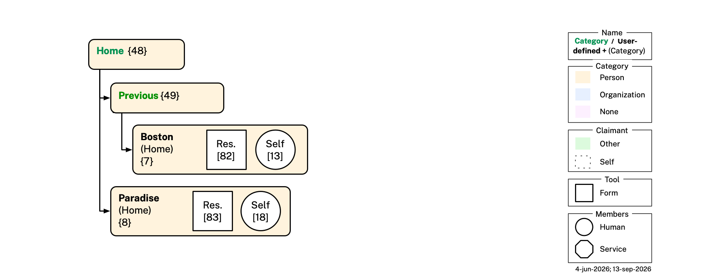
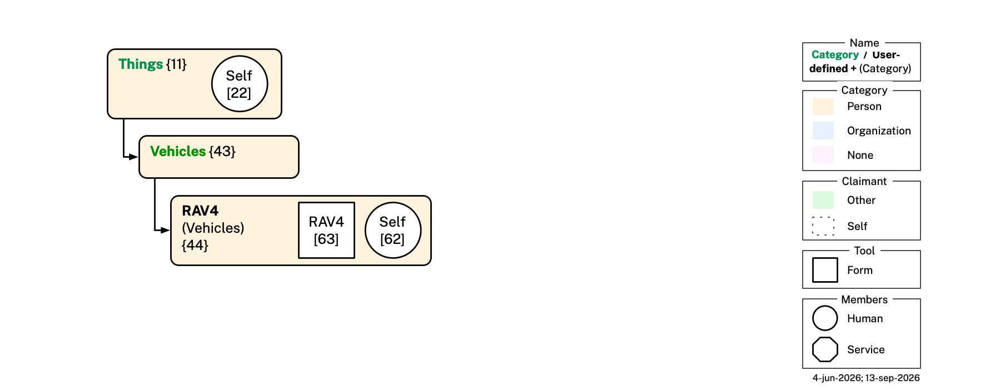
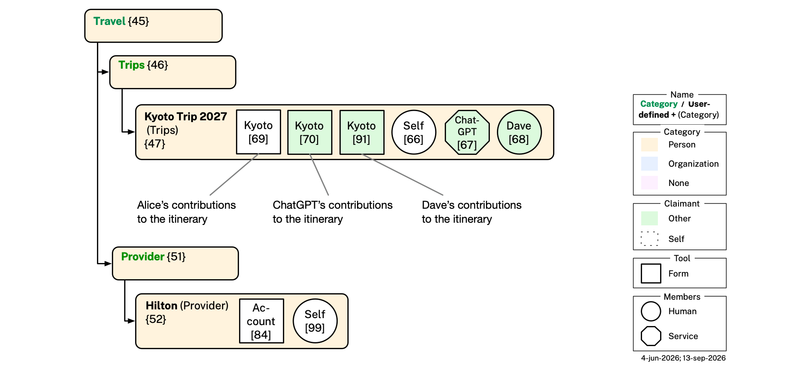

# Cellula Ontologies — Illustrative Example

This file continues [README.md](README.md), which describes the Category, Cell, Graph, Persona, and Organization ontologies, and is continued by [APP-BEHAVIOR.md](APP-BEHAVIOR.md), which documents how the app behaves on top of this data. It provides an illustrative example — a hypothetical user, Alice Walker — showing how those ontologies are used together, followed by diagram-generation instructions and the full validation pipeline for the example dataset. 

## Illustrative Example: Alice 

This section describes the local dataset for a hypothetical user, Alice Walker. Alice's cells — each a folder holding exactly one cell DataBook file — live in a tree of cells rooted at `example/Cells/`. Every mention of "Self" in the following is a reference to the user, Alice.

### Bob and Fred

Alice knows two people, Bob and Fred. She has created two *Two-Member* cells nested under *Others* sharing one with Bob and the other with Fred. 

In her shared cell with Bob ([cell 16](<example/Cells/People/Others/Bob Johnson/Bob Johnson(others).databook.md>)) Alice has included some claims about herself ([graph 12](<example/Cells/People/Others/Bob Johnson/Bob Johnson(others).databook.md#graph-12>)) including her given name "Alice", her family name "Walker", etc. She has included ([graph 4](<example/Cells/People/Others/Bob Johnson/Bob Johnson(others).databook.md#graph-04>)) her claim that Bob's favorite drink is an oat milk cappuccino. Bob has claimed some contact information about himself ([graph 2](<example/Cells/People/Others/Bob Johnson/Bob Johnson(others).databook.md#graph-02>)), and he claims that her favorite drink is Pepsi ([graph 8](<example/Cells/People/Others/Bob Johnson/Bob Johnson(others).databook.md#graph-08>)).

<p align="center"></p>

### Taking Care of Paula

To capture Alice's family-related relationship with her mother, Paula Walker, Alice created a cell ([cell 12](<example/Cells/People/Immediate Family/Paula Walker/Paula Walker(immediate-family).databook.md>)) named *Paula Walker*, nested under her *Immediate Family* cell. The subjects of this cell are Self and Paula. The cell (graphs [7](<example/Cells/People/Immediate Family/Paula Walker/Paula Walker(immediate-family).databook.md#graph-07>), [5](<example/Cells/People/Immediate Family/Paula Walker/Paula Walker(immediate-family).databook.md#graph-05>), [21](<example/Cells/People/Immediate Family/Paula Walker/Paula Walker(immediate-family).databook.md#graph-21>)) capture her connection with Paula. 

Alice spends time taking care of her mother, so she has, by herself assembled some information about Paula in some non-shared cells. In the *Health & Wellness* cell Alice keeps a record of Paula's physical characteristics such as height, eye color, hair color in [graph 17](<example/Cells/People/Immediate Family/Paula Walker/Health & Wellness/Health & Wellness.databook.md#graph-17>). This is a *Single-Member* cell whose subject is Paula. Its required `member` slot holds a minimal graph about Alice herself ([graph 35](<example/Cells/People/Immediate Family/Paula Walker/Health & Wellness/Health & Wellness.databook.md#graph-35>)). [Graph 17](<example/Cells/People/Immediate Family/Paula Walker/Health & Wellness/Health & Wellness.databook.md#graph-17>) is linked via `cell:topic`.  

Under *Medical* > *Provider* > *Primary Care Physician*, Alice keeps a record of Dr. Jane Starostina, Paula's primary care physician ([graph 25](<example/Cells/People/Immediate Family/Paula Walker/Health & Wellness/Medical/Provider/Jane Starostina/Jane Starostina(primary-care-physician).databook.md#graph-25>)). This is a *Single-Member* cell whose subject is Jane.

Alice's sister Carol is involved in taking care of their mother. The sisters need to arrange medical appointments, etc. To do so, they need to share and synchronize medical information about Paula, including her list of medications, medical history, health insurance policy, contact information and so on. To work on this as a team, Alice creates a two-member *Medical Appointment* cell and shares it with Carol. They both use it to share information about Paula's upcoming medical appointment ([graph 26](<example/Cells/People/Immediate Family/Paula Walker/Health & Wellness/Medical/Provider/Medical Appointment/Medical Appointment.databook.md#graph-26>)). This graph includes the name of Paula's doctor (primary care physician) which the app copies from the Dr. Jane Starostina cell ([graph 25](<example/Cells/People/Immediate Family/Paula Walker/Health & Wellness/Medical/Provider/Jane Starostina/Jane Starostina(primary-care-physician).databook.md#graph-25>)). 

<p align="center"></p>

### Working for Acme

Alice is an employee of Acme, so under her *Work* cell she has created an *Acme* cell to represent her employer. Since Acme is an organization, rather than using `cat:Person` categories she has switched to `cat:Organization` categories (light blue color). 

Under *Employees* she has added her own *Alice Walker* cell holding her Business Card claims ([graph 10](<example/Cells/Work/Acme/Employees/Alice Walker/Alice Walker(employee).databook.md#graph-10>)) — job title at Acme, work telephone number, work email, etc. One of the employees she works with is Paula Walker, so she has a *Paula Walker* cell for her — a two-member cell with Paula herself as the second member ([graph 6](<example/Cells/Work/Acme/Employees/Paula Walker/Paula Walker(employee).databook.md#graph-06>), a bare identifying claim mirroring Alice's own) alongside Alice's own claims about herself ([graph 20](<example/Cells/Work/Acme/Employees/Paula Walker/Paula Walker(employee).databook.md#graph-20>)) — neither of which have been shared with Paula since this is a (non-shared) Single-Member Cell.

<p align="center"></p>

### Service Providers

Alice has relationships with two companies, Google and ATT (her cell phone provider). Both are `cat:Companies` `c:TopicCell`s: each `c:member` entry is the usual bare business-card stub, and each `c:topic` graph carries that company's service account itself — service name, username, service URI, and password — typed `persona:ServiceAccount`. Google's username is her Gmail address; ATT's is her mobile phone number, since AT&T accounts are logged into by phone number rather than a separate handle.

<p align="center"></p>

### Checking Account and Debit Card

Alice has a checking account (and associated debit card) at Citibank. In our example Citibank is compatible with PDN and participates directly, claiming this cell's own topic content — a debit card, a checking account, and Citibank's own record of Alice's online service account — in [graph 76](<example/Cells/Finances/Banking & Payments Firms/Citibank/Citibank(banking-payments).databook.md#graph-76>). It is colored green because the claimant is Citibank, not Alice. Alice separately self-asserts her own username and password for that same online account in [graph 75](<example/Cells/Finances/Banking & Payments Firms/Citibank/Citibank(banking-payments).databook.md#graph-75>), and asserts her own notes about Citibank as an institution in [graph 27](<example/Cells/Finances/Banking & Payments Firms/Citibank/Citibank(banking-payments).databook.md#graph-27>). Alice's own required given-name member entry is [graph 77](<example/Cells/Finances/Banking & Payments Firms/Citibank/Citibank(banking-payments).databook.md#graph-77>).

<p align="center"></p>

### Birth Certificate and Driver's License

Alice was born in Texas and their vital records department issued a birth certificate about Alice. Alice has manually entered the information from her birth certificate into the *Birth Certificate* cell's topic graph ([graph 78](<example/Cells/Government/State/Birth Certificate/Birth Certificate.databook.md#graph-78>)) and has included a scan of her paper birth certificate as content in that cell's Attachments tab (not shown). She recently moved to Paradise, California, and was issued a license by the California DMV. Alice manually entered the information from her plastic license card into the *Drivers License* cell's topic graph ([graph 79](<example/Cells/Government/State/Drivers License/Drivers License.databook.md#graph-79>)) and included a scan of it as content in that cell's Attachments tab (not shown). Each cell's required `member` entry ([graph 24](<example/Cells/Government/State/Birth Certificate/Birth Certificate.databook.md#graph-24>), [graph 15](<example/Cells/Government/State/Drivers License/Drivers License.databook.md#graph-15>)) is just her bare given name.

<p align="center"></p>

### Passport and Social Security Number

Alice has a social security number (SSN) issued to her by the Social Security Administration, recorded in the *SSN* cell's topic graph ([graph 80](<example/Cells/Government/Federal/SSN/SSN.databook.md#graph-80>)). Similarly, she has a Passport issued to her by the US Department of State, recorded in the *Passport* cell's topic graph ([graph 81](<example/Cells/Government/Federal/Passport/Passport.databook.md#graph-81>)). Each cell's required `member` entry ([graph 23](<example/Cells/Government/Federal/SSN/SSN.databook.md#graph-23>), [graph 19](<example/Cells/Government/Federal/Passport/Passport.databook.md#graph-19>)) is just her bare given name.

<p align="center"></p>

### Current and Previous Homes

Alice used to live in Boston until late 2025, but now lives in Paradise, CA. Both cells are `cat:Home` `TopicCell`s: each `c:member` entry ([graph 13](<example/Cells/Home/Previous/Boston/Boston(home).databook.md#graph-13>), [graph 18](<example/Cells/Home/Paradise/Paradise(home).databook.md#graph-18>)) is the usual bare given-name stub, and each `c:topic` graph carries the actual `persona:Residence` — Boston's in [graph 82](<example/Cells/Home/Previous/Boston/Boston(home).databook.md#graph-82>), Paradise's in [graph 83](<example/Cells/Home/Paradise/Paradise(home).databook.md#graph-83>).

<p align="center"></p>

### Possessions 

Alice, like everyone, owns (or borrows, or rents) zillions of things. A tiny few of them are described in [graph 22](<example/Cells/Things/Things.databook.md#graph-22>). We focused on a few identity documents. Alice has a plastic driver's license card, a health insurance cards, social security number cards. She also has a wallet. She keeps some of these in her wallet and some separately. Alice also has a vehicle — see [Vehicles](#vehicles) below — but so many other things besides, so this example is still limited at the moment.

Here are a few lines from [graph 22](<example/Cells/Things/Things.databook.md#graph-22>):
```turtle 
:Self persona:hasWallet :Alice_Wallet ;
    persona:hasPhysicalCard :Alice_HealthInsuranceCard ;   # carried separately
    persona:hasPhysicalCard :Alice_SSNCard ;               # stored at home
    persona:hasPhysicalCard :Alice_DriversLicense ;        # in wallet
    persona:hasPhysicalCard :Alice_PaymentCard .           # in wallet

:Alice_DriversLicense rdf:type persona:PhysicalDriversLicense ;
    BFO_0000176 :Alice_Wallet .                            # in the wallet

:Alice_PaymentCard rdf:type persona:PhysicalPaymentCard ;
    BFO_0000176 :Alice_Wallet .                            # in the wallet
```

<p align="center"></p>

#### Vehicles

Under her *Things* cell, Alice has created a *Vehicles* cell — a purely organizational category node, like *Pets* — and, nested inside it, a cell for her car, named *RAV4* after the car itself (reusing its parent's own `cat:Vehicles` category, the same "child folder reuses its parent's category" pattern the *Ginger* cell already uses under *Pets*). Thanks to `cat:Vehicles`'s own template cell, the *RAV4* cell identifies the car's vehicle type, make and model (real Wikidata individuals — Toyota and the Toyota RAV4), model year, VIN, color, body type, fuel type, drive wheel configuration, current odometer reading, and engine specification as a real `v:Vehicle` individual rather than a bare label ([graph 63](<example/Cells/Things/Vehicles/RAV4/RAV4(vehicles).databook.md#graph-63>)).

Here is a snippet from [graph 63](<example/Cells/Things/Vehicles/RAV4/RAV4(vehicles).databook.md#graph-63>):

```turtle
:Alice_RAV4 rdf:type owl:NamedIndividual ,
                     vehicles:Vehicle ;
    rdfs:label "Alice Walker's RAV4"@en ;

    vehicles:hasVehicleType vehicles:Car ;
    vehicles:hasMake wd:Q53268 ;   # Toyota
    vehicles:hasModel wd:Q819982 ;  # Toyota RAV4
    vehicles:modelYear "2022"^^xsd:gYear ;
    vehicles:vehicleIdentificationNumber "JT3RWRFV1NU012345" ;
    vehicles:color "Silver" ;
    vehicles:bodyType "SUV" ;
    vehicles:fuelType "Gasoline" ;
    vehicles:driveWheelConfiguration "AWD" ;
    vehicles:hasOdometerReading :Alice_RAV4_Odometer ;
    vehicles:hasEngineSpecification :Alice_RAV4_Engine .
```

### Caring for Ginger

Alice also has a cat, Ginger. Under her *Pets* cell she has created a *Ginger* cell ([cell 41](<example/Cells/Pets/Ginger/Ginger(pets).databook.md>)) for this specific pet — reusing its parent's own `cat:Pets` category, and now, thanks to `cat:Pets`'s own template cell, identifying Ginger's name, species (*Felis catus*, an NCBITaxon class IRI), breed (VBO's own "Mixed Breed (Cat)" class), birth date, and current body weight as a real `pets:Pet` individual rather than a bare label ([graph 37](<example/Cells/Pets/Ginger/Ginger(pets).databook.md#graph-37>)).

<p align="center"></p>

Under [cell 41](<example/Cells/Pets/Ginger/Ginger(pets).databook.md>) is a *Medical* cell ([cell 40](<example/Cells/Pets/Ginger/Medical/Medical.databook md>)) that Alice created and shared with Paula, who also helps look after Ginger. Its topic is a record of Ginger's medical care (reusing its parent's own `cat:PetsMedical` category) — a completed course of amoxicillin/clavulanate (brand name Clavamox, from Zoetis) and an ongoing daily glucosamine/chondroitin joint supplement ([topic graph 32](<example/Cells/Pets/Ginger/Medical/Medical.databook.md#graph-32>)). The cell contains Alice's claims as a cell `member` in [graph 33](<example/Cells/Pets/Ginger/Medical/Medical.databook.md#graph-33>) and Paula's claims as a cell `member` in [graph 57](<example/Cells/Pets/Ginger/Medical/Medical.databook.md#graph-57>). 

Under [cell 41](<example/Cells/Pets/Ginger/Ginger(pets).databook.md>) there is also a *Care & Feeding* cell ([cell 42](<example/Cells/Pets/Ginger/Care & Feeding/Care & Feeding.databook.md>)) (`cat:PetsCareAndFeeding`) that Alice also created and also shared with Paula. Its topic is a recording her day-to-day care instructions: her feeding schedule and where she sleeps ([topic graph 60](<example/Cells/Pets/Ginger/Care & Feeding/Care & Feeding.databook.md#graph-60>)). The cell contains Alice's claims as a cell `member` in [graph 58](<example/Cells/Pets/Ginger/Care & Feeding/Care & Feeding.databook.md#graph-58>) and Paul's claims as a cell `member` in [graph 59](<example/Cells/Pets/Ginger/Care & Feeding/Care & Feeding.databook.md#graph-59>). 

When Alice shares her Medical cell with Paula, the app must decide where to file it in Paula's own tree — see APP-BEHAVIOR.md's [Auto-Filing on Receipt](APP-BEHAVIOR.md#auto-filing-on-receipt) for how that filing heuristic works, using this very cell as its worked example.

### Boston Hub Society

Alice is a member of the Boston Hub Society, an informal professional networking society. In our example BHS has PDN support into their server, allowing it to participate directly as an `o:Organization` member of this cell, alongside Alice and Bob. Alice maintains her BHS profile in [graph 14](<example/Cells/Affiliations/Boston Hub Society/Boston Hub Society(affiliations).databook.md#graph-14>), Bob another member keeps his profile updated ([graph 3](<example/Cells/Affiliations/Boston Hub Society/Boston Hub Society(affiliations).databook.md#graph-03>)), and BHS itself asserts a basic profile about itself in [graph 1](<example/Cells/Affiliations/Boston Hub Society/Boston Hub Society(affiliations).databook.md#graph-01>). The subject of the cell, is one of its members, BHS.

<p align="center"></p>

### Planning a Trip with an Agent

Alice is planning a trip with her spouse Dave, and invites her own AI travel agent to help. Under a *Travel* cell (a purely organizational category node, like *Things*) she has created a *Trips* cell (also purely organizational, reusing its parent's own `cat:Travel` category) and, nested inside it, a cell for this specific trip — *Kyoto Trip 2027* (reusing its immediate parent *Trips*'s own `cat:Trips` category, the same "child folder reuses its parent's category" pattern the *Ginger* and *RAV4* cells already use). Alice's travel agent (`a:Agent`) joins this cell as a real member alongside Alice and Dave — not as an invisible tool — giving it its own self-claimed `c:member` graph (see [graph 67](<example/Cells/Travel/Trips/Kyoto Trip 2027/Kyoto Trip 2027(trips).databook.md#graph-67>)) carrying `a:actsFor :Self`. Three distinct members (Self, Dave, and the agent) make this a three-member cell.

The trip itself is backed by two `c:topic` graphs sharing one subject, `:Kyoto_Trip_2027`, but claimed from two different sides: Alice's own basic claim identifying the trip ([graph 69](<example/Cells/Travel/Trips/Kyoto Trip 2027/Kyoto Trip 2027(trips).databook.md#graph-69>)) and her agent's own evolving, collaboratively-drafted itinerary ([graph 70](<example/Cells/Travel/Trips/Kyoto Trip 2027/Kyoto Trip 2027(trips).databook.md#graph-70>)) — the same "one topic, two claimants" pattern the Medical Appointment cell's two "Med. Appt mt." squares already illustrate (see [Representative Cells](README.md#representative-cells)). The agent's own graph is revised in place turn by turn as Alice chats back and forth with it, rather than replaced by a new graph each time (see APP-BEHAVIOR.md's [Agent Collaboration](APP-BEHAVIOR.md#agent-collaboration)).

<p align="center"></p>

## Cells Mentioned

A summary of every narratively-illustrated cell under `example/Cells/`, grouped by the narrative subsection above it describes. 

| Subsection | Name | Cell DataBook | Subject(s) | Cell Category | Graphs |
|---|---|---|---|---|---|
| Bob and Fred | Bob Johnson | [Bob Johnson(others).databook.md](<example/Cells/People/Others/Bob Johnson/Bob Johnson(others).databook.md>) {16} | Self, Bob Johnson | `cat:Others` | 2, 4, 8, 12 |
| Bob and Fred | Fred Flintstone | [Fred Flintstone(others).databook.md](<example/Cells/People/Others/Fred Flintstone/Fred Flintstone(others).databook.md>) {17} | Self, Fred Flintstone | `cat:Others` | 29, 31 |
| Taking Care of Paula | Paula Walker | [Paula Walker(immediate-family).databook.md](<example/Cells/People/Immediate Family/Paula Walker/Paula Walker(immediate-family).databook.md>) {12} | Self, Paula Walker | `cat:ImmediateFamily` | 5, 7, 21 |
| Taking Care of Paula | Health & Wellness | [Health & Wellness.databook.md](<example/Cells/People/Immediate Family/Paula Walker/Health & Wellness/Health & Wellness.databook.md>) {13} | Paula Walker | `cat:HealthWellness` | 17, 35 |
| Taking Care of Paula | Jane Starostina | [Jane Starostina(primary-care-physician).databook.md](<example/Cells/People/Immediate Family/Paula Walker/Health & Wellness/Medical/Provider/Jane Starostina/Jane Starostina(primary-care-physician).databook.md>) {14} | Jane Starostina | `cat:PrimaryCarePhysician` | 25, 34 |
| Taking Care of Paula | Medical Appointment | [Medical Appointment.databook.md](<example/Cells/People/Immediate Family/Paula Walker/Health & Wellness/Medical/Provider/Medical Appointment/Medical Appointment.databook.md>) {15} | Paula Walker | `cat:MedicalAppointment` | 26, 28, 30 |
| Working for Acme | Alice Walker | [Alice Walker(employee).databook.md](<example/Cells/Work/Acme/Employees/Alice Walker/Alice Walker(employee).databook.md>) {18} | Self | `cat:Employee` | 10 |
| Working for Acme | Paula Walker | [Paula Walker(employee).databook.md](<example/Cells/Work/Acme/Employees/Paula Walker/Paula Walker(employee).databook.md>) {19} | Self, Paula Walker | `cat:Employee` | 6, 20 |
| Service Providers | Google | [Google(companies).databook.md](<example/Cells/Companies/Google/Google(companies).databook.md>) {3} | Alice's Google Account | `cat:Companies` | 16, 73 |
| Service Providers | ATT | [ATT(companies).databook.md](<example/Cells/Companies/ATT/ATT(companies).databook.md>) {2} | Alice's AT&T Account | `cat:Companies` | 11, 74 |
| Checking Account and Debit Card | Citibank | [Citibank(banking-payments).databook.md](<example/Cells/Finances/Banking & Payments Firms/Citibank/Citibank(banking-payments).databook.md>) {4} | Self, Citibank | `cat:BankingPayments` | 9, 27 |
| Birth Certificate and Driver's License | Birth Certificate | [Birth Certificate.databook.md](<example/Cells/Government/State/Birth Certificate/Birth Certificate.databook.md>) {10} | Self | `cat:BirthCertificate` | 24, 78 |
| Birth Certificate and Driver's License | Drivers License | [Drivers License.databook.md](<example/Cells/Government/State/Drivers License/Drivers License.databook.md>) {9} | Self | `cat:DriversLicense` | 15, 79 |
| Passport and Social Security Number | Passport | [Passport.databook.md](<example/Cells/Government/Federal/Passport/Passport.databook.md>) {5} | Self | `cat:Passport` | 19, 81 |
| Passport and Social Security Number | SSN | [SSN.databook.md](<example/Cells/Government/Federal/SSN/SSN.databook.md>) {6} | Self | `cat:SSN` | 23, 80 |
| Current and Previous Homes | Boston | [Boston(home).databook.md](<example/Cells/Home/Previous/Boston/Boston(home).databook.md>) {7} | Self | `cat:Home` | 13, 82 |
| Current and Previous Homes | Paradise | [Paradise(home).databook.md](<example/Cells/Home/Paradise/Paradise(home).databook.md>) {8} | Self | `cat:Home` | 18, 83 |
| Possessions | Things | [Things.databook.md](<example/Cells/Things/Things.databook.md>) {11} | Self | `cat:Things` | 22 |
| Vehicles | RAV4 | [RAV4(vehicles).databook.md](<example/Cells/Things/Vehicles/RAV4/RAV4(vehicles).databook.md>) {44} | Alice's RAV4 | `cat:Vehicles` | 62, 63 |
| Caring for Ginger | Ginger | [Ginger(pets).databook.md](<example/Cells/Pets/Ginger/Ginger(pets).databook.md>) {41} | Ginger | `cat:Pets` | 36, 37 |
| Caring for Ginger | Medical | [Medical.databook.md](<example/Cells/Pets/Ginger/Medical/Medical.databook.md>) {40} | Ginger | `cat:PetsMedical` | 32, 33, 57 |
| Caring for Ginger | Care & Feeding | [Care & Feeding.databook.md](<example/Cells/Pets/Ginger/Care & Feeding/Care & Feeding.databook.md>) {42} | Ginger | `cat:PetsCareAndFeeding` | 58, 59, 60 |
| Boston Hub Society | Boston Hub Society | [Boston Hub Society(affiliations).databook.md](<example/Cells/Affiliations/Boston Hub Society/Boston Hub Society(affiliations).databook.md>) {1} | BHS | `cat:Affiliations` | 1, 3, 14 |
| Planning a Trip with an Agent | Kyoto Trip 2027 | [Kyoto Trip 2027(trips).databook.md](<example/Cells/Travel/Trips/Kyoto Trip 2027/Kyoto Trip 2027(trips).databook.md>) {47} | Self, Dave, Alice's Travel Agent | `cat:Trips` | 66, 67, 68, 69, 70 |

## Graphs

The graphs in the table below are *about* Alice and claimed *by* Alice. The "Cell DataBook" link jumps straight to each graph's own `### Graph NN` section inside its owning cell-databook file under `example/Cells/`.

| #  | Cell DataBook                                                                          | Category | Key data                                                         | Diagram |
|--- |:--------------------------------------------------------------------------------------|:-------------|:-----------------------------------------------------------------|:--------|
| 10 | [Alice Walker(employee).databook.md](<example/Cells/Work/Acme/Employees/Alice Walker/Alice Walker(employee).databook.md#graph-10>) {18} | `cat:Employee`     | Business card — given name, family name, email, phone, employer  | [view](example/graphs/images/graph-10.png) |
| 11 | [ATT(companies).databook.md](<example/Cells/Companies/ATT/ATT(companies).databook.md#graph-11>) {2}                     | `cat:Companies`    | The ATT cell's required member entry — carries her given name (required by `JSContactCardPersonShape`, `cell:memberGraphShape`, since this template is `isTopicCell: true`), plus an optional organization name and email          | [view](example/graphs/images/graph-11.png) |
| 12 | [Bob Johnson(others).databook.md](<example/Cells/People/Others/Bob Johnson/Bob Johnson(others).databook.md#graph-12>) {16}                     | `cat:Others`       | Alice's 1:1 graph with Bob; social network with Bob as member  | [view](example/graphs/images/graph-12.png)|
| 13 | [Boston(home).databook.md](<example/Cells/Home/Previous/Boston/Boston(home).databook.md#graph-13>) {7}               | `cat:Home` | The Boston cell's required member entry — carries her given name (required by `JSContactCardPersonShape`, `cell:memberGraphShape`, since this template is `isTopicCell: true`)          | [view](example/graphs/images/graph-13.png) |
| 14  | [Boston Hub Society(affiliations).databook.md](<example/Cells/Affiliations/Boston Hub Society/Boston Hub Society(affiliations).databook.md#graph-14>) {1}                     | `cat:Affiliations` | BHS profile: email, phone and current address                    | [view](example/graphs/images/graph-14.png)|
| 15 | [Drivers License.databook.md](<example/Cells/Government/State/Drivers License/Drivers License.databook.md#graph-15>) {9} | `cat:DriversLicense`      | The Drivers License cell's required member entry — carries her given name (required by `JSContactCardPersonShape`, `cell:memberGraphShape`, since this template is `isTopicCell: true`) | [view](example/graphs/images/graph-15.png) |
| 16 | [Google(companies).databook.md](<example/Cells/Companies/Google/Google(companies).databook.md#graph-16>) {3}               | `cat:Companies`    | The Google cell's required member entry — carries her given name (required by `JSContactCardPersonShape`, `cell:memberGraphShape`, since this template is `isTopicCell: true`), plus an optional organization name and email          | [view](example/graphs/images/graph-16.png) |
| 18 | [Paradise(home).databook.md](<example/Cells/Home/Paradise/Paradise(home).databook.md#graph-18>) {8}           | `cat:Home` | The Paradise cell's required member entry — carries her given name (required by `JSContactCardPersonShape`, `cell:memberGraphShape`, since this template is `isTopicCell: true`) | [view](example/graphs/images/graph-18.png) |
| 19 | [Passport.databook.md](<example/Cells/Government/Federal/Passport/Passport.databook.md#graph-19>) {5}             | `cat:Passport`    | The Passport cell's required member entry — carries her given name (required by `JSContactCardPersonShape`, `cell:memberGraphShape`, since this template is `isTopicCell: true`) | [view](example/graphs/images/graph-19.png) |
| 20 | [Paula Walker(employee).databook.md](<example/Cells/Work/Acme/Employees/Paula Walker/Paula Walker(employee).databook.md#graph-20>) {19}                   | `cat:Employee`     | Acme employee graph; company email; works with Paula           | [view](example/graphs/images/graph-20.png)|
| 21 | [Paula Walker(immediate-family).databook.md](<example/Cells/People/Immediate Family/Paula Walker/Paula Walker(immediate-family).databook.md#graph-21>) {12}   | `cat:ImmediateFamily`       | Alice as a family member                       | [view](example/graphs/images/graph-21.png) |
| 22 | [Things.databook.md](<example/Cells/Things/Things.databook.md#graph-22>) {11}     | `cat:Things`  | Wallet (driver's license + payment card); health ins., SSN card  | [view](example/graphs/images/graph-22.png) |
| 23 | [SSN.databook.md](<example/Cells/Government/Federal/SSN/SSN.databook.md#graph-23>) {6}                     | `cat:SSN`      | The SSN cell's required member entry — carries her given name (required by `JSContactCardPersonShape`, `cell:memberGraphShape`, since this template is `isTopicCell: true`) | [view](example/graphs/images/graph-23.png) |
| 24 | [Birth Certificate.databook.md](<example/Cells/Government/State/Birth Certificate/Birth Certificate.databook.md#graph-24>) {10} | `cat:BirthCertificate`        | The Birth Certificate cell's required member entry — carries her given name (required by `JSContactCardPersonShape`, `cell:memberGraphShape`, since this template is `isTopicCell: true`) | [view](example/graphs/images/graph-24.png) |
| 78 | [Birth Certificate.databook.md](<example/Cells/Government/State/Birth Certificate/Birth Certificate.databook.md#graph-78>) {10} | `cat:BirthCertificate` | Alice's Texas birth certificate — legal names, maiden name; typed `persona:BirthCertificateDocument` | [view](example/graphs/images/graph-78.png) |
| 79 | [Drivers License.databook.md](<example/Cells/Government/State/Drivers License/Drivers License.databook.md#graph-79>) {9} | `cat:DriversLicense` | California driver's license — legal name, DOB, DL#, expiry, photo; typed `persona:DriversLicenseDocument` | [view](example/graphs/images/graph-79.png) |
| 80 | [SSN.databook.md](<example/Cells/Government/Federal/SSN/SSN.databook.md#graph-80>) {6} | `cat:SSN` | Social security number (SSN) | [view](example/graphs/images/graph-80.png) |
| 81 | [Passport.databook.md](<example/Cells/Government/Federal/Passport/Passport.databook.md#graph-81>) {5} | `cat:Passport` | US passport — legal name, DOB, passport#, issue/expiry, place of birth, gender marker, photo; typed `persona:PassportDocument` | [view](example/graphs/images/graph-81.png) |
| 82 | [Boston(home).databook.md](<example/Cells/Home/Previous/Boston/Boston(home).databook.md#graph-82>) {7} | `cat:Home` | Previous address — Boston, MA (2020–2025) with temporal interval; typed `persona:Residence` | [view](example/graphs/images/graph-82.png) |
| 83 | [Paradise(home).databook.md](<example/Cells/Home/Paradise/Paradise(home).databook.md#graph-83>) {8} | `cat:Home` | Current address — Paradise, CA (2025–present); typed `persona:Residence` | [view](example/graphs/images/graph-83.png) |
| 29 | [Fred Flintstone(others).databook.md](<example/Cells/People/Others/Fred Flintstone/Fred Flintstone(others).databook.md#graph-29>) {17}                     | `cat:Others`       | Alice's 1:1 graph with Fred; social network with Fred as member  | [view](example/graphs/images/graph-29.png) |
| 33 | [Medical.databook.md](<example/Cells/Pets/Ginger/Medical/Medical.databook.md#graph-33>) {40} | `cat:PetsMedical`     | The Ginger-Medical cell's required member entry — carries her given name (required by `JSContactCardPersonShape`, `cell:memberGraphShape`, since this template is `isTopicCell: true`), plus an optional organization name and email          | [view](example/graphs/images/graph-33.png) |
| 34 | [Jane Starostina(primary-care-physician).databook.md](<example/Cells/People/Immediate Family/Paula Walker/Health & Wellness/Medical/Provider/Jane Starostina/Jane Starostina(primary-care-physician).databook.md#graph-34>) {14} | `cat:PrimaryCarePhysician`     | Alice's bare given-name claim — the Jane-Starostina cell's required member entry (required by `JSContactCardPersonShape`, `cell:memberGraphShape`, since this template is `isTopicCell: true`)          | [view](example/graphs/images/graph-34.png) |
| 35 | [Health & Wellness.databook.md](<example/Cells/People/Immediate Family/Paula Walker/Health & Wellness/Health & Wellness.databook.md#graph-35>) {13} | `cat:HealthWellness`     | Alice's bare given-name claim — the Health & Wellness cell's required member entry (required by `JSContactCardPersonShape`, `cell:memberGraphShape`, since this template is `isTopicCell: true`)          | [view](example/graphs/images/graph-35.png) |
| 36 | [Ginger(pets).databook.md](<example/Cells/Pets/Ginger/Ginger(pets).databook.md#graph-36>) {41} | `cat:Pets`     | The Ginger cell's required member entry — carries her given name (required by `JSContactCardPersonShape`, `cell:memberGraphShape`, since this template is `isTopicCell: true`), plus an optional organization name and email          | [view](example/graphs/images/graph-36.png) |
| 47 | [People.databook.md](<example/Cells/People/People.databook.md#graph-47>) {29} | `cat:People`     | The People cell's required member entry — carries her given name (required by `JSContactCardPersonShape`, `cell:memberGraphShape`), plus an optional organization name and email          | *(todo)* |
| 48 | [Immediate Family.databook.md](<example/Cells/People/Immediate Family/Immediate Family.databook.md#graph-48>) {30} | `cat:ImmediateFamily`     | The Immediate Family cell's required member entry — carries her given name (required by `JSContactCardPersonShape`, `cell:memberGraphShape`), plus an optional organization name and email          | *(todo)* |
| 51 | [Others.databook.md](<example/Cells/People/Others/Others.databook.md#graph-51>) {33} | `cat:Others`     | The Others cell's required member entry — carries her given name (required by `JSContactCardPersonShape`, `cell:memberGraphShape`), plus an optional organization name and email          | *(todo)* |
| 58 | [Care & Feeding.databook.md](<example/Cells/Pets/Ginger/Care & Feeding/Care & Feeding.databook.md#graph-58>) {42} | `cat:PetsCareAndFeeding`     | Alice's bare given-name claim — the Ginger-Care & Feeding cell's required member entry (required by `JSContactCardPersonShape`, `cell:memberGraphShape`, since this template is `isTopicCell: true`)          | [view](example/graphs/images/graph-58.png) |
| 62 | [RAV4(vehicles).databook.md](<example/Cells/Things/Vehicles/RAV4/RAV4(vehicles).databook.md#graph-62>) {44} | `cat:Vehicles`     | The RAV4 cell's required member entry — carries her given name (required by `JSContactCardPersonShape`, `cell:memberGraphShape`, since this template is `isTopicCell: true`), plus an optional organization name and email          | [view](example/graphs/images/graph-62.png) |
| 66 | [Kyoto Trip 2027(trips).databook.md](<example/Cells/Travel/Trips/Kyoto Trip 2027/Kyoto Trip 2027(trips).databook.md#graph-66>) {47} | `cat:Trips` | Alice's bare given-name claim, extended with her social network link to Dave — one of the Kyoto Trip cell's three required member entries | [view](example/graphs/images/graph-66.png) |

The following table lists graphs that are *about* Alice but claimed by others.

| #  | Cell DataBook                                                                         | Category | Key data                             | Diagram |
|--- |:-------------------------------------------------------------------------------------|:-------------|:-------------------------------------|:--------|
| 8  | [Bob Johnson(others).databook.md](<example/Cells/People/Others/Bob Johnson/Bob Johnson(others).databook.md#graph-08>) {16}                         | `cat:Others`            | Alice as seen by Bob                 | [view](example/graphs/images/graph-08.png)|
| 9 | [Citibank(banking-payments).databook.md](<example/Cells/Finances/Banking & Payments Firms/Citibank/Citibank(banking-payments).databook.md#graph-09>) {4}     | `cat:BankingPayments` | Debit card                           | [view](example/graphs/images/graph-09.png) |

The following table lists graphs about other people (Paula and Bob) or organizations (Boston Hub Society) in Alice's own tree. As above, each "Cell DataBook" link jumps to that graph's section inside its owning cell-databook file.

| #  | Cell DataBook                                                                                     | Category | Key data                                                         | Diagram |
|--- |:-------------------------------------------------------------------------------------------------|:-------------|:-----------------------------------------------------------------|:--------|
| 1  | [Boston Hub Society(affiliations).databook.md](<example/Cells/Affiliations/Boston Hub Society/Boston Hub Society(affiliations).databook.md#graph-01>) {1}             | `cat:Affiliations` | BHS's own organization profile, claimed by BHS                | [view](example/graphs/images/graph-01.png) |
| 2  | [Bob Johnson(others).databook.md](<example/Cells/People/Others/Bob Johnson/Bob Johnson(others).databook.md#graph-02>) {16}                     | `cat:Others`       | Bob's self-claimed Bob persona                                 | [view](example/graphs/images/graph-02.png)|
| 3  | [Boston Hub Society(affiliations).databook.md](<example/Cells/Affiliations/Boston Hub Society/Boston Hub Society(affiliations).databook.md#graph-03>) {1}                     | `cat:Affiliations` | Bob's BHS member persona (name, email, phone, address)          | [view](example/graphs/images/graph-03.png) |
| 4  | [Bob Johnson(others).databook.md](<example/Cells/People/Others/Bob Johnson/Bob Johnson(others).databook.md#graph-04>) {16}                 | `cat:Others`       | Alice's notes about Bob; fav drink: oat milk cappuccino         | [view](example/graphs/images/graph-04.png) |
| 5  | [Paula Walker(immediate-family).databook.md](<example/Cells/People/Immediate Family/Paula Walker/Paula Walker(immediate-family).databook.md#graph-05>) {12} | `cat:ImmediateFamily`       | Paula's own family persona; social network with Alice       | [view](example/graphs/images/graph-05.png)|
| 6  | [Paula Walker(employee).databook.md](<example/Cells/Work/Acme/Employees/Paula Walker/Paula Walker(employee).databook.md#graph-06>) {19}           | `cat:Employee`     | Paula as Alice's Acme colleague (Alice-claimed)                | [view](example/graphs/images/graph-06.png)|
| 7  | [Paula Walker(immediate-family).databook.md](<example/Cells/People/Immediate Family/Paula Walker/Paula Walker(immediate-family).databook.md#graph-07>) {12} | `cat:ImmediateFamily`       | Paula as Alice's family member (Alice-claimed)           | [view](example/graphs/images/graph-07.png)|
| 17 | [Health & Wellness.databook.md](<example/Cells/People/Immediate Family/Paula Walker/Health & Wellness/Health & Wellness.databook.md#graph-17>) {13} | `cat:HealthWellness`     | Paula's physical body — height (68 in.), blue eyes, grey hair — as recorded by Alice; linked via `cell:topic` (Paula is the cell's subject, not its member)            | [view](example/graphs/images/graph-17.png) |
| 25 | [Jane Starostina(primary-care-physician).databook.md](<example/Cells/People/Immediate Family/Paula Walker/Health & Wellness/Medical/Provider/Jane Starostina/Jane Starostina(primary-care-physician).databook.md#graph-25>) {14} | `cat:PrimaryCarePhysician`       | Alice's record of Dr. Jane Starostina, Paula Walker's primary care physician, including her medical specialty (Endocrinology)           | [view](example/graphs/images/graph-25.png)|
| 26 | [Medical Appointment.databook.md](<example/Cells/People/Immediate Family/Paula Walker/Health & Wellness/Medical/Provider/Medical Appointment/Medical Appointment.databook.md#graph-26>) {15} | `cat:MedicalAppointment`       | Alice and Carol's shared claims for Paula's medical appointment — medications, allergies, insurance, PCP reference           | [view](example/graphs/images/graph-26.png)|
| 28 | [Medical Appointment.databook.md](<example/Cells/People/Immediate Family/Paula Walker/Health & Wellness/Medical/Provider/Medical Appointment/Medical Appointment.databook.md#graph-28>) {15} | `cat:MedicalAppointment`       | Carol's own self-claimed persona and contact info — one of this cell's two members, alongside Alice (graph 30)           | [view](example/graphs/images/graph-28.png) |
| 30 | [Medical Appointment.databook.md](<example/Cells/People/Immediate Family/Paula Walker/Health & Wellness/Medical/Provider/Medical Appointment/Medical Appointment.databook.md#graph-30>) {15} | `cat:MedicalAppointment`       | Alice's own self-claimed contact info — the other of this cell's two members, alongside Carol (graph 28)           | [view](example/graphs/images/graph-30.png) |
| 27 | [Citibank(banking-payments).databook.md](<example/Cells/Finances/Banking & Payments Firms/Citibank/Citibank(banking-payments).databook.md#graph-27>) {4} | `cat:BankingPayments` | Alice's own self-claimed notes about Citibank as an institution, alongside Citibank's own claimed record about her (graph 09) | [view](example/graphs/images/graph-27.png) |
| 31 | [Fred Flintstone(others).databook.md](<example/Cells/People/Others/Fred Flintstone/Fred Flintstone(others).databook.md#graph-31>) {17}                     | `cat:Others`       | Fred's self-claimed Fred persona                                 | [view](example/graphs/images/graph-31.png) |
| 32 | [Medical.databook.md](<example/Cells/Pets/Ginger/Medical/Medical.databook.md#graph-32>) {40} | `cat:PetsMedical`       | Alice's record of her cat Ginger's medications — amoxicillin/clavulanate course, ongoing glucosamine/chondroitin supplement           | [view](example/graphs/images/graph-32.png)|
| 37 | [Ginger(pets).databook.md](<example/Cells/Pets/Ginger/Ginger(pets).databook.md#graph-37>) {41} | `cat:Pets`       | Alice's basic claim identifying Ginger — name, species (Felis catus, NCBITaxon), breed (Mixed Breed (Cat), VBO), birth date, and current body weight — backs the Ginger cell's `subject: ":Ginger"` with a real graph, typed `pets:Pet`           | [view](example/graphs/images/graph-37.png)|
| 57 | [Medical.databook.md](<example/Cells/Pets/Ginger/Medical/Medical.databook.md#graph-57>) {40} | `cat:PetsMedical`       | Paula's own self-claimed given-name claim (required by `JSContactCardPersonShape`) — the cell's second `member` entry after Alice shared it with her, making it a two-member cell — plus an optional organization name and phone           | [view](example/graphs/images/graph-57.png)|
| 59 | [Care & Feeding.databook.md](<example/Cells/Pets/Ginger/Care & Feeding/Care & Feeding.databook.md#graph-59>) {42} | `cat:PetsCareAndFeeding`       | Paula's own self-claimed given-name claim (required by `JSContactCardPersonShape`) — the cell's second `member` entry after Alice shared it with her, making it a two-member cell           | [view](example/graphs/images/graph-59.png)|
| 60 | [Care & Feeding.databook.md](<example/Cells/Pets/Ginger/Care & Feeding/Care & Feeding.databook.md#graph-60>) {42} | `cat:PetsCareAndFeeding`       | Alice's day-to-day care and feeding instructions for Ginger — feeding schedule, food, and where she sleeps           | [view](example/graphs/images/graph-60.png)|
| 63 | [RAV4(vehicles).databook.md](<example/Cells/Things/Vehicles/RAV4/RAV4(vehicles).databook.md#graph-63>) {44} | `cat:Vehicles`       | Alice's basic claim identifying her car — vehicle type (Car), make and model (Toyota RAV4, real Wikidata individuals), model year, VIN, color, body type, fuel type, drive wheel configuration, odometer reading, and engine specification — backs the RAV4 cell's `subject: ":Alice_RAV4"` with a real graph, typed `v:Vehicle`           | [view](example/graphs/images/graph-63.png)|
| 67 | [Kyoto Trip 2027(trips).databook.md](<example/Cells/Travel/Trips/Kyoto Trip 2027/Kyoto Trip 2027(trips).databook.md#graph-67>) {47} | `cat:Trips` | Alice's travel agent's own self-claimed member graph — typed `a:Agent`, carrying `a:actsFor :Self` | [view](example/graphs/images/graph-67.png)|
| 68 | [Kyoto Trip 2027(trips).databook.md](<example/Cells/Travel/Trips/Kyoto Trip 2027/Kyoto Trip 2027(trips).databook.md#graph-68>) {47} | `cat:Trips` | Dave's own self-claimed bare given-name persona — the Kyoto Trip cell's third required member entry, making it a three-member cell | [view](example/graphs/images/graph-68.png)|
| 69 | [Kyoto Trip 2027(trips).databook.md](<example/Cells/Travel/Trips/Kyoto Trip 2027/Kyoto Trip 2027(trips).databook.md#graph-69>) {47} | `cat:Trips` | Alice's basic claim identifying the trip itself — backs the Kyoto Trip cell's derived subject `:Kyoto_Trip_2027` with a real graph, distinct from her agent's own contribution (graph 70) | [view](example/graphs/images/graph-69.png)|
| 70 | [Kyoto Trip 2027(trips).databook.md](<example/Cells/Travel/Trips/Kyoto Trip 2027/Kyoto Trip 2027(trips).databook.md#graph-70>) {47} | `cat:Trips` | Alice's travel agent's own evolving, collaboratively-drafted itinerary for the trip — a single graph revised in place turn by turn, not replaced each time | [view](example/graphs/images/graph-70.png)|
| 73 | [Google(companies).databook.md](<example/Cells/Companies/Google/Google(companies).databook.md#graph-73>) {3} | `cat:Companies` | Alice's basic claim about her Google account itself — service name, username (her Gmail address), and password — backs the Google cell's derived subject `:Alice_Google_Account` with a real graph, typed `persona:ServiceAccount` | [view](example/graphs/images/graph-73.png)|
| 74 | [ATT(companies).databook.md](<example/Cells/Companies/ATT/ATT(companies).databook.md#graph-74>) {2} | `cat:Companies` | Alice's basic claim about her AT&T account itself — service name, username (her mobile phone number), service URI, and password — backs the ATT cell's derived subject `:Alice_ATT_Account` with a real graph, typed `persona:ServiceAccount` | [view](example/graphs/images/graph-74.png)|
| 85 | [Companies.databook.md](<example/Cells/Companies/Companies.databook.md#graph-85>) {22} | `cat:Companies` | The Companies scaffold cell's required `topic` — deliberately empty, since its real content lives in its own leaf cells (Google, ATT) instead | [view](example/graphs/images/graph-85.png)|
| 86 | [Banking & Payments Firms(banking-payments).databook.md](<example/Cells/Finances/Banking & Payments Firms/Banking & Payments Firms(banking-payments).databook.md#graph-86>) {24} | `cat:BankingPayments` | The Banking & Payments Firms scaffold cell's required `topic` — deliberately empty, since its real content lives in its own leaf cell (Citibank) instead | [view](example/graphs/images/graph-86.png)|
| 87 | [Home.databook.md](<example/Cells/Home/Home.databook.md#graph-87>) {48} | `cat:Home` | The Home scaffold cell's required `topic` — deliberately empty, since its real content lives in its own leaf cells (Paradise, Boston) instead | [view](example/graphs/images/graph-87.png)|
| 88 | [Pets.databook.md](<example/Cells/Pets/Pets.databook.md#graph-88>) {37} | `cat:Pets` | The Pets scaffold cell's required `topic` — deliberately empty, since its real content lives in its own leaf cell (Ginger) instead | [view](example/graphs/images/graph-88.png)|
| 89 | [Vehicles.databook.md](<example/Cells/Things/Vehicles/Vehicles.databook.md#graph-89>) {43} | `cat:Vehicles` | The Vehicles scaffold cell's required `topic` — deliberately empty, since its real content lives in its own leaf cell (RAV4) instead | [view](example/graphs/images/graph-89.png)|
| 90 | [Trips.databook.md](<example/Cells/Travel/Trips/Trips.databook.md#graph-90>) {46} | `cat:Trips` | The Trips scaffold cell's required `topic` — deliberately empty, since its real content lives in its own leaf cell (Kyoto Trip 2027) instead | [view](example/graphs/images/graph-90.png)|

## Diagrams

`draw.py` generates a Mermaid (`.mmd`) and PNG diagram for a single embedded graph, given its owning cell DataBook file and its id (or id local-name):

```bash
python3 draw.py "example/Cells/Finances/Banking & Payments Firms/Citibank/Citibank(banking-payments).databook.md" "graph-09"
python3 draw.py "example/Cells/Home/Paradise/Paradise(home).databook.md" "graph-18"
```

Both output files are always written to `example/graphs/images/` (must be run from the repo root), keyed by the graph's own id local-name.

**Dependencies** (one-time setup):
```bash
pip install rdflib pyyaml
npm install -g @mermaid-js/mermaid-cli
```

Each diagram shows the `p:Person` individual (yellow), supporting named individuals (white boxes), class labels (plain text), blank-node designator chains, and literal values (green).

## Validation

Validation requires [Apache Jena](https://jena.apache.org/) (`riot`, `shacl`), the [DataBook CLI](https://github.com/kurtcagle/databook) (`databook`; install: `git clone https://github.com/kurtcagle/databook.git && cd databook && npm install && npm install -g .`), `pyyaml` and `rdflib` for `yaml-to-rdf.py`/`extract-graph.py`/`validate-tier2.py` (`pip install pyyaml rdflib`). `extract-graph.py` isolates one embedded graph's Turtle from a cell DataBook that may hold several — needed since `databook extract` has no notion of "pick one graph out of many," and Tier 2 validates one graph at a time. SHACL shapes remain plain Turtle (`.ttl`).

### Quick check — DataBook syntax

Verify that every DataBook file has valid YAML frontmatter and well-formed block annotations:

```bash
find example -name "*.databook.md" -not -path "*/under-development/*" -print0 | sort -z |
while IFS= read -r -d '' f; do
  databook head "$f" -q > /dev/null || echo "FAIL: $f"
done
```

A file that fails here will also fail silently in `databook extract`, producing no Turtle output and causing downstream `riot` or SHACL errors that are harder to trace. (Uses `-print0`/`read -d ''` rather than `for f in $(find ...)` — cell DataBook paths under `example/Cells/` routinely contain spaces, e.g. `Banking & Payments Firms`, which word-splitting would otherwise silently break.)

### Tier 1 — general validation (all graphs)

`persona-shacl.ttl` applies to every `p:Person` individual across every embedded graph.

```bash
# Step 1 — extract turtle from every DataBook file (excluding under-development).
# Uses -print0/read -d '' rather than for f in $(find ...) — cell-databook paths
# under example/Cells/ routinely contain spaces (e.g. "Banking & Payments Firms"),
# which word-splitting would otherwise silently break.
> /tmp/mia-data.ttl
find example -name "*.databook.md" -not -path "*/under-development/*" -print0 | sort -z |
while IFS= read -r -d '' f; do
  databook extract "$f" 2>/dev/null
done >> /tmp/mia-data.ttl

# Step 1b — synthesize c: triples from each cell DataBook's own YAML
# frontmatter (mia.* fields, including each mia.member/mia.topic entry's own
# embedded claimant/subject/template fields — not read from a separate
# graph-databook file).
# There is no cat: synthesis at all — a folder's tree position is purely a
# filesystem fact with no RDF individual to synthesize; the only
# surviving classification fact, c:category, is read directly from each cell
# DataBook's own explicit mia.category field. databook extract only pulls
# fenced Turtle blocks, which cell DataBooks don't carry — without this
# step, c:Cell individuals and c:SCGraph's subject/claimant/template never
# reach the merged graph, and cell-shacl.ttl's
# :SCGraphShape never fires against real instance data. See yaml-to-rdf.py.
python3 yaml-to-rdf.py . > /tmp/mia-yaml.ttl

# Step 2 — merge data with all ontology files and foundation ontologies
# (cell-templates.ttl is deliberately excluded here, unlike Tier 2's base merge
# below: its template individuals are generic, reusable content with no real
# person bound to them, so they can't sensibly carry cell-shacl.ttl's required
# c:member/c:creator/c:owner — they're validated only via cell-templates-shacl.ttl/
# other/pets-shacl.ttl/other/vehicles-shacl.ttl, in Tier 2. other/pets.ttl and
# other/vehicles.ttl are included below — each is a full peer application
# ontology, same as persona-templates.ttl/cell.ttl/etc. There is no separate
# self.ttl to merge any more — :Self's own rdf:type is asserted directly in
# every graph that references :Self, the same self-containment rule every
# other named individual's own graphs already follow.)
riot --output=turtle \
  project_files/bfo-core.ttl \
  project_files/PersonOntology.ttl \
  project_files/AddressOntology.ttl \
  project_files/StagingOntology.ttl \
  project_files/UnitsOfMeasureOntology.ttl \
  project_files/InformationEntityOntology.ttl \
  project_files/dron-upper.ttl \
  project_files/ncbitaxon-subset.ttl \
  project_files/vbo-subset.ttl \
  project_files/wikidata-vehicle-makes-subset.ttl \
  project_files/wikidata-vehicle-models-subset.ttl \
  project_files/prov-upper.ttl \
  persona.ttl persona-templates.ttl cell.ttl category.ttl other/pets.ttl other/vehicles.ttl \
  organization.ttl agent.ttl \
  /tmp/mia-data.ttl \
  /tmp/mia-yaml.ttl \
  2>/dev/null > /tmp/mia-merged.ttl

# Step 3 — collect shapes (shacl/jscontactcard-shacl.ttl, cell-templates-shacl.ttl,
# other/pets-shacl.ttl, and other/vehicles-shacl.ttl excluded — see Tier 2; all four
# target document classes and would fire incorrectly on all individuals when applied
# to merged data. pdn-identity-shacl.ttl is also excluded: its ontology,
# pdn-identity.ttl, isn't part of the Step 2 merge — nothing here ever references
# an identity: term)
grep -v 'owl:imports' persona-shacl.ttl > /tmp/mia-shapes.ttl
grep -v 'owl:imports' cell-shacl.ttl >> /tmp/mia-shapes.ttl
grep -v 'owl:imports' organization-shacl.ttl >> /tmp/mia-shapes.ttl
grep -v 'owl:imports' agent-shacl.ttl >> /tmp/mia-shapes.ttl

# Step 4 — validate
shacl validate --shapes /tmp/mia-shapes.ttl --data /tmp/mia-merged.ttl --text
```

Expected output: `Conforms`

### Tier 2 — per-template validation (individual graphs)

Tier 2 is driven entirely by data already present in each cell-databook's own `mia.member[]`/`mia.topic[]` entries — no hand-maintained per-graph command list to keep in sync. `validate-tier2.py` implements two rules:

1. **Each cell-databook is validated in isolation from every other cell.** The script processes one cell-databook file at a time; no two cells' extracted graph data are ever merged into the same `shacl validate` call. (The shared foundation/application ontologies it merges in are schema, not another cell's instance data.)
2. **A graph's own `template:` YAML value is the sole indicator of what to validate it against** — resolved via a template-CURIE → shape lookup table built purely from each shape's own `sh:targetClass` (two documented, named exceptions: `persona:JSContactCard` and `persona:DebitCard`, both label-only classes whose shape targets a different underlying class — see `shacl/jscontactcard-shacl.ttl` and `persona-shacl.ttl`). A graph with no `template:` value needs no Tier 2 validation and is skipped outright.

Every resolved shape is additionally scoped at runtime so it can't fire on an individual outside the one graph being checked: every *other* shape co-located in the same physical shapes file is deactivated for that call, and — for the one class broad enough to risk an incidental same-type individual within a single isolated graph, `persona:Person` (targeted by `JSContactCardPersonShape`) — the shape is re-targeted (`sh:targetNode`) at only the *substantive* `persona:Person` individual(s) actually present in the graph (one carrying real content, not just the bare `rdf:type` triple the self-containment convention re-asserts on every referenced individual). Every other template's shape already targets a narrow, specific document/account class with no such risk, so it keeps its own original targeting.

```bash
python3 validate-tier2.py
```

Sample output (abridged):

```
SKIP     example/Cells/Affiliations/Boston Hub Society/Boston Hub Society(affiliations).databook.md graph-01 (no template)
OK       example/Cells/Companies/Google/Google(companies).databook.md graph-16 [persona:JSContactCard]
OK       example/Cells/Companies/Google/Google(companies).databook.md graph-73 [persona:ServiceAccount]
OK       example/Cells/Government/Federal/Passport/Passport.databook.md graph-81 [persona:PassportDocument]
...

Checked: 48   Skipped (no template): 34   Violations: 0   Unresolved: 0
```

The script exits non-zero if any checked graph reports a violation (or a `template:` value has no entry in its `TEMPLATE_TO_SHAPE` table), so it doubles as a CI-style gate.
