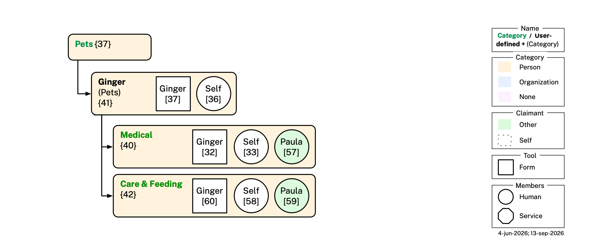

# Mia Ontologies — Illustrative Example

This file continues [README.md](README.md), which describes the Category, Cell, Topic, Persona, and Organization ontologies. It provides an illustrative example — a hypothetical Mia user, Alice Walker — showing how those ontologies are used together, followed by diagram-generation instructions and the full validation pipeline for the example dataset. 

## Illustrative Example: Alice 

This section describes the local Mia dataset for a hypothetical user, Alice Walker. Alice's cells — each a folder holding exactly one cell DataBook file — live in a tree of cells rooted at `example/Cells/`. Every mention of "Self" in the following is a reference to the user, Alice.

### Bob and Fred

Alice knows two people, Bob and Fred. She has created two *Two-Member* cells nested under *Others* sharing one with Bob and the other with Fred. 

In her shared cell with Bob ([cell 16](<example/Cells/People/Others/Bob Johnson/Bob Johnson(others).databook.md>)) Alice has included some claims about herself ([topic 12](<example/Cells/People/Others/Bob Johnson/Bob Johnson(others).databook.md#topic-12>)) including her given name "Alice", her family name "Walker", etc. She has included ([topic 4](<example/Cells/People/Others/Bob Johnson/Bob Johnson(others).databook.md#topic-04>)) her claim that Bob's favorite drink is an oat milk cappuccino. Bob has claimed some contact information about himself ([topic 2](<example/Cells/People/Others/Bob Johnson/Bob Johnson(others).databook.md#topic-02>)), and he claims that her favorite drink is Pepsi ([topic 8](<example/Cells/People/Others/Bob Johnson/Bob Johnson(others).databook.md#topic-08>)).

<p align="center"></p>

### Taking Care of Paula

To capture Alice's family-related relationship with her mother, Paula Walker, Alice created a cell ([cell 12](<example/Cells/People/Immediate Family/Paula Walker/Paula Walker(immediate-family).databook.md>)) named *Paula Walker*, nested under her *Immediate Family* cell. The subjects of this cell are Self and Paula. The cell (topics [7](<example/Cells/People/Immediate Family/Paula Walker/Paula Walker(immediate-family).databook.md#topic-07>), [5](<example/Cells/People/Immediate Family/Paula Walker/Paula Walker(immediate-family).databook.md#topic-05>), [21](<example/Cells/People/Immediate Family/Paula Walker/Paula Walker(immediate-family).databook.md#topic-21>)) capture her connection with Paula. 

Alice spends time taking care of her mother, so she has, by herself assembled some information about Paula in some non-shared cells. In the *Health & Wellness* cell Alice keeps a record of Paula's physical characteristics such as height, eye color, hair color in [topic 17](<example/Cells/People/Immediate Family/Paula Walker/Health & Wellness/Health & Wellness.databook.md#topic-17>). This is a *Single-Member* cell whose subject is Paula. Its required `memberTopics` slot holds a minimal topic about Alice herself ([topic 35](<example/Cells/People/Immediate Family/Paula Walker/Health & Wellness/Health & Wellness.databook.md#topic-35>)). [Topic 17](<example/Cells/People/Immediate Family/Paula Walker/Health & Wellness/Health & Wellness.databook.md#topic-17>) is linked as an `otherTopic`.  

Under *Medical* > *Providers* > *Primary Care Physician*, Alice keeps a record of Dr. Jane Starostina, Paula's primary care physician ([topic 25](<example/Cells/People/Immediate Family/Paula Walker/Health & Wellness/Medical/Providers/Jane Starostina/Jane Starostina(primary-care-physician).databook.md#topic-25>)). This is a *Single-Member* cell whose subject is Jane.

Alice's sister Carol is involved in taking care of their mother. The sisters need to arrange medical appointments, etc. To do so, they need to share and synchronize medical information about Paula, including her list of medications, medical history, health insurance policy, contact information and so on. To work on this as a team, Alice creates a two-member *Med. App. Info* cell and shares it with Carol. They both use it to share information about Paula's upcoming medical appointment ([topic 26](<example/Cells/People/Immediate Family/Paula Walker/Health & Wellness/Medical/Providers/Med. App. Info/Med. App. Info(medical-appointment-info).databook.md#topic-26>)). This topic includes the name of Paula's doctor (primary care physician) which Mia copies from the Dr. Jane Starostina cell ([topic 25](<example/Cells/People/Immediate Family/Paula Walker/Health & Wellness/Medical/Providers/Jane Starostina/Jane Starostina(primary-care-physician).databook.md#topic-25>)). 

<p align="center"></p>

### Working for Acme

Alice is an employee of Acme, so under her *Work* cell she has created an *Acme* cell to represent her employer. Since Acme is an organization, rather than using `cat:Person` categories she has switched to `cat:Organization` categories (light blue color). 

Under *Employees* she has added her own *Alice Walker* cell holding her Business Card claims ([topic 10](<example/Cells/Work/Acme/Employees/Alice Walker/Alice Walker(employee).databook.md#topic-10>)) — job title at Acme, work telephone number, work email, etc. One of the employees she works with is Paula Walker, so she has a *Paula Walker* cell for her, containing statements Alice has made about Paula ([topic 6](<example/Cells/Work/Acme/Employees/Paula Walker/Paula Walker(employee).databook.md#topic-06>)) and statements about herself ([topic 20](<example/Cells/Work/Acme/Employees/Paula Walker/Paula Walker(employee).databook.md#topic-20>)) neither of which have been shared with Paula since this is a (non-shared) Single-Member Cell.

<p align="center"></p>

### Service Providers

Alice has relationships with two companies, Google and ATT. The former provides her Gmail address, and the latter is her cell phone provider.

<p align="center"></p>

### Checking Account and Debit Card

Alice has a checking account (and associated debit care) at Citibank. In our example Citibank is compatible with PDN and participates directly as a member of this Self<>Citibank cell. Citibank directly write the data about Alice's checking account into [topic 9](<example/Cells/Finances/Banking & Payments Firms/Citibank/Citibank(banking-payments).databook.md#topic-09>). It is colored green because the claimant is Citibank, not Alice. Alice self-asserts her username and password. Citibank asserts some information about itself in [topic 27](<example/Cells/Finances/Banking & Payments Firms/Citibank/Citibank(banking-payments).databook.md#topic-27>).

<p align="center"></p>

### Birth Certificate and Driver's License

Alice was born in Texas and their vital records department issued a birth certificate about Alice. Alice has manually entered the information from her birth certificate ([topic 24](<example/Cells/Government/State/Texas Vital Records/Texas Vital Records(birth-certificate).databook.md#topic-24>)) and has included a scan of her paper birth certificate as content in the *Texas Vital Records* cell's Files tab (not shown). She recently moved to Paradise, California, and was issued a license by the California DMV. Alice manually entered the information from her plastic license card ([topic 15](<example/Cells/Government/State/California DMV/California DMV(drivers-license).databook.md#topic-15>)) and included a scan of it as content in the *California DMV* cell's Files tab (not shown).

<p align="center"></p>

### Passport and Social Security Number

Alice has a social security number (SSN) issued to her by the Social Security Administration. Similarly, she has a Passport issued to her by the US Department of State.

<p align="center"></p>

### Current and Previous Homes

Alice used to live in Boston until late 2025, but now lives in Paradise, CA. Information about these two residences are in topics [13](<example/Cells/Government/Municipality/Boston/Boston(residence).databook.md#topic-13>) and [18](<example/Cells/Government/Municipality/Paradise/Paradise(residence).databook.md#topic-18>). 

<p align="center"></p>

### Possessions 

Alice, like everyone, owns (or borrows, or rents) zillions of things. A tiny few of them are described in [topic 22](<example/Cells/Ownership/Ownership.databook.md#topic-22>). We focused on a few identity documents. Alice has a plastic driver's license card, a health insurance cards, social security number cards. She also has a wallet. She keeps some of these in her wallet and some separately. Presumably Alice has a vehicle of some kind, and so many other things, so this example is extremely limited at the moment. 

Here are a few lines from [topic 22](<example/Cells/Ownership/Ownership.databook.md#topic-22>):
```turtle 
:Self persona:hasWallet :Alice_Wallet ;
    persona:hasPhysicalCard :Alice_HealthInsuranceCard ;   # carried separately
    persona:hasPhysicalCard :Alice_SSNCard ;               # stored at home
    persona:hasPhysicalCard :Alice_DriversLicense ;        # in wallet
    persona:hasPhysicalCard :Alice_PaymentCard .           # in wallet

:Alice_DriversLicense rdf:type persona:PhysicalDriversLicense ;
    BFO_0000176 :Alice_Wallet .                            # in the wallet

:Alice_PaymentCard rdf:type persona:PhysicalPaymentCard ;
    BFO_0000176 :Alice_Wallet .                            # in the wallet
```

<p align="center"></p>


### Ginger's Medications

Alice also has a cat, Ginger. Under her *Pets* cell she has created a *Ginger* cell for this specific pet — reusing its parent's own `cat:Pets` origin — and, nested inside it, a *Health* cell, and nested inside that a *Medications* cell recording Ginger's medications: a completed course of amoxicillin/clavulanate (brand name Clavamox, from Zoetis) and an ongoing daily glucosamine/chondroitin joint supplement ([topic 32](<example/Cells/Pets/Ginger/Health/Medications/Medications.databook.md#topic-32>)). Alice shared this cell with Paula, who also helps look after Ginger, making it a `cell:TwoMember` cell with Alice's and Paula's own bare identity claims ([topic 33](<example/Cells/Pets/Ginger/Health/Medications/Medications.databook.md#topic-33>) and [topic 57](<example/Cells/Pets/Ginger/Health/Medications/Medications.databook.md#topic-57>)) as its two `memberTopics`.

<p align="center"></p>

Let's imagine that Paula doesn't use the app and the invite link from Alice to [cell 40](<example/Cells/Pets/Ginger/Health/Medications/Medications.databook.md>) causes Paula to click on the link and download/install it. The app receives the cell, but where should to file it on Paul's side? Paula's app examines the cell, looks at its category type "Medications" and makes a good (though not perfect) guess to create the following tree of empty cells: People > Others > Alice > Pets > Ginger > Health and put it as a new child cell of the Health cell.

Ideally it would have filed the cell shared by Alice's app under People > Immediate Family because she is Paula's daughter, but Paula's app didn't know that, so it did the best it could. To perfect things, Paula can create an Immediate Family cell under her People cell and move Alice (and sub-cells) under it.

### Boston Hub Society

Alice is a member of the Boston Hub Society, an informal professional networking society. In our example BHS has PDN support into their server, allowing it to participate directly as an `o:Organization` member of this cell, alongside Alice and Bob. Alice maintains her BHS profile in [topic 14](<example/Cells/Affiliations/Boston Hub Society/Boston Hub Society(affiliations).databook.md#topic-14>), Bob another member keeps his profile updated ([topic 3](<example/Cells/Affiliations/Boston Hub Society/Boston Hub Society(affiliations).databook.md#topic-03>)), and BHS itself asserts a basic profile about itself in [topic 1](<example/Cells/Affiliations/Boston Hub Society/Boston Hub Society(affiliations).databook.md#topic-01>). The subject of the cell, is one of its members, BHS.

<p align="center"></p>

## Cells Mentioned

A summary of every narratively-illustrated cell under `example/Cells/`, grouped by the narrative subsection above it describes. 

| Subsection | Name | Cell DataBook | Subject(s) | Cell Category | Topics |
|---|---|---|---|---|---|
| Bob and Fred | Bob Johnson | [Bob Johnson(others).databook.md](<example/Cells/People/Others/Bob Johnson/Bob Johnson(others).databook.md>) {16} | Self, Bob Johnson | `cat:Others` | 2, 4, 8, 12 |
| Bob and Fred | Fred Flintstone | [Fred Flintstone(others).databook.md](<example/Cells/People/Others/Fred Flintstone/Fred Flintstone(others).databook.md>) {17} | Self, Fred Flintstone | `cat:Others` | 29, 31 |
| Taking Care of Paula | Paula Walker | [Paula Walker(immediate-family).databook.md](<example/Cells/People/Immediate Family/Paula Walker/Paula Walker(immediate-family).databook.md>) {12} | Self, Paula Walker | `cat:ImmediateFamily` | 5, 7, 21 |
| Taking Care of Paula | Health & Wellness | [Health & Wellness.databook.md](<example/Cells/People/Immediate Family/Paula Walker/Health & Wellness/Health & Wellness.databook.md>) {13} | Paula Walker | `cat:HealthWellness` | 17, 35 |
| Taking Care of Paula | Jane Starostina | [Jane Starostina(primary-care-physician).databook.md](<example/Cells/People/Immediate Family/Paula Walker/Health & Wellness/Medical/Providers/Jane Starostina/Jane Starostina(primary-care-physician).databook.md>) {14} | Jane Starostina | `cat:PrimaryCarePhysician` | 25, 34 |
| Taking Care of Paula | Med. App. Info | [Med. App. Info(medical-appointment-info).databook.md](<example/Cells/People/Immediate Family/Paula Walker/Health & Wellness/Medical/Providers/Med. App. Info/Med. App. Info(medical-appointment-info).databook.md>) {15} | Paula Walker | `cat:MedicalAppointmentInfo` | 26, 28, 30 |
| Working for Acme | Alice Walker | [Alice Walker(employee).databook.md](<example/Cells/Work/Acme/Employees/Alice Walker/Alice Walker(employee).databook.md>) {18} | Self | `cat:Employee` | 10 |
| Working for Acme | Paula Walker | [Paula Walker(employee).databook.md](<example/Cells/Work/Acme/Employees/Paula Walker/Paula Walker(employee).databook.md>) {19} | Paula Walker | `cat:Employee` | 6, 20 |
| Service Providers | Google | [Google(companies).databook.md](<example/Cells/Companies/Google/Google(companies).databook.md>) {3} | Self | `cat:Companies` | 16 |
| Service Providers | ATT | [ATT(companies).databook.md](<example/Cells/Companies/ATT/ATT(companies).databook.md>) {2} | Self | `cat:Companies` | 11 |
| Checking Account and Debit Card | Citibank | [Citibank(banking-payments).databook.md](<example/Cells/Finances/Banking & Payments Firms/Citibank/Citibank(banking-payments).databook.md>) {4} | Self, Citibank | `cat:BankingPayments` | 9, 27 |
| Birth Certificate and Driver's License | Texas Vital Records | [Texas Vital Records(birth-certificate).databook.md](<example/Cells/Government/State/Texas Vital Records/Texas Vital Records(birth-certificate).databook.md>) {10} | Self | `cat:BirthCertificate` | 24 |
| Birth Certificate and Driver's License | California DMV | [California DMV(drivers-license).databook.md](<example/Cells/Government/State/California DMV/California DMV(drivers-license).databook.md>) {9} | Self | `cat:DriversLicense` | 15 |
| Passport and Social Security Number | Department of State | [Department of State(passport).databook.md](<example/Cells/Government/Federal/Department of State/Department of State(passport).databook.md>) {5} | Self | `cat:Passport` | 19 |
| Passport and Social Security Number | Social Security Administration | [Social Security Administration(ssn).databook.md](<example/Cells/Government/Federal/Social Security Administration/Social Security Administration(ssn).databook.md>) {6} | Self | `cat:SSN` | 23 |
| Current and Previous Homes | Boston | [Boston(residence).databook.md](<example/Cells/Government/Municipality/Boston/Boston(residence).databook.md>) {7} | Self | `cat:Residence` | 13 |
| Current and Previous Homes | Paradise | [Paradise(residence).databook.md](<example/Cells/Government/Municipality/Paradise/Paradise(residence).databook.md>) {8} | Self | `cat:Residence` | 18 |
| Possessions | Ownership | [Ownership.databook.md](<example/Cells/Ownership/Ownership.databook.md>) {11} | Self | `cat:Ownership` | 22 |
| Ginger's Medications | Ginger | [Ginger(pets).databook.md](<example/Cells/Pets/Ginger/Ginger(pets).databook.md>) {41} | Ginger | `cat:Pets` | 36, 37 |
| Ginger's Medications | Medications | [Medications.databook.md](<example/Cells/Pets/Ginger/Health/Medications/Medications.databook.md>) {40} | Ginger | `cat:PetsMedications` | 32, 33, 57 |
| Boston Hub Society | Boston Hub Society | [Boston Hub Society(affiliations).databook.md](<example/Cells/Affiliations/Boston Hub Society/Boston Hub Society(affiliations).databook.md>) {1} | BHS | `cat:Affiliations` | 1, 3, 14 |

## Topics

The topics in the table below are *about* Alice and claimed *by* Alice. The "Cell DataBook" link jumps straight to each topic's own `### Topic NN` section inside its owning cell-databook file under `example/Cells/`.

| #  | Cell DataBook                                                                          | Category | Key data                                                         | Diagram |
|--- |:--------------------------------------------------------------------------------------|:-------------|:-----------------------------------------------------------------|:--------|
| 10 | [Alice Walker(employee).databook.md](<example/Cells/Work/Acme/Employees/Alice Walker/Alice Walker(employee).databook.md#topic-10>) {18} | `cat:Employee`     | Business card — given name, family name, email, phone, employer  | [view](example/topics/images/topic-10.png) |
| 11 | [ATT(companies).databook.md](<example/Cells/Companies/ATT/ATT(companies).databook.md#topic-11>) {2}                     | `cat:Companies`    | Phone number                                                     | [view](example/topics/images/topic-11.png) |
| 12 | [Bob Johnson(others).databook.md](<example/Cells/People/Others/Bob Johnson/Bob Johnson(others).databook.md#topic-12>) {16}                     | `cat:Others`       | Alice's 1:1 topic with Bob; social network with Bob as member  | [view](example/topics/images/topic-12.png)|
| 13 | [Boston(residence).databook.md](<example/Cells/Government/Municipality/Boston/Boston(residence).databook.md#topic-13>) {7}               | `cat:Residence` | Previous address — Boston, MA (2020–2025) with temporal interval | [view](example/topics/images/topic-13.png) |
| 14  | [Boston Hub Society(affiliations).databook.md](<example/Cells/Affiliations/Boston Hub Society/Boston Hub Society(affiliations).databook.md#topic-14>) {1}                     | `cat:Affiliations` | BHS profile: email, phone and current address                    | [view](example/topics/images/topic-14.png)|
| 15 | [California DMV(drivers-license).databook.md](<example/Cells/Government/State/California DMV/California DMV(drivers-license).databook.md#topic-15>) {9} | `cat:DriversLicense`      | California driver's license — legal name, DOB, DL#, expiry, photo | [view](example/topics/images/topic-15.png) |
| 16 | [Google(companies).databook.md](<example/Cells/Companies/Google/Google(companies).databook.md#topic-16>) {3}               | `cat:Companies`    | Gmail address                                                    | [view](example/topics/images/topic-16.png) |
| 18 | [Paradise(residence).databook.md](<example/Cells/Government/Municipality/Paradise/Paradise(residence).databook.md#topic-18>) {8}           | `cat:Residence` | Current address — Paradise, CA (2025–present)                    | [view](example/topics/images/topic-18.png) |
| 19 | [Department of State(passport).databook.md](<example/Cells/Government/Federal/Department of State/Department of State(passport).databook.md#topic-19>) {5}             | `cat:Passport`    | US passport — legal name, DOB, passport#, issue/expiry, place of birth, gender marker, photo | [view](example/topics/images/topic-19.png) |
| 20 | [Paula Walker(employee).databook.md](<example/Cells/Work/Acme/Employees/Paula Walker/Paula Walker(employee).databook.md#topic-20>) {19}                   | `cat:Employee`     | Acme employee topic; company email; works with Paula           | [view](example/topics/images/topic-20.png)|
| 21 | [Paula Walker(immediate-family).databook.md](<example/Cells/People/Immediate Family/Paula Walker/Paula Walker(immediate-family).databook.md#topic-21>) {12}   | `cat:ImmediateFamily`       | Alice as a family member                       | [view](example/topics/images/topic-21.png) |
| 22 | [Ownership.databook.md](<example/Cells/Ownership/Ownership.databook.md#topic-22>) {11}     | `cat:Ownership`  | Wallet (driver's license + payment card); health ins., SSN card  | [view](example/topics/images/topic-22.png) |
| 23 | [Social Security Administration(ssn).databook.md](<example/Cells/Government/Federal/Social Security Administration/Social Security Administration(ssn).databook.md#topic-23>) {6}                     | `cat:SSN`      | Social security number (SSN)                                     | [view](example/topics/images/topic-23.png) |
| 24 | [Texas Vital Records(birth-certificate).databook.md](<example/Cells/Government/State/Texas Vital Records/Texas Vital Records(birth-certificate).databook.md#topic-24>) {10} | `cat:BirthCertificate`        | Legal names, maiden name                                         | [view](example/topics/images/topic-24.png) |
| 29 | [Fred Flintstone(others).databook.md](<example/Cells/People/Others/Fred Flintstone/Fred Flintstone(others).databook.md#topic-29>) {17}                     | `cat:Others`       | Alice's 1:1 topic with Fred; social network with Fred as member  | [view](example/topics/images/topic-29.png) |
| 33 | [Medications.databook.md](<example/Cells/Pets/Ginger/Health/Medications/Medications.databook.md#topic-33>) {40} | `cat:PetsMedications`     | Deliberately empty — the Ginger-Medications cell's required memberTopic          | [view](example/topics/images/topic-33.png) |
| 34 | [Jane Starostina(primary-care-physician).databook.md](<example/Cells/People/Immediate Family/Paula Walker/Health & Wellness/Medical/Providers/Jane Starostina/Jane Starostina(primary-care-physician).databook.md#topic-34>) {14} | `cat:PrimaryCarePhysician`     | Alice's bare given-name claim — the Jane-Starostina cell's required memberTopic          | [view](example/topics/images/topic-34.png) |
| 35 | [Health & Wellness.databook.md](<example/Cells/People/Immediate Family/Paula Walker/Health & Wellness/Health & Wellness.databook.md#topic-35>) {13} | `cat:HealthWellness`     | Alice's bare given-name claim — the Health & Wellness cell's required memberTopic          | [view](example/topics/images/topic-35.png) |
| 36 | [Ginger(pets).databook.md](<example/Cells/Pets/Ginger/Ginger(pets).databook.md#topic-36>) {41} | `cat:Pets`     | Deliberately empty — the Ginger cell's required memberTopic; the `memberTopics` requirement is about `t:subject`/`t:claimant`, not about carrying content          | [view](example/topics/images/topic-36.png) |

The following table lists topics that are *about* Alice but claimed by others.

| #  | Cell DataBook                                                                         | Category | Key data                             | Diagram |
|--- |:-------------------------------------------------------------------------------------|:-------------|:-------------------------------------|:--------|
| 8  | [Bob Johnson(others).databook.md](<example/Cells/People/Others/Bob Johnson/Bob Johnson(others).databook.md#topic-08>) {16}                         | `cat:Others`            | Alice as seen by Bob                 | [view](example/topics/images/topic-08.png)|
| 9 | [Citibank(banking-payments).databook.md](<example/Cells/Finances/Banking & Payments Firms/Citibank/Citibank(banking-payments).databook.md#topic-09>) {4}     | `cat:BankingPayments` | Debit card                           | [view](example/topics/images/topic-09.png) |

The following table lists topics about other people (Paula and Bob) or organizations (Boston Hub Society) in Alice's Mia. As above, each "Cell DataBook" link jumps to that topic's section inside its owning cell-databook file.

| #  | Cell DataBook                                                                                     | Category | Key data                                                         | Diagram |
|--- |:-------------------------------------------------------------------------------------------------|:-------------|:-----------------------------------------------------------------|:--------|
| 1  | [Boston Hub Society(affiliations).databook.md](<example/Cells/Affiliations/Boston Hub Society/Boston Hub Society(affiliations).databook.md#topic-01>) {1}             | `cat:Affiliations` | BHS's own organization profile, claimed by BHS                | [view](example/topics/images/topic-01.png) |
| 2  | [Bob Johnson(others).databook.md](<example/Cells/People/Others/Bob Johnson/Bob Johnson(others).databook.md#topic-02>) {16}                     | `cat:Others`       | Bob's self-claimed Bob persona                                 | [view](example/topics/images/topic-02.png)|
| 3  | [Boston Hub Society(affiliations).databook.md](<example/Cells/Affiliations/Boston Hub Society/Boston Hub Society(affiliations).databook.md#topic-03>) {1}                     | `cat:Affiliations` | Bob's BHS member persona (name, email, phone, address)          | [view](example/topics/images/topic-03.png) |
| 4  | [Bob Johnson(others).databook.md](<example/Cells/People/Others/Bob Johnson/Bob Johnson(others).databook.md#topic-04>) {16}                 | `cat:Others`       | Alice's notes about Bob; fav drink: oat milk cappuccino         | [view](example/topics/images/topic-04.png) |
| 5  | [Paula Walker(immediate-family).databook.md](<example/Cells/People/Immediate Family/Paula Walker/Paula Walker(immediate-family).databook.md#topic-05>) {12} | `cat:ImmediateFamily`       | Paula's own family persona; social network with Alice       | [view](example/topics/images/topic-05.png)|
| 6  | [Paula Walker(employee).databook.md](<example/Cells/Work/Acme/Employees/Paula Walker/Paula Walker(employee).databook.md#topic-06>) {19}           | `cat:Employee`     | Paula as Alice's Acme colleague (Alice-claimed)                | [view](example/topics/images/topic-06.png)|
| 7  | [Paula Walker(immediate-family).databook.md](<example/Cells/People/Immediate Family/Paula Walker/Paula Walker(immediate-family).databook.md#topic-07>) {12} | `cat:ImmediateFamily`       | Paula as Alice's family member (Alice-claimed)           | [view](example/topics/images/topic-07.png)|
| 17 | [Health & Wellness.databook.md](<example/Cells/People/Immediate Family/Paula Walker/Health & Wellness/Health & Wellness.databook.md#topic-17>) {13} | `cat:HealthWellness`     | Paula's physical body — height (68 in.), blue eyes, grey hair — as recorded by Alice; linked as an `otherTopic` (Paula is the cell's subject, not its member)            | [view](example/topics/images/topic-17.png) |
| 25 | [Jane Starostina(primary-care-physician).databook.md](<example/Cells/People/Immediate Family/Paula Walker/Health & Wellness/Medical/Providers/Jane Starostina/Jane Starostina(primary-care-physician).databook.md#topic-25>) {14} | `cat:PrimaryCarePhysician`       | Alice's record of Dr. Jane Starostina, Paula Walker's primary care physician           | [view](example/topics/images/topic-25.png)|
| 26 | [Med. App. Info(medical-appointment-info).databook.md](<example/Cells/People/Immediate Family/Paula Walker/Health & Wellness/Medical/Providers/Med. App. Info/Med. App. Info(medical-appointment-info).databook.md#topic-26>) {15} | `cat:MedicalAppointmentInfo`       | Alice and Carol's shared claims for Paula's medical appointment — medications, allergies, insurance, PCP reference           | [view](example/topics/images/topic-26.png)|
| 28 | [Med. App. Info(medical-appointment-info).databook.md](<example/Cells/People/Immediate Family/Paula Walker/Health & Wellness/Medical/Providers/Med. App. Info/Med. App. Info(medical-appointment-info).databook.md#topic-28>) {15} | `cat:MedicalAppointmentInfo`       | Carol's own self-claimed persona and contact info — one of this cell's two members, alongside Alice (topic 30)           | [view](example/topics/images/topic-28.png) |
| 30 | [Med. App. Info(medical-appointment-info).databook.md](<example/Cells/People/Immediate Family/Paula Walker/Health & Wellness/Medical/Providers/Med. App. Info/Med. App. Info(medical-appointment-info).databook.md#topic-30>) {15} | `cat:MedicalAppointmentInfo`       | Alice's own self-claimed contact info — the other of this cell's two members, alongside Carol (topic 28)           | [view](example/topics/images/topic-30.png) |
| 27 | [Citibank(banking-payments).databook.md](<example/Cells/Finances/Banking & Payments Firms/Citibank/Citibank(banking-payments).databook.md#topic-27>) {4} | `cat:BankingPayments` | Alice's own self-claimed notes about Citibank as an institution, alongside Citibank's own claimed record about her (topic 09) | [view](example/topics/images/topic-27.png) |
| 31 | [Fred Flintstone(others).databook.md](<example/Cells/People/Others/Fred Flintstone/Fred Flintstone(others).databook.md#topic-31>) {17}                     | `cat:Others`       | Fred's self-claimed Fred persona                                 | [view](example/topics/images/topic-31.png) |
| 32 | [Medications.databook.md](<example/Cells/Pets/Ginger/Health/Medications/Medications.databook.md#topic-32>) {40} | `cat:PetsMedications`       | Alice's record of her cat Ginger's medications — amoxicillin/clavulanate course, ongoing glucosamine/chondroitin supplement           | [view](example/topics/images/topic-32.png)|
| 37 | [Ginger(pets).databook.md](<example/Cells/Pets/Ginger/Ginger(pets).databook.md#topic-37>) {41} | `cat:Pets`       | Alice's basic claim identifying Ginger — backs the Ginger cell's `subject: ":Ginger"` with a real topic           | [view](example/topics/images/topic-37.png)|
| 57 | [Medications.databook.md](<example/Cells/Pets/Ginger/Health/Medications/Medications.databook.md#topic-57>) {40} | `cat:PetsMedications`       | Paula's own self-claimed given-name claim — the cell's second `memberTopics` entry after Alice shared it with her, making it a `cell:TwoMember` cell           | [view](example/topics/images/topic-57.png)|

## Diagrams

`draw.py` generates a Mermaid (`.mmd`) and PNG diagram for a single embedded topic, given its owning cell DataBook file and its id (or id local-name):

```bash
python3 draw.py "example/Cells/Finances/Banking & Payments Firms/Citibank/Citibank(banking-payments).databook.md" "topic-09"
python3 draw.py "example/Cells/Government/Municipality/Paradise/Paradise(residence).databook.md" "topic-18"
```

Both output files are always written to `example/topics/images/` (must be run from the repo root), keyed by the topic's own id local-name — the same location and naming topic diagrams used before the topic/cell merge, even though the topic's own file no longer exists.

**Dependencies** (one-time setup):
```bash
pip install rdflib pyyaml
npm install -g @mermaid-js/mermaid-cli
```

Each diagram shows the `p:Person` individual (yellow), supporting named individuals (white boxes), class labels (plain text), blank-node designator chains, and literal values (green).

## Validation

Validation requires [Apache Jena](https://jena.apache.org/) (`riot`, `shacl`), the [DataBook CLI](https://github.com/kurtcagle/databook) (`databook`; install: `git clone https://github.com/kurtcagle/databook.git && cd databook && npm install && npm install -g .`) — the CLI's reference implementation moved here from `w3c-cg/holon`, which retired its two previously-vendored copies in favor of this single upstream source — `pyyaml` for `yaml-to-rdf.py` (`pip install pyyaml`), and `extract-topic.py` (no extra dependencies) for isolating one embedded topic's Turtle from a cell DataBook that may hold several — needed since `databook extract` has no notion of "pick one topic out of many" and Tier 2 validates one topic at a time. SHACL shapes remain plain Turtle (`.ttl`).

### Quick check — DataBook syntax

Verify that every DataBook file has valid YAML frontmatter and well-formed block annotations:

```bash
find example -name "*.databook.md" -not -path "*/under-development/*" -print0 | sort -z |
while IFS= read -r -d '' f; do
  databook head "$f" -q > /dev/null || echo "FAIL: $f"
done
```

A file that fails here will also fail silently in `databook extract`, producing no Turtle output and causing downstream `riot` or SHACL errors that are harder to trace. (Uses `-print0`/`read -d ''` rather than `for f in $(find ...)` — cell DataBook paths under `example/Cells/` routinely contain spaces, e.g. `Banking & Payments Firms`, which word-splitting would otherwise silently break.)

### Tier 1 — general validation (all topics)

`persona-shacl.ttl` applies to every `p:Person` individual across every embedded topic.

```bash
# Step 1 — extract turtle from every DataBook file (excluding under-development).
# Uses -print0/read -d '' rather than for f in $(find ...) — cell-databook paths
# under example/Cells/ routinely contain spaces (e.g. "Banking & Payments Firms"),
# which word-splitting would otherwise silently break.
> /tmp/mia-data.ttl
find example -name "*.databook.md" -not -path "*/under-development/*" -print0 | sort -z |
while IFS= read -r -d '' f; do
  databook extract "$f" 2>/dev/null
done >> /tmp/mia-data.ttl

# Step 1b — synthesize c:/topic: triples from each cell DataBook's own YAML
# frontmatter (mia.* fields, including its mia.topics list — since
# topic-databooks were merged into their owning cell-databooks, a topic's
# claimant/subject now live there rather than in a separate topic-databook
# file). There is no cat: synthesis at all any more — category.ttl 1.31.0
# deleted cat:Folder and its subclasses outright, so a folder's tree position
# is purely a filesystem fact with no RDF individual to synthesize; the only
# surviving classification fact, c:origin, is read directly from each cell
# DataBook's own explicit mia.origin field. databook extract only pulls
# fenced Turtle blocks, which cell DataBooks don't carry — without this
# step, c:Cell individuals and topic:SCTopicGraph's subject/claimant never
# reach the merged graph, and cell-shacl.ttl/topic-shacl.ttl's
# :SCTopicGraphShape never fire against real instance data. See yaml-to-rdf.py.
python3 yaml-to-rdf.py . > /tmp/mia-yaml.ttl

# Step 2 — merge data with all ontology files, foundation ontologies, and self.ttl
# (cell-templates.ttl is deliberately excluded here, unlike Tier 2's base merge
# below: its 4 template individuals are generic, reusable content with no real
# person bound to them, so they can't sensibly carry cell-shacl.ttl's required
# c:memberTopics/c:creator — they're validated only via cell-templates-shacl.ttl, in Tier 2)
riot --output=turtle \
  project_files/bfo-core.ttl \
  project_files/PersonOntology.ttl \
  project_files/AddressOntology.ttl \
  project_files/StagingOntology.ttl \
  project_files/UnitsOfMeasureOntology.ttl \
  project_files/InformationEntityOntology.ttl \
  project_files/dron-upper.ttl \
  persona.ttl persona-templates.ttl topic.ttl cell.ttl category.ttl \
  organization.ttl \
  example/topics/self.ttl \
  /tmp/mia-data.ttl \
  /tmp/mia-yaml.ttl \
  2>/dev/null > /tmp/mia-merged.ttl

# Step 3 — collect shapes (shacl/jscontactcard-shacl.ttl and cell-templates-shacl.ttl
# excluded — see Tier 2; both target document classes and would fire incorrectly on all
# individuals when applied to merged data. pdn-identity-shacl.ttl is also excluded: its
# ontology, pdn-identity.ttl, isn't part of the Step 2 merge — nothing here ever
# references an identity: term, see persona.ttl 4.0.6)
grep -v 'owl:imports' persona-shacl.ttl > /tmp/mia-shapes.ttl
grep -v 'owl:imports' topic-shacl.ttl >> /tmp/mia-shapes.ttl
grep -v 'owl:imports' cell-shacl.ttl >> /tmp/mia-shapes.ttl
grep -v 'owl:imports' organization-shacl.ttl >> /tmp/mia-shapes.ttl

# Step 4 — validate
shacl validate --shapes /tmp/mia-shapes.ttl --data /tmp/mia-merged.ttl --text
```

Expected output: `Conforms`

### Tier 2 — per-template validation (individual topics)

Five of the six per-template shapes (BirthCertificate, DriversLicense, Passport, MedicalAppointment, PetMedications) live in `cell-templates-shacl.ttl`; JSContactCard's shape remains a standalone file in `shacl/` (it has no `cat:Category` class of its own — see [Persona Templates](README.md#persona-templates)). Each is run against only the relevant topic, isolated via `extract-topic.py` from its owning cell DataBook file and merged with the foundation ontologies. Isolation matters because a cell may hold more than one topic — the MedicalAppointment case below lives in a three-topic cell, so a whole-file `databook extract` there would wrongly pull in its two sibling topics' data too.

```bash
# Shared base: foundation ontologies + application ontologies + self.ttl
riot --output=turtle \
  project_files/bfo-core.ttl \
  project_files/PersonOntology.ttl \
  project_files/AddressOntology.ttl \
  project_files/StagingOntology.ttl \
  project_files/UnitsOfMeasureOntology.ttl \
  project_files/InformationEntityOntology.ttl \
  project_files/dron-upper.ttl \
  persona.ttl persona-templates.ttl topic.ttl cell.ttl category.ttl cell-templates.ttl \
  organization.ttl \
  example/topics/self.ttl \
  2>/dev/null > /tmp/mia-base.ttl

# BirthCertificate — topic-24
python3 extract-topic.py "example/Cells/Government/State/Texas Vital Records/Texas Vital Records(birth-certificate).databook.md" "topic-24" > /tmp/data-birth-cert-raw.ttl
riot --output=turtle /tmp/mia-base.ttl /tmp/data-birth-cert-raw.ttl 2>/dev/null > /tmp/data-birth-cert.ttl
grep -v 'owl:imports' cell-templates-shacl.ttl > /tmp/shapes-cell-templates.ttl
shacl validate --shapes /tmp/shapes-cell-templates.ttl --data /tmp/data-birth-cert.ttl --text

# JSContactCard — topic-10
python3 extract-topic.py "example/Cells/Work/Acme/Employees/Alice Walker/Alice Walker(employee).databook.md" "topic-10" > /tmp/data-jscontact-raw.ttl
riot --output=turtle /tmp/mia-base.ttl /tmp/data-jscontact-raw.ttl 2>/dev/null > /tmp/data-jscontact.ttl
grep -v 'owl:imports' shacl/jscontactcard-shacl.ttl > /tmp/shapes-jscontact.ttl
shacl validate --shapes /tmp/shapes-jscontact.ttl --data /tmp/data-jscontact.ttl --text

# DriversLicense — topic-15
python3 extract-topic.py "example/Cells/Government/State/California DMV/California DMV(drivers-license).databook.md" "topic-15" > /tmp/data-dl-raw.ttl
riot --output=turtle /tmp/mia-base.ttl /tmp/data-dl-raw.ttl 2>/dev/null > /tmp/data-dl.ttl
shacl validate --shapes /tmp/shapes-cell-templates.ttl --data /tmp/data-dl.ttl --text

# Passport — topic-19
python3 extract-topic.py "example/Cells/Government/Federal/Department of State/Department of State(passport).databook.md" "topic-19" > /tmp/data-passport-raw.ttl
riot --output=turtle /tmp/mia-base.ttl /tmp/data-passport-raw.ttl 2>/dev/null > /tmp/data-passport.ttl
shacl validate --shapes /tmp/shapes-cell-templates.ttl --data /tmp/data-passport.ttl --text

# MedicalAppointment — topic-26
# (this cell has THREE embedded topics — extract-topic.py isolates just this one,
# unlike the other four, which happen to be alone in a single-topic cell)
python3 extract-topic.py "example/Cells/People/Immediate Family/Paula Walker/Health & Wellness/Medical/Providers/Med. App. Info/Med. App. Info(medical-appointment-info).databook.md" "topic-26" > /tmp/data-medical-appt-raw.ttl
riot --output=turtle /tmp/mia-base.ttl /tmp/data-medical-appt-raw.ttl 2>/dev/null > /tmp/data-medical-appt.ttl
shacl validate --shapes /tmp/shapes-cell-templates.ttl --data /tmp/data-medical-appt.ttl --text

# PetMedications — topic-32
python3 extract-topic.py "example/Cells/Pets/Ginger/Health/Medications/Medications.databook.md" "topic-32" > /tmp/data-pet-medications-raw.ttl
riot --output=turtle /tmp/mia-base.ttl /tmp/data-pet-medications-raw.ttl 2>/dev/null > /tmp/data-pet-medications.ttl
shacl validate --shapes /tmp/shapes-cell-templates.ttl --data /tmp/data-pet-medications.ttl --text
```

Expected output for each: `Conforms`
