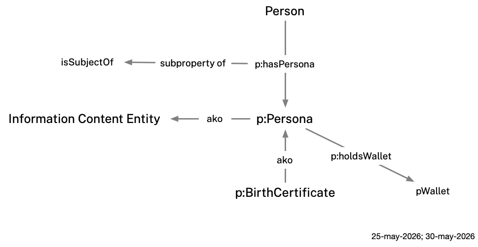
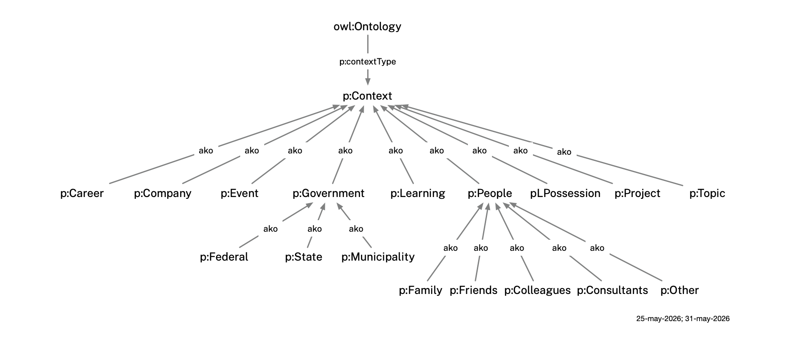
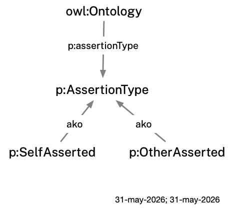
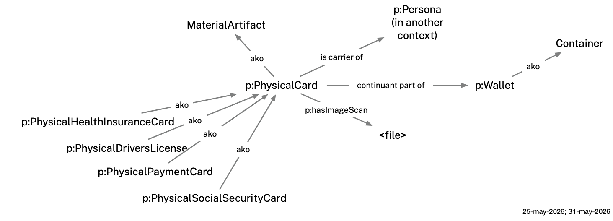

# Persona Ontology

Persona is an **application ontology** for the Mee Identity Agent (Mia). It imports and profiles existing domain ontologies — documenting which of their classes and properties Mee requires or uses — and extends them with Mia-specific classes and properties.

## Purpose

It defines a formal, machine-readable model of a real-world person's identity data — names, addresses, phone numbers, SSNs, physical characteristics, parent-child relationships, social connections, payment cards, and more — by reusing existing well-known ontologies wherever possible and defining new terms only where no suitable existing term exists.

## Ontological Foundation

Built on **BFO** (Basic Formal Ontology) and **CCO** (Common Core Ontologies) as the upper ontological foundation, and on domain ontologies that extend CCO:
- **PersonOntology** — person, name types, parent-child relationships
- **AddressOntology** — postal address structure
- **StagingOntology** — staging area for terms pending promotion (phone numbers, email addresses, user accounts, etc.)
- **AgentOntology** — agents and their properties (imported transitively via PersonOntology)

Throughout this document, `p:` is used as shorthand for the `persona:` namespace (`http://mee.foundation/ontologies/persona#`).

## One Person, Multiple Personas

We represent a person as a combination of a single `Person` entity representing their **selfness** and multiple **context files**, one per relationship or institutional context.

A person's selfness is their essential individuality or unique selfhood represented by this one central `Person` entity. The `Person` carries very few properties: only physical attributes and parent-child relationships. Most importantly, it carries `p:hasPersona` links to context-specific `p:Persona` instances. Most names and all identifiers belong to those context-specific `p:Persona` instances; the one exception is a preferred/goes-by name, which belongs to the Person entity because it applies across all contexts.

Rather than being a kind of Person, a `p:Persona` is an **Information Content Entity** (CCO `ont00000958`) — a context-specific facet *of* a Person. `p:Persona` instances are linked to the Person entity via `p:hasPersona`, a subproperty of CCO `is subject of` (`ont00001801`). Each `p:Persona` carries only the data relevant to its specific context.

<p align="center"></p>

**Properties**

* `p:hasPersona` — links a `Person` (one's "selfness", essential individuality, or a sense of one's own unique personality and identity) to one of their context-specific `p:Persona` instances.
* `p:hasWallet` — links a `p:Persona` to a physical wallet (see Belongings below).

**Classes**

* `p:Persona` — an Information Content Entity that represents how a person appears in the context of a specific interaction — with a company, government agency, another person, or a group of people. A `p:Persona` is a context-specific facet of that person linked via `p:hasPersona`.
* `p:Context` — Controlled vocabulary for the kind of interaction context. Used as the value of `p:contextType` on ontology IRIs.
* `p:BirthCertificate` — a `p:Persona` subtype whose purpose is to carry a person's legal birth name record as issued by a state agency.

## Contexts

Each context contains a single `p:Persona`, and is tagged with three orthogonal annotation properties that together classify its nature. All three are applied to the ontology IRI.

**`p:contextType`** — The nature of the interaction/relationship context. Values form a subclass hierarchy under `p:Context`:

- `p:Company` — a relationship with a company or institution (e.g. a bank, or other service provider).
- `p:Government` and subtypes `p:Federal`, `p:State`, `p:Municipality` — a government relationship.
- `p:People` and subtypes `p:Family`, `p:Colleagues`, `p:Friends`, `p:Consultants`, `p:Other` — a relationship with other people.
- `p:Possession` — a person's belongings in the real world.
- `p:Career` — professional roles, employment history, and career relationships.
- `p:Project` — involvement in a specific project or initiative.
- `p:Event` — participation in or relationship to a specific event.
- `p:Learning` — educational experiences, courses, and certifications.
- `p:Topic` — interest in or expertise around a specific subject area.

<p align="center"></p>

**`p:assertionType`** — Who is making the assertion. Contexts can contain self-asserted or other-asserted information. Values are subclasses of `p:AssertionType`:
- `p:SelfAsserted` — the Mia user is recording the data (using Mia), even if the underlying information originates from some other party such as a company, government agency, or another person.
- `p:OtherAsserted` — another person, company or government agency is asserting the data directly

<p align="center"></p>

**`p:subject`** — Whose identity the context file describes. Contexts may be about the Mia user or about someone else or some other entity. Values are subclasses of `p:SubjectType`:
- `p:Self` — the file is about the Mia user
- `p:Other` — the file is about another person, company or government agency.

<p align="center"></p>

## Belongings

A `p:Persona` with `contextType: p:Possession` models the physical items a person carries or stores — their wallet, payment cards, driver's license, health insurance card, and other documents. Physical cards are `MaterialArtifact` subclasses and may be placed inside a wallet (via BFO `continuant part of`) or held directly by the `p:Persona` (via `p:hasPhysicalCard`). When a future context file creates a `p:Persona` for a card-issuing institution (e.g. a DMV), the corresponding physical card links back to that `p:Persona` using BFO `is carrier of`.

<p align="center"></p>

**Properties**

* `is carrier of` (from BFO) — used to link a physical card to its corresponding `p:Persona` in another context.
* `p:hasPhysicalCard` — links a `p:Persona` to a `p:PhysicalCard` carried outside of a wallet (e.g. stored at home or kept separately).
* `p:hasWallet` — links a `p:Persona` to the physical wallet they carry.
* `p:hasImageScan` — a link to a scanned image of this card.

**Classes**

* `p:PhysicalCard` — a physical plastic or paper card held in a wallet.
* `p:PhysicalHealthInsuranceCard` (subclass of `p:PhysicalCard`) — a physical health insurance membership card.
* `p:PhysicalDriversLicense` (subclass of `p:PhysicalCard`) — a state-issued driver's license card.
* `p:PhysicalPaymentCard` (subclass of `p:PhysicalCard`) — a physical credit or debit card.
* `p:PhysicalSocialSecurityCard` (subclass of `p:PhysicalCard`) — a paper or plastic card issued by the Social Security Administration.
* `p:Wallet` — a physical wallet that holds cards, money, and other personal documents.

## Banking & Accounts

Persona models bank accounts and online service credentials.

**Properties**

* `p:hasBankAccount` — links a `p:Persona` to a `p:CheckingAccount` it records.
* `p:accessesBankAccount` — links a DebitCard to the `p:CheckingAccount` it draws funds from.
* `p:hasPassword` — the password credential for an `OnlineServiceAccount` (CCO `ont00000033`).

**Classes**

* `p:CheckingAccount` — a bank checking account held by a person, linked to a debit card.
* `p:CheckingAccountNumber` — an identifier designating a bank checking account, connected via `designated by` (`ont00001879`).
* `p:RoutingNumber` — an ABA routing transit number identifying the financial institution, connected via `designated by`.

## Ontology Files

- **`persona.ttl`** — The application ontology. Imports the domain ontologies above and documents which classes and properties Mee uses (required vs. optional). Also defines Mee-specific extension properties (`p:hasSocialNetwork`, `p:hasPaymentCard`, `p:hasPersona`), the `p:Persona` context hierarchy, and three annotation properties for tagging context files: `p:contextType`, `p:assertionType`, and `p:subject` (see **Contexts** above).

- **`persona-shacl.ttl`** — SHACL constraint rules defining how instance data must be structured. Validates:
  - *`p:BirthCertificate` `p:Persona` instances*: FullName OR (GivenName + FamilyName) required; optional AdditionalName, AlternateName, Nickname, Legal Name
  - *All `p:Persona` instances*: SSN format (`NNN-NN-NNNN`), email format, phone (E.164), address cardinality, payment cards, wallet
  - *US Postal Address*: required street, city, state (USPS 2-letter), ZIP; optional country
  - *Person (selfness)*: scalp hair (0..1); `has mother` / `is mother of` range must be a Person
  - *Social Network*: sub-groups (via `has part`) must be Social Networks; members (via `has member part`) must be `p:Persona` instances
  - *Debit Card*: card number and expiration date required; CVV optional
  - *`p:Wallet`*: items declaring themselves `continuant part of` this wallet must be `p:PhysicalCard` instances
  - *`p:PhysicalCard`*: image scan, if present, must be `xsd:anyURI` (max 1); `continuant part of` target, if present, must be a `p:Wallet` (max 1)

## Illustrative Example: Alice Walker

The repository includes a worked example for a hypothetical person, Alice Walker, to demonstrate the ontology in use. 

Within Alice's self, `example/alice/self.ttl`, is `:Alice_Walker-Self`, a Person entity. She also has an entity representing her mother, `:Paula_Walker-Self`. 

Her Person is linked to multiple `p:Persona` facets in separate context files. For example `:Alice_Walker-Citibank` is the facet of Alice in the context of her interactions with Citibank--most notably as the issuer of her debit card.

<p align="center"></p>

Each context file is an independent `owl:Ontology` linked to a Person entity in `example/alice/self.ttl` via `p:hasPersona`. All context files are `p:assertionType p:SelfAsserted` — Alice is the one recording all of this data, even when the underlying information originates from a third party.

Alice's `self.ttl` also describes some physical characteristics of Alice shown below:

<p align="center"></p>

### Alice Walker's Contexts 
As we've mentioned, Alice interacts in a set of contexts. In the following, each context carries `p:subject = Self` which indicates that they are about Alice.

| Context file | Context type | Key data | Image |
|:-------------|:-------------|:---------|:------|
| `att.ttl` | Company (ATT) | Phone number | [view](images/alice-contexts/alice(att).png) |
| `belongings.ttl` | Possession | Wallet (driver's license + payment card); health insurance card and SSN card held directly (with image scans) | [view](images/alice-contexts/alice(belongings).png) |
| `boston.ttl` | Municipality (Boston) | Previous address — Boston, MA (2020–2025) with temporal interval | [view](images/alice-contexts/alice(boston).png) |
| `citibank.ttl` | Company (Citibank) | Debit card | [view](images/alice-contexts/alice(citibank).png) |
| `colleagues.ttl` | People/Professionals | Colleagues social network with Bob Johnston | [view](images/alice-contexts/alice(colleagues).png) |
| `family.ttl` | People/Family | Family social network with Paula Walker | [view](images/alice-contexts/alice(family).png) |
| `google.ttl` | Company (Google) | Email address | [view](images/alice-contexts/alice(google).png) |
| `paradise.ttl` | Municipality (Paradise) | Current address — Paradise, CA (2025–present) | [view](images/alice-contexts/alice(paradise).png) |
| `ssa.ttl` | Federal (SSA.gov) | SSN | [view](images/alice-contexts/alice(ssa).png) |
| `texas-birth-certificate.ttl` | State (texas.gov) | Legal names: Margery Alice Walker; maiden name Margery Alice Arnold | [view](images/alice-contexts/alice(texas-birth-certificate).png) |

### Alice's Paula Walker Context

For the following context, `p:subject = Other` - that is, they are about another person or entity which in this case is her mother, Paula Walker.

| Context file | Context type | Key data | Image |
|:-------------|:-------------|:---------|:------|
| `florida-birth-certificate.ttl` | State (FL) | Legal names | [view](images/paula-contexts/paula(florida-birth-certificate).png) |

For example, Alice's `texas-birth-certificate.ttl` is `p:contextType: p:State`, `p:assertionType: p:SelfAsserted`, `p:subject: p:Self` — a state government context recorded by Alice, about Alice. Her `florida-birth-certificate.ttl` is `p:contextType: p:State`, `p:assertionType: p:SelfAsserted`, `p:subject: p:Other` — also recorded by Alice, but describing her mother Paula.

## Design Patterns

**Physical cards**: When a future context file creates a `p:Persona` for a credential issuer (e.g. DMV), the corresponding physical card in `belongings.ttl` links back using BFO `is carrier of` (`BFO_0000101`): the `p:PhysicalCard` individual is the carrier of the `p:Persona` (ICE).

**Peer name pattern**: All name types (FullName, GivenName, FamilyName, AlternateName) connect directly to a Person or `p:Persona` via `designated by` (`ont00001879`). They are siblings, not nested under a PersonName parent. Legal names belong to `p:BirthCertificate` `p:Persona` instances; a preferred/goes-by name lives in `self.ttl` since it applies across all contexts.

**Address history**: Each address `p:Persona` carries a USPostalAddress and an `AddressDesignation` with a `TemporalInterval` (start date required; no end date = current address).

## Diagrams

`draw.py` generates a Graphviz diagram from any context `.ttl` file:

```bash
python3 draw.py example/alice-contexts/citibank.ttl      # → example/alice-contexts/citibank.png
python3 draw.py example/alice-contexts/paradise.ttl      # → example/alice-contexts/paradise.png
```

**Dependencies** (one-time setup):
```bash
pip install rdflib graphviz
brew install graphviz
```

Each diagram shows the `p:Persona` individual (yellow), supporting named individuals (white boxes), class labels (plain text), blank-node designator chains, and literal values (green).

## Validation

Validation requires Apache Jena. The following validates Alice Walker's example instance data against the SHACL shapes. Merge all data files first, then validate:

```bash
riot --output=turtle \
  project_files/bfo-core.ttl project_files/PersonOntology.ttl \
  project_files/AddressOntology.ttl project_files/StagingOntology.ttl \
  persona.ttl example/alice/self.ttl \
  example/alice-contexts/citibank.ttl example/alice-contexts/boston.ttl \
  example/alice-contexts/paradise.ttl example/alice-contexts/family.ttl \
  example/alice-contexts/colleagues.ttl example/alice-contexts/att.ttl \
  example/alice-contexts/ssa.ttl example/alice-contexts/google.ttl \
  example/alice-contexts/texas-birth-certificate.ttl \
  example/paula-contexts/florida-birth-certificate.ttl \
  example/alice-contexts/belongings.ttl \
  2>/dev/null > /tmp/mia-merged.ttl

grep -v 'owl:imports' persona-shacl.ttl > /tmp/mia-shapes.ttl

shacl validate --shapes /tmp/mia-shapes.ttl --data /tmp/mia-merged.ttl --text
```

Expected output: `Conforms`
