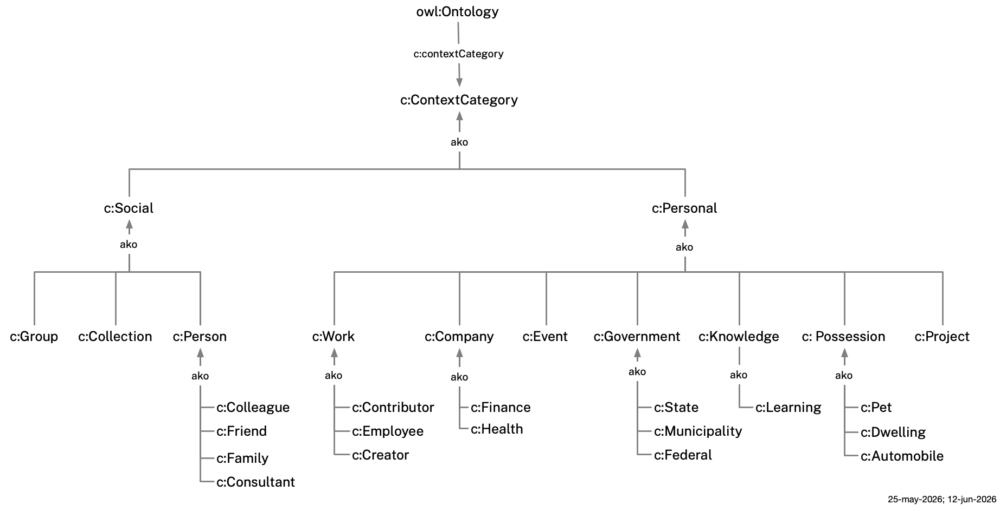
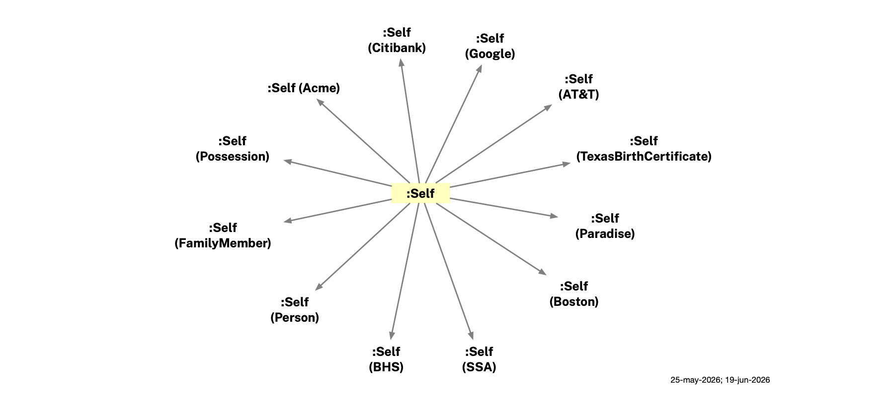
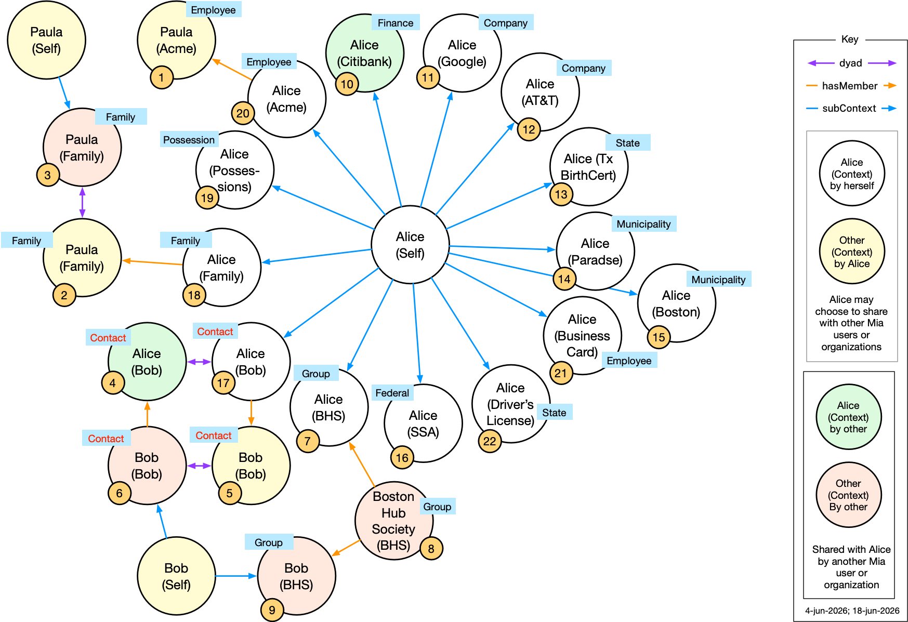

# Mia Ontologies

This document describes the ontologies used by the Mee Identity Agent (Mia) software application. 
Each Mia lives within the Personal Data Network (PDN), a data-sharing network with three kinds of participants: individual Mia users, groups of Mia users and/or organizations, and organizations (government agencies, companies, and nonprofits).

Mia ontologies import and profile existing ontologies — documenting which of their classes and properties Mia requires or uses — and extending them with Mia-specific classes and properties. They are built on BFO (Basic Formal Ontology) and CCO (Common Core Ontologies) as the upper ontological foundation, and on domain ontologies that extend CCO:
- **PersonOntology** — person, name types, parent-child relationships
- **AddressOntology** — postal address structure
- **StagingOntology** — staging area for terms pending promotion (phone numbers, email addresses, user accounts, etc.)
- **AgentOntology** — agents and their properties (imported transitively via PersonOntology)

The first two ontologies are **domain ontologies** that model a distinct kind of PDN node:
- **Persona ontology** — models a real person's identity data: names, addresses, phone numbers, relationships, payment cards, and more, structured around context-specific *personas*.
- **Organization ontology** — models organizations (companies, government agencies, non-profits, etc.) on the PDN.

The last three are **supporting ontologies** that support all three domains:
- **Group ontology** — a group made up of individuals and/or organizations.
- **Context ontology** — a container for information about people, groups, and organizations. A context also holds metadata about the category of context, who asserted the data, and which entity is primarily being described.
- **Identity ontology** — types of PDN network identifiers.

Throughout, we use these shorthands:
- `p:` is shorthand for the `persona:` namespace (`http://mee.foundation/ontologies/persona#`)
- `c:` for the `context:` namespace (`http://mee.foundation/ontologies/context#`)
- `i:` for the `identity:` namespace (`http://mee.foundation/ontologies/identity#`)
- `g:` for the `group:` namespace (`http://mee.foundation/ontologies/group#`)
- `o:` for the `organization:` namespace (`http://mee.foundation/ontologies/organization#`).

We first present an overview of the five ontologies and then illustrate them through a sample dataset for a hypothetical user, Alice Walker.

## Persona Ontology

The Persona ontology defines a formal, machine-readable model of a person. It is used by Mia to represent the user and to bi-directionally synchronize this information with other Mia users on a Personal Data Network that includes other Mia users as well as groups and organizations. 


We represent a person using the `persona:Person` class — a Mee-specific subclass of CCO `Person` (`cco:ont00001262`). Each context file contains exactly one `persona:Person` individual, identified by a unified IRI (e.g. `:Alice_Walker`) that is shared across all context files about that person. These context files function as *named-graph slices* — each is an independent snapshot of that person's identity in a specific relationship or institutional context, carrying the claims relevant to that context: names, addresses, phone numbers, SSNs, physical characteristics, parent-child relationships, social connections, payment cards, and more. The Persona ontology reuses existing well-known ontologies wherever possible and defines new terms only where no suitable existing term exists.

<p align="center"></p>

### Key properties and classes

This section describes the most fundamental properties and classes in the Persona ontology. A person's identity data is spread across multiple named-graph slice files, each containing one `persona:Person` individual with the same unified IRI.

**Classes**

* `persona:Person` — a Mee-specific subclass of CCO `Person` (`cco:ont00001262`). Each context file (named-graph slice) contains exactly one `persona:Person` individual. The same IRI is used for the same person across all context files (e.g. `:Alice_Walker` appears in every context file about Alice Walker). All identity data — names, identifiers, addresses, social networks, payment cards, and more — attaches to this individual.

**Properties**

* `i:hasIdentity` — links a `persona:Person` to a `i:PDNidentity` — the identifier used to communicate with this Person over the Personal Data Network. Sub-property of CCO `designated by`.

### Persona Templates

`p:PersonaTemplate` is an abstract classification class that serves as the common superclass for all reusable, context-type-specific template labels. These labels are defined in `persona-templates.ttl`. A context file declares its template by annotating its `owl:Ontology` header with `c:template` rather than by typing its `persona:Person` individual. Per-template SHACL files live in the `shacl/` subdirectory.

<p align="center"></p>

The three currently defined subclasses of `p:PersonaTemplate` are:

* `p:BirthCertificate` — label for context files that carry a person's legal birth name record as issued by a state agency. Used as the value of `c:template persona:BirthCertificate` on the ontology header. SHACL shape `:BirthCertificatePersonShape` (in `shacl/birthcertificate-shacl.ttl`) enforces:
  - **Required**: either a `FullName` designator **or** both a `GivenName` and a `FamilyName` designator (via `designated by`, `ont00001879`) — expressed with `sh:or`.
  - **Optional**: `AdditionalName` (middle name), `AlternateName` (e.g. maiden name), `Nickname`, and `Legal Name` designators.

* `p:JSContactCard` — label for context files that carry professional contact details in the JSContact (RFC 9553) format. Used as the value of `c:template persona:JSContactCard`. SHACL shape `:JSContactCardPersonShape` (in `shacl/jscontactcard-shacl.ttl`) enforces:
  - **Required**: exactly one `OrganizationName` designator; at least one `Email` or `TelephoneNumber` designator.
  - **Optional**: all name components, `OrganizationUnit`, `JobTitle`, addresses, online services, anniversaries, personal info, photo.
  - **Max 1** on all single-valued name and organization components.
  See the [JSContact field coverage table](#jscontact-field-coverage) below for the complete mapping.

* `p:DriversLicense` — label for context files that carry the identity claims on a state-issued driver's license. Used as the value of `c:template persona:DriversLicense`. SHACL shape `:DriversLicensePersonShape` (in `shacl/driverslicense-shacl.ttl`) enforces:
  - **Required**: `FullName` **or** (`GivenName` + `FamilyName`); exactly one `Birthdate` (`cco:ent00000046`); exactly one `p:DriversLicenseNumber`; exactly one `ExpirationDateIdentifier` (`cco:ent00000054`).
  - **Optional**: `AdditionalName`; `p:IssuingJurisdiction` (USPS 2-letter state code, validated by `USStateNameShape`); `PostalAddress`; `p:hasPhoto`.
  Note: `p:PhysicalDriversLicense` (in `persona.ttl`) models the physical card object held in a wallet — `p:DriversLicense` is the template label that marks a context file as carrying driver's license identity data.

#### JSContact field coverage

The table below maps every JSContact (RFC 9553) property to its representation in the Persona ontology. Properties defined in `persona-templates.ttl` for JSContact alignment are marked **JSC**.

| JSContact Property | Card. | Ontology Representation | Via | SHACL constraint |
|---|:---:|---|---|:---:|
| `name.full` | 0..1 | `cco:ent00000001` FullName | `designated by` | max 1 |
| `name.given` | 0..1 | `cco:ent00000002` GivenName | `designated by` | max 1 |
| `name.surname` | 0..1 | `cco:ent00000004` FamilyName | `designated by` | max 1 |
| `name.given2` | 0..1 | `cco:ent00000003` AdditionalName | `designated by` | max 1 |
| `name.surname2` | 0..1 | `cco:ent00000058` Surname2 | `designated by` | max 1 |
| `name.prefix` | 0..1 | `cco:ent00000057` Title/HonorificPrefix | `designated by` | max 1 |
| `name.suffix` | 0..1 | `cco:ent00000005` Suffix (Jr., Sr., III) | `designated by` | max 1 |
| `name.credential` | 0..1 | **JSC** `p:Credential` (MD, PhD, Esq.) | `designated by` | max 1 |
| `nicknames` | 0..1 | `cco:ont00000990` Nickname | `designated by` | max 1 |
| `name.altName` | 0..1 | `cco:ent00000006` AlternateName | `designated by` | max 1 |
| `emails` | 0..N | `cco:ent00000024` EmailAddress | `designated by` | — |
| ↳ `contexts` | 0..N | **JSC** `p:contactContext` annotation | annotation property | — |
| `phones` | 0..N | `cco:ent00000023` TelephoneNumber | `designated by` | — |
| ↳ `contexts` | 0..N | **JSC** `p:contactContext` annotation | annotation property | — |
| ↳ `features` | 0..N | **JSC** `p:phoneFeature` annotation | annotation property | — |
| `addresses` | 0..N | `cco:ent00000010` USPostalAddress | (address pattern) | — |
| ↳ `contexts` | 0..N | **JSC** `p:contactContext` annotation | annotation property | — |
| `anniversaries` (birth) | 0..1 | `cco:ent00000046` Birthdate | `designated by` | max 1 |
| `anniversaries` (other) | 0..N | **JSC** `p:Anniversary` | `p:hasAnniversary` | — |
| ↳ `kind` | — | **JSC** `p:anniversaryKind` | datatype property | — |
| ↳ `date` | — | **JSC** `p:anniversaryDate` | datatype property | — |
| ↳ `label` | — | **JSC** `p:anniversaryLabel` | datatype property | — |
| `organizations[].name` | 0..1 | `cco:ent00000047` OrganizationName | `designated by` | max 1 |
| `organizations[].units` | 0..1 | **JSC** `p:OrganizationUnit` | `designated by` | max 1 |
| `titles[].name` | 0..1 | **JSC** `p:JobTitle` | `designated by` | max 1 |
| `onlineServices` (account) | 0..N | `cco:ont00000033` OnlineServiceAccount | `holds user account` | — |
| `onlineServices` (URL) | 0..N | **JSC** `p:WebURL` | `designated by` | — |
| ↳ `service` | 0..N | **JSC** `p:serviceLabel` annotation | annotation property | — |
| `personalInfo` | 0..N | **JSC** `p:PersonalInfo` | `p:hasPersonalInfo` | — |
| ↳ `kind` | — | **JSC** `p:personalInfoKind` | datatype property | — |
| ↳ `value` | — | **JSC** `p:personalInfoValue` | datatype property | — |
| ↳ `level` | — | **JSC** `p:personalInfoLevel` | datatype property | — |
| `photos[].uri` | 0..N | **JSC** `p:hasPhoto` (xsd:anyURI) | datatype property | — |
| `legalName` | 0..1 | `cco:ont00001331` Legal Name | `designated by` | — |
| `uid` | 1 | IRI of the `persona:Person` individual | — | — |
| `notes` | 0..N | Person Note via `has text value` | `designated by` | — |
| `relatedTo` | 0..N | `c:dyad` (graph-level peer); `BFO_0000115` (member) | annotation / object property | — |
| `updated` | 0..1 | `owl:versionInfo` on the context file | annotation | — |
| `language` | 0..1 | *(not yet mapped)* | — | — |
| `categories` | 0..N | *(not yet mapped)* | — | — |
| `preferredLanguages` | 0..N | *(not yet mapped)* | — | — |

### Social classes and properties 

This section describes classes and properties related to a person's social network.

**Classes**

* `cco:ont00001183` - Social Network

**Properties**

* `p:hasSocialNetwork` - a social network — other people known by the `persona:Person` carrying the social network. The holder is not included as a member part of the social network object, but *is* considered to be a part of it by virtue of holding the network entity.
* `BFO_0000115` - has member part. Links to `persona:Person` members of this network.

### Possession-related classes and properties

This section describes properties and classes related to things a person has, holds, possesses, purchased, or rents. 

 - Physical plastic/paper cards are `MaterialArtifact` subclasses that include driver's license, health insurance card, payment card, etc.
 - Physical wallets - Cards may be placed in a wallet (via BFO `continuant part of`) or held directly by the `persona:Person` (via `p:hasPhysicalCard`).

<p align="center"></p>

**Classes**

* `p:PhysicalCard` — a physical plastic or paper card held in a wallet.
* `p:PhysicalHealthInsuranceCard` (subclass of `p:PhysicalCard`) — a physical health insurance membership card.
* `p:PhysicalDriversLicense` (subclass of `p:PhysicalCard`) — a state-issued driver's license card.
* `p:PhysicalPaymentCard` (subclass of `p:PhysicalCard`) — a physical credit or debit card.
* `p:PhysicalSocialSecurityCard` (subclass of `p:PhysicalCard`) — a paper or plastic card issued by the Social Security Administration.
* `p:Wallet` — a physical wallet that can hold cash as well as various kinds of paper or plastic identity or payment cards.

**Properties**

* `is carrier of` (from BFO) — used to link a physical card to its corresponding `persona:Person` in another context.
* `p:hasWallet` — links a `persona:Person` to a physical wallet (see Belongings below).
* `p:hasImageScan` — a link to a scanned image of this card.
* `p:hasPhysicalCard` — links a `persona:Person` to a `p:PhysicalCard` carried outside of a wallet (see Belongings below).

### Accounts

This section describes properties and classes related to a person's relationship with an only service provider. An online service account (`OnlineServiceAccount`, CCO `ont00000033`) records a person's credentials and identity with an online service provider such as Google or AT&T.

**Properties**

* `holds user account` (CCO) — links a `persona:Person` to an `OnlineServiceAccount`.
* `has service name` (CCO) — the name of the online service (e.g. "Google").
* `has service URI` (CCO) — the URI of the online service.
* `has user handle` (CCO) — the user's handle or username on the service.
* `p:hasPassword` — the password credential for an `OnlineServiceAccount` (Persona ontology extension).

### Finance-related classes and properties

This section describes properties and classes related to a person's interactions with financial institutions.

**Classes**

* `p:CheckingAccount` — a bank checking account held by a person, linked to a debit card.
* `p:CheckingAccountNumber` — an identifier designating a bank checking account, connected via `designated by` (`ont00001879`).
* `p:RoutingNumber` — an ABA routing transit number identifying the financial institution, connected via `designated by`.

**Properties**

* `p:hasBankAccount` — links a `persona:Person` to a `p:CheckingAccount` it records.
* `p:accessesBankAccount` — links a DebitCard to the `p:CheckingAccount` it draws funds from.

### Modeling details

This section describes a few details related to modeling names and addresses.

**Peer name pattern**: All name types (FullName, GivenName, FamilyName, AlternateName) connect directly to a `persona:Person` via `designated by` (`ont00001879`). They are siblings, not nested under a PersonName parent. Legal names belong to the birth certificate context file (annotated `c:template persona:BirthCertificate`); a preferred/goes-by name lives in `alice(self)alice.ttl` since it applies across all contexts.

**Address history**: Each address context file carries a `persona:Person` with a USPostalAddress and an `AddressDesignation` with a `TemporalInterval` (start date required; no end date = current address).

### Persona Ontology Files

- **`persona.ttl`** — The Persona ontology. Imports the domain ontologies above and documents which classes and properties Mia uses (required vs. optional). Defines `persona:Person` (Mee-specific subclass of CCO `Person`), Mia-specific extension properties (`p:hasSocialNetwork`, `p:hasPaymentCard`, `p:hasBankAccount`, etc.), and the core data model classes (physical card classes, banking classes, and others).
- **`persona-templates.ttl`** — Defines `p:PersonaTemplate` (abstract classification superclass) and the three concrete subtypes `p:BirthCertificate`, `p:JSContactCard`, and `p:DriversLicense`. These are used as values of the `c:template` annotation on context file ontology headers — they classify the context file, not the `persona:Person` individual inside it. Also defines related designator classes (`p:DriversLicenseNumber`, `p:IssuingJurisdiction`, `p:Credential`, `p:WebURL`, `p:OrganizationUnit`, `p:JobTitle`), complex information classes (`p:Anniversary`, `p:PersonalInfo`), annotation properties for JSContact channel labels (`p:contactContext`, `p:phoneFeature`, `p:serviceLabel`), and `p:hasPhoto`. Imported by `persona.ttl` so all context files inherit these classes transitively.

- **`shacl/birthcertificate-shacl.ttl`** — SHACL shapes for birth certificate context files (`c:template persona:BirthCertificate`). Validates `persona:Person` instances found in those files:
  - FullName OR (GivenName + FamilyName) required; optional AdditionalName, AlternateName, Nickname, Legal Name.

- **`shacl/jscontactcard-shacl.ttl`** — SHACL shapes for JSContactCard context files (`c:template persona:JSContactCard`). Validates `persona:Person` instances:
  - OrganizationName required (1..1); at least one Email or TelephoneNumber required; all name components and OrganizationUnit/JobTitle optional (0..1 each).

- **`shacl/driverslicense-shacl.ttl`** — SHACL shapes for driver's license context files (`c:template persona:DriversLicense`). Validates `persona:Person` instances:
  - FullName OR (GivenName + FamilyName) required; Birthdate, DriversLicenseNumber, ExpirationDateIdentifier required (1..1 each); IssuingJurisdiction, PostalAddress, and hasPhoto optional.

- **`persona-shacl.ttl`** — SHACL constraint rules for all `persona:Person` individuals across all context files. Validates properties including:
  - *All `persona:Person` instances*: SSN format (`NNN-NN-NNNN`), email format, phone (E.164), address cardinality, payment cards, wallet, social network, bank account
  - *US Postal Address*: required street, city, state (USPS 2-letter), ZIP; optional country
  - *`persona:Person`*: scalp hair (0..1); `has mother` / `is mother of` range must be a `persona:Person`
  - *Social Network*: sub-groups (via `has part`) must be Social Networks; members (via `has member part`) must be `persona:Person` instances
  - *Debit Card*: card number and expiration date required; CVV optional
  - *`p:Wallet`*: items declaring themselves `continuant part of` this wallet must be `p:PhysicalCard` instances
  - *`p:PhysicalCard`*: image scan, if present, must be `xsd:anyURI` (max 1); `continuant part of` target, if present, must be a `p:Wallet` (max 1)

### Validation

`persona-shacl.ttl` validates all `persona:Person` instances. Key constraints: SSNs must match `NNN-NN-NNNN` format; US postal addresses must have street, city, state (USPS 2-letter code), and ZIP; debit cards must have a card number and expiration date. Per-template SHACL files in `shacl/` add additional constraints: birth certificate files require FullName OR (GivenName + FamilyName); JSContactCard files require OrganizationName and at least one contact channel; driver's license files require name, DOB, license number, and expiration date. The Persona Ontology Files section above lists the full set of constraints.

## Group Ontology

The Group ontology introduces the concept of a *shared* group (`g:Group`) whose members are individuals and/or organizations. The group entity *itself* as well as any attached properties are shared with all of its members. Like individuals and organizations, `g:Groups` also have their on PDN identifiers and can be communicated with as with any other node on the PDN network. 

<p align="center"></p>

**Classes**

* **`g:Group`** — a group of people and/organizations on the Personal Data Network.

### Group Ontology File

- **`group.ttl`** — The Group ontology. Imports `identity.ttl`.

### Validation

`group-shacl.ttl` validates `g:Group` instances. Key constraint: each `g:Group` must have exactly one `i:hasIdentity` value of type `i:Group`.

## Organization Ontology

The Organization ontology models organizations — companies, government agencies, nonprofits, and other institutions — that participate in the Personal Data Network. An organization has a PDN identity — an `i:Organization` identifier — that allows Mia to communicate with it as with any other node on the network.

<p align="center"></p>

**Classes**

* **`o:Organization`** — an organization (company, government agency, corporation, nonprofit, etc.) on the Personal Data Network.

### Organization Ontology File

- **`organization.ttl`** — The Organization ontology. Imports `identity.ttl`.

### Validation

`organization-shacl.ttl` validates `o:Organization` instances. Key constraint: each `o:Organization` must have exactly one `i:hasIdentity` value of type `i:Organization`.

## Context Ontology

A context is a container of information whose primary subject is one of the three kinds of PDN node: a `persona:Person` individual (a named-graph slice of a person's identity in a specific context), a `g:Group`, or an `o:Organization`. It holds the subject's claims and, in the case of a `persona:Person` subject, may also include `persona:Person` individuals for other people in that context. A context is implemented as a `.ttl` file that by convention contains an `owl:Ontology`. The context ontology defines properties of this `owl:Ontology` header:

- A human-readable name for the context (`c:name`) — a plain string, e.g. `"Citibank"`.
- What is the category of context (`c:contextCategory`), e.g. relationships with family members, interactions with a bank, etc.
- Who is making the assertions the context contains (`c:assertedBy`) — its value is a `i:PDNidentity`.
- Who is the context mainly about (`c:subject`) — its value is a `i:PDNidentity`.
- The template type for specialized context files (`c:template`) — its value is a `p:PersonaTemplate` subclass (e.g. `persona:BirthCertificate`, `persona:JSContactCard`, `persona:DriversLicense`). Present only on context files that conform to a specific template.
- The dyad partner for 1:1 relationship context files (`c:dyad`) — its value is the IRI of the partner context file's `owl:Ontology`. If context file A carries `c:dyad` pointing to context file B, then B must carry `c:dyad` pointing back to A.

`c:contextCategory` takes values from the `c:ContextCategory` hierarchy; both `c:assertedBy` and `c:subject` take values from the `i:PDNidentity` hierarchy defined in identity.ttl.

**`c:contextCategory`** — The nature of the interaction/relationship context. Values form a subclass hierarchy under `c:ContextCategory`:

- `c:MultiPerson` — a context whose subject is the Self *and* that includes a social network with `has member` links to `persona:Person` individuals of other people in other contexts. Examples: family relationships, colleague networks, friend groups.
  - `c:Group` — interactions with a formal or informal group of people.
  - `c:Person` and subtypes `c:Family`, `c:Friend`, `c:Consultant` — interactions with individual people in a person's life.
- `c:SinglePerson` — a context containing only a `persona:Person` slice for the Self — no other person's `persona:Person` appears in it. It describes the Self's relationship with (and interactions with) a specific institution, role, possession, or area of knowledge. Examples: a bank account, a driver's license, a car.
  - `c:Work` and subtypes `c:Employee`, `c:Contributor`, `c:Creator` — professional roles.
  - `c:Company` and subtype `c:Health` — interactions and/or relationship with a company or other non-governmental organization.
  - `c:Finance` — information about personal finances not related to any interactions with banks, financial institutions or government agencies.
  - `c:Event` and subtypes `c:Meeting`, `c:Conference`, `c:Party` — participation in or relationship to a specific event, e.g. a face-to-face or online meeting.
  - `c:Government` and subtypes `c:Federal`, `c:State`, `c:Municipality` — interactions with government agencies.
  - `c:Note` general knowledge selected by a person to be useful to them. It has a subtype `c:Learning` which is knowledge gained through personal experience.
  - `c:Possession` and subtypes `c:Automobile`, `c:Pet`, `c:Dwelling` — a person's belongings or other things they possess, rent, or lease.
  - `c:Project` — involvement in a specific project or initiative.

<p align="center"></p>

**`c:assertedBy`** — Who is making the assertion. Values are subclasses of `i:PDNidentity` from the Identity ontology:
- `i:Self` — the Mia user is recording the data, even if the underlying information originates from some other party such as a company, government agency, or another person.
- `i:Individual` — another Mia user is asserting the data directly.
- `i:Group` — a group of Mia users is asserting the data.
- `i:Organization` — an organization is asserting the data directly.

**`c:subject`** — Whose identity the context file describes. Values are subclasses of `i:PDNidentity` from the Identity ontology:
- `i:Self` — the context is primarily about the Mia user.
- `i:Individual` — the context is primarily about another human Mia user.
- `i:Group` — the context is primarily about a group of Mia users.
- `i:Organization` — the context is primarily about an organization (legal corporation or government agency).

The diagram below shows four kinds of contexts related to a hypothetical Mia user, Alice, and her interactions with a Department of Motor Vehicles (DMV) agency. Across the top are contexts where the DMV itself is the subject, and at the bottom where Alice is the subject. At the left are contexts where Alice has made the assertions (e.g. Alice's Mia has written the claims into the context) and at the right are contexts where the DMV as the "other" has written the claims. 

<p align="center"></p>

The lower right shows a context that Alice might share with other people or companies. In it, she asserts that her driver's license number is S43228943, having almost certainly copied that number from her physical driver's license. The context in the lower right carries the same information as the lower left, but because it is being asserted by the DMV it is more likely to be trusted by a recipient, especially if this information is conveyed via secure channel and the claims are cryptographically bound to the identity of the DMV.

### Context Ontology File

- **`context.ttl`** — The Context ontology. 

### Validation

`context-shacl.ttl` validates context file ontology IRIs. Key constraint: any ontology annotated with `c:contextCategory` must also declare exactly one `c:name`, `c:assertedBy`, and `c:subject`.

## Identity Ontology

The Identity ontology is used to describe the kinds of identities that Mia can communicate with over the internet using Personal Data Network protocols. The root class, `i:PDNidentity`, has three subclasses:

<p align="center"></p>

**Classes**

* `i:Individual` - an identifier of a Mia user. The identity of *this* Mia's user is an instance of the subclass, `i:Self`
* `i:Group` - an identifier of a `g:Group` of Mia users (`p:Personas`) and/or `o:Organizations`.
* `i:Organization` - an identifier of an `o:Organization`.

### Identity Ontology File

- **`identity.ttl`** — The Identity ontology. 

### Validation

`identity-shacl.ttl` validates `i:PDNidentity` instances. Key constraint: each instance must be typed as exactly one of `i:Individual`, `i:Group`, or `i:Organization`.

## Illustrative Example: Alice 

This section describes the local Mia dataset for a hypothetical user, Alice Walker.

Within Alice's self context is `:Alice_Walker`, a `persona:Person` individual. The same IRI, `:Alice_Walker`, is used for Alice in every context file — each file is a named-graph slice of her identity in a specific context. The self context (`example/alice(self)alice.ttl`) imports all of Alice's other context files.

<p align="center"></p>

Alice's `alice(self)alice.ttl` context also describes some of her physical characteristics shown below:

<p align="center"></p>

### Alice's Contexts

Here is an overview of the contexts in Alice's Mia. 

<p align="center"></p>

### Alice's Personas and Contexts

Alice interacts with other people, organizations and groups in contexts of different types, with each context file holding a `persona:Person` slice of her identity.

The contexts in the table below are *about* Alice and asserted *by* Alice. All `.ttl` files are in the `example/` folder.

| #  | Context file                                                                          | Context type | Key data                                                         | Diagram |
|--- |:--------------------------------------------------------------------------------------|:-------------|:-----------------------------------------------------------------|:--------|
| 7  | [07-alice(bhs)alice.ttl](example/07-alice(bhs)alice.ttl)                     | Group        | BHS profile: email, phone and current address                    | [view](example/images/07-alice(bhs)alice.png)|
| 11 | [11-alice(google)alice.ttl](example/11-alice(google)alice.ttl)               | Company      | Gmail address                                                    | [view](example/images/11-alice(google)alice.png) |
| 12 | [12-alice(att)alice.ttl](example/12-alice(att)alice.ttl)                     | Company      | Phone number                                                     | [view](example/images/12-alice(att)alice.png) |
| 13 | [13-alice(tx-birth-cert)alice.ttl](example/13-alice(tx-birth-cert)alice.ttl) | State        | Legal names, maiden name                                         | [view](example/images/13-alice(tx-birth-cert)alice.png) |
| 14 | [14-alice(paradise)alice.ttl](example/14-alice(paradise)alice.ttl)           | Municipality | Current address — Paradise, CA (2025–present)                    | [view](example/images/14-alice(paradise)alice.png) |
| 15 | [15-alice(boston)alice.ttl](example/15-alice(boston)alice.ttl)               | Municipality | Previous address — Boston, MA (2020–2025) with temporal interval | [view](example/images/15-alice(boston)alice.png) |
| 16 | [16-alice(ssa)alice.ttl](example/16-alice(ssa)alice.ttl)                     | Federal      | Social security number (SSN)                                     | [view](example/images/16-alice(ssa)alice.png) |
| 17 | [17-alice(bob)alice.ttl](example/17-alice(bob)alice.ttl)                     | Person       | Alice's 1:1 context with Bob; social network with Bob as member  | [view](example/images/17-alice(bob)alice.png)|
| 18 | [18-alice(family)alice.ttl](example/18-alice(family)alice.ttl)               | Family       | Family social network with Paula as member                       | [view](example/images/18-alice(family)alice.png) |
| 19 | [19-alice(possessions)alice.ttl](example/19-alice(possessions)alice.ttl)     | Possession   | Wallet (driver's license + payment card); health ins., SSN card  | [view](example/images/19-alice(possessions)alice.png) |
| 20 | [20-alice(acme)alice.ttl](example/20-alice(acme)alice.ttl)                   | Employee     | Acme employee context; company email; works with Paula      | [view](example/images/20-alice(acme)alice.png)|
| 21 | [21-alice(business-card)alice.ttl](example/21-alice(business-card)alice.ttl) | Employee     | Business card — given name, family name, email, phone, employer | [view](example/images/21-alice(business-card)alice.png) |
| 22 | [22-alice(driverslicense)alice.ttl](example/22-alice(driverslicense)alice.ttl) | State       | California driver's license — legal name, DOB, DL#, expiry, photo | [view](example/images/22-alice(driverslicense)alice.png) |

The following table lists contexts that are *about* Alice but asserted by others.

| #  | Context file                                                                         | Context type | Key data                             | Diagram |
|--- |:-------------------------------------------------------------------------------------|:-------------|:-------------------------------------|:--------|
| 4  | [04-alice(bob)bob.ttl](example/04-alice(bob)bob.ttl)            | Person       | Alice as seen by Bob (dyad with #17) | [view](example/images/04-alice(bob)bob.png)|
| 10 | [10-alice(citibank)citibank.ttl](example/10-alice(citibank)citibank.ttl)    | Finance      | Debit card                           | [view](example/images/10-alice(citibank)citibank.png) |

The following table lists contexts about other people (Paula and Bob) or groups (Boston Hub Society) in Alice's Mia. All files are in `example/`.

| #  | Context file                                                                                     | Context type | Key data                                                         | Diagram |
|--- |:-------------------------------------------------------------------------------------------------|:-------------|:-----------------------------------------------------------------|:--------|
| 1  | [01-paula(acme)alice.ttl](example/01-paula(acme)alice.ttl)                              | Employee     | Paula as Alice's Acme colleague (Alice-asserted)                 | *(todo)*|
| 2  | [02-paula(family)alice.ttl](example/02-paula(family)alice.ttl)                          | Family       | Paula as Alice's family member (Alice-asserted)                  | *(todo)*|
| 3  | [03-paula(family)paula.ttl](example/03-paula(family)paula.ttl)          | Family       | Paula's own family persona; social network with Alice (dyad #2)  | *(todo)*|
| 5  | [05-bob(bob)alice.ttl](example/05-bob(bob)alice.ttl)                          | Person       | Alice's notes about Bob; fav drink: oat milk cappuccino          | [view](example/images/05-bob(bob)alice.png) |
| 6  | [06-bob(bob)bob.ttl](example/06-bob(bob)bob.ttl)                              | Person       | Bob's self-asserted Bob persona (dyad with #5)                   | *(todo)*|
| 8  | [08-bhs(bhs)members.ttl](example/08-bhs(bhs)members.ttl)                                  | Group        | BHS group instance with Alice and Bob as members                 | [view](example/images/08-bhs(bhs)members.png) |
| 9  | [09-bob(bhs)bob.ttl](example/09-bob(bhs)bob.ttl)                              | Group        | Bob's BHS member persona (name, email, phone, address)           | [view](example/images/09-bob(bhs)bob.png) |


## Diagrams

`draw.py` generates a Graphviz diagram from any context `.ttl` file:

```bash
python3 draw.py example/10-alice(citibank)citibank.ttl      # → example/images/10-alice(citibank)citibank.png
python3 draw.py example/14-alice(paradise)alice.ttl      # → example/images/14-alice(paradise)alice.png
```

**Dependencies** (one-time setup):
```bash
pip install rdflib graphviz
brew install graphviz
```

Each diagram shows the `persona:Person` individual (yellow), supporting named individuals (white boxes), class labels (plain text), blank-node designator chains, and literal values (green).

## Validation

Validation requires Apache Jena. The first `find` picks up every `.ttl` file as data except the foundation ontologies in `project_files/` (listed explicitly), files in any `under-development/` directory, and all `*-shacl.ttl` files (collected separately as shapes). The second `find` gathers all `*-shacl.ttl` files as shapes, stripping their `owl:imports` to prevent the validator re-loading the data graph.

```bash
find . -name "*.ttl" \
  -not -path "*/project_files/*" \
  -not -path "*/under-development/*" \
  -not -name "*-shacl.ttl" \
  -print0 | sort -z | xargs -0 \
  riot --output=turtle \
  project_files/bfo-core.ttl \
  project_files/PersonOntology.ttl \
  project_files/AddressOntology.ttl \
  project_files/StagingOntology.ttl \
  2>/dev/null > /tmp/mia-merged.ttl

find . -name "*-shacl.ttl" \
  -not -path "*/under-development/*" \
  -print0 | sort -z | xargs -0 cat | grep -v 'owl:imports' > /tmp/mia-shapes.ttl

shacl validate --shapes /tmp/mia-shapes.ttl --data /tmp/mia-merged.ttl --text
```

Expected output: `Conforms`
