# Mia Ontologies

This document describes the ontologies used by the Mee Identity Agent (Mia) software application. Each Mia interoperates with the Personal Data Network (PDN). The PDN is a data-sharing network with three kinds of participants: individual Mia users, groups of Mia users and/or organizations, and organizations (government agencies, companies, and nonprofits).

Mia's ontologies import and profile existing ontologies — documenting which of their classes and properties Mia requires or uses — and extending them with Mia-specific classes and properties. 

The **Context ontology** is the organizing framework: it defines the controlled vocabularies that classify every context file — what kind of interaction it captures, who asserted the data, and whose identity it describes.

The three **domain ontologies** model people, organizations and groups:
- **Persona ontology** — models a person: names, addresses, phone numbers, relationships, payment cards, and more. It is built on BFO (Basic Formal Ontology) and CCO (Common Core Ontologies) as the upper ontological foundation, and on domain ontologies that extend CCO:
  - **PersonOntology** — person, name types, parent-child relationships
  - **AddressOntology** — postal address structure
  - **StagingOntology** — staging area for terms pending promotion (phone numbers, email addresses, user accounts, etc.)
  - **AgentOntology** — agents and their properties (imported transitively via PersonOntology)
- **Organization ontology** — models organizations (companies, government agencies, non-profits, etc.) 
- **Group ontology** — a group made up of individuals and/or organizations.

An additional ontology provides PDN ids for persons, organizations and groups:
- **Identity ontology** — types of PDN network identifiers used by people, organizations or groups. 

Throughout, we use these shorthands:

- `c:` for the `context:` namespace (`http://mee.foundation/ontologies/context#`)
- `p:` for the `persona:` namespace (`http://mee.foundation/ontologies/persona#`)
- `o:` for the `organization:` namespace (`http://mee.foundation/ontologies/organization#`).
- `g:` for the `group:` namespace (`http://mee.foundation/ontologies/group#`)
- `i:` for the `identity:` namespace (`http://mee.foundation/ontologies/pdn-identity#`)
- `ako` for `rdfs:subClassOf` ("a kind of")
- `isa` for 'rdf:type` ("is a")

We first present an overview of the ontologies and then illustrate their use through a sample dataset for a hypothetical user, Alice Walker.

## Context Ontology

The Context ontology describes Contexts and Categories.

### Contexts

A *context* is a container of information about a person related to their interactions with, or relationship to, another person, group or organization. This information is expressed as triples using the Persona, Organization, Group and Identity ontologies and stored in a **[DataBook](https://github.com/w3c-cg/holon/tree/main/architectures/databook)** (`.databook.md`) file. 

The description of the context container itself is carried in the DataBook's YAML frontmatter under the `mia:` key. The context ontology (`context.ttl`) defines the controlled vocabularies that those YAML fields reference:

- `mia.category` = `c:category`
- `mia.assertedBy` = `c:assertedBy`
- `mia.subject` = `c:subject`
- `mia:template` = `c:template`
- `mia.about-by` — classifies a context DataBook by the combination of subject and assertedBy; one of `context:SBS-Context` (subject=Self, assertedBy=Self), `context:OBS-Context` (subject=Other, assertedBy=Self), `context:OBO-Context` (subject=Other, assertedBy=Other), or `context:SBO-Context` (subject=Self, assertedBy=Other).


**`c:category`** — containing category. Its value is the IRI of a category DataBook (e.g. `"http://www.example.org/mia/categories/family"`).

**`c:assertedBy`** — Who is making the assertion. Values are local IRIs of `p:Person`, `g:Group`, or `o:Organization` individuals:
- `:Self` — the Mia user is recording the data, even if the underlying information originates from some other party such as a company, government agency, or another person.
- a named individual of `p:Person` — another Mia user is asserting the data directly.
- a named individual of `g:Group` — a group of Mia users is asserting the data.
- a named individual of `o:Organization` — an organization is asserting the data directly.

**`c:subject`** — Whose identity the context file describes. Values are local IRIs of `p:Person`, `g:Group`, or `o:Organization` individuals:
- `:Self` — the context is primarily about the Mia user.
- a named individual of `p:Person` — the context is primarily about another human Mia user.
- a named individual of `g:Group` — the context is primarily about a group of Mia users.
- a named individual of `o:Organization` — the context is primarily about an organization (legal corporation or government agency).

**`c:template`** — present only on context files that conform to a specific template; its value is a `p:PersonaTemplate` subclass (e.g. `"persona:BirthCertificate"`, `"persona:JSContactCard"`, `"persona:DriversLicense"`, `"persona:Passport"`).

The diagram below shows four kinds of contexts related to a hypothetical Mia user, Alice, and her interactions with a Department of Motor Vehicles (DMV) agency. Across the top are contexts where the DMV itself is the subject, and at the bottom where Alice is the subject. At the left are contexts where Alice has made the assertions (e.g. Alice's Mia has written the claims into the context) and at the right are contexts where the DMV as the "other" has written the claims. 

<p align="center">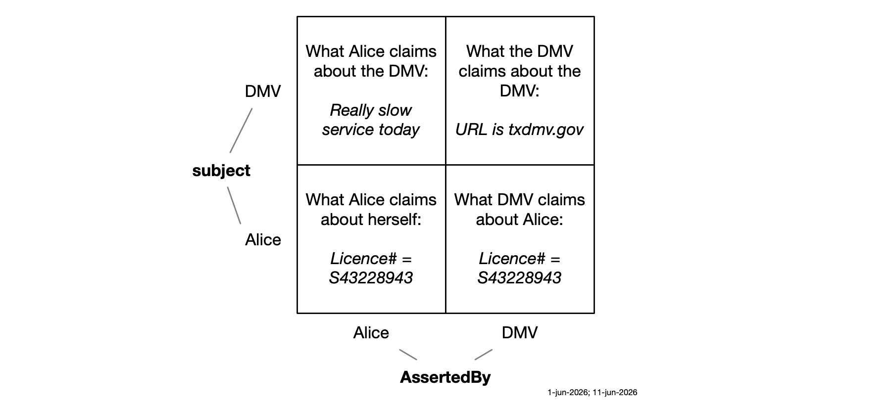</p>

The lower left shows a context that Alice might share with other people or companies. In it, she asserts that her driver's license number is S43228943, having almost certainly copied that number from her physical driver's license. The context in the lower right carries the same information as the lower left, but because it is being asserted by the DMV it is more likely to be trusted by a recipient, especially if this information is conveyed via secure channel and the claims are cryptographically bound to the identity of the DMV.

## Categories

We organize multiple dimensions of a person's life into a structure of nested *categories*. Categories in turn may contain one or more *contexts*. Categories can model finer-grained concepts such as roles or personas, or capture the full nuance of a 1:1 relationship with a specific person or company.

Categories range in scope. They vary from a few broad top level categories like "People" to narrower categories like "Family" and ultimately narrowing down to individual relationships with a single family member. The user can choose at what level in this broad to narrow tree structure to put what kind of information. For example if the user has a nickname used only by this one family member, they can add that "claim" (attribute) at the 1:1 relationship level. 

<p align="center">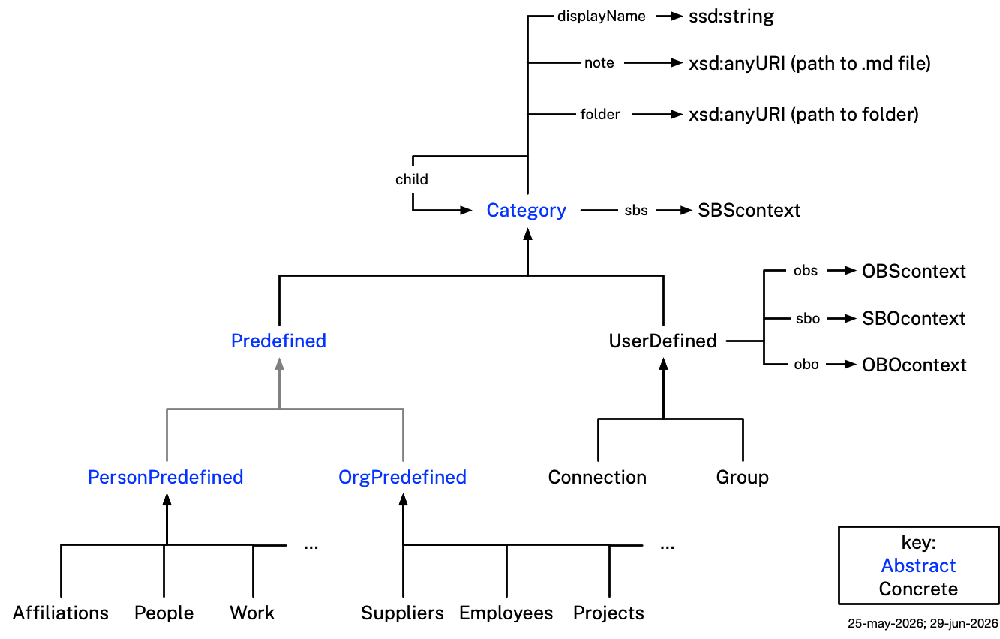</p>

As shown in the diagram below, categories may be `c:Predefined` or `c:UserDefined`. Some predefined subtypes are shown in the diagram below. The `c:child` property enables categories to be arranged into a tree structure.

<p align="center">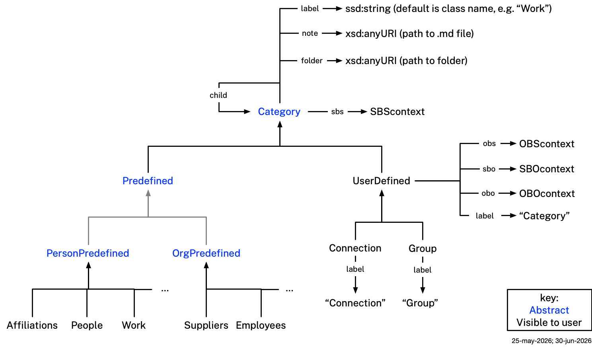</p>

All categories have a `c:sbs` link to a context (or category) that is about the self as asserted by the self (user). User-defined categories have three additional (optional) kinds of links to contexts: 

- `c:obs` - a context about the other party as asserted by the self.
- `c:sbo` - a context about the self as asserted by the other party.
- `c:obo` - a context about the other party as asserted by the other party.


#### Predefined Categories

Here are the predefined categories:
1. **People** — relationships and interactions with people in your social or professional life.
    - **Family** — relationships and interactions with family members.
    - **Marriage/Partner** - relationships with a spouse or life partner.
    - **Friends** — relationships and interactions with friends.
    - **Consultants** — interactions with individuals who are consultants and provide services to you. Health-related consultants (e.g. primary care physician, physical therapist) see are under the Health category. Accountants, bookkeepers and financial advisors are under the Finance category.
2. **Work** — professional roles, employment history, and career relationships.
    - **Employee** — related to being an employee. Your business card. 
    - **Contributor** — related to contributing to initiatives started or led by others.
    - **Creator** — related to being a creator, inventor, founder, or author of something.
3. **Companies** — relationship with companies and organizations that provide services or products to you that are not in these other categories:
    - For healthcare related firms see Health > Healthcare. 
   - For financial service providers see Finance > Financial Services.
   - For home utility providers see Home.
4. **Finances** — information about personal finances, bookkeeping, budgets, payment cards, bank accounts, IOUs, accountants, bookkeepers, financial advisors. 
    - **FinancialServices** — relationship with banks or other financial services institution.
5. **Health** — personal health and wellness information. Medical history, allergies, medications, blood type, primary care physician, nurses, physical therapists, health insurance policies and cards, vaccinations.
    - **Healthcare** — relationship with healthcare providers or health insurance companies.
6. **Events** — participation in or relationship to a specific event.
    - **Meetings** — a meeting or appointment.
    - **Conferences** — a conference or professional gathering.
    - **Parties** — parties and other kinds of social gatherings.
7. **Government** — government-issued credentials, tax records, and civic relationships.
    - **Federal** — federal government context (e.g. passport, federal tax records).
    - **State** — state government context (e.g. driver's license, state tax records).
    - **Municipality** — municipal government context (e.g. local permits, library card).
8. **Information** — general knowledge selected by you, web links, documents, images
    - **Learnings** — knowledge gained through personal experience.
9. **Possessions** — owned assets, property, vehicles, and other possessions.
    - **Vehicles** — owning and maintaining a vehicle. Vehicle insurance, repairs, mechanics, garages.
    - **Pets** — taking care of your pet(s). Veterinarians, medicines, food providers.
10. **Home** — owning or renting a home, apartment or other dwelling. Leases, deeds, utility accounts, home/renters insurance. 
11. **Projects** — involvement in a specific project or initiative.
12. **Legal** — legal matters, contracts, agreements, trusts, wills, and professional legal relationships.
13. **Travel** — travel plans, trips, and related information. Loyalty programs, airlines, bus lines, trains. 
14. **Affiliations** — sports clubs, team, charities, faith groups, memberships. Some of these may exist as a `g:Group` on the PDN.

### Category DataBooks

Each node in the `c:Category` hierarchy is represented by a **category DataBook** (`.databook.md` file with `type: category-databook`). Category DataBooks form a tree linked by the `c:child` property, which points from a parent category to its child category IRIs. The predefined canonical category DataBooks live in `categories/`, rooted at `categories/categories.databook.md`.

Each Mia user instance maintains its own parallel category tree in a separate directory. No links of any kind (`c:child`, `c:sbs`, `c:obs`, `c:obo`, `c:sbo`) cross from the canonical tree into a user's instance tree. A user's instance tree contains copies of the predefined canonical categories (each with a `copiedFrom:` property pointing to the canonical IRI) alongside any user-defined categories they have created. Context links (`c:sbs`, `c:obs`, `c:obo`, `c:sbo`) appear only in a user's instance tree, not in the canonical tree.

**Predefined vs. user-defined**: Categories with `mia.predefined: true` correspond to `c:Predefined` subclasses shipped with Mia. The class IRI is derived from the DataBook title by removing spaces (e.g. title `"FinancialServices"` → class `context:FinancialServices`). Categories with `mia.predefined: false` are `c:UserDefined` instances created by the Mia user to organize their own contexts (e.g. a specific person, company, or place).

**Context links**: Each category DataBook in a user's instance tree may carry up to four optional links to context DataBook IRIs, corresponding to the four `c:Context` subtypes:

| Property | `c:Context` subtype | Cardinality | Meaning |
|----------|---------------------|-------------|---------|
| `c:sbs` | `c:SBS-Context` | 0..1 | The user's own context in this category |
| `c:obs` | `c:OBS-Context` | 0..1 | The user's record of the other party |
| `c:obo` | `c:OBO-Context` | 0..N | A context the other party presents |
| `c:sbo` | `c:SBO-Context` | 0..1 | A context the other party holds about the user |


### Context Ontology File

- **`context.ttl`** — The Context ontology, defining:
  - *Classes*: `c:Category`, `c:Predefined`, `c:UserDefined` and all leaf category subclasses; `c:Context`, `c:SBS-Context`, `c:OBS-Context`, `c:OBO-Context`, `c:SBO-Context`.
  - *Annotation properties*: `c:category`, `c:assertedBy`, `c:subject`, `c:about-by`, `c:template`.
  - *Object properties*: `c:sbs`, `c:obs`, `c:obo`, `c:sbo`, `c:child`.
  These terms are referenced by name in the YAML frontmatter of each DataBook file.

- **`context-shacl.ttl`** — SHACL shapes for category DataBook instances. Constrains `c:Category` instances to at most one `c:sbs` value, and `c:UserDefined` instances to at most one `c:obs` and at most one `c:sbo` value; `c:obo` is unconstrained (0..N).

### Validation

Context file metadata (category, asserter, subject, about-by) is declared in YAML frontmatter and validated at authoring time by convention. Category DataBook instances are validated by `context-shacl.ttl`.


## Persona Ontology

The Persona ontology defines a formal, machine-readable model of a person. It is used by Mia to represent the user as well as information about other people. Mia can bi-directionally synchronize information with other Mia users on a Personal Data Network (PDN).  

We represent a person with the `persona:Person` class — a Mia-specific subclass of CCO `Person` (`cco:ont00001262`). Each context file contains exactly one `persona:Person` individual. The Mia user's own `persona:Person` individual always uses the IRI `:Self` across all of their context files; other people, groups, and organizations are assigned locally-minted named IRIs (e.g. `:Bob_Johnson`). These context files function as *named-graph slices* — each is an independent snapshot of an identity in a specific relationship or institutional context, carrying the claims relevant to that context: names, addresses, phone numbers, SSNs, physical characteristics, parent-child relationships, social connections, payment cards, and more. The Persona ontology reuses existing well-known ontologies wherever possible and defines new terms only where no suitable existing term exists.

<p align="center"></p>

### Key properties and classes

This section describes the most fundamental properties and classes in the Persona ontology. A person's identity data is spread across multiple named-graph slice files, each containing one `persona:Person` individual. The Mia user's slices share the IRI `:Self`; each other person's slices share their locally-assigned named IRI.

**Classes**

* `persona:Person` — a Mia-specific subclass of CCO `Person` (`cco:ont00001262`). Each context file (named-graph slice) contains exactly one `persona:Person` individual. The Mia user's own `persona:Person` always uses the IRI `:Self`, shared across all of their context files. Other people, groups, and organizations are assigned locally-minted named IRIs (e.g. `:Bob_Johnson`, `:Paula_Walker`). `:Self` is a local IRI and is never exposed externally over the PDN, so there are no collisions between Mia instances. All identity data — names, identifiers, addresses, social networks, payment cards, and more — attaches to this individual.

**Properties**

* `i:hasPDNidentifier` — links a `persona:Person` to a `i:PDNidentifier` — the identifier used to communicate with this Person over the Personal Data Network. Sub-property of CCO `designated by`.


### Social classes and properties 

This section describes classes and properties related to a person's social network.

**Classes**

* `cco:ont00001183` - Social Network

**Properties**

* `p:hasSocialNetwork` - a social network — other people known by the `persona:Person` carrying the social network. The holder is not included as a member part of the social network object, but *is* considered to be a part of it by virtue of holding the network entity.
* `BFO_0000115` - has member part. Links to `persona:Person` members of this network.

### Possession-related classes and properties

This section describes properties and classes related to things a person has, holds, possesses, purchased, or rents. 

 - Physical plastic/paper cards are `MaterialArtifact` subclasses that include driver's license, health insurance card, payment card, etc.
 - Physical wallets - Cards may be placed in a wallet (via BFO `continuant part of`) or held directly by the `persona:Person` (via `p:hasPhysicalCard`).

<p align="center">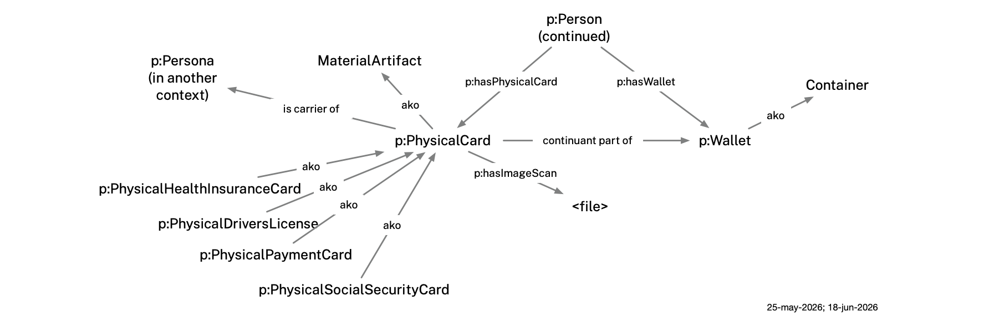</p>

**Classes**

* `p:PhysicalCard` — a physical plastic or paper card (held in a wallet or carried directly).
* `p:PhysicalHealthInsuranceCard` (subclass of `p:PhysicalCard`) — a physical health insurance membership card.
* `p:PhysicalDriversLicense` (subclass of `p:PhysicalCard`) — a state-issued driver's license card.
* `p:PhysicalPaymentCard` (subclass of `p:PhysicalCard`) — a physical credit or debit card.
* `p:PhysicalSocialSecurityCard` (subclass of `p:PhysicalCard`) — a paper or plastic card issued by the Social Security Administration.
* `p:Wallet` — a physical wallet that can hold cash as well as various kinds of paper or plastic identity or payment cards.

**Properties**

* `is carrier of` (from BFO) — used to link a physical card to its corresponding `persona:Person` in another context.
* `p:hasWallet` — links a `persona:Person` to a physical wallet (see Possessions below).
* `p:hasImageScan` — a link to a scanned image of this card.
* `p:hasPhysicalCard` — links a `persona:Person` to a `p:PhysicalCard` carried outside of a wallet (see Possessions below).

### Accounts

This section describes properties and classes related to a person's relationship with an online service provider. An online service account (`OnlineServiceAccount`, CCO `ont00000033`) records a person's credentials and identity with an online service provider such as Google or AT&T.

**Properties**

* `holds user account` (CCO) — links a `persona:Person` to an `OnlineServiceAccount`.
* `has service name` (CCO) — the name of the online service (e.g. "Google").
* `has service URI` (CCO) — the URI of the online service.
* `has user handle` (CCO) — the user's handle or username on the service.
* `p:hasPassword` — the password credential for an `OnlineServiceAccount` (Persona ontology extension).

### Finance-related classes and properties

This section describes properties and classes related to a person's interactions with financial institutions.

**Classes**

* `p:CheckingAccount` — a bank checking account held by a person, linked to a debit card.
* `p:CheckingAccountNumber` — an identifier designating a bank checking account, connected via `designated by` (`ont00001879`).
* `p:RoutingNumber` — an ABA routing transit number identifying the financial institution, connected via `designated by`.

**Properties**

* `p:hasBankAccount` — links a `persona:Person` to a `p:CheckingAccount` it records.
* `p:accessesBankAccount` — links a DebitCard to the `p:CheckingAccount` it draws funds from.

### Modeling details

This section describes a few details related to modeling names and addresses.

**Peer name pattern**: All name types (FullName, GivenName, FamilyName, AlternateName) connect directly to a `persona:Person` via `designated by` (`ont00001879`). They are siblings, not nested under a PersonName parent. Legal names belong to the birth certificate context file (annotated `c:template persona:BirthCertificate`); a preferred/goes-by name (AlternateName) belongs to each social or professional context where it applies.

**Address history**: Each address context file carries a `persona:Person` with a USPostalAddress and an `AddressDesignation` with a `TemporalInterval` (start date required; no end date = current address).

### Persona Templates

`p:PersonaTemplate` is an abstract classification class that serves as the common superclass for all reusable, context-type-specific template labels. These labels are defined in `persona-templates.ttl`. A context file declares its template in the YAML frontmatter as `mia.template` rather than by typing its `persona:Person` individual. Per-template SHACL files live in the `shacl/` subdirectory.

<p align="center">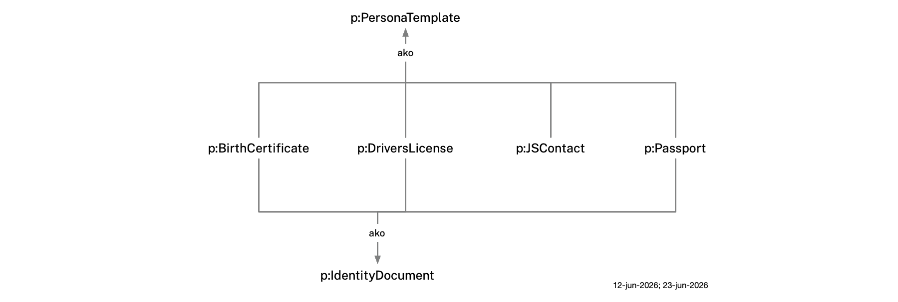</p>

**Government-issued identity documents** — `p:BirthCertificate`, `p:DriversLicense`, and `p:Passport` are subclasses of both `p:PersonaTemplate` (template label use) and `p:IdentityDocument` (artifact instance use). `p:IdentityDocument` is the class for government-issued documents that formally identify a person. The property `p:hasIdentityDocument` (domain: `p:Person`, range: `p:IdentityDocument`) links a person to the government document they hold. Each government-ID context file declares one named individual of the document type and links it from `:Self`. `p:JSContactCard` is a format label only — not a government-issued document — and is a subclass of `p:PersonaTemplate` only.

The four currently defined subclasses of `p:PersonaTemplate` are:

* `p:BirthCertificate` — label for context files that carry a person's legal birth name record as issued by a state agency. Also a subclass of `p:IdentityDocument`. Declared in the YAML frontmatter as `mia.template: "persona:BirthCertificate"`. SHACL shape `:BirthCertificateDocumentShape` (in `shacl/birthcertificate-shacl.ttl`) targets the `p:BirthCertificate` document individual and validates the holding `p:Person` via `^persona:hasIdentityDocument`:
  - **Required**: either a `FullName` designator **or** both a `GivenName` and a `FamilyName` designator (via `designated by`, `ont00001879`) — expressed with `sh:or`.
  - **Optional**: `AdditionalName` (middle name), `AlternateName` (e.g. maiden name), `Nickname`, and `Legal Name` designators.

* `p:JSContactCard` — label for context files that carry professional contact details in the JSContact (RFC 9553) format. A digital contact format (RFC 9553) — not a government-issued identity document, and therefore not a subclass of `p:IdentityDocument`. Declared in the YAML frontmatter as `mia.template: "persona:JSContactCard"`. SHACL shape `:JSContactCardPersonShape` (in `shacl/jscontactcard-shacl.ttl`) enforces:
  - **Required**: exactly one `OrganizationName` designator; at least one `Email` or `TelephoneNumber` designator.
  - **Optional**: all name components, `OrganizationUnit`, `JobTitle`, addresses, online services, anniversaries, personal info, photo.
  - **Max 1** on all single-valued name and organization components.
  See the [JSContact field coverage table](#jscontact-field-coverage) below for the complete mapping.

* `p:DriversLicense` — label for context files that carry the identity claims on a state-issued driver's license. Also a subclass of `p:IdentityDocument`. Declared in the YAML frontmatter as `mia.template: "persona:DriversLicense"`. SHACL shape `:DriversLicenseDocumentShape` (in `shacl/driverslicense-shacl.ttl`) targets the `p:DriversLicense` document individual and validates the holding `p:Person` via `^persona:hasIdentityDocument`:
  - **Required**: `FullName` **or** (`GivenName` + `FamilyName`); exactly one `Birthdate` (`cco:ent00000046`); exactly one `p:DriversLicenseNumber`; exactly one `ExpirationDateIdentifier` (`cco:ent00000054`).
  - **Optional**: `AdditionalName`; `p:IssuingJurisdiction` (USPS 2-letter state code, validated by `USStateNameShape`); `PostalAddress`; `p:hasPhoto`.
  Note: `p:PhysicalDriversLicense` (in `persona.ttl`) models the physical card object held in a wallet — `p:DriversLicense` is the template label that marks a context file as carrying driver's license identity data.

* `p:Passport` — label for context files that carry the identity claims on a government-issued passport. Also a subclass of `p:IdentityDocument`. Declared in the YAML frontmatter as `mia.template: "persona:Passport"`. SHACL shape `:PassportDocumentShape` (in `shacl/passport-shacl.ttl`) targets the `p:Passport` document individual and validates the holding `p:Person` via `^persona:hasIdentityDocument`:
  - **Required**: `FullName` **or** (`GivenName` + `FamilyName`); exactly one `Birthdate` (`cco:ent00000046`); exactly one `p:PassportNumber`; exactly one `ExpirationDateIdentifier` (`cco:ent00000054`).
  - **Optional**: `AdditionalName`; `p:IssueDate`; `p:IssuingCountry`; `p:PlaceOfBirth`; `p:GenderMarker`; `p:hasPhoto`.

#### JSContact field coverage

The table below maps every JSContact (RFC 9553) property to its representation in the Persona ontology. Properties defined in `persona-templates.ttl` for JSContact alignment are marked **JSC**.

| JSContact Property | Card. | Ontology Representation | Via | SHACL constraint |
|---|:---:|---|---|:---:|
| `name.full` | 0..1 | `cco:ent00000001` FullName | `designated by` | max 1 |
| `name.given` | 0..1 | `cco:ent00000002` GivenName | `designated by` | max 1 |
| `name.surname` | 0..1 | `cco:ent00000004` FamilyName | `designated by` | max 1 |
| `name.given2` | 0..1 | `cco:ent00000003` AdditionalName | `designated by` | max 1 |
| `name.surname2` | 0..1 | `cco:ent00000058` Surname2 | `designated by` | max 1 |
| `name.prefix` | 0..1 | `cco:ent00000057` Title/HonorificPrefix | `designated by` | max 1 |
| `name.suffix` | 0..1 | `cco:ent00000005` Suffix (Jr., Sr., III) | `designated by` | max 1 |
| `name.credential` | 0..1 | **JSC** `p:Credential` (MD, PhD, Esq.) | `designated by` | max 1 |
| `nicknames` | 0..1 | `cco:ont00000990` Nickname | `designated by` | max 1 |
| `name.altName` | 0..1 | `cco:ent00000006` AlternateName | `designated by` | max 1 |
| `emails` | 0..N | `cco:ent00000024` EmailAddress | `designated by` | — |
| ↳ `contexts` | 0..N | **JSC** `p:contactContext` annotation | annotation property | — |
| `phones` | 0..N | `cco:ent00000023` TelephoneNumber | `designated by` | — |
| ↳ `contexts` | 0..N | **JSC** `p:contactContext` annotation | annotation property | — |
| ↳ `features` | 0..N | **JSC** `p:phoneFeature` annotation | annotation property | — |
| `addresses` | 0..N | `cco:ent00000010` USPostalAddress | (address pattern) | — |
| ↳ `contexts` | 0..N | **JSC** `p:contactContext` annotation | annotation property | — |
| `anniversaries` (birth) | 0..1 | `cco:ent00000046` Birthdate | `designated by` | max 1 |
| `anniversaries` (other) | 0..N | **JSC** `p:Anniversary` | `p:hasAnniversary` | — |
| ↳ `kind` | — | **JSC** `p:anniversaryKind` | datatype property | — |
| ↳ `date` | — | **JSC** `p:anniversaryDate` | datatype property | — |
| ↳ `label` | — | **JSC** `p:anniversaryLabel` | datatype property | — |
| `organizations[].name` | 0..1 | `cco:ent00000047` OrganizationName | `designated by` | max 1 |
| `organizations[].units` | 0..1 | **JSC** `p:OrganizationUnit` | `designated by` | max 1 |
| `titles[].name` | 0..1 | **JSC** `p:JobTitle` | `designated by` | max 1 |
| `onlineServices` (account) | 0..N | `cco:ont00000033` OnlineServiceAccount | `holds user account` | — |
| `onlineServices` (URL) | 0..N | **JSC** `p:WebURL` | `designated by` | — |
| ↳ `service` | 0..N | **JSC** `p:serviceLabel` annotation | annotation property | — |
| `personalInfo` | 0..N | **JSC** `p:PersonalInfo` | `p:hasPersonalInfo` | — |
| ↳ `kind` | — | **JSC** `p:personalInfoKind` | datatype property | — |
| ↳ `value` | — | **JSC** `p:personalInfoValue` | datatype property | — |
| ↳ `level` | — | **JSC** `p:personalInfoLevel` | datatype property | — |
| `photos[].uri` | 0..N | **JSC** `p:hasPhoto` (xsd:anyURI) | datatype property | — |
| `legalName` | 0..1 | `cco:ont00001331` Legal Name | `designated by` | — |
| `uid` | 1 | IRI of the `persona:Person` individual | — | — |
| `notes` | 0..N | Person Note via `has text value` | `designated by` | — |
| `relatedTo` | 0..N | `BFO_0000115` (member) | object property | — |
| `updated` | 0..1 | `version:` in the DataBook YAML frontmatter | YAML field | — |
| `language` | 0..1 | *(not yet mapped)* | — | — |
| `categories` | 0..N | *(not yet mapped)* | — | — |
| `preferredLanguages` | 0..N | *(not yet mapped)* | — | — |


### Persona Ontology Files

- **`persona.ttl`** — The Persona ontology. Imports the domain ontologies above and documents which classes and properties Mia uses (required vs. optional). Defines `persona:Person` (Mee-specific subclass of CCO `Person`), Mia-specific extension properties (`p:hasSocialNetwork`, `p:hasPaymentCard`, `p:hasBankAccount`, etc.), and the core data model classes (physical card classes, banking classes, and others).
- **`persona-templates.ttl`** — Defines `p:PersonaTemplate` (abstract classification superclass) and the four concrete subtypes `p:BirthCertificate`, `p:JSContactCard`, `p:DriversLicense`, and `p:Passport`. These are used as values of `mia.template` in the DataBook YAML frontmatter — they classify the context file, not the `persona:Person` individual inside it. Also defines `p:IdentityDocument` (superclass for government-issued identity document artifacts) and `p:hasIdentityDocument` (links a `p:Person` to a `p:IdentityDocument` individual they hold); `p:BirthCertificate`, `p:DriversLicense`, and `p:Passport` are subclasses of both `p:PersonaTemplate` and `p:IdentityDocument`. Also defines related designator classes (`p:DriversLicenseNumber`, `p:IssuingJurisdiction`, `p:PassportNumber`, `p:IssuingCountry`, `p:PlaceOfBirth`, `p:GenderMarker`, `p:IssueDate`, `p:Credential`, `p:WebURL`, `p:OrganizationUnit`, `p:JobTitle`), complex information classes (`p:Anniversary`, `p:PersonalInfo`), annotation properties for JSContact channel labels (`p:contactContext`, `p:phoneFeature`, `p:serviceLabel`), and `p:hasPhoto`. Imported by `persona.ttl` so all context files inherit these classes transitively.

- **`shacl/birthcertificate-shacl.ttl`** — SHACL shapes for birth certificate context files (`c:template persona:BirthCertificate`). `:BirthCertificateDocumentShape` targets `persona:BirthCertificate` document individuals directly — all identity claims (names) are properties of the document individual, not the `persona:Person`. Enforces: FullName OR (GivenName + FamilyName) required; optional AdditionalName, AlternateName, Nickname, Legal Name.

- **`shacl/jscontactcard-shacl.ttl`** — SHACL shapes for JSContactCard context files (`c:template persona:JSContactCard`). Validates `persona:Person` instances:
  - OrganizationName required (1..1); at least one Email or TelephoneNumber required; all name components and OrganizationUnit/JobTitle optional (0..1 each).

- **`shacl/driverslicense-shacl.ttl`** — SHACL shapes for driver's license context files (`c:template persona:DriversLicense`). `:DriversLicenseDocumentShape` targets `persona:DriversLicense` document individuals directly — all identity claims are properties of the document individual, not the `persona:Person`. Enforces: FullName OR (GivenName + FamilyName) required; Birthdate, DriversLicenseNumber, ExpirationDateIdentifier required (1..1 each); IssuingJurisdiction, PostalAddress, and hasPhoto optional.

- **`shacl/passport-shacl.ttl`** — SHACL shapes for passport context files (`c:template persona:Passport`). `:PassportDocumentShape` targets `persona:Passport` document individuals directly — all identity claims are properties of the document individual, not the `persona:Person`. Enforces: FullName OR (GivenName + FamilyName) required; Birthdate, PassportNumber, ExpirationDateIdentifier required (1..1 each); IssueDate, IssuingCountry, PlaceOfBirth, GenderMarker, and hasPhoto optional.

- **`persona-shacl.ttl`** — SHACL constraint rules for all `persona:Person` individuals across all context files. Validates properties including:
  - *All `persona:Person` instances*: SSN format (`NNN-NN-NNNN`), email format, phone (E.164), address cardinality, payment cards, wallet, social network, bank account
  - *US Postal Address*: required street, city, state (USPS 2-letter), ZIP; optional country
  - *`persona:Person`*: scalp hair (0..1); `has mother` / `is mother of` range must be a `persona:Person`
  - *Social Network*: sub-groups (via `has part`) must be Social Networks; members (via `has member part`) must be `persona:Person` instances
  - *Debit Card*: card number and expiration date required; CVV optional
  - *`p:Wallet`*: items declaring themselves `continuant part of` this wallet must be `p:PhysicalCard` instances
  - *`p:PhysicalCard`*: image scan, if present, must be `xsd:anyURI` (max 1); `continuant part of` target, if present, must be a `p:Wallet` (max 1)

### Validation

`persona-shacl.ttl` runs against merged data from all context files (Tier 1 validation). Per-template SHACL files in `shacl/` run against individual context files (Tier 2): birth certificate, JSContactCard, driver's license, and passport each have their own shape file and are validated separately to avoid their `sh:targetClass persona:Person` constraints firing on every person slice in the merged dataset. See the [Validation](#validation) section for commands.

## Organization Ontology

The Organization ontology models organizations — companies, government agencies, nonprofits, and other institutions — that participate in the Personal Data Network. An organization has a PDN identity — an `i:Organization` identifier — that allows Mia to communicate with it as with any other node on the network.

<p align="center"></p>

**Classes**

* `o:Organization` — an organization (company, government agency, corporation, nonprofit, etc.) on the Personal Data Network.

### Organization Ontology File

- **`organization.ttl`** — The Organization ontology. Imports `pdn-identity.ttl`.

### Validation

`organization-shacl.ttl` validates `o:Organization` instances. Key constraint: each `o:Organization` must have exactly one `i:hasPDNidentifier` value of type `i:Organization`.

## Group Ontology

The Group ontology introduces the concept of a *shared* group (`g:Group`) whose members are individuals and/or organizations. The group entity *itself* as well as any attached properties are shared with all of its members. Like individuals and organizations, `g:Groups` also have their own PDN identifiers and can be communicated with as with any other node on the PDN.

<p align="center"></p>

**Classes**

* `g:Group` — a group of people and/or organizations on the Personal Data Network.

### Group Ontology File

- **`group.ttl`** — The Group ontology. Imports `pdn-identity.ttl`.

### Validation

`group-shacl.ttl` validates `g:Group` instances. Key constraint: each `g:Group` must have exactly one `i:hasPDNidentifier` value of type `i:Group`.

## PDN Identity Ontology

The Identity ontology is used to describe the kinds of identities that Mia can communicate with over the internet using Personal Data Network protocols. The root class, `i:PDNidentifier`, has three subclasses:

<p align="center"></p>

**Classes**

* `i:Individual` - an identifier of a human Mia user.
* `i:Group` - an identifier of a `g:Group` of Mia users and/or `o:Organizations`.
* `i:Organization` - an identifier of an `o:Organization`.

**Well-known individual**

* `i:Self` — a singleton individual of `i:Individual` representing the current Mia user's PDN identity. The corresponding `p:Person` individual `:Self` is what appears in `mia.assertedBy` and `mia.subject` fields. Every other Mia user is represented by a locally-assigned named individual of `i:Individual`.

### PDN Identity Ontology File

- **`pdn-identity.ttl`** — The PDN Identity ontology. 

### Validation

`pdn-identity-shacl.ttl` validates `i:PDNidentifier` instances. Key constraint: each instance must be typed as exactly one of `i:Individual`, `i:Group`, or `i:Organization`.

## Illustrative Example: Alice 

This section describes the local Mia dataset for a hypothetical user, Alice Walker. All of Alice's identity data lives in context-specific files — there is no separate selfness file. The IRI `:Self` identifies her `persona:Person` individual across all of her context files.

### Context File Naming Convention

Context DataBook filenames follow the pattern:

```
<subject>.<asserted-by>(<containing-category>)(<NN>).databook.md
```

| Segment | Meaning |
|---|---|
| `<subject>` | Who the context is about. `self` when the subject is the Mia user (`:Self`); the full hyphenated lowercase name otherwise (e.g. `paula-walker`, `bob-johnson`, `bhs-group`). |
| `<asserted-by>` | Who recorded the data. `self` when the asserter is `:Self`; the full hyphenated lowercase name otherwise (e.g. `bob-johnson`, `citibank`); the literal `members` for group contexts where any member may write. |
| `(<containing-category>)` | The filename root of the category DataBook that directly holds the `obs`, `sbs`, `obo`, or `sbo` link pointing to this context (e.g. `(paula-walker)`, `(bob-johnson)`, `(boston-hub-society)`, `(acme)`, `(citibank)`). This is often a user-defined category DataBook — it is NOT the `mia.category` IRI local name of the predefined category. |
| `(<NN>)` | Zero-padded two-digit context number in parentheses. |

The document IRI uses the same local name under the `https://www.example.org/mia/contexts/` base. For example, `self.citibank(citibank)(09).databook.md` has `id: https://www.example.org/mia/contexts/self.citibank(citibank)(09)`.

Examples:

| File | Subject | Asserted by | Containing category DataBook |
|---|---|---|---|
| `self.self(paula-walker)(employee)(20).databook.md` | Self (Alice) | Self (Alice) | `paula-walker(acme).databook.md` |
| `paula-walker.self(paula-walker)(family)(07).databook.md` | Paula Walker | Self (Alice) | `paula-walker(family).databook.md` |
| `self.bob-johnson(bob-johnson)(08).databook.md` | Self (Alice) | Bob Johnson | `bob-johnson(people).databook.md` |
| `bob-johnson.bob-johnson(boston-hub-society)(03).databook.md` | Bob Johnson | Bob Johnson | `boston-hub-society(affiliations).databook.md` |
| `bhs-group.members(boston-hub-society)(01).databook.md` | BHS Group | members (group) | `boston-hub-society(affiliations).databook.md` |

### Alice's Categories and Contexts

Alice interacts with other people, organizations and groups in contexts of different types, with each context file holding a named-graph slice of her identity. All context files are loaded into the triplestore together.

All context files reside in Alice's Mia. Some are authored by Alice (self-asserted data she entered directly); others are data received from peers over PDN and stored locally. In either case, Alice is the Mia user, so her `persona:Person` individual uses the IRI `:Self` across all of her context files. Other people — Bob Johnson, Paula Walker — and groups such as BHS use locally-assigned named IRIs (e.g. `:Bob_Johnson`, `:Paula_Walker`, `:BHS`). When data arrives from a peer's Mia (where that peer was `:Self` in their own instance), Alice's Mia assigns them a locally-minted identifier; once a PDN connection is established, that identifier resolves to their PDN ID.

Alice's category DataBooks are all in `example/categories/`. The full tree can be walked starting from `example/categories/categories.databook.md`. It contains two kinds of entries:

- **Copies of predefined canonical categories** (`mia.predefined: true`) — one for each of the 14 top-level categories and their subcategories. Each copy carries a `copiedFrom:` property pointing to the corresponding canonical IRI (e.g. `copiedFrom: "http://mee.foundation/ontologies/categories/people"`). Context links (`c:sbs`, `c:obs`, `c:obo`, `c:sbo`) to Alice's contexts are attached here, not in the canonical tree.
- **User-defined categories** (`mia.predefined: false`) — one per specific person, company, government agency, or group Alice interacts with (e.g. `bob-johnson(people)`, `acme(employee)`, `citibank(financial-services)`).

The following diagrams map out the categories and contexts used in our Alice example. We start with the People category--Alice's relationships with Bob and Paula. Note that Alice has put Bob in the general People category, rather than in Friends, Family or Consultants. We're not sure why she did this, but the example shows it's permissible. Note that the contexts with dotted outlines are context "slots" in the category — Alice could fill a context in any of these placeholder slots if she wishes to, and the claims in the context would flow downwards (although they can also be overridden) by lower-level categories and contexts:

<p align="center">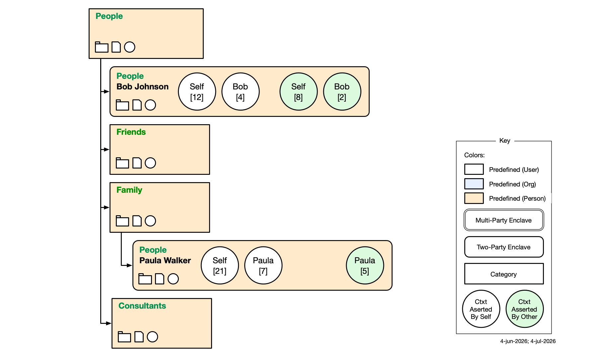</p>

Alice is an employee of Acme. She has added Business Card claims (attributes) to her Employee mid-level category. In her role as an employee of Acme she has a relationship with a colleague named Paula. 
<p align="center">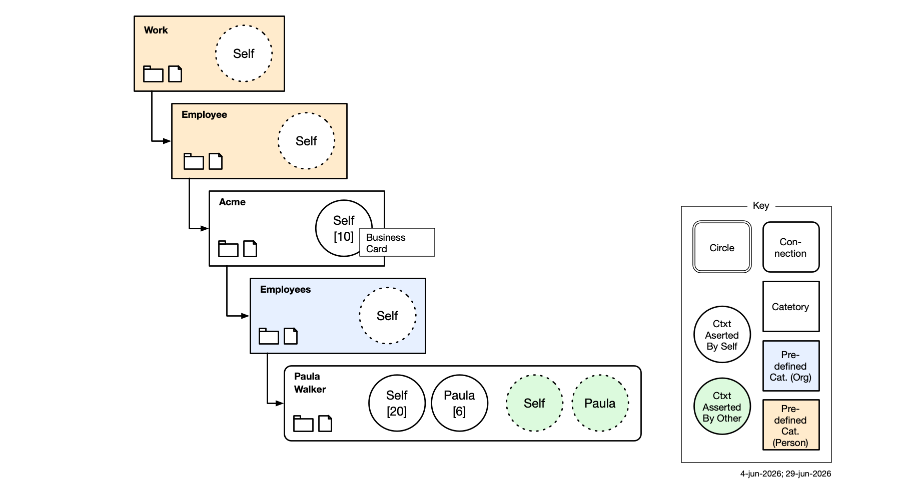</p>

Alice has relationships with two companies, Google and AT&T:
<p align="center">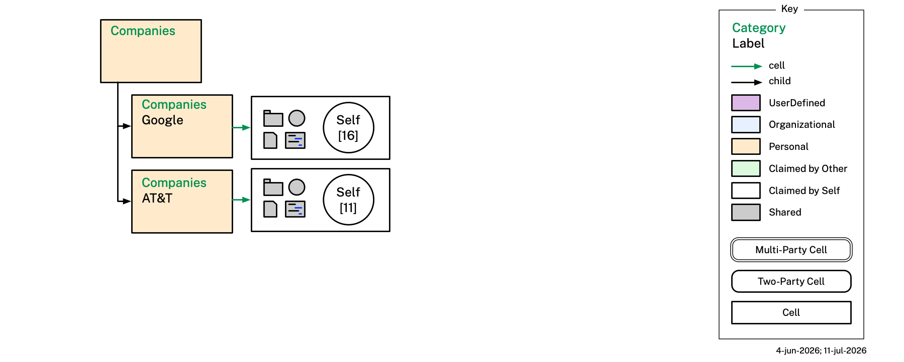</p>

Alice has a relationship with Citibank. In our example Citibank exists as a node on the PDN and directly asserts information about their customer, Alice in context #10.
<p align="center">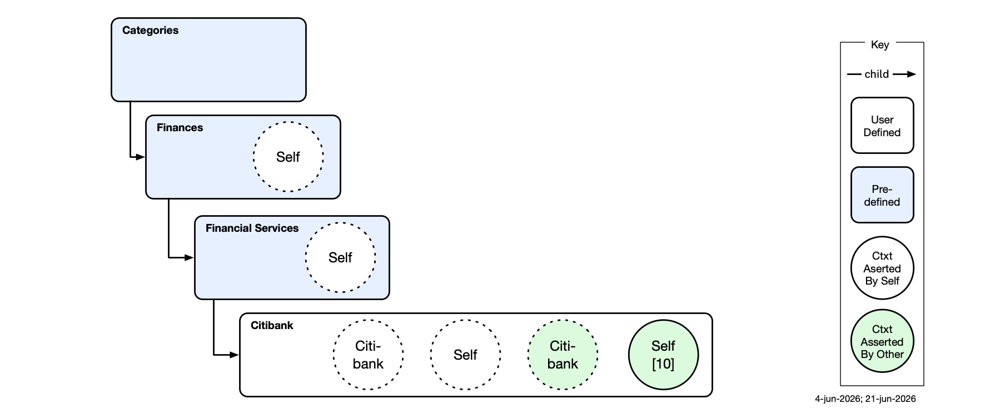</p>


Here are the categories related to Alice's interactions with various state governments:
<p align="center">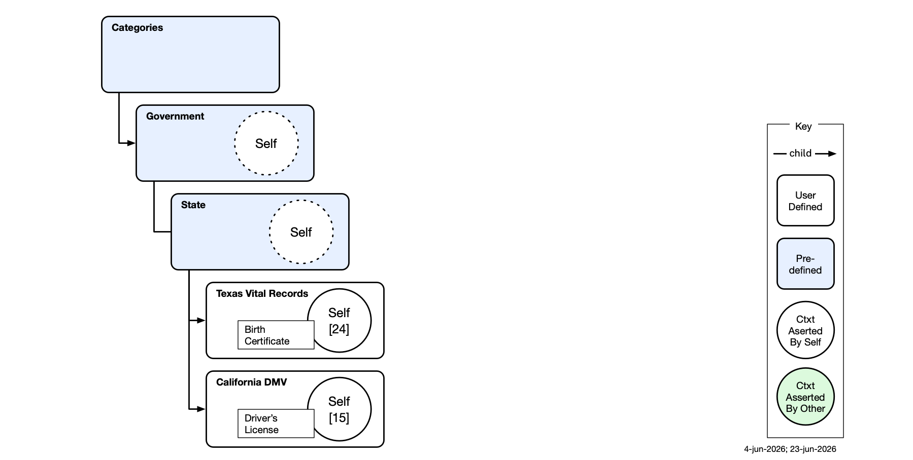</p>
Here are the categories related to Alice's interactions with the federal government:
<p align="center">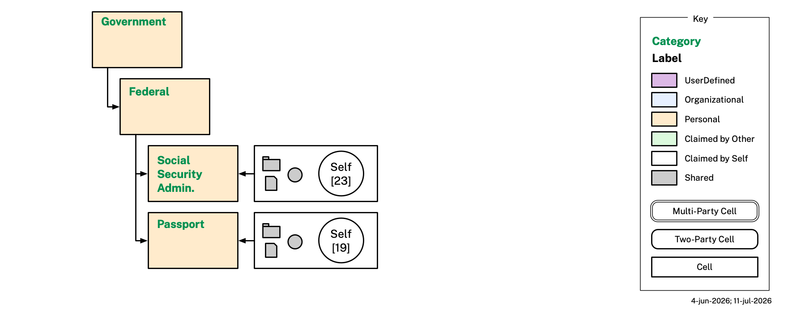</p>

Here are the categories related to Alice's interactions with two municipal governments:

<p align="center">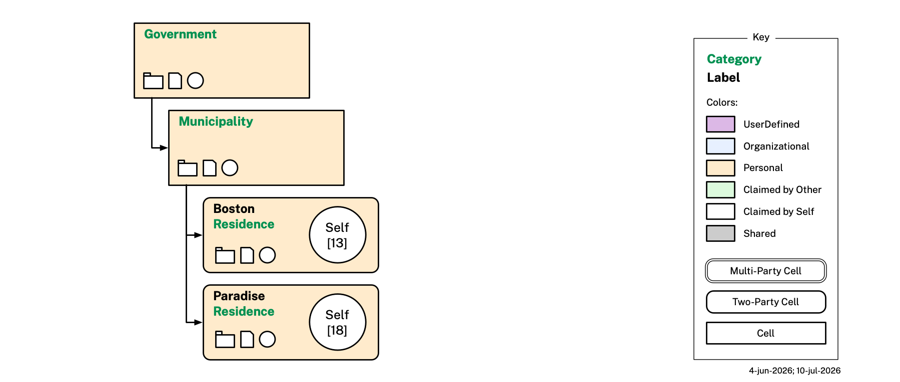</p>

Here are Alice's categories related to her personal health and her possessions:
<p align="center">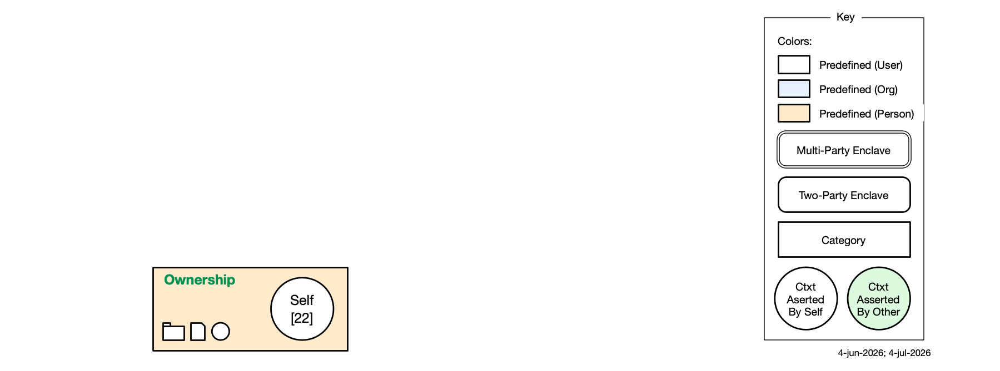</p>

The last diagram shows Alice's membership in the Boston Hub Society, an informal group that exists as a node on the PDN:
<p align="center">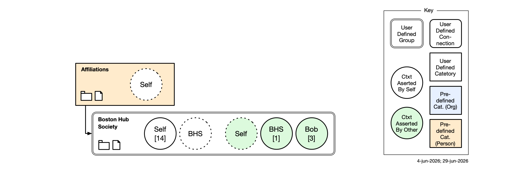</p>


The contexts in the table below are *about* Alice and asserted *by* Alice. All `.databook.md` files are in the `example/contexts/` folder.

| #  | DataBook file                                                                          | Context type | Key data                                                         | Diagram |
|--- |:--------------------------------------------------------------------------------------|:-------------|:-----------------------------------------------------------------|:--------|
| 10 | [self.self(acme)(10)](example/contexts/self.self(acme)(10).databook.md) | Employee     | Business card — given name, family name, email, phone, employer  | [view](example/contexts/images/self.self(acme)(10).png) |
| 11 | [self.self(att)(11)](example/contexts/self.self(att)(11).databook.md)                     | Companies    | Phone number                                                     | [view](example/contexts/images/self.self(att)(11).png) |
| 12 | [self.self(bob-johnson)(12)](example/contexts/self.self(bob-johnson)(12).databook.md)                     | People       | Alice's 1:1 context with Bob; social network with Bob as member  | [view](example/contexts/images/self.self(bob-johnson)(12).png)|
| 13 | [self.self(boston)(13)](example/contexts/self.self(boston)(13).databook.md)               | Municipality | Previous address — Boston, MA (2020–2025) with temporal interval | [view](example/contexts/images/self.self(boston)(13).png) |
| 14  | [self.self(boston-hub-society)(14)](example/contexts/self.self(boston-hub-society)(14).databook.md)                     | Affiliations | BHS profile: email, phone and current address                    | [view](example/contexts/images/self.self(boston-hub-society)(14).png)|
| 15 | [self.self(california-dmv)(15)](example/contexts/self.self(california-dmv)(15).databook.md) | State      | California driver's license — legal name, DOB, DL#, expiry, photo | [view](example/contexts/images/self.self(california-dmv)(15).png) |
| 16 | [self.self(google)(16)](example/contexts/self.self(google)(16).databook.md)               | Companies    | Gmail address                                                    | [view](example/contexts/images/self.self(google)(16).png) |
| 17 | [self.self(health)(17)](example/contexts/self.self(health)(17).databook.md)                 | Health     | Physical body — height (68 in.), blue eyes, grey hair            | [view](example/contexts/images/self.self(health)(17).png) |
| 18 | [self.self(paradise)(18)](example/contexts/self.self(paradise)(18).databook.md)           | Municipality | Current address — Paradise, CA (2025–present)                    | [view](example/contexts/images/self.self(paradise)(18).png) |
| 19 | [self.self(passport)(19)](example/contexts/self.self(passport)(19).databook.md)             | Federal    | US passport — legal name, DOB, passport#, issue/expiry, place of birth, gender marker, photo | [view](example/contexts/images/self.self(passport)(19).png) |
| 20 | [self.self(paula-walker)(employee)(20)](example/contexts/self.self(paula-walker)(employee)(20).databook.md)                   | Employee     | Acme employee context; company email; works with Paula           | [view](example/contexts/images/self.self(paula-walker)(employee)(20).png)|
| 21 | [self.self(paula-walker)(family)(21)](example/contexts/self.self(paula-walker)(family)(21).databook.md)   | Family       | Alice as a family member                       | [view](example/contexts/images/self.self(paula-walker)(family)(21).png) |
| 22 | [self.self(possessions)(22)](example/contexts/self.self(possessions)(22).databook.md)     | Possessions  | Wallet (driver's license + payment card); health ins., SSN card  | [view](example/contexts/images/self.self(possessions)(22).png) |
| 23 | [self.self(social-security-administration)(23)](example/contexts/self.self(social-security-administration)(23).databook.md)                     | Federal      | Social security number (SSN)                                     | [view](example/contexts/images/self.self(social-security-administration)(23).png) |
| 24 | [self.self(texas-vital-records)(24)](example/contexts/self.self(texas-vital-records)(24).databook.md) | State        | Legal names, maiden name                                         | [view](example/contexts/images/self.self(texas-vital-records)(24).png) |

The following table lists contexts that are *about* Alice but asserted by others.

| #  | DataBook file                                                                         | Context type | Key data                             | Diagram |
|--- |:-------------------------------------------------------------------------------------|:-------------|:-------------------------------------|:--------|
| 8  | [self.bob-johnson(bob-johnson)(08)](example/contexts/self.bob-johnson(bob-johnson)(08).databook.md)                         | People            | Alice as seen by Bob                 | [view](example/contexts/images/self.bob-johnson(bob-johnson)(08).png)|
| 9 | [self.citibank(citibank)(09)](example/contexts/self.citibank(citibank)(09).databook.md)     | FinancialServices | Debit card                           | [view](example/contexts/images/self.citibank(citibank)(09).png) |

The following table lists contexts about other people (Paula and Bob) or groups (Boston Hub Society) in Alice's Mia. All files are in `example/contexts/`.

| #  | DataBook file                                                                                     | Context type | Key data                                                         | Diagram |
|--- |:-------------------------------------------------------------------------------------------------|:-------------|:-----------------------------------------------------------------|:--------|
| 1  | [bhs-group.members(boston-hub-society)(01)](example/contexts/bhs-group.members(boston-hub-society)(01).databook.md)             | Affiliations | BHS group instance with Alice and Bob as members                | [view](example/contexts/images/bhs-group.members(boston-hub-society)(01).png) |
| 2  | [bob-johnson.bob-johnson(bob-johnson)(02)](example/contexts/bob-johnson.bob-johnson(bob-johnson)(02).databook.md)                     | People       | Bob's self-asserted Bob persona                                 | [view](example/contexts/images/bob-johnson.bob-johnson(bob-johnson)(02).png)|
| 3  | [bob-johnson.bob-johnson(boston-hub-society)(03)](example/contexts/bob-johnson.bob-johnson(boston-hub-society)(03).databook.md)                     | Affiliations | Bob's BHS member persona (name, email, phone, address)          | [view](example/contexts/images/bob-johnson.bob-johnson(boston-hub-society)(03).png) |
| 4  | [bob-johnson.self(bob-johnson)(04)](example/contexts/bob-johnson.self(bob-johnson)(04).databook.md)                 | People       | Alice's notes about Bob; fav drink: oat milk cappuccino         | [view](example/contexts/images/bob-johnson.self(bob-johnson)(04).png) |
| 5  | [paula-walker.paula-walker(paula-walker)(05)](example/contexts/paula-walker.paula-walker(paula-walker)(05).databook.md) | Family       | Paula's own family persona; social network with Alice       | [view](example/contexts/images/paula-walker.paula-walker(paula-walker)(05).png)|
| 6  | [paula-walker.self(paula-walker)(employee)(06)](example/contexts/paula-walker.self(paula-walker)(employee)(06).databook.md)           | Employee     | Paula as Alice's Acme colleague (Alice-asserted)                | [view](example/contexts/images/paula-walker.self(paula-walker)(employee)(06).png)|
| 7  | [paula-walker.self(paula-walker)(family)(07)](example/contexts/paula-walker.self(paula-walker)(family)(07).databook.md) | Family       | Paula as Alice's family member (Alice-asserted)           | [view](example/contexts/images/paula-walker.self(paula-walker)(family)(07).png)|


### Named graph scoping and context-specific membership

A `BFO_0000115` (has member part) triple on a Social Network individual — for example, `:Alice_Family_Network BFO_0000115 :Paula_Walker` in context 21 — targets `:Paula_Walker` as a person entity, not as a context-specific slice of her data. The named graph architecture provides the isolation: that triple lives inside context 21's named graph, and when an application needs "Paula Walker's family context data" it queries context 21's graph together with context 02's graph, rather than the full merged dataset.

This is the correct design for three reasons:

- **BFO semantics**: changing the range of `BFO_0000115` to a DataBook document IRI (e.g. `<https://www.example.org/mia/contexts/paula-walker.self(paula-walker)(family)(07)>`) would be a semantic error — the range of `has member part` must be a continuant (a person or group), not a document.
- **Model simplicity**: introducing context-specific "view" individuals (e.g. `:Paula_Walker_Family`) would reintroduce the layered complexity that the removal of `p:Persona` was designed to eliminate.
- **Tooling maturity**: annotating the triple with RDF-star (`<< :Alice_Family_Network BFO_0000115 :Paula_Walker >> mia:inContext <...>`) is a valid future option, but is not yet supported by Protégé and remains non-standard.

The practical implication is that **Tier 1 validation** (which merges all graphs) correctly finds all reachability links across the full dataset, while **application queries** that display a social network's members should join against specific context named graphs rather than the full triplestore merge.

## Diagrams

`draw.py` generates a Mermaid (`.mmd`) and PNG diagram from any context DataBook file:

```bash
python3 draw.py example/contexts/self.citibank(citibank)(09).databook.md
python3 draw.py example/contexts/self.self(paradise)(18).databook.md
```

Both output files are written to the same `images/` directory as the existing PNG diagrams.

**Dependencies** (one-time setup):
```bash
pip install rdflib pyyaml
npm install -g @mermaid-js/mermaid-cli
```

Each diagram shows the `persona:Person` individual (yellow), supporting named individuals (white boxes), class labels (plain text), blank-node designator chains, and literal values (green).

## Validation

Validation requires [Apache Jena](https://jena.apache.org/) (`riot`, `shacl`) and the [DataBook CLI](https://github.com/w3c-cg/holon/tree/main/architectures/databook/implementations/js) (`databook`; install: `cd /tmp/holon/architectures/databook/implementations/js && npm install && npm install -g .`). SHACL shapes remain plain Turtle (`.ttl`).

### Quick check — DataBook syntax

Verify that every DataBook file has valid YAML frontmatter and well-formed block annotations:

```bash
for f in $(find example -name "*.databook.md" \
             -not -path "*/under-development/*" | sort); do
  databook head "$f" -q > /dev/null || echo "FAIL: $f"
done
```

A file that fails here will also fail silently in `databook extract`, producing no Turtle output and causing downstream `riot` or SHACL errors that are harder to trace.

### Tier 1 — general validation (all context files)

`persona-shacl.ttl` applies to every `persona:Person` individual across all context files.

```bash
# Step 1 — extract turtle from every DataBook file (excluding under-development)
for f in $(find example -name "*.databook.md" \
             -not -path "*/under-development/*" | sort); do
  databook extract "$f" 2>/dev/null
done > /tmp/mia-data.ttl

# Step 2 — merge data with all ontology files and foundation ontologies
riot --output=turtle \
  project_files/bfo-core.ttl \
  project_files/PersonOntology.ttl \
  project_files/AddressOntology.ttl \
  project_files/StagingOntology.ttl \
  persona.ttl persona-templates.ttl context.ttl \
  pdn-identity.ttl group.ttl organization.ttl \
  /tmp/mia-data.ttl \
  2>/dev/null > /tmp/mia-merged.ttl

# Step 3 — collect shapes (shacl/ per-template files excluded — see Tier 2)
grep -v 'owl:imports' persona-shacl.ttl > /tmp/mia-shapes.ttl

# Step 4 — validate
shacl validate --shapes /tmp/mia-shapes.ttl --data /tmp/mia-merged.ttl --text
```

Expected output: `Conforms`

### Tier 2 — per-template validation (individual context files)

The `shacl/` shapes target document classes (`persona:BirthCertificate`, `persona:DriversLicense`, `persona:Passport`) or `persona:Person` (JSContactCard). Each template SHACL file is run against only the relevant context file merged with the foundation ontologies.

```bash
# Shared base: foundation ontologies + application ontologies
riot --output=turtle \
  project_files/bfo-core.ttl \
  project_files/PersonOntology.ttl \
  project_files/AddressOntology.ttl \
  project_files/StagingOntology.ttl \
  persona.ttl persona-templates.ttl context.ttl \
  pdn-identity.ttl group.ttl organization.ttl \
  2>/dev/null > /tmp/mia-base.ttl

# BirthCertificate — self.self(texas-vital-records)(24).databook.md
databook extract "example/contexts/self.self(texas-vital-records)(24).databook.md" 2>/dev/null > /tmp/data-birth-cert-raw.ttl
riot --output=turtle /tmp/mia-base.ttl /tmp/data-birth-cert-raw.ttl 2>/dev/null > /tmp/data-birth-cert.ttl
grep -v 'owl:imports' shacl/birthcertificate-shacl.ttl > /tmp/shapes-birth-cert.ttl
shacl validate --shapes /tmp/shapes-birth-cert.ttl --data /tmp/data-birth-cert.ttl --text

# JSContactCard — self.self(acme)(10).databook.md
databook extract "example/contexts/self.self(acme)(10).databook.md" 2>/dev/null > /tmp/data-jscontact-raw.ttl
riot --output=turtle /tmp/mia-base.ttl /tmp/data-jscontact-raw.ttl 2>/dev/null > /tmp/data-jscontact.ttl
grep -v 'owl:imports' shacl/jscontactcard-shacl.ttl > /tmp/shapes-jscontact.ttl
shacl validate --shapes /tmp/shapes-jscontact.ttl --data /tmp/data-jscontact.ttl --text

# DriversLicense — self.self(california-dmv)(15).databook.md
databook extract "example/contexts/self.self(california-dmv)(15).databook.md" 2>/dev/null > /tmp/data-dl-raw.ttl
riot --output=turtle /tmp/mia-base.ttl /tmp/data-dl-raw.ttl 2>/dev/null > /tmp/data-dl.ttl
grep -v 'owl:imports' shacl/driverslicense-shacl.ttl > /tmp/shapes-dl.ttl
shacl validate --shapes /tmp/shapes-dl.ttl --data /tmp/data-dl.ttl --text

# Passport — self.self(passport)(19).databook.md
databook extract "example/contexts/self.self(passport)(19).databook.md" 2>/dev/null > /tmp/data-passport-raw.ttl
riot --output=turtle /tmp/mia-base.ttl /tmp/data-passport-raw.ttl 2>/dev/null > /tmp/data-passport.ttl
grep -v 'owl:imports' shacl/passport-shacl.ttl > /tmp/shapes-passport.ttl
shacl validate --shapes /tmp/shapes-passport.ttl --data /tmp/data-passport.ttl --text
```

Expected output for each: `Conforms`
