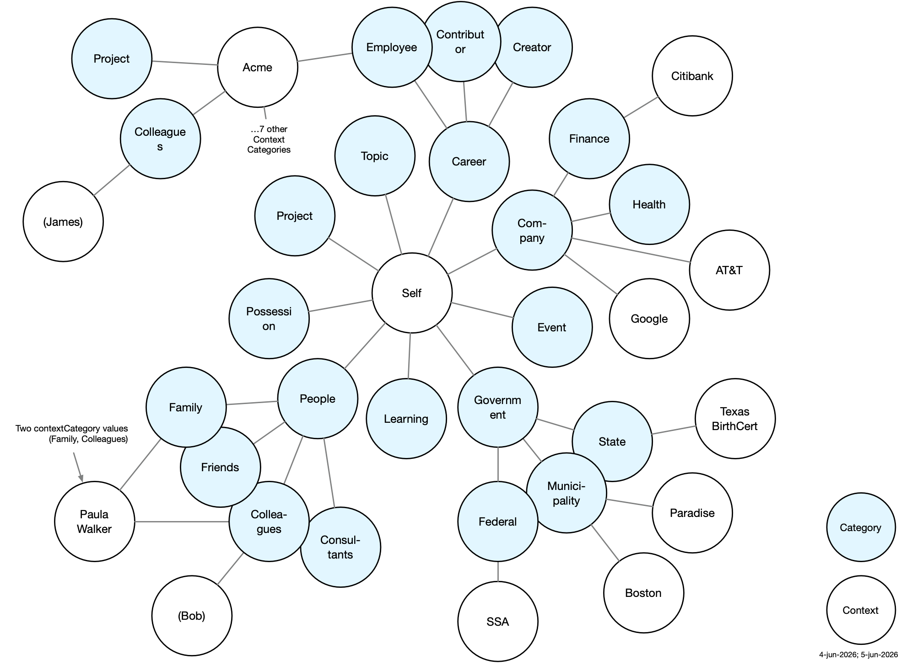

# Mia Ontologies

This document describes the ontologies used by the Mee Identity Agent (Mia) software application. 
Each Mia lives within the Personal Data Network (PDN), a data-sharing network with three kinds of participants: individual Mia users, groups of Mia users and/or organizations, and organizations (government agencies, companies, and nonprofits).

Mia ontologies import and profile existing ontologies — documenting which of their classes and properties Mia requires or uses — and extending them with Mia-specific classes and properties. They are built on BFO (Basic Formal Ontology) and CCO (Common Core Ontologies) as the upper ontological foundation, and on domain ontologies that extend CCO:
- **PersonOntology** — person, name types, parent-child relationships
- **AddressOntology** — postal address structure
- **StagingOntology** — staging area for terms pending promotion (phone numbers, email addresses, user accounts, etc.)
- **AgentOntology** — agents and their properties (imported transitively via PersonOntology)

The first two ontologies are **domain ontologies** that model a distinct kind of PDN node:
- **Persona ontology** — models a real person's identity data: names, addresses, phone numbers, relationships, payment cards, and more, structured around context-specific *personas*.
- **Organization ontology** — models organizations (companies, government agencies, non-profits, etc.) on the PDN.

The last three are **supporting ontologies** that support all three domains:
- **Group ontology** — a group made up of individuals and/or organizations.
- **Context ontology** — a container for information about people, groups, and organizations. A context also holds metadata about the category of context, who asserted the data, and which entity is primarily being described.
- **Identity ontology** — types of PDN network identifiers.

Throughout, we use these shorthands:
- `p:` is shorthand for the `persona:` namespace (`http://mee.foundation/ontologies/persona#`)
- `c:` for the `context:` namespace (`http://mee.foundation/ontologies/context#`)
- `i:` for the `identity:` namespace (`http://mee.foundation/ontologies/identity#`)
- `g:` for the `group:` namespace (`http://mee.foundation/ontologies/group#`)
- `o:` for the `organization:` namespace (`http://mee.foundation/ontologies/organization#`).

We first present an overview of the five ontologies and then illustrate them through a sample dataset for a hypothetical user, Alice Walker.

## Persona Ontology

The Persona ontology defines a formal, machine-readable model of a real-world person's identity data — names, addresses, phone numbers, SSNs, physical characteristics, parent-child relationships, social connections, payment cards, etc., — by reusing existing well-known ontologies wherever possible and defining new terms only where no suitable existing term exists.

We represent a person as a single `Person` entity along with multiple `p:Personas`, one per relationship or institutional context.

A person's selfness is their essential individuality or unique selfhood. It is represented by one central `Person` entity. This `Person` per se carries few properties: only physical attributes and parent-child relationships. Most importantly, it carries `p:hasPersona` links to context-specific `p:Persona` instances. Most names, identifiers and other attributes (often called claims) belong to those context-specific `p:Persona` instances; the one exception is a preferred/goes-by name, which belongs to the `Person` entity because it applies across all contexts.

A`p:Persona` is an Information Content Entity (CCO `ont00000958`) — a context-specific facet of a `Person`. `p:Persona` instances are linked to the `Person` entity via `p:hasPersona`, a subproperty of CCO `is subject of` (`ont00001801`). Each `p:Persona` carries the claims relevant to its specific context. 

A `p:Persona` can itself carry `p:hasPersona`. This allows intermediate, branch level `p:Personas` which in turn link to leaf level `p:Personas`. The claims of intermediate `p:Personas` are inherited by leaf `p:Personas` to which they are linked.

<p align="center"></p>

### Key properties and classes

This section describes the most fundamental properties and classes in the Persona ontology. The interconnection of a Person object in the Self container with multiple Persona objects in separate contexts forms the foundational graph structure. 

**Properties**

* `p:hasPersona` — links a `Person` (one's "selfness", essential individuality, or a sense of one's own unique personality and identity) to one of their context-specific `p:Persona` instances.
* `i:hasIdentity` — links a `p:Persona` to a `i:PDNidentity` — the identifier used to communicate with this Persona over the Personal Data Network. Sub-property of CCO `designated by`.
* `p:dyad` — links a `p:Persona` to a corresponding `p:Persona` about the same subject, but asserted by the other party rather than by the Self.
* `p:copiedFrom` — annotates a claim (blank node designator or named individual) to indicate the source context ontology from which it was copied. Value is the source context's ontology IRI.

**Classes**

* `p:Persona` — an Information Content Entity that represents how a person appears in the context of a specific interaction — with a company, government agency, another person, or a group of people. A `p:Persona` is a context-specific facet of that person linked via `p:hasPersona`.
* `p:BirthCertificate` — a `p:Persona` subtype whose purpose is to carry a person's legal birth name record as issued by a state agency.

### Possession-related properties and classes

This section describes properties and classes related to things a person has, holds, possesses, purchased, or rents. 

 - Physical plastic/paper cards are `MaterialArtifact` subclasses that include driver's license, health insurance card, payment card, etc.
 - Physical wallets - Cards may be placed in a wallet (via BFO `continuant part of`) or held directly by the `p:Persona` (via `p:hasPhysicalCard`).

<p align="center"></p>

**Properties**

* `is carrier of` (from BFO) — used to link a physical card to its corresponding `p:Persona` in another context.
* `p:hasWallet` — links a `p:Persona` to a physical wallet (see Belongings below).
* `p:hasImageScan` — a link to a scanned image of this card.
* `p:hasPhysicalCard` — links a `p:Persona` to a `p:PhysicalCard` carried outside of a wallet (see Belongings below).

**Classes**

* `p:PhysicalCard` — a physical plastic or paper card held in a wallet.
* `p:PhysicalHealthInsuranceCard` (subclass of `p:PhysicalCard`) — a physical health insurance membership card.
* `p:PhysicalDriversLicense` (subclass of `p:PhysicalCard`) — a state-issued driver's license card.
* `p:PhysicalPaymentCard` (subclass of `p:PhysicalCard`) — a physical credit or debit card.
* `p:PhysicalSocialSecurityCard` (subclass of `p:PhysicalCard`) — a paper or plastic card issued by the Social Security Administration.
* `p:Wallet` — a physical wallet that can hold cash as well as various kinds of paper or plastic identity or payment cards.

### Accounts

This section describes properties and classes related to a person's relationship with an only service provider. An online service account (`OnlineServiceAccount`, CCO `ont00000033`) records a person's credentials and identity with an online service provider such as Google or AT&T.

**Properties**

* `holds user account` (CCO) — links a `p:Persona` to an `OnlineServiceAccount`.
* `has service name` (CCO) — the name of the online service (e.g. "Google").
* `has service URI` (CCO) — the URI of the online service.
* `has user handle` (CCO) — the user's handle or username on the service.
* `p:hasPassword` — the password credential for an `OnlineServiceAccount` (Persona ontology extension).

### Finance-related properties and classes

This section describes properties and classes related to a person's interactions with financial institutions.

**Properties**

* `p:hasBankAccount` — links a `p:Persona` to a `p:CheckingAccount` it records.
* `p:accessesBankAccount` — links a DebitCard to the `p:CheckingAccount` it draws funds from.

**Classes**

* `p:CheckingAccount` — a bank checking account held by a person, linked to a debit card.
* `p:CheckingAccountNumber` — an identifier designating a bank checking account, connected via `designated by` (`ont00001879`).
* `p:RoutingNumber` — an ABA routing transit number identifying the financial institution, connected via `designated by`.

### Modeling details

This section describes a few details related to modeling names and addresses.

**Peer name pattern**: All name types (FullName, GivenName, FamilyName, AlternateName) connect directly to a `Person` or `p:Persona` via `designated by` (`ont00001879`). They are siblings, not nested under a PersonName parent. Legal names belong to `p:BirthCertificate` `p:Persona` instances; a preferred/goes-by name lives in `self.ttl` since it applies across all contexts.

**Address history**: Each address `p:Persona` carries a USPostalAddress and an `AddressDesignation` with a `TemporalInterval` (start date required; no end date = current address).

### Persona Ontology Files

- **`persona.ttl`** — The Persona ontology. Imports the domain ontologies above and documents which classes and properties Mia uses (required vs. optional). Defines Mia-specific extension properties (`p:hasPersona`, `p:hasSocialNetwork`, `p:hasPaymentCard`, `p:hasBankAccount`, etc.) and the core Persona data model classes (`p:Persona`, `p:BirthCertificate`, physical card classes, banking classes, and others).

- **`persona-shacl.ttl`** — SHACL constraint rules defining the shape `p:Personas`. Validates properties including:
  - *`p:BirthCertificate` `p:Persona` instances*: FullName OR (GivenName + FamilyName) required; optional AdditionalName, AlternateName, Nickname, Legal Name
  - *All `p:Persona` instances*: SSN format (`NNN-NN-NNNN`), email format, phone (E.164), address cardinality, payment cards, wallet
  - *US Postal Address*: required street, city, state (USPS 2-letter), ZIP; optional country
  - *`Person` (selfness)*: scalp hair (0..1); `has mother` / `is mother of` range must be a `Person`
  - *Social Network*: sub-groups (via `has part`) must be Social Networks; members (via `has member part`) must be `p:Persona` instances
  - *Debit Card*: card number and expiration date required; CVV optional
  - *`p:Wallet`*: items declaring themselves `continuant part of` this wallet must be `p:PhysicalCard` instances
  - *`p:PhysicalCard`*: image scan, if present, must be `xsd:anyURI` (max 1); `continuant part of` target, if present, must be a `p:Wallet` (max 1)

### Validation

`persona-shacl.ttl` validates instance data against the Persona ontology. Key constraints: `p:BirthCertificate` instances must have FullName OR (GivenName + FamilyName); SSNs must match `NNN-NN-NNNN` format; US postal addresses must have street, city, state (USPS 2-letter code), and ZIP; debit cards must have a card number and expiration date; a `p:Persona` may have at most one `i:hasIdentity`. The Persona Ontology Files section above lists the full set of constraints.

## Group Ontology

The Group ontology introduces the concept of a shared group whose members are individuals and/or organizations. The group object *itself* (i.e. the set object) as well as any attached properties are shared with all of its members. In addition to individuals and organizations having PDN identifiers, a group itself has a PDN identity as a node on the PDN network. 

<p align="center"></p>

**Classes**

* **`g:Group`** — a group or community of people on the Personal Data Network.

### Group Ontology File

- **`group.ttl`** — The Group ontology. Imports `identity.ttl`.

### Validation

`group-shacl.ttl` validates `g:Group` instances. Key constraint: each `g:Group` must have exactly one `i:hasIdentity` value of type `i:Group`.

## Organization Ontology

The Organization ontology models organizations — companies, government agencies, non-profits, and other institutions — that participate in the Personal Data Network. An organization has a PDN identity — an `i:Organization` identifier — that allows Mia to communicate with it as a node on the network.

<p align="center"></p>

**Classes**

* **`o:Organization`** — an organization on the Personal Data Network.

### Organization Ontology File

- **`organization.ttl`** — The Organization ontology. Imports `identity.ttl`.

### Validation

`organization-shacl.ttl` validates `o:Organization` instances. Key constraint: each `o:Organization` must have exactly one `i:hasIdentity` value of type `i:Organization`.

## Context Ontology

A context is a container of information whose primary subject is one of the three kinds of PDN node: a `p:Persona` (representing a context-specific facet of a person), a `g:Group`, or an `o:Organization`. It holds the subject's claims and, in the case of a `p:Persona` subject, may also include the `p:Persona` facets of other people in that context. A context is implemented as a `.ttl` file that by convention contains an owl:Ontology. The context ontology defines four required properties of this owl:Ontology:

- A human-readable name for the context (`c:name`) — a plain string, e.g. `"Citibank"`.
- What is the category of context (`c:contextCategory`), e.g. relationships with family members, interactions with a bank, etc.
- Who is making the assertions the context contains (`c:assertedBy`) - its value is a `i:PDNidentity`
- Who is the context mainly about (`c:subject`) - its value is a `i:PDNidentity`
`c:contextCategory` takes values from the `c:ContextCategory` hierarchy; both `c:assertedBy` and `c:subject` take values from the `i:PDNidentity` hierarchy defined in identity.ttl.

**`c:contextCategory`** — The nature of the interaction/relationship context. Values form a subclass hierarchy under `c:ContextCategory`:

- `c:Social` — a context whose subject is one of the Self's `p:Personas` *and* that includes a social network with `has member` links to the `p:Personas` of other people in other contexts.  Examples: family relationships, colleague networks, friend groups.
  - `c:Group` — interactions with a formal or informal group of people.
  - `c:Collection` and subtypes `c:Family`, `c:Colleagues`, `c:Friends`, `c:Consultants` — interactions with individual people in a person's life.
- `c:Personal` — a context containing only one of the Self's `p:Personas` -- no other person's `p:Persona` appears in it. It describes the Self's relationship with (and interactions with) a specific institution, role, possession, or area of knowledge. Examples: a bank account, a driver's license, a car.
  - `c:Work` and subtypes `c:Employee`, `c:Contributor`, `c:Creator` — professional roles.
  - `c:Company` and subtypes `c:Health`, `c:Finance` — interactions and/or relationship with a company or other non-governmental organization.
  - `c:Event` — participation in or relationship to a specific event, e.g. a face-to-face or online meeting.
  - `c:Government` and subtypes `c:Federal`, `c:State`, `c:Municipality` — interactions with government agencies.
  - `c:Knowledge` general knowledge selected by a person to be useful to them. It has a subtype `c:Learning` which is knowledge gained through personal experience.
  - `c:Possession` and subtypes `c:Automobile`, `c:Pet`, `c:Dwelling` — a person's belongings or other things they possess, rent, or lease.
  - `c:Project` — involvement in a specific project or initiative.

<p align="center"></p>

**`c:assertedBy`** — Who is making the assertion. Values are subclasses of `i:PDNidentity` from the Identity ontology:
- `i:Self` — the Mia user is recording the data, even if the underlying information originates from some other party such as a company, government agency, or another person.
- `i:Individual` — another Mia user is asserting the data directly.
- `i:Group` — a group of Mia users is asserting the data.
- `i:Organization` — an organization is asserting the data directly.

**`c:subject`** — Whose identity the context file describes. Values are subclasses of `i:PDNidentity` from the Identity ontology:
- `i:Self` — the context is primarily about the Mia user.
- `i:Individual` — the context is primarily about another human Mia user.
- `i:Group` — the context is primarily about a group of Mia users.
- `i:Organization` — the context is primarily about an organization (legal corporation or government agency).

The diagram below shows four kinds of contexts related to a hypothetical Mia user, Alice, and her interactions with a Department of Motor Vehicles (DMV) agency. Across the top are contexts where the DMV itself is the subject, and at the bottom where Alice is the subject. At the left are contexts where Alice has made the assertions (e.g. Alice's Mia has written the claims into the context) and at the right are contexts where the DMV as the "other" has written the claims. 

<p align="center"></p>

The lower right shows a context that Alice might share with other people or companies. In it, she asserts that her driver's license number is S43228943, having almost certainly copied that number from her physical driver's license. The context in the lower right carries the same information as the lower left, but because it is being asserted by the DMV it is more likely to be trusted by a recipient, especially if this information is conveyed via secure channel and the claims are cryptographically bound to the identity of the DMV.

### Context Ontology File

- **`context.ttl`** — The Context ontology. 

### Validation

`context-shacl.ttl` validates context file ontology IRIs. Key constraint: any ontology annotated with `c:contextCategory` must also declare exactly one `c:name`, `c:assertedBy`, and `c:subject`.

## Identity Ontology

The Identity ontology is used to describe the kinds of identities that Mia can communicate with over the internet using Personal Data Network protocols. The root class, `i:PDNidentity`, has three subclasses:

<p align="center"></p>

* `i:Individual` - an identifier of a Mia user. The identity of *this* Mia's user is an instance of the subclass, `i:Self`
* `i:Group` - an identifier of a `g:Group` of Mia users (`p:Personas`) and/or `o:Organizations`.
* `i:Organization` - an identifier of an `o:Organization`.

### Identity Ontology File

- **`identity.ttl`** — The Identity ontology. 

### Validation

`identity-shacl.ttl` validates `i:PDNidentity` instances. Key constraint: each instance must be typed as exactly one of `i:Individual`, `i:Group`, or `i:Organization`.

## Illustrative Example: Alice Walker

The repository includes a worked example for a hypothetical person, Alice Walker, to demonstrate the five Mia ontologies in use.

Within Alice's self context is `:Alice_Walker-Self`, a `Person` entity. It is linked via `p:hasPersona` links to multiple `p:Personas`- each in its own context outside the self context container (`example/alice/self.ttl`).

<p align="center"></p>

Alice's `self.ttl` context also describes some of her physical characteristics shown below:

<p align="center"></p>

### Alice's Personas and Contexts

As we've mentioned, Alice interacts with other people, organizations and groups in contexts of different types with each context holding a distinct `p:Persona` facet.

The contexts in the table below are all *about* Alice. That is, they have a c:subject property whose value is one of Alice's PDNidenties. They are also all asserted *by* Alice - Alice is making these claims about herself. That is, they have a c:assertedBy property whose value is one of Alice's PDNidentities.

| Context file       | Context type | Key data | Image |
|:-------------------|:-------------|:---------|:------|
| `google.ttl`       | Company      | Email address | [view](images/alice-contexts/alice(google).png) |
| `att.ttl`          | Company      | Phone number | [view](images/alice-contexts/alice(att).png) |
| `tx-birth-cert.ttl`| State        | Legal names: Margery Alice Walker; maiden name Margery Alice Arnold | [view](images/alice-contexts/alice(texas-birth-certificate).png) |
| `paradise.ttl`     | Municipality | Current address — Paradise, CA (2025–present) | [view](images/alice-contexts/alice(paradise).png) |
| `boston.ttl`       | Municipality | Previous address — Boston, MA (2020–2025) with temporal interval | [view](images/alice-contexts/alice(boston).png) |
| `ssa.ttl`          | Federal      | SSN | [view](images/alice-contexts/alice(ssa).png) |
| `bhs.ttl`          | Group        | BHS profile includes email, phone and current address | [view](images/alice-contexts/alice(bhs).png) |
| `colleagues.ttl`   | People       | Colleagues social network with Bob Johnston | [view](images/alice-contexts/alice(colleagues).png) |
| `family.ttl`       | Family       | Family social network with Paula Walker | [view](images/alice-contexts/alice(family).png) |
| `possessions.ttl`  | Possession   | Wallet (driver's license + payment card); health insurance and SSN card | [view](images/alice-contexts/alice(possessions).png) |
| `acme.ttl` (TODO)  | Employee     | Colleagues, Customers, Projects |  |

The following table lists contexts that are *about* Alice, but asserted by others. The Citibank context is asserted by the Citibank organization; it makes claims about Alice. 

| Context file       | Context type | Key data | Image |
|:-------------------|:-------------|:---------|:------|
| `citibank.ttl`     | Company      | Debit card | [view](images/alice-contexts/alice(citibank).png) |
<!---
| `alice(by-bob)` | Colleagues | What Bob says about Alice |  |
--->


<!---
Rhe following table lists contexts that are about other people (Paula and Bob).


| Context file              | Context type | Key data | Image |
|:--------------------------|:-------------|:---------|:------|
| `paula(by-alice).ttl`     | Family       | What Alice claims about Paula |  |
| `paula(by-paula).ttl`     | Family       | What Paula claims about Paula |  |
| `paula(by-paula-BHS).ttl` | Group        | What Paula claims about herself in BHS |  |
| `bob(by-alice).ttl`       | Colleagues   | What Alice claims about Bob |  |
| `bob(by-bob).ttl`         | Colleagues   | What Bob claims about Bob |  |
--->

### Alice's Contexts

Here is an overview of the contexts in Alice's Mia.

<p align="center"></p>

Notes on the labeled contexts in the diagram above.
1. What Alice claims about her Acme employee colleague, Paula
2. What Alice claims about her mother, Paula, in the context of Alice's family
3. What Paula claims about herself and shares back to Alice likely in response to Alice sharing some contact and profile information about herself with Paula.
4. What Alice's colleague Bob claims about Alice likely in response to Alice sharing some contact and profile information with him.
5. What Alice claims about Bob a person she currently or previously works with at some organization.
6. What Bob claims about Bob (e.g. contact information) that he decided to share with Alice.
7. What Alice claims about herself (i.e. standard BHS profile schema information) in the BHS community context.
8. A shared Group context shared by all members of BHS (including Alice and Paula).

## Diagrams

`draw.py` generates a Graphviz diagram from any context `.ttl` file:

```bash
python3 draw.py example/alice-contexts/citibank.ttl      # → example/alice-contexts/citibank.png
python3 draw.py example/alice-contexts/paradise.ttl      # → example/alice-contexts/paradise.png
```

**Dependencies** (one-time setup):
```bash
pip install rdflib graphviz
brew install graphviz
```

Each diagram shows the `p:Persona` individual (yellow), supporting named individuals (white boxes), class labels (plain text), blank-node designator chains, and literal values (green).

## Validation

Validation requires Apache Jena. The following validates Alice Walker's example instance data against the SHACL shapes. Merge all data files first, then validate:

```bash
riot --output=turtle \
  project_files/bfo-core.ttl project_files/PersonOntology.ttl \
  project_files/AddressOntology.ttl project_files/StagingOntology.ttl \
  persona.ttl context.ttl example/alice/self.ttl \
  example/alice-contexts/citibank.ttl example/alice-contexts/boston.ttl \
  example/alice-contexts/paradise.ttl example/alice-contexts/family.ttl \
  example/alice-contexts/colleagues.ttl example/alice-contexts/att.ttl \
  example/alice-contexts/ssa.ttl example/alice-contexts/google.ttl \
  example/alice-contexts/texas-birth-certificate.ttl \
  example/paula-contexts/florida-birth-certificate.ttl \
  example/alice-contexts/possessions.ttl \
  2>/dev/null > /tmp/mia-merged.ttl

grep -v 'owl:imports' persona-shacl.ttl > /tmp/mia-shapes.ttl

shacl validate --shapes /tmp/mia-shapes.ttl --data /tmp/mia-merged.ttl --text
```

Expected output: `Conforms`
