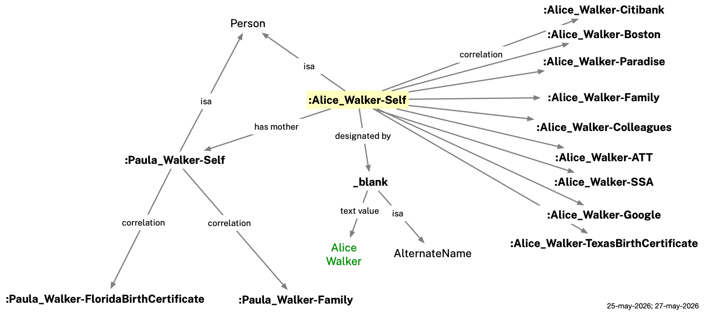
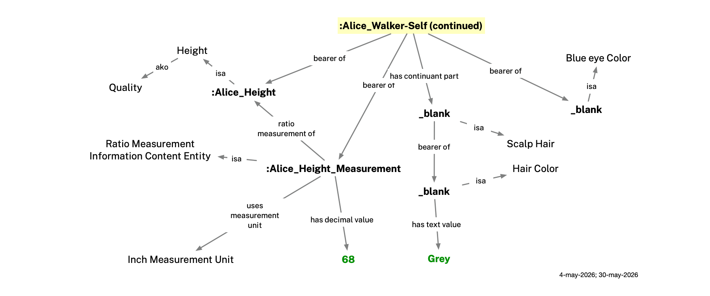

# Mia Ontologies
The Mee Identity Agent (Mia) represents information about a person using two complementary ontologies. The **Persona ontology** models identity data — names, addresses, phone numbers, relationships, payment cards, and more — structured around the concept of a *persona*: a coherent slice of a person's identity as presented in a particular context. The **Context ontology** describes those contexts themselves — what broad category of interaction or relationship is involved (relationships with family members, interactions with a bank, etc.), who it is about, and who asserted the data. This document provides an overview of both ontologies, then illustrates them with example Mia data for a hypothetical user, Alice Walker. Throughout, `p:` is shorthand for the `persona:` namespace (`http://mee.foundation/ontologies/persona#`) and `c:` for the `context:` namespace (`http://mee.foundation/ontologies/context#`).

## Persona Ontology

Persona is an **application ontology** for the Mee Identity Agent (Mia). It imports and profiles existing domain ontologies — documenting which of their classes and properties Mia requires or uses — and extends them with Mia-specific classes and properties.

### Purpose

It defines a formal, machine-readable model of a real-world person's identity data — names, addresses, phone numbers, SSNs, physical characteristics, parent-child relationships, social connections, payment cards, and more — by reusing existing well-known ontologies wherever possible and defining new terms only where no suitable existing term exists.

### Ontological Foundation

Built on **BFO** (Basic Formal Ontology) and **CCO** (Common Core Ontologies) as the upper ontological foundation, and on domain ontologies that extend CCO:
- **PersonOntology** — person, name types, parent-child relationships
- **AddressOntology** — postal address structure
- **StagingOntology** — staging area for terms pending promotion (phone numbers, email addresses, user accounts, etc.)
- **AgentOntology** — agents and their properties (imported transitively via PersonOntology)

### Persona Ontology Files

- **`persona.ttl`** — The Persona ontology. Imports the domain ontologies above and documents which classes and properties Mia uses (required vs. optional). Defines Mia-specific extension properties (`p:hasPersona`, `p:hasSocialNetwork`, `p:hasPaymentCard`, `p:hasBankAccount`) and the core Persona data model classes (`p:Persona`, `p:BirthCertificate`, physical card classes, banking classes).

- **`persona-shacl.ttl`** — SHACL constraint rules defining how instance data must be structured. Validates:
  - *`p:BirthCertificate` `p:Persona` instances*: FullName OR (GivenName + FamilyName) required; optional AdditionalName, AlternateName, Nickname, Legal Name
  - *All `p:Persona` instances*: SSN format (`NNN-NN-NNNN`), email format, phone (E.164), address cardinality, payment cards, wallet
  - *US Postal Address*: required street, city, state (USPS 2-letter), ZIP; optional country
  - *`Person` (selfness)*: scalp hair (0..1); `has mother` / `is mother of` range must be a `Person`
  - *Social Network*: sub-groups (via `has part`) must be Social Networks; members (via `has member part`) must be `p:Persona` instances
  - *Debit Card*: card number and expiration date required; CVV optional
  - *`p:Wallet`*: items declaring themselves `continuant part of` this wallet must be `p:PhysicalCard` instances
  - *`p:PhysicalCard`*: image scan, if present, must be `xsd:anyURI` (max 1); `continuant part of` target, if present, must be a `p:Wallet` (max 1)

### One Person, Multiple Personas

We represent a person as a combination of a single `Person` entity along with multiple `p:Personas`, one per relationship or institutional context.

A person's selfness is their essential individuality or unique selfhood represented by this one central `Person` entity. The `Person` carries very few properties: only physical attributes and parent-child relationships. Most importantly, it carries `p:hasPersona` links to context-specific `p:Persona` instances. Most names and all identifiers belong to those context-specific `p:Persona` instances; the one exception is a preferred/goes-by name, which belongs to the `Person` entity because it applies across all contexts.

Rather than being a kind of `Person`, a `p:Persona` is an **Information Content Entity** (CCO `ont00000958`) — a context-specific facet *of* a `Person`. `p:Persona` instances are linked to the `Person` entity via `p:hasPersona`, a subproperty of CCO `is subject of` (`ont00001801`). Each `p:Persona` carries only the data relevant to its specific context. 

A `p:Persona` can itself carry `p:hasPersona`. This allows intermediate, branch level `p:Personas` which in turn link to leaf level `p:Personas`. Each intermediate `p:Persona` acts as a bundle of attributes which can be inherited by multiple leaf `p:Personas` to which it is linked.

<p align="center"></p>

**Properties**

* `p:hasPersona` — links a `Person` (one's "selfness", essential individuality, or a sense of one's own unique personality and identity) to one of their context-specific `p:Persona` instances.
* `p:hasPhysicalCard` — links a `p:Persona` to a `p:PhysicalCard` carried outside of a wallet (see Belongings below).
* `p:hasWallet` — links a `p:Persona` to a physical wallet (see Belongings below).

**Classes**

* `p:Persona` — an Information Content Entity that represents how a person appears in the context of a specific interaction — with a company, government agency, another person, or a group of people. A `p:Persona` is a context-specific facet of that person linked via `p:hasPersona`.
* `p:BirthCertificate` — a `p:Persona` subtype whose purpose is to carry a person's legal birth name record as issued by a state agency.

### Belongings

A `p:Persona` within a context of `c:contextType: c:Possession` models the physical items a person carries or stores — their wallet, payment cards, driver's license, health insurance card, and other documents. Physical cards are `MaterialArtifact` subclasses and may be placed inside a wallet (via BFO `continuant part of`) or held directly by the `p:Persona` (via `p:hasPhysicalCard`). When a future context file creates a `p:Persona` for a card-issuing institution (e.g. a DMV), the corresponding physical card links back to that `p:Persona` using BFO `is carrier of`.

<p align="center"></p>

**Properties**

* `is carrier of` (from BFO) — used to link a physical card to its corresponding `p:Persona` in another context.
* `p:hasPhysicalCard` — links a `p:Persona` to a `p:PhysicalCard` carried outside of a wallet (e.g. stored at home or kept separately).
* `p:hasWallet` — links a `p:Persona` to the physical wallet they carry.
* `p:hasImageScan` — a link to a scanned image of this card.

**Classes**

* `p:PhysicalCard` — a physical plastic or paper card held in a wallet.
* `p:PhysicalHealthInsuranceCard` (subclass of `p:PhysicalCard`) — a physical health insurance membership card.
* `p:PhysicalDriversLicense` (subclass of `p:PhysicalCard`) — a state-issued driver's license card.
* `p:PhysicalPaymentCard` (subclass of `p:PhysicalCard`) — a physical credit or debit card.
* `p:PhysicalSocialSecurityCard` (subclass of `p:PhysicalCard`) — a paper or plastic card issued by the Social Security Administration.
* `p:Wallet` — a physical wallet that holds cards, money, and other personal documents.

### Accounts

An online service account (`OnlineServiceAccount`, CCO `ont00000033`) records a person's credentials and identity with an online service provider such as Google or AT&T.

**Properties**

* `holds user account` (CCO) — links a `p:Persona` to an `OnlineServiceAccount`.
* `has service name` (CCO) — the name of the online service (e.g. "Google").
* `has service URI` (CCO) — the URI of the online service.
* `has user handle` (CCO) — the user's handle or username on the service.
* `p:hasPassword` — the password credential for an `OnlineServiceAccount` (Persona ontology extension).

### Banking

A bank account is modeled as a `p:CheckingAccount` linked to a `p:Persona` and accessed via a debit card. Builds on the Accounts model above.

**Properties**

* `p:hasBankAccount` — links a `p:Persona` to a `p:CheckingAccount` it records.
* `p:accessesBankAccount` — links a DebitCard to the `p:CheckingAccount` it draws funds from.

**Classes**

* `p:CheckingAccount` — a bank checking account held by a person, linked to a debit card.
* `p:CheckingAccountNumber` — an identifier designating a bank checking account, connected via `designated by` (`ont00001879`).
* `p:RoutingNumber` — an ABA routing transit number identifying the financial institution, connected via `designated by`.

## Context Ontology

The Context ontology (`context.ttl`) defines the controlled vocabularies used to classify each context file along three orthogonal dimensions: what kind of relationship the context represents (`c:contextType`) such as relationships with family members or interactions with a bank, who is making the assertions it contains (`c:assertionType`), and who it is about (`c:subject`). Value hierarchies are defined for each (`c:Context`, `c:AssertionType`, `c:SubjectType` and their subclasses). 

**`c:contextType`** — The nature of the interaction/relationship context. Values form a subclass hierarchy under `c:Context`:

- `c:Company` — interactions with a company or other non-governmental organization.
- `c:Government` and subtypes `c:Federal`, `c:State`, `c:Municipality` — interactions with government agencies.
- `c:People` and subtypes `c:Family`, `c:Colleagues`, `c:Friends`, `c:Consultants`, `c:Other` — a relationship with other people.
- `c:Possession` — a person's belongings or other things they possess in the real world.
- `c:Career` — professional roles, employment history, and career relationships.
- `c:Project` — involvement in a specific project or initiative.
- `c:Event` — participation in or relationship to a specific event, e.g. a meeting.
- `c:Learning` — information gathered from personal experience.
- `c:Topic` — pieces of existing, general knowledge selected by a person to be useful to them.

<p align="center"></p>

**`c:assertionType`** — Who is making the assertion. Contexts can contain self-asserted or other-asserted information. Values are subclasses of `c:AssertionType`:
- `c:SelfAsserted` — the Mia user is recording the data (using Mia), even if the underlying information originates from some other party such as a company, government agency, or another person.
- `c:OtherAsserted` — another person, company or government agency is asserting the data directly.

<p align="center"></p>

**`c:subject`** — Whose identity the context file describes. Contexts may be about the Mia user or about someone else or some other entity. Values are subclasses of `c:SubjectType`:
- `c:Self` — the file is about the Mia user.
- `c:Other` — the file is about another person, company or government agency.

<p align="center"></p>

The diagram below shows four kinds of contexts related to a hypothetical Mia user, Alice, and her interactions with a Registry of Motor Vehicles (RMV) agency. Across the top are contexts where the RMV itself is the subject, and at the bottom where Alice is the subject. At the left are contexts where Alice has made the assertions (e.g. Alice's Mia has written the claims into the context) and at the right are contexts where the RMV as the "other" has written the claims. 

<p align="center"></p>

In the lower right shows a context that Alice might share with other people or companies. In it, she asserts that her driver's license number is S43228943, having almost certainly copied that number from her physical driver's license. The context in the lower right carries the same information as the lower left, but because it is being asserted by the RMV it is more likely to be trusted by a recipient, especially if this information is conveyed via secure channel and the claims are cryptographically bound to the identity of the RMV.

### Context Ontology File

- **`context.ttl`** — The Context ontology. It defines three dimensions of characteristics of the context containers that hold the information about people defined using the Persona ontology. 

## Illustrative Example: Alice Walker

The repository includes a worked example for a hypothetical person, Alice Walker, to demonstrate the ontology in use.

Within Alice's self, `example/alice/self.ttl`, is `:Alice_Walker-Self`, a `Person` entity. She also has an entity representing her mother, `:Paula_Walker-Self`.

<p align="center"></p>

Each context file is an independent `owl:Ontology` linked to a `Person` entity in `example/alice/self.ttl` via `p:hasPersona`. These context files are `c:assertionType c:SelfAsserted` — Alice is the one recording all of this data, even when the underlying information originates from a third party.

Alice's `self.ttl` also describes some physical characteristics of Alice shown below:

<p align="center"></p>

### Alice Walker's Contexts
As we've mentioned, Alice interacts in a set of contexts. In the following, each context carries `c:subject c:Self`, indicating they are about Alice.

| Context file | Context type | Key data | Image |
|:-------------|:-------------|:---------|:------|
| `att.ttl` | Company (ATT) | Phone number | [view](images/alice-contexts/alice(att).png) |
| `belongings.ttl` | Possession | Wallet (driver's license + payment card); health insurance card and SSN card held directly (with image scans) | [view](images/alice-contexts/alice(belongings).png) |
| `boston.ttl` | Municipality (Boston) | Previous address — Boston, MA (2020–2025) with temporal interval | [view](images/alice-contexts/alice(boston).png) |
| `citibank.ttl` | Company (Citibank) | Debit card | [view](images/alice-contexts/alice(citibank).png) |
| `colleagues.ttl` | People/Professionals | Colleagues social network with Bob Johnston | [view](images/alice-contexts/alice(colleagues).png) |
| `family.ttl` | People/Family | Family social network with Paula Walker | [view](images/alice-contexts/alice(family).png) |
| `google.ttl` | Company (Google) | Email address | [view](images/alice-contexts/alice(google).png) |
| `paradise.ttl` | Municipality (Paradise) | Current address — Paradise, CA (2025–present) | [view](images/alice-contexts/alice(paradise).png) |
| `ssa.ttl` | Federal (SSA.gov) | SSN | [view](images/alice-contexts/alice(ssa).png) |
| `texas-birth-certificate.ttl` | State (texas.gov) | Legal names: Margery Alice Walker; maiden name Margery Alice Arnold | [view](images/alice-contexts/alice(texas-birth-certificate).png) |

### Alice's Paula Walker Context

For the following context, `c:subject c:Other` — they are about another person, in this case her mother, Paula Walker.

| Context file | Context type | Key data | Image |
|:-------------|:-------------|:---------|:------|
| `florida-birth-certificate.ttl` | State (FL) | Legal names | [view](images/paula-contexts/paula(florida-birth-certificate).png) |

For example, Alice's `texas-birth-certificate.ttl` is `c:contextType: c:State`, `c:assertionType: c:SelfAsserted`, `c:subject: c:Self` — a state government context recorded by Alice, about Alice. Her `florida-birth-certificate.ttl` is `c:contextType: c:State`, `c:assertionType: c:SelfAsserted`, `c:subject: c:Other` — also recorded by Alice, but describing her mother Paula.

## Design Patterns

**Physical cards**: When a future context file creates a `p:Persona` for a credential issuer (e.g. DMV), the corresponding physical card in `belongings.ttl` links back using BFO `is carrier of` (`BFO_0000101`): the `p:PhysicalCard` individual is the carrier of the `p:Persona` (ICE).

**Peer name pattern**: All name types (FullName, GivenName, FamilyName, AlternateName) connect directly to a `Person` or `p:Persona` via `designated by` (`ont00001879`). They are siblings, not nested under a PersonName parent. Legal names belong to `p:BirthCertificate` `p:Persona` instances; a preferred/goes-by name lives in `self.ttl` since it applies across all contexts.

**Address history**: Each address `p:Persona` carries a USPostalAddress and an `AddressDesignation` with a `TemporalInterval` (start date required; no end date = current address).

## Diagrams

`draw.py` generates a Graphviz diagram from any context `.ttl` file:

```bash
python3 draw.py example/alice-contexts/citibank.ttl      # → example/alice-contexts/citibank.png
python3 draw.py example/alice-contexts/paradise.ttl      # → example/alice-contexts/paradise.png
```

**Dependencies** (one-time setup):
```bash
pip install rdflib graphviz
brew install graphviz
```

Each diagram shows the `p:Persona` individual (yellow), supporting named individuals (white boxes), class labels (plain text), blank-node designator chains, and literal values (green).

## Validation

Validation requires Apache Jena. The following validates Alice Walker's example instance data against the SHACL shapes. Merge all data files first, then validate:

```bash
riot --output=turtle \
  project_files/bfo-core.ttl project_files/PersonOntology.ttl \
  project_files/AddressOntology.ttl project_files/StagingOntology.ttl \
  persona.ttl context.ttl example/alice/self.ttl \
  example/alice-contexts/citibank.ttl example/alice-contexts/boston.ttl \
  example/alice-contexts/paradise.ttl example/alice-contexts/family.ttl \
  example/alice-contexts/colleagues.ttl example/alice-contexts/att.ttl \
  example/alice-contexts/ssa.ttl example/alice-contexts/google.ttl \
  example/alice-contexts/texas-birth-certificate.ttl \
  example/paula-contexts/florida-birth-certificate.ttl \
  example/alice-contexts/belongings.ttl \
  2>/dev/null > /tmp/mia-merged.ttl

grep -v 'owl:imports' persona-shacl.ttl > /tmp/mia-shapes.ttl

shacl validate --shapes /tmp/mia-shapes.ttl --data /tmp/mia-merged.ttl --text
```

Expected output: `Conforms`
