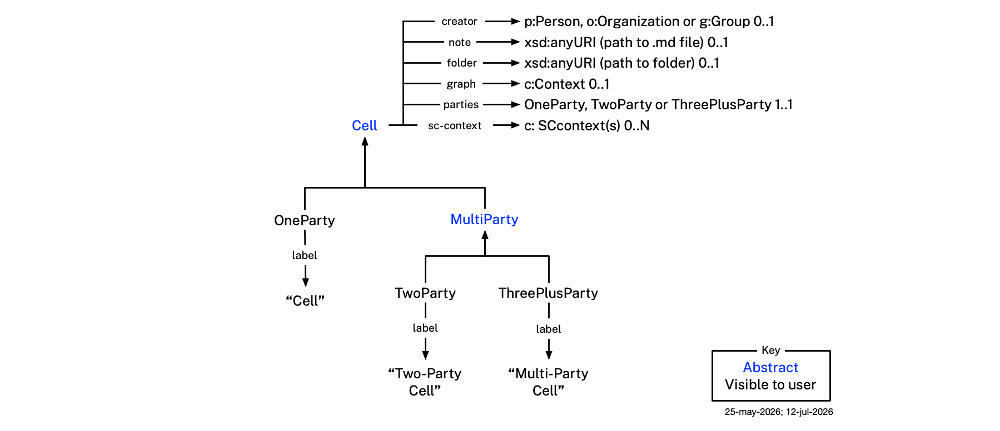
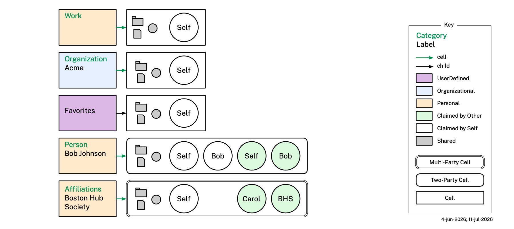

# Mia Ontologies

This document describes the ontologies used by the Mee Identity Agent (Mia) software application. Each Mia interoperates with the Personal Data Network (PDN). The PDN is a data-sharing network with three kinds of participants: individual Mia users, groups of Mia users and/or organizations, and organizations (government agencies, companies, and nonprofits).

Mia's ontologies import and profile existing ontologies — documenting which of their classes and properties Mia requires or uses — and extending them with Mia-specific classes and properties. 

The **Category**, **Cell**, and **Context** ontologies are the organizing framework. The category ontology defines `cat:Category` — a set of categories of information about a person or organization; nodes in the tree contain no content of their own but may have an associated cell. The cell ontology defines `cell:Cell` — a self-contained block of content that may reference one or more contexts described by the context ontology. A `c:Context` is a graph; its important subclass `c:SCcontext` holds claims (attributes) about a subject as claimed by a person, group, or organization.

The three **domain ontologies** model claims about people, organizations and groups contained in `c:SCcontext` instances:
- **Persona ontology** — models a person: names, addresses, phone numbers, relationships, payment cards, and more. It is built on BFO (Basic Formal Ontology) and CCO (Common Core Ontologies) as the upper ontological foundation, and on domain ontologies that extend CCO:
  - **PersonOntology** — person, name types, parent-child relationships
  - **AddressOntology** — postal address structure
  - **StagingOntology** — staging area for terms pending promotion (phone numbers, email addresses, user accounts, etc.)
  - **AgentOntology** — agents and their properties (imported transitively via PersonOntology)
- **Organization ontology** — models organizations (companies, government agencies, non-profits, etc.) 
- **Group ontology** — a group made up of individuals and/or organizations.

An additional ontology provides PDN identifiers for persons, organizations and groups:
- **Identity ontology** — types of PDN network identifiers used by people, organizations or groups. 

Throughout, we use these shorthands:

- `cat:` for the `category:` namespace (`http://mee.foundation/ontologies/category#`)
- `cell:` for the `cell:` namespace (`http://mee.foundation/ontologies/cell#`)
- `c:` for the `context:` namespace (`http://mee.foundation/ontologies/context#`)
- `p:` for the `persona:` namespace (`http://mee.foundation/ontologies/persona#`)
- `o:` for the `organization:` namespace (`http://mee.foundation/ontologies/organization#`).
- `g:` for the `group:` namespace (`http://mee.foundation/ontologies/group#`)
- `i:` for the `identity:` namespace (`http://mee.foundation/ontologies/pdn-identity#`)
- `ako` for `rdfs:subClassOf` ("a kind of")
- `isa` for 'rdf:type` ("is a")

We first present an overview of the ontologies and then illustrate their use through a sample dataset for a hypothetical user, Alice Walker.

## Category Ontology

The category ontology defines two orthogonal facets of a category DataBook. `cat:Category` (abstract) is the *classificatory* facet — which kind of thing it is (e.g. "Customer"), recorded as a plain string in `cat:catType`. `cat:Node` (abstract) is the *tree-position* facet — where the category sits in a tree. 

<p align="center"></p>

The canonical category trees are preinstalled with Mia and are constructed using `cat:Canonical` nodes. The nodes in these canonical trees are copied into `cat:Copy` nodes — building blocks the user chooses from to build a tree that suits their needs. They can select some building blocks and ignore others.

The user's information content is held in `cell:Cell`s attached to branch and leaf nodes of the user's tree. In addition, the user may choose to insert `cat:UserDefined` nodes into their instance tree — these are not copied from a `cat:Canonical` node.

A `cat:Copy` or `cat:UserDefined` node has an optional `cat:label` that lets the user override the display name (e.g. "Client") — canonical templates are never renamed by a user, so `cat:label` doesn't apply there.

Although each node in a category tree has no content of its own, every node — `cat:Canonical`, `cat:Copy`, and `cat:UserDefined` alike — is linked to one or more `cell:Cell`s which do hold content, via `cat:cell`.

Categories vary in scope from broad groupings of information to narrower ones. In the social domain, for example, a category might be about "People", or more narrowly about "Immediate Family", and ultimately about a single family member. The user can choose at what level in this broader-to-narrower structure to put what kind of information. For example if the user has a nickname used only by this one family member, they can add that "claim" (attribute) at the individual relationship level or at a higher level. 

Both personal life (family, health, finances categories) and work life (employment, colleagues categories) are organized within this same tree, since `Work` is itself a `cat:Person` subclass alongside `People` and `Health & Wellness`, not a separate branch. The `categories-org/` tree, rooted in `cat:Organization`, exists, so a person can copy pieces of it into their own `Work` branch to model the organizations they work for or with — e.g. Alice's `Work > Organization-Acme > Employees` category is a copy of `cat:Organization`'s `Employees`, since Acme's own structure is what her employment relationship is actually about.

As we've mentioned, canonical category nodes are copied from one of the canonical trees into the user's category tree and in the process the class is switched from `cat:Canonical` to `cat:Copy`, while recording where the original came from using `cat:copiedFrom`. If the canonical had a cell linked to it (via that node's own `cat:cell`), a new cell is copied too and linked from the new `cat:Copy` the same way. If that cell contains references to contexts, these contexts are also copied.

The user is free to rearrange their instance tree as they wish, adding new `cat:UserDefined` categories and moving things around. This works because the tree is just a way to organize the cells that it points to, and the cells are self-contained units of content (though any referenced context lies outside the cell boundary).

### Category Properties

- **`cat:catType`** — the `cat:Category` subclass this category is or was copied from, or `Category` itself. Domain `cat:Category`. 

### Node Properties

- **`cat:child`** — organizes nodes into a tree structure. Domain and range `cat:Node`.
- **`cat:cell`** — IRI of a `cell:Cell` holding this node's content. This is the sole link between a node and its cell(s); `cell:Cell` carries no equivalent pointing back.
- **`cat:category`** — links a canonical node to the `cat:Category` subclass it represents (e.g. `cat:Work`). Domain `cat:Canonical`, range `cat:Category`.
- **`cat:copiedFrom`** — IRI of the canonical node this copy was copied from. Domain `cat:Copy`, range `cat:Canonical`.
- **`cat:label`** — user-editable display name of a copy or user-defined category. Defaults to the category's class name. Domain is the union of `cat:Copy` and `cat:UserDefined`.

### Personal Categories

`cat:Person` categories organize a person's mostly non-employment-related information:

1. **People** (`cat:People`) — people in your social or professional life. Use this category for people not otherwise tied to a specific domain — a bookkeeper you know belongs under Finances (Advisory), and your primary care physician belongs under Health & Wellness (Medical > Providers > Primary Care Physician), rather than here.
    - **Immediate Family** (`cat:ImmediateFamily`) — your closest living relatives, which generally include parents, siblings, spouses/partners, and children.
    - **Extended Family** (`cat:ExtendedFamily`) — relatives outside the immediate nuclear group, such as grandparents, aunts, uncles, cousins, nieces and nephews.
    - **In-Laws / Step-Family** (`cat:InLawsStepFamily`) — relatives gained through marriage or legal guardianship, including a spouse's parents and siblings, or children from a previous relationship.
    - **Friends** (`cat:Friends`) — interactions with friends.
    - **Others** (`cat:Others`) — people you know socially or professionally who are not family or friends — acquaintances, neighbors, or other connections not yet more specifically categorized.
1. **Affiliations** (`cat:Affiliations`) — clubs, charities, faith groups, and other group affiliations not covered by a more specific category — includes formal memberships and their social networks, some of which may be `cell:ThreePlusParty` ("Multi-Party Cell") cells that exist as a `g:Group` on the PDN. See also Sports & Entertainment for personal sports and entertainment interests, like following a favorite team, that aren't tied to a formal membership.
1. **Health & Wellness** (`cat:HealthWellness`) — personal health and wellness information. Medical history, allergies, medications, vaccinations, prescriptions, eyeglasses.
    - **Medical** (`cat:Medical`) — medical (as opposed to dental or vision) care — diagnoses, treatments, providers, and insurance.
        - **History** (`cat:MedicalHistory`) — past diagnoses, conditions, surgeries, and treatments.
        - **Insurance** (`cat:MedicalInsurance`) — medical health insurance policies, providers, and coverage.
        - **Providers** (`cat:MedicalProviders`) — medical providers and practices you see for care.
            - **Primary Care Physician** (`cat:PrimaryCarePhysician`) — your primary care doctor, the physician you generally see first for checkups, referrals, and everyday health concerns.
            - **Medical Appointment Info** (`cat:MedicalAppointmentInfo`) — a medical appointment you're helping arrange on behalf of someone else.
    - **Dental** (`cat:Dental`) — dental care — diagnoses, treatments, providers, and insurance.
        - **History** (`cat:DentalHistory`) — past dental treatments, procedures, and conditions.
        - **Insurance** (`cat:DentalInsurance`) — dental insurance policies, providers, and coverage.
        - **Providers** (`cat:DentalProviders`) — dental providers and practices you see for care.
    - **Vision** (`cat:Vision`) — vision and eye care — diagnoses, treatments, providers, and insurance.
        - **History** (`cat:VisionHistory`) — past eye-care prescriptions, treatments, and conditions.
        - **Insurance** (`cat:VisionInsurance`) — vision insurance policies, providers, and coverage.
        - **Providers** (`cat:VisionProviders`) — vision care providers and practices you see for care.
    - **Fitness** (`cat:Fitness`) — general fitness and preventive physical health — exercise, gyms, trainers, and other non-clinical wellbeing information.
        - **Providers** (`cat:FitnessProviders`) — fitness providers and practices you see for care, e.g. gyms, trainers, and coaches.
    - **Nutrition** (`cat:Nutrition`) — nutritionists and dietitians.
        - **History** (`cat:NutritionHistory`) — past nutritional consultations, diet plans, and dietary conditions.
        - **Providers** (`cat:NutritionProviders`) — nutritionists and dietitians you see for care.
    - **Mental Health** (`cat:MentalHealth`) — mental and behavioral health care.
        - **History** (`cat:MentalHealthHistory`) — past diagnoses, treatments, and mental health conditions.
        - **Insurance** (`cat:MentalHealthInsurance`) — mental health insurance policies, providers, and coverage.
        - **Providers** (`cat:MentalHealthProviders`) — mental health providers and practices you see for care, e.g. therapists, counselors, and psychiatrists.
    - **Physical Therapy** (`cat:PhysicalTherapy`) — physical therapy and rehabilitative care.
        - **History** (`cat:PhysicalTherapyHistory`) — past physical therapy treatments, injuries, and rehabilitation plans.
        - **Providers** (`cat:PhysicalTherapyProviders`) — physical therapy providers and practices you see for care.
1. **Finances** (`cat:Finances`) — information about personal finances, bookkeeping, budgets, payment cards, bank accounts, brokerage accounts, insurance policies, financial advisors, etc.
    - **Banking & Payments** (`cat:BankingPayments`) — firms that help you store, access, and move your cash for daily living. These include Retail Banks & Credit Unions, which provide checking accounts, savings accounts, and debit cards. These also include Payment Processors like Visa, Mastercard, or PayPal that let you buy things online and in stores, and Remittance Firms like Western Union or Wise used to send money to family or friends, especially overseas.
    - **Investing** (`cat:Investing`) — firms that help you buy assets, so your money can grow over time for goals like buying a house or retiring. These include Brokerage Firms like Charles Schwab or Robinhood where you buy and sell stocks, bonds, and ETFs; Robo-Advisors, computer-run investing platforms like Betterment or Wealthfront that manage your portfolio for a low fee; and Mutual Fund companies like Vanguard or Fidelity that pool your money with other investors to buy a large bundle of stocks.
    - **Lending & Credit** (`cat:LendingCredit`) — firms that lend you money when you need to buy something expensive that you cannot pay for all at once. These include Mortgage Lenders, banks or specialized companies that give you loans specifically to buy a home; Consumer Finance Companies, that give out personal loans, auto loans, or student loans; and Credit Card Issuers, banks that give you a plastic card to borrow money on the spot for daily purchases.
    - **Insurance** (`cat:Insurance`) — firms that protect you and your family from financial ruin if something bad happens. These include Life & Health Insurance firms that cover medical bills or provide money to your family if you pass away, and Property & Casualty Insurance firms that insure your car, home, or apartment against accidents and theft.
    - **Advisory** (`cat:Advisory`) — firms and individuals who do not just hold your money, but tell you the best ways to use it. These include Financial Planners (Wealth Advisors), human experts who help you build a custom roadmap for taxes, retirement, and budgeting, and Estate Planners, specialized professionals who help you write wills and plan how to pass your money to your children. Also includes Accountants and Bookkeepers, who track your income and expenses and prepare your taxes.
1. **Pets** (`cat:Pets`) — care instructions, veterinarians, medicines, food providers.
1. **Home** (`cat:Home`) — owning or renting a home, apartment, or other dwelling. Leases, deeds, utility accounts, real estate brokers.
1. **Work** (`cat:Work`) — professional roles. Employment history, resume/CV.
1. **Ownership** (`cat:Ownership`) — owned assets, property, vehicles, and other possessions.
    - **Vehicles** (`cat:Vehicles`) — related to owning and maintaining a vehicle. Vehicle insurance, repairs, mechanics, garages. 
1. **Travel** (`cat:Travel`) — travel plans, trips, and related information. Loyalty programs, airlines, bus lines, trains.
1. **Food** (`cat:Food`) — food preferences, dietary restrictions, favorite restaurants, recipes, shopping lists, and other food-related interests
1. **Sports & Entertainment** (`cat:SportsEntertainment`) — sports, hobbies, entertainment, and media interests. Favorite teams, venues, streaming services, ticketing. See also `cat:Affiliations` for club or team memberships.
1. **Education** (`cat:Education`) — educational history and ongoing learning — schools, degrees, certifications, transcripts, and enrolled courses.
1. **Hobbies & Interests** (`cat:HobbiesInterests`) — personal hobbies and creative or cultural interests — e.g. drawing, painting, dancing, religion, singing. See also `cat:SportsEntertainment` for sports/media interests, and `cat:Affiliations` for formal memberships tied to a hobby or interest.
1. **Legal** (`cat:Legal`) — legal matters, contracts, agreements, trusts, wills, and professional legal relationships.
1. **Projects** (`cat:Projects`) — involvement in a specific project or initiative.
1. **Events** (`cat:Events`) — participation in or relationship to a specific event or gathering.
1. **Information** (`cat:Information`) — general knowledge selected by you, web links, documents, images.
    - **Learnings** (`cat:Learnings`) — knowledge gained through personal experience.
1. **Government** (`cat:Government`) — government-issued credentials, tax records, and civic relationships.
    - **Federal** (`cat:Federal`) — federal government context (e.g. passport, federal tax records).
        - **SSA** (`cat:SSA`) — the Social Security Administration.
        - **Passport** (`cat:Passport`) — a federal agency that issues and holds passport records.
    - **State** (`cat:State`) — state government context (e.g. driver's license, state tax records).
        - **Birth Certificate** (`cat:BirthCertificate`) — a state agency that issues and holds birth certificate records.
        - **Drivers License** (`cat:DriversLicense`) — a state agency that issues and holds driver's license records.
    - **Municipality** (`cat:Municipality`) — municipal government context (e.g. local permits, library card).
        - **Residence** (`cat:Residence`) — a place a person has lived, current or past.
1. **Companies** (`cat:Companies`) — miscellaneous companies and organizations that provide services or products to you. See also Finances, Health, Home, Food for companies and organizations related to those areas.

### Organizational Categories

`cat:Organization` categories organize a person's professional and organizational-role information:

1. **Customers** (`cat:Customers`) — customer organizations. Rename to "Clients", etc.
1. **Marketing** (`cat:Marketing`) — marketing activities, campaigns, and related organizations.
    - **Prospects** (`cat:Prospects`) — customer prospects. Rename to "Client prospects", etc.
1. **Partners** (`cat:Partners`) — firms that provide goods and services.
1. **People (org)** (`cat:People(org)`) — people the organization interacts with in a working capacity.
    - **Employees** (`cat:Employees`) — related to employees.
        - **Employee** (`cat:Employee`) — detailed information about a specific employee.
    - **Consultants (org)** (`cat:Consultants(org)`) — engaged consultants.
    - **Other (org)** (`cat:Other(org)`) — people associated with the organization who don't fit Employees, Consultants, or Colleagues.
    - **Colleagues** (`cat:Colleagues`) — coworkers and peers within the organization not tracked as formal Employee records.
    - **Advisors (org)** (`cat:Advisors(org)`) — individuals who advise the organization in a non-employee capacity.
    - **Board of Directors (org)** (`cat:BoardOfDirectors(org)`) — the organization's board members.
1. **KB** (`cat:KB`) — corporate knowledge bases.
1. **Projects (org)** (`cat:Projects(org)`) — projects related to R&D, manufacturing, sales, marketing, operations, HR, etc.
1. **Meetings (org)** (`cat:Meetings(org)`) — events, meetings, workshops, webinars, and gatherings.
    - **Conferences** (`cat:Conferences`) — a conference or professional gathering.
1. **Suppliers** (`cat:Suppliers`) — companies that supply goods or services to this organization.
1. **Legal (org)** (`cat:Legal(org)`) — contracts and agreements.
1. **Government (org)** (`cat:Government(org)`) — interactions with government organizations.
1. **Finances (org)** (`cat:Finances(org)`) — corporate finance-related matters.
    - **Banking & Payments (org)** (`cat:BankingPayments(org)`) — firms that help you store, access, and move your cash for daily living. These include Retail Banks & Credit Unions, which provide checking accounts, savings accounts, and debit cards. These also include Payment Processors like Visa, Mastercard, or PayPal that let you buy things online and in stores, and Remittance Firms like Western Union or Wise used to send money to family or friends, especially overseas.
    - **Investing (org)** (`cat:Investing(org)`) — firms that help you buy assets, so your money can grow over time for goals like buying a house or retiring. These include Brokerage Firms like Charles Schwab or Robinhood where you buy and sell stocks, bonds, and ETFs; Robo-Advisors, computer-run investing platforms like Betterment or Wealthfront that manage your portfolio for a low fee; and Mutual Fund companies like Vanguard or Fidelity that pool your money with other investors to buy a large bundle of stocks.
    - **Lending & Credit (org)** (`cat:LendingCredit(org)`) — firms that lend you money when you need to buy something expensive that you cannot pay for all at once. These include Mortgage Lenders, banks or specialized companies that give you loans specifically to buy a home; Consumer Finance Companies, that give out personal loans, auto loans, or student loans; and Credit Card Issuers, banks that give you a plastic card to borrow money on the spot for daily purchases.
    - **Insurance (org)** (`cat:Insurance(org)`) — firms that protect you and your family from financial ruin if something bad happens. These include Life & Health Insurance firms that cover medical bills or provide money to your family if you pass away, and Property & Casualty Insurance firms that insure your car, home, or apartment against accidents and theft.
    - **Advisory (org)** (`cat:Advisory(org)`) — firms and individuals who do not just hold your money, but tell you the best ways to use it. These include Financial Planners (Wealth Advisors), human experts who help you build a custom roadmap for taxes, retirement, and budgeting, and Estate Planners, specialized professionals who help you write wills and plan how to pass your money to your children. Also includes Accountants and Bookkeepers, who track your income and expenses and prepare your taxes.

### Category DataBooks

Each node in the tree is represented by a **category DataBook** (`.databook.md` file with `type: category-databook`), linked to its child nodes via the parent's `cat:child` property, whose value is the child's IRI. This tree contains a mixture of user-defined categories and copies of canonical categories. These copies contain a `copiedFrom:` IRI property pointing back to the corresponding canonical category.

#### Canonical Category DataBooks

`cat:Person` category DataBooks live in `categories-person/`, rooted at `categories-person/categories-person.databook.md`. `cat:Organization` category DataBooks live in `categories-org/`, rooted at `categories-org/categories-org.databook.md`. Every canonical category is a `cat:Canonical` node.

#### Cell/Category Split

Every category DataBook is associated, in the same folder, with one or more cell DataBooks (see [Cell DataBooks](#cell-databooks) below) holding its content and any context links — many-to-one, not 1:1. `cell:Cell` has no property linking back to a node at all — the association is recorded only on the category side, via `cat:cell`, asserted on every category DataBook that has content, regardless of whether it's a `cat:Canonical` (`categories-person/`, `categories-org/`), a `cat:Copy`, or a `cat:UserDefined` (`example/categories/`).

This — keeping any category→cell link entirely on the category side — is what makes a shared cell's content fully portable: moving or renaming any category anywhere in any tree is done through its parent's `cat:child` list, never through the category's own properties, so a category's `cat:cell` value(s) never need to change when the category itself moves. It's also what makes the many-to-one relationship straightforward: adding a second cell to an existing category is just adding another `cat:cell` value pointing at that new cell DataBook — nothing about the cell(s) already there changes.

#### Properties

The following properties are defined in `category.ttl` and represented as `mia.` YAML fields in category DataBooks:

| YAML field | Ontology property | Cardinality | Applies to | Meaning |
|------------|-------------------|-------------|------------|---------|
| `mia.catType` | `cat:catType` | 1 | Any category | The local name of the `cat:Category` subclass this DataBook is or was copied from (e.g. `ImmediateFamily`, `Employees(org)`), or `Category` itself if there is no canonical counterpart |
| `mia.child` | `cat:child` | 0..N | Any category | IRIs of this node's child nodes |
| `mia.category` | `cat:category` | 0..1 | `cat:Canonical` only | The `cat:Category` subclass this canonical node represents, as a class value rather than a string (e.g. `"cat:Work"`). Omitted on the invisible tree roots, whose `catType` falls back to the abstract root |
| `mia.copiedFrom` | `cat:copiedFrom` | 0..1 | `cat:Copy` only | IRI of the canonical node this DataBook was copied from |
| `mia.label` | `cat:label` | 0..1 | `cat:Copy` or `cat:UserDefined` | User-editable display name — defaults to the DataBook `title` but can be changed independently, leaving `title` and `id` immutable |
| `mia.cell` | `cat:cell` | 0..N | Any category (`cat:Canonical`, `cat:Copy`, or `cat:UserDefined` alike) | IRI(s) of the `cell:Cell` DataBook(s) holding this node's content. Many-to-one, not 1:1 — the only place a category/cell association is recorded, in either direction |

### Category Ontology File

**`category.ttl`** — The Category ontology, defining:
  - *Classes*: `cat:Category` (abstract; formerly `cell:Cell`), `cat:Person`, `cat:Organization`, and all leaf category subclasses (the classificatory hierarchy) — orthogonal to `cat:Node` (abstract), split into `cat:Canonical`, `cat:Copy`, and `cat:UserDefined` (the tree-position hierarchy). A user-defined category with no canonical counterpart is a `cat:UserDefined` node.
  - *Annotation properties*: `cat:catType` (domain `cat:Category`), `cat:label` (domain the union of `cat:Copy` and `cat:UserDefined`).
  - *Object properties*: `cat:child` (domain and range `cat:Node`), `cat:category` (domain `cat:Canonical`, range `cat:Category`), `cat:copiedFrom` (domain `cat:Copy`, range `cat:Canonical`), `cat:cell` (domain `cat:Node`, range `cell:Cell` — the sole link between a node and its cell(s), since `cell:Cell` has no forward-pointing equivalent; see [Cell Ontology File](#cell-ontology-file)).
  These terms are referenced by name in the YAML frontmatter of each category DataBook file. `category.ttl` imports `cell.ttl` (for `cat:cell`'s range, `cell:Cell`, and to reuse `cell:abstract` to mark non-instantiated classes); `cell.ttl` no longer imports `category.ttl` back, since nothing there references `cat:` terms anymore.

**`category-shacl.ttl`** — SHACL shapes for category DataBook instances: `:CategoryShape` (target `cat:Category`) constrains `cat:catType` to exactly one value (open-ended — no enum, since new canonical subclasses can be added freely); `:NodeShape` (target `cat:Node`) constrains `cat:child` values, if any, to each be a `cat:Node`; `:CanonicalShape` (target `cat:Canonical`) constrains `cat:category` to at most one value (must be a `cat:Category`); `:CopyShape` (target `cat:Copy`) constrains `cat:copiedFrom` to at most one value (must be a `cat:Canonical`); `:LabelShape` (target `cat:Copy` and `cat:UserDefined`) constrains `cat:label` to at most one value.

### Category Ontology Validation

Category DataBook instances are validated by `category-shacl.ttl`.

## Cell Ontology

The cell ontology defines `cell:Cell` — a self-contained unit of *content*. 

### Cells

A cell may contain a reference to a folder on the local file system (`cell:folder`). It may contain a reference to a markdown note on the local file system (`cell:note`). It may also contain within itself a graph structure (`cell:graph`). Lastly, it may also contain a set of references to *contexts* (also graphs) as described in the previous section, via `cell:sc-context` — how many depends on the cell's party composition (see below).

<p align="center"></p>

### Cell Party Composition

Every cell is a `cell:Cell`, classified by `cell:num-parties` according to how many total parties (the user plus zero or more others) are involved in the relationship it represents. There are three concrete types: `cell:OneParty` (the user alone — an associated `cat:Category` would typically show display label "Cell"), `cell:TwoParty` (the user plus exactly one other party — "Two-Party Cell"), and `cell:ThreePlusParty` (the user plus two or more other parties, e.g. a group — "Multi-Party Cell"). `cell:TwoParty` and `cell:ThreePlusParty` are both subclasses of the abstract `cell:MultiParty`, which exists purely to classify cells by party count — it carries no property of its own, since `cell:sc-context` has domain the broader `cell:Cell` rather than `cell:MultiParty`.

`cell:sc-context`'s expected cardinality varies by party count: up to 1 for `OneParty` (only a context with subject=self and claimant=self makes sense with no other party), up to four for `TwoParty` (one of each of the four self-vs-other combinations), and unconstrained for `ThreePlusParty` (any number of other-party contexts, one or more per other party).

| Property | OneParty | TwoParty | ThreePlusParty |
|----------|----------|----------|-----------------|
| `cell:sc-context` | 0..1 | 0..4 | 0..N |

### Properties

- **`cell:label`** — default display name for a concrete `cell:Cell` subtype (`OneParty`/`TwoParty`/`ThreePlusParty`), e.g. `"Two-Party Cell"`. Asserted directly on the class, not an instance — distinct from `cat:label` (category.ttl), which is the user-editable per-instance display name of an associated `cat:Category`.
- **`cell:note`** — optional path to a markdown note in the *notes* folder/file hierarchy for this cell.
- **`cell:folder`** — optional path to a folder in the *files* folder/file hierarchy for this cell.
- **`cell:num-parties`** — the concrete `cell:Cell` subtype this DataBook instantiates: one of `OneParty`, `TwoParty`, `ThreePlusParty`. See [Cell Party Composition](#cell-party-composition) above.
- **`cell:sc-context`** — link to any number of Subject-Claimant classified contexts (`c:SCcontext`); cardinality varies by party count — see [Cell Party Composition](#cell-party-composition) above.
- **`cell:graph`** — link to a plain `c:Context` that doesn't fit the self-vs-other classification `cell:sc-context` assumes — e.g. claims jointly maintained by multiple parties about a third party, or, on a `OneParty` cell, a context that simply doesn't need self-vs-other framing.

### Representative Cells and Categories

The diagram below shows representative kinds of cell/category pairs, each labeled with its `cat:catType` (green text) over its `cat:label` (black text), when set.

The first, "Work", is a `cat:Person` canonical category with no override label. The second, "Organization / Acme", is a `cat:Organization` category, `cat:label`-renamed to "Acme". The third, "Favorites", is a hypothetical `cat:UserDefined` category with no more specific canonical counterpart, `cat:label`-renamed to "Favorites" (not tied to any real example data). The fourth, "Person / Bob Johnson", is a `cell:TwoParty` cell between the user and another Mia user, Bob — shown with all four self-vs-other classified contexts filled (self-by-self, other-by-self, self-by-other, other-by-other, all linked via `cell:sc-context`). The last, "Affiliations / Boston Hub Society", is a `cell:ThreePlusParty` cell with two other-party members, Carol and BHS.

<p align="center"></p>

Each of these five example cells contains contexts shown as circles. White circles are contexts whose triples are claimed by the self (the user). Green circles are contexts whose triples are claimed by a person other than the self (`i:Individual`), by an organization (`i:Organization`) or by a group (`i:Group`), and synchronized with the user's Mia instance over the PDN. For example the BHS cell at the bottom has three contexts: Self (the user)'s BHS profile, the BHS group's own profile and Bob Johnson's BHS member profile as claimed by Bob.

#### Lazy Copying

A canonical category node is not copied into a user's tree ahead of time. Mia copies a canonical category (and mints an associated cell if needed) into the tree, and creates its `cell:note`/`cell:folder` paths, only once the user actually has content for it. Empty categories are not pre-populated as placeholder folders.

#### About Cell Notes and Folders

`cell:note` and `cell:folder` are file paths that point into two separate but parallel folder structures in local storage. The Mia app actively adjusts these two structures to stay isomorphic with the user's tree of `cat:Copy` nodes with its associated links to `cat:Category` entities — when a category is created, renamed, or deleted, Mia updates both hierarchies automatically.

The **notes hierarchy** mirrors the category tree as a folder structure, rooted at a top-level folder named **`Self`**. The invisible root category's note is `Self.md`, stored directly inside `Self/`; every other category's note is stored as `X.md` inside the X folder — for example, `Self/People/Immediate Family/Immediate Family.md`. Using the same name as the folder matches the convention used by PKM (Personal Knowledge Management) tools such as Obsidian (using the Folder Notes plugin), Logseq, Foam and others. Any file or folder in the notes root that is not `Self/` — app-managed folders (e.g. `Templates/`, `.obsidian/`), unrelated personal notes (e.g. a `Journal/`), or loose files — falls outside the category tree entirely and is ignored by Mia.

The **files hierarchy** mirrors the category tree as a folder structure. It has no equivalent of a root note, so it has no `Self` wrapper folder — the files root itself plays that role, and each top-level category (e.g. `People`, `Work`) is a folder directly inside it. Each folder may hold arbitrary files, and may also contain additional subfolders (to any depth) that are not part of the category tree. Any file or folder directly inside the files root that is not a recognized top-level category folder likewise falls outside the category tree and is ignored by Mia.

The two roots are stored separately so the notes hierarchy can be opened as a standalone PKM vault without exposing the files hierarchy. Two user-configurable settings define where each root lives on disk:

- **Files root** — default on macOS: `~/Enclave`
- **Notes root** — default on macOS: `~/Enclave/ObsidianVault`

The files root defaults to a dedicated top-level folder (sibling of the Mac's built-in `Desktop`/`Downloads`/`Pictures`/`Movies`/`Music`/`Public`/`Documents` folders) so the category tree doesn't mix with — or need to accommodate — those OS-managed conventions; native Mac folders are left alone entirely, outside the Enclave tree. The notes root's default location is nested inside the files root's default location on disk — that's a matter of default configuration convenience, not a statement that the notes hierarchy is part of the files hierarchy. When Mia walks the files hierarchy it excludes the notes-root subtree entirely, and vice versa. All `cell:note` values are relative paths from the notes root; all `cell:folder` values are relative paths from the files root.

In the normal case `cell:note` and `cell:folder` are technically redundant — both paths can be derived from the category tree plus the two configured roots. They are retained for three reasons:

1. **Divergence detection** — if a stored path no longer matches the derived path, Mia knows the user has manually renamed or rearranged folders outside of Mia and can alert them or attempt reconciliation rather than failing silently.
2. **Graceful degradation** — Mia can continue to locate a cell's folder or note via the stored path even when the folder hierarchy has drifted out of sync with the category tree.
3. **Intentional overrides** — a user may deliberately want a cell's folder to live somewhere other than the derived location (e.g. `~/Pictures/Immediate Family/` rather than the default `~/Enclave/People/Immediate Family/`). The explicit link records that intentional deviation without disrupting the category tree.

### Cell DataBooks

Every category node has one or more associated **cell DataBooks** (`.databook.md` files with `type: cell-databook`) — the relationship is many-to-one, not 1:1: more than one cell may share the same category node, each an independent piece of content at that one tree position. (The example tree currently shows only one cell per category, but that's incidental to the data shown so far, not a constraint.) A cell DataBook's `id`/filename is its category's `id`/filename with a `-cell` suffix — with a further distinguishing suffix, e.g. `-cell-2`, if a second cell shares the same category — and it lives in the same folder as its category. This association is recorded on the category, not the cell — see [Cell/Category Split](#cellcategory-split) for why.

#### Properties

The following properties are defined in `cell.ttl` and represented as `mia.` YAML fields in cell DataBooks:

| YAML field | Ontology property | Cardinality | Meaning |
|------------|-------------------|-------------|---------|
| `mia.num-parties` | `cell:num-parties` | 1 | The concrete `cell:Cell` subclass this DataBook instantiates: one of `OneParty`, `TwoParty`, `ThreePlusParty` |
| `mia.note` | `cell:note` | 0..1 | Relative path to a markdown notes file for this cell (e.g. `People/Paula Walker/Paula Walker.md`) |
| `mia.folder` | `cell:folder` | 0..1 | Relative path to a folder of arbitrary files for this cell (e.g. `People/Paula Walker`) |

Note files live in a folder hierarchy whose structure mirrors the category hierarchy; associated file folders live in a parallel hierarchy whose names match the category names.

#### Context Link Properties

Each cell DataBook may carry any number of links to context DataBook IRIs via `cell:sc-context`, plus `cell:graph`:

| Property | Value | Cardinality | Applies to | Meaning |
|----------|-------|-------------|------------|---------|
| `cell:sc-context` | `c:SCcontext` | 0..1 on `OneParty`; 0..4 on `TwoParty`; 0..N on `ThreePlusParty` | Any `cell:Cell` | Any number of self-vs-other classified contexts — the user's own context in this cell, the user's record of the other party, a context the other party presents, or a context the other party holds about the user, distinguished by each linked context's own `about-by` value rather than by separate properties or classes |
| `cell:graph` | `c:Context` | 0..1 | Any `cell:Cell` | A context that doesn't fit the self-vs-other classification — e.g. claims jointly maintained by multiple parties about a third party, or, on a `OneParty` cell, a context that simply doesn't need self-vs-other framing |

`cell:sc-context`'s domain is the broader `cell:Cell` rather than `cell:MultiParty`, unlike the four properties it replaced (`cell:sbs`/`cell:obs`/`cell:sbo`/`cell:obo`) — a `OneParty` cell can hold a self-by-self context through this same property, not just a `TwoParty`/`ThreePlusParty` cell. Its expected cardinality still varies by party count (see the table in [Cell Party Composition](#cell-party-composition)), but this isn't currently enforced by `cell-shacl.ttl` — `:CellShape` only constrains `cell:sc-context` values to each be a `c:SCcontext`, uniformly regardless of party count. `cell:graph`'s domain has always been the broader `cell:Cell` for the same reason: it's also useful on a `OneParty` cell for a context that doesn't need self-vs-other classification at all.

### Cell Ontology File

**`cell.ttl`** — The Cell ontology, defining:
  - *Classes*: `cell:Cell` (formerly `cell:Parties`), `cell:OneParty`, `cell:MultiParty` (abstract), `cell:TwoParty`, `cell:ThreePlusParty`.
  - *Annotation properties*: `cell:num-parties` (concrete `cell:Cell` subclass), `cell:label` (default display name for a concrete `cell:Cell` subtype, asserted on the class), `cell:note` (path to markdown notes file), `cell:folder` (path to associated file folder), `cell:abstract` (marks a class as not directly instantiated in DataBooks).
  - *Object properties*: `cell:sc-context`/`cell:graph` (both domain `cell:Cell`). `cell:Cell` carries no property pointing back to a node at all — that link is asserted only on the category side, as `cat:cell` (see [Category Ontology File](#category-ontology-file)).
  These terms are referenced by name in the YAML frontmatter of each cell DataBook file. `cell.ttl` imports `context.ttl` (for `cell:sc-context`'s range, `c:SCcontext`, and the plain `c:Context` range of `cell:graph`); `context.ttl` in turn imports `cell.ttl` back, solely to reuse `cell:abstract` — a mutual import. `category.ttl` also imports `cell.ttl` (for `cat:cell`'s range, `cell:Cell`, and to reuse `cell:abstract`), but `cell.ttl` no longer imports `category.ttl` back — nothing here references `cat:` terms anymore.

**`cell-shacl.ttl`** — SHACL shapes for cell DataBook instances: `:CellShape` (target `cell:Cell`) constrains `cell:graph`, `cell:note`, and `cell:folder` to at most one value each, `cell:num-parties` to at most one value which, if present, must be one of `OneParty`, `TwoParty`, `ThreePlusParty`, and `cell:sc-context` values, if any, to each be a `c:SCcontext` — with no cardinality distinction by party count, unlike the `cell:sbs`/`obs`/`sbo`/`obo` properties it replaced.

### Cell Ontology Validation

Cell DataBook instances are validated by `cell-shacl.ttl`.

## Context Ontology

The context ontology defines *contexts* (`c:Context`) — named graphs containing sets of claims about a person. Contexts are referenced by cells described in the Cell Ontology.

### Contexts

A context is a container of information about a person related to their interactions with, or relationship to, another person, group or organization. This information is expressed as a named graph of triples using the Persona, Organization, Group and Identity ontologies and stored in a **[DataBook](https://github.com/w3c-cg/holon/tree/main/architectures/databook)** (`.databook.md`) file that describes one facet of a person or organization (called the `subject` of the context). These claims may have originated from other contexts about the same subject. 

<p align="center"></p>

One property applies to every `c:Context`:

**`c:template`** — present only on context files that contain instances of a template; its value is the name of a `p:PersonaTemplate` subclass (e.g. `"persona:BirthCertificate"`, `"persona:JSContactCard"`, `"persona:DriversLicense"`, `"persona:Passport"`, `"persona:MedicalAppointment"`).

A context carries no field pointing back at the cell that references it — that link is asserted only on the cell side, via `cell:sc-context` or `cell:graph` (see the Cell Ontology section below).

Three more properties apply only to contexts classified as `c:SCcontext` — a context linked via `cell:graph` rather than `cell:sc-context` is a plain `c:Context` and does not carry these:

**`c:about-by`** — classifies a context DataBook by the combination of `subject` and `claimant`. Value is one of four conventional string labels, not a separate class (`c:SCcontext` has no subclasses): `"context:SBScontext"` (subject=Self, claimant=Self), `"context:OBScontext"` (subject=Other, claimant=Self), `"context:OBOcontext"` (subject=Other, claimant=Other), or `"context:SBOcontext"` (subject=Self, claimant=Other).

**`c:subject`** — The identity the context file is about. Values are IRIs of `p:Person`, `g:Group`, or `o:Organization` individuals:
- `:Self` — the context is about the Mia user.
- a named individual of `p:Person` — the context is about another human Mia user.
- a named individual of `g:Group` — the context is about a group of Mia users.
- a named individual of `o:Organization` — the context is about an organization (legal corporation or government agency).

**`c:claimant`** — Who is making the claim. Values are local IRIs of `p:Person`, `g:Group`, or `o:Organization` individuals:
- `:Self` — the Mia user that is entering the data, even if the underlying information originates from some other party such as a company, government agency, or another person.
- a named individual of class `p:Person` — another Mia user is claiming the data directly.
- a named individual of class `g:Group` — a group of Mia users is claiming the data.
- a named individual of class `o:Organization` — an organization is claiming the data.

The diagram below shows four kinds of contexts related to a hypothetical Mia user, Alice, and her interactions with a Department of Motor Vehicles (DMV) agency. Across the top are two contexts where the DMV itself is the subject, and at the bottom where Alice is the subject. At the left are contexts where Alice has made the claims (e.g. Alice's Mia has written the claims into the context) and at the right are contexts where the DMV as the "other" has written the claims. 

<p align="center"></p>

The lower left shows a context that Alice might share with other people or companies. In it, she claims that her driver's license number is S43228943, having copied that number from her physical driver's license. The context in the lower right carries the same information as the lower left, but because it is being claimed by the DMV it is more likely to be trusted by a recipient (especially if this information is conveyed via secure channel and the claims are cryptographically bound to the identity of the DMV).

### Context DataBooks

The description of the context container itself is carried in the DataBook's YAML front matter under the `mia:` key. The context ontology (`context.ttl`) defines the controlled vocabularies that those YAML fields reference:

- `mia:template` = `c:template`
- `mia.about-by` = `c:about-by`
- `mia.subject` = `c:subject`
- `mia.claimant` = `c:claimant`

### Context Ontology File

**`context.ttl`** — the Context ontology, defines:
  - *Classes*: `c:Context`, `c:SCcontext` (Subject-Claimant context; the concrete class every self-vs-other classified context DataBook is typed as directly — it has no subclasses; carries the `c:about-by`/`c:subject`/`c:claimant` annotations, since a `cell:graph`-linked plain `c:Context` doesn't carry them).
  - *Annotation properties*: `c:template` (domain `c:Context`), `c:claimant`, `c:subject` (domain `c:SCcontext`; range a union of `p:Person`, `g:Group`, `o:Organization`), `c:about-by` (domain `c:SCcontext`).
  These terms are referenced by name in the YAML frontmatter of each DataBook file. `context.ttl` imports `cell.ttl` to reuse `cell:abstract` on `c:Context`/`c:SCcontext`.

### Context Ontology Validation

Context file metadata (claimant, subject, about-by) is declared in YAML frontmatter and validated at authoring time by convention. `context.ttl` has no SHACL shapes of its own, but `persona-shacl.ttl`'s `:SCcontextShape` constrains `c:subject` and `c:claimant` on every `c:SCcontext` DataBook: each must have exactly one value, and that value must be a `p:Person`, `g:Group`, or `o:Organization` (see [Persona Ontology Validation](#persona-ontology-validation)). The remaining classification fields live on the associated category and cell DataBooks: `catType`/`child`/`label`/`copiedFrom`/`category`/`cell` on category DataBooks, validated by `category-shacl.ttl` (see [Category Ontology Validation](#category-ontology-validation)); `num-parties`/`sc-context`/`graph`/`note`/`folder` on cell DataBooks, validated by `cell-shacl.ttl` (see [Cell Ontology Validation](#cell-ontology-validation)).

## Persona Ontology

The Persona ontology defines a formal, machine-readable model of a person. It is used by triples stored in `c:Context` graphs. 

We represent a person with the `p:Person` class — a Mia-specific subclass of CCO `Person` (`cco:ont00001262`). Each context file contains exactly one `p:Person` individual. The Mia user's own `p:Person` individual always uses the IRI `:Self` across all of their context files; other people, groups, and organizations are assigned locally-minted named IRIs (e.g. `:Bob_Johnson`). These context files function as *named-graph slices* — each is an independent snapshot of an identity in a specific relationship or institutional context, carrying the claims relevant to that context: names, addresses, phone numbers, SSNs, physical characteristics, parent-child relationships, social connections, payment cards, and more. The Persona ontology reuses existing well-known ontologies wherever possible and defines new terms only where no suitable existing term exists.

<p align="center"></p>

### Key Properties and Classes

This section describes the most fundamental properties and classes in the Persona ontology. A person's identity data is spread across multiple named-graph slice files, each containing one `p:Person` individual. The Mia user's slices share the IRI `:Self`; each other person's slices share their locally-assigned named IRI.

**Classes:**

- `p:Person` — a Mia-specific subclass of CCO `Person` (`cco:ont00001262`). Each context file (named-graph slice) contains exactly one `p:Person` individual. The Mia user's own `p:Person` always uses the IRI `:Self`, shared across all of their context files. Other people, groups, and organizations are assigned locally-minted named IRIs (e.g. `:Bob_Johnson`, `:Paula_Walker`). `:Self` is a local IRI and is never exposed externally over the PDN, so there are no collisions between Mia instances. All identity data — names, identifiers, addresses, social networks, payment cards, and more — attaches to this individual.

**Properties:**

- `i:hasPDNidentifier` — links a `p:Person` to a `i:PDNidentifier` — the identifier used to communicate with this `Person` over the Personal Data Network. Sub-property of CCO `designated by`.

### Social Classes and Properties

This section describes classes and properties related to a person's social network.

**Classes:**

- `cco:ont00001183` — Social Network

**Properties:**

- `p:hasSocialNetwork` — a social network — other people known by the `p:Person` carrying the social network. The holder is not included as a member part of the social network object, but *is* considered to be a part of it by virtue of holding the network entity.
- `BFO_0000115` — has member part. Links to `p:Person` members of this network.

### Possession-Related Classes and Properties

This section describes properties and classes related to things a person has, holds, possesses, purchased, or rents.

- Physical plastic/paper cards are `MaterialArtifact` subclasses that include driver's license, health insurance card, payment card, etc.
- Physical wallets — cards may be placed in a wallet (via BFO `continuant part of`) or held directly by the `p:Person` (via `p:hasPhysicalCard`).

<p align="center"></p>

**Classes:**

- `p:PhysicalCard` — a physical plastic or paper card (held in a wallet or carried directly).
- `p:PhysicalHealthInsuranceCard` (subclass of `p:PhysicalCard`) — a physical health insurance membership card.
- `p:PhysicalDriversLicense` (subclass of `p:PhysicalCard`) — a state-issued driver's license card.
- `p:PhysicalPaymentCard` (subclass of `p:PhysicalCard`) — a physical credit or debit card.
- `p:PhysicalSocialSecurityCard` (subclass of `p:PhysicalCard`) — a paper or plastic card issued by the Social Security Administration.
- `p:Wallet` — a physical wallet that can hold cash as well as various kinds of paper or plastic identity or payment cards.

**Properties:**

- `is carrier of` (from BFO) — used to link a physical card to its corresponding `p:Person` in another context.
- `p:hasWallet` — links a `p:Person` to a physical wallet (see Possessions below).
- `p:hasImageScan` — a link to a scanned image of this card.
- `p:hasPhysicalCard` — links a `p:Person` to a `p:PhysicalCard` carried outside of a wallet (see Possessions below).

### Accounts

This section describes properties and classes related to a person's relationship with an online service provider. An online service account (`OnlineServiceAccount`, CCO `ont00000033`) records a person's credentials and identity with an online service provider such as Google or AT&T.

**Properties:**

- `holds user account` (CCO) — links a `p:Person` to an `OnlineServiceAccount`.
- `has service name` (CCO) — the name of the online service (e.g. "Google").
- `has service URI` (CCO) — the URI of the online service.
- `has user handle` (CCO) — the user's handle or username on the service.
- `p:hasPassword` — the password credential for an `OnlineServiceAccount` (Persona ontology extension).

### Finance-Related Classes and Properties

This section describes properties and classes related to a person's interactions with financial institutions.

**Classes:**

- `p:CheckingAccount` — a bank checking account held by a person, linked to a debit card.
- `p:CheckingAccountNumber` — an identifier designating a bank checking account, connected via `designated by` (`ont00001879`).
- `p:RoutingNumber` — an ABA routing transit number identifying the financial institution, connected via `designated by`.

**Properties:**

- `p:hasBankAccount` — links a `p:Person` to a `p:CheckingAccount` it records.
- `p:accessesBankAccount` — links a DebitCard to the `p:CheckingAccount` it draws funds from.

### Modeling Details

This section describes a few details related to modeling names and addresses.

**Peer name pattern**: All name types (FullName, GivenName, FamilyName, AlternateName) connect directly to a `p:Person` via `designated by` (`ont00001879`). They are siblings, not nested under a PersonName parent. Legal names belong to the birth certificate context file (annotated `c:template p:BirthCertificate`); a preferred/goes-by name (AlternateName) belongs to each social or professional context where it applies.

**Address history**: Each address context file carries a `p:Person` with a USPostalAddress and an `AddressDesignation` with a `TemporalInterval` (start date required; no end date = current address).

### Persona Templates

`p:PersonaTemplate` is an abstract classification class that serves as the common superclass for all reusable, context-type-specific template labels. These labels are defined in `persona-templates.ttl`. A context file declares its template in the YAML frontmatter as `mia.template` rather than by typing its `p:Person` individual. Per-template SHACL files live in the `shacl/` subdirectory.

<p align="center"></p>

**Government-issued identity documents** — `p:BirthCertificate`, `p:DriversLicense`, and `p:Passport` are subclasses of both `p:PersonaTemplate` (template label use) and `p:IdentityDocument` (artifact instance use). `p:IdentityDocument` is the class for government-issued documents that formally identify a person. The property `p:hasIdentityDocument` (domain: `p:Person`, range: `p:IdentityDocument`) links a person to the government document they hold. Each government-ID context file declares one named individual of the document type and links it from `:Self`. `p:JSContactCard` is a format label only — not a government-issued document — and is a subclass of `p:PersonaTemplate` only.

The four currently defined subclasses of `p:PersonaTemplate` are:

- `p:BirthCertificate` — label for context files that carry a person's legal birth name record as issued by a state agency. Also a subclass of `p:IdentityDocument`. Declared in the YAML frontmatter as `mia.template: "persona:BirthCertificate"`. SHACL shape `:BirthCertificateDocumentShape` (in `shacl/birthcertificate-shacl.ttl`) targets the `p:BirthCertificate` document individual and validates the holding `p:Person` via `^persona:hasIdentityDocument`:
  - **Required**: either a `FullName` designator **or** both a `GivenName` and a `FamilyName` designator (via `designated by`, `ont00001879`) — expressed with `sh:or`.
  - **Optional**: `AdditionalName` (middle name), `AlternateName` (e.g. maiden name), `Nickname`, and `Legal Name` designators.

- `p:JSContactCard` — label for context files that carry professional contact details in the JSContact (RFC 9553) format. A digital contact format (RFC 9553) — not a government-issued identity document, and therefore not a subclass of `p:IdentityDocument`. Declared in the YAML frontmatter as `mia.template: "persona:JSContactCard"`. SHACL shape `:JSContactCardPersonShape` (in `shacl/jscontactcard-shacl.ttl`) enforces:
  - **Required**: exactly one `OrganizationName` designator; at least one `Email` or `TelephoneNumber` designator.
  - **Optional**: all name components, `OrganizationUnit`, `JobTitle`, addresses, online services, anniversaries, personal info, photo.
  - **Max 1** on all single-valued name and organization components.
  See the [JSContact field coverage table](#jscontact-field-coverage) below for the complete mapping.

- `p:DriversLicense` — label for context files that carry the identity claims on a state-issued driver's license. Also a subclass of `p:IdentityDocument`. Declared in the YAML frontmatter as `mia.template: "persona:DriversLicense"`. SHACL shape `:DriversLicenseDocumentShape` (in `shacl/driverslicense-shacl.ttl`) targets the `p:DriversLicense` document individual and validates the holding `p:Person` via `^persona:hasIdentityDocument`:
  - **Required**: `FullName` **or** (`GivenName` + `FamilyName`); exactly one `Birthdate` (`cco:ent00000046`); exactly one `p:DriversLicenseNumber`; exactly one `ExpirationDateIdentifier` (`cco:ent00000054`).
  - **Optional**: `AdditionalName`; `p:IssuingJurisdiction` (USPS 2-letter state code, validated by `USStateNameShape`); `PostalAddress`; `p:hasPhoto`.
  Note: `p:PhysicalDriversLicense` (in `persona.ttl`) models the physical card object held in a wallet — `p:DriversLicense` is the template label that marks a context file as carrying driver's license identity data.

- `p:Passport` — label for context files that carry the identity claims on a government-issued passport. Also a subclass of `p:IdentityDocument`. Declared in the YAML frontmatter as `mia.template: "persona:Passport"`. SHACL shape `:PassportDocumentShape` (in `shacl/passport-shacl.ttl`) targets the `p:Passport` document individual and validates the holding `p:Person` via `^persona:hasIdentityDocument`:
  - **Required**: `FullName` **or** (`GivenName` + `FamilyName`); exactly one `Birthdate` (`cco:ent00000046`); exactly one `p:PassportNumber`; exactly one `ExpirationDateIdentifier` (`cco:ent00000054`).
  - **Optional**: `AdditionalName`; `p:IssueDate`; `p:IssuingCountry`; `p:PlaceOfBirth`; `p:GenderMarker`; `p:hasPhoto`.

#### JSContact Field Coverage

The table below maps every JSContact (RFC 9553) property to its representation in the Persona ontology. Properties defined in `persona-templates.ttl` for JSContact alignment are marked **JSC**.

| JSContact Property | Card. | Ontology Representation | Via | SHACL constraint |
|---|:---:|---|---|:---:|
| `name.full` | 0..1 | `cco:ent00000001` FullName | `designated by` | max 1 |
| `name.given` | 0..1 | `cco:ent00000002` GivenName | `designated by` | max 1 |
| `name.surname` | 0..1 | `cco:ent00000004` FamilyName | `designated by` | max 1 |
| `name.given2` | 0..1 | `cco:ent00000003` AdditionalName | `designated by` | max 1 |
| `name.surname2` | 0..1 | `cco:ent00000058` Surname2 | `designated by` | max 1 |
| `name.prefix` | 0..1 | `cco:ent00000057` Title/HonorificPrefix | `designated by` | max 1 |
| `name.suffix` | 0..1 | `cco:ent00000005` Suffix (Jr., Sr., III) | `designated by` | max 1 |
| `name.credential` | 0..1 | **JSC** `p:Credential` (MD, PhD, Esq.) | `designated by` | max 1 |
| `nicknames` | 0..1 | `cco:ont00000990` Nickname | `designated by` | max 1 |
| `name.altName` | 0..1 | `cco:ent00000006` AlternateName | `designated by` | max 1 |
| `emails` | 0..N | `cco:ent00000024` EmailAddress | `designated by` | — |
| ↳ `contexts` | 0..N | **JSC** `p:contactContext` annotation | annotation property | — |
| `phones` | 0..N | `cco:ent00000023` TelephoneNumber | `designated by` | — |
| ↳ `contexts` | 0..N | **JSC** `p:contactContext` annotation | annotation property | — |
| ↳ `features` | 0..N | **JSC** `p:phoneFeature` annotation | annotation property | — |
| `addresses` | 0..N | `cco:ent00000010` USPostalAddress | (address pattern) | — |
| ↳ `contexts` | 0..N | **JSC** `p:contactContext` annotation | annotation property | — |
| `anniversaries` (birth) | 0..1 | `cco:ent00000046` Birthdate | `designated by` | max 1 |
| `anniversaries` (other) | 0..N | **JSC** `p:Anniversary` | `p:hasAnniversary` | — |
| ↳ `kind` | — | **JSC** `p:anniversaryKind` | datatype property | — |
| ↳ `date` | — | **JSC** `p:anniversaryDate` | datatype property | — |
| ↳ `label` | — | **JSC** `p:anniversaryLabel` | datatype property | — |
| `organizations[].name` | 0..1 | `cco:ent00000047` OrganizationName | `designated by` | max 1 |
| `organizations[].units` | 0..1 | **JSC** `p:OrganizationUnit` | `designated by` | max 1 |
| `titles[].name` | 0..1 | **JSC** `p:JobTitle` | `designated by` | max 1 |
| `onlineServices` (account) | 0..N | `cco:ont00000033` OnlineServiceAccount | `holds user account` | — |
| `onlineServices` (URL) | 0..N | **JSC** `p:WebURL` | `designated by` | — |
| ↳ `service` | 0..N | **JSC** `p:serviceLabel` annotation | annotation property | — |
| `personalInfo` | 0..N | **JSC** `p:PersonalInfo` | `p:hasPersonalInfo` | — |
| ↳ `kind` | — | **JSC** `p:personalInfoKind` | datatype property | — |
| ↳ `value` | — | **JSC** `p:personalInfoValue` | datatype property | — |
| ↳ `level` | — | **JSC** `p:personalInfoLevel` | datatype property | — |
| `photos[].uri` | 0..N | **JSC** `p:hasPhoto` (xsd:anyURI) | datatype property | — |
| `legalName` | 0..1 | `cco:ont00001331` Legal Name | `designated by` | — |
| `uid` | 1 | IRI of the `p:Person` individual | — | — |
| `notes` | 0..N | `Person` Note via `has text value` | `designated by` | — |
| `relatedTo` | 0..N | `BFO_0000115` (member) | object property | — |
| `updated` | 0..1 | `version:` in the DataBook YAML frontmatter | YAML field | — |
| `language` | 0..1 | *(not yet mapped)* | — | — |
| `cells` | 0..N | *(not yet mapped)* | — | — |
| `preferredLanguages` | 0..N | *(not yet mapped)* | — | — |

### Persona Ontology Files

- **`persona.ttl`** — The Persona ontology. Imports the domain ontologies above and documents which classes and properties Mia uses (required vs. optional). Defines `p:Person` (Mee-specific subclass of CCO `Person`), Mia-specific extension properties (`p:hasSocialNetwork`, `p:hasPaymentCard`, `p:hasBankAccount`, etc.), and the core data model classes (physical card classes, banking classes, and others).
- **`persona-templates.ttl`** — Defines `p:PersonaTemplate` (abstract classification superclass) and the five concrete subtypes `p:BirthCertificate`, `p:JSContactCard`, `p:DriversLicense`, `p:Passport`, and `p:MedicalAppointment`. These are used as values of `mia.template` in the DataBook YAML frontmatter — they classify the context file, not the `p:Person` individual inside it. Also defines `p:IdentityDocument` (superclass for government-issued identity document artifacts) and `p:hasIdentityDocument` (links a `p:Person` to a `p:IdentityDocument` individual they hold); `p:BirthCertificate`, `p:DriversLicense`, and `p:Passport` are subclasses of both `p:PersonaTemplate` and `p:IdentityDocument`. Also defines related designator classes (`p:DriversLicenseNumber`, `p:IssuingJurisdiction`, `p:PassportNumber`, `p:IssuingCountry`, `p:PlaceOfBirth`, `p:GenderMarker`, `p:IssueDate`, `p:Credential`, `p:WebURL`, `p:OrganizationUnit`, `p:JobTitle`), complex information classes (`p:Anniversary`, `p:PersonalInfo`), annotation properties for JSContact channel labels (`p:contactContext`, `p:phoneFeature`, `p:serviceLabel`), `p:hasPhoto`, and the `p:MedicalAppointment` claim properties (`p:forPatient`, `p:hasPrimaryCarePhysician`, `p:currentMedication`, `p:allergy`, `p:medicalHistoryNote`, `p:insuranceProvider`, `p:insurancePolicyNumber`, `p:insuranceGroupNumber`, `p:preferredPharmacy`). Imported by `persona.ttl` so all context files inherit these classes transitively.

- **`shacl/birthcertificate-shacl.ttl`** — SHACL shapes for birth certificate context files (`c:template p:BirthCertificate`). `:BirthCertificateDocumentShape` targets `p:BirthCertificate` document individuals directly — all identity claims (names) are properties of the document individual, not the `p:Person`. Enforces: FullName OR (GivenName + FamilyName) required; optional AdditionalName, AlternateName, Nickname, Legal Name.

- **`shacl/jscontactcard-shacl.ttl`** — SHACL shapes for JSContactCard context files (`c:template p:JSContactCard`). Validates `p:Person` instances:
  - OrganizationName required (1..1); at least one Email or TelephoneNumber required; all name components and OrganizationUnit/JobTitle optional (0..1 each).

- **`shacl/driverslicense-shacl.ttl`** — SHACL shapes for driver's license context files (`c:template p:DriversLicense`). `:DriversLicenseDocumentShape` targets `p:DriversLicense` document individuals directly — all identity claims are properties of the document individual, not the `p:Person`. Enforces: FullName OR (GivenName + FamilyName) required; Birthdate, DriversLicenseNumber, ExpirationDateIdentifier required (1..1 each); IssuingJurisdiction, PostalAddress, and hasPhoto optional.

- **`shacl/passport-shacl.ttl`** — SHACL shapes for passport context files (`c:template p:Passport`). `:PassportDocumentShape` targets `p:Passport` document individuals directly — all identity claims are properties of the document individual, not the `p:Person`. Enforces: FullName OR (GivenName + FamilyName) required; Birthdate, PassportNumber, ExpirationDateIdentifier required (1..1 each); IssueDate, IssuingCountry, PlaceOfBirth, GenderMarker, and hasPhoto optional.

- **`persona-shacl.ttl`** — SHACL constraint rules for all `p:Person` individuals across all context files. Validates properties including:
  - *All `p:Person` instances*: SSN format (`NNN-NN-NNNN`), email format, phone (E.164), address cardinality, payment cards, wallet, social network, bank account
  - *US Postal Address*: required street, city, state (USPS 2-letter), ZIP; optional country
  - *`p:Person`*: scalp hair (0..1); `has mother` / `is mother of` range must be a `p:Person`
  - *Social Network*: sub-groups (via `has part`) must be Social Networks; members (via `has member part`) must be `p:Person` instances
  - *Debit Card*: card number and expiration date required; CVV optional
  - *`p:Wallet`*: items declaring themselves `continuant part of` this wallet must be `p:PhysicalCard` instances
  - *`p:PhysicalCard`*: image scan, if present, must be `xsd:anyURI` (max 1); `continuant part of` target, if present, must be a `p:Wallet` (max 1)

### Persona Ontology Validation

`persona-shacl.ttl` runs against merged data from all context files (Tier 1 validation). Per-template SHACL files in `shacl/` run against individual context files (Tier 2): birth certificate, JSContactCard, driver's license, passport, and medical appointment each have their own shape file and are validated separately to avoid their `sh:targetClass` constraints firing on every relevant slice in the merged dataset. See the [Validation](#validation) section for commands.

## Organization Ontology

The Organization ontology models organizations — companies, government agencies, nonprofits, and other institutions — that participate in the Personal Data Network. An organization has a PDN identity — an `i:Organization` identifier — that allows Mia to communicate with it as with any other node on the network.

<p align="center"></p>

**Classes**

* `o:Organization` — an organization (company, government agency, corporation, nonprofit, etc.) on the Personal Data Network.

### Organization Ontology File

- **`organization.ttl`** — The Organization ontology. Imports `pdn-identity.ttl`.

### Organization Ontology Validation

`organization-shacl.ttl` validates `o:Organization` instances. Key constraint: each `o:Organization` must have exactly one `i:hasPDNidentifier` value of type `i:Organization`.

## Group Ontology

The Group ontology introduces the concept of a *shared* group (`g:Group`) whose members are individuals and/or organizations. The group entity *itself* as well as any attached properties are shared with all of its members. Like individuals and organizations, `g:Groups` have their own PDN identifiers and can be communicated with as with any other node on the PDN.

<p align="center"></p>

**Classes**

* `g:Group` — a group of people and/or organizations on the Personal Data Network.

### Group Ontology File

- **`group.ttl`** — The Group ontology. Imports `pdn-identity.ttl`.

### Group Ontology Validation

`group-shacl.ttl` validates `g:Group` instances. Key constraint: each `g:Group` must have exactly one `i:hasPDNidentifier` value of type `i:Group`.

## PDN Identity Ontology

The Identity ontology is used to describe the kinds of identities that Mia can communicate with over the internet using Personal Data Network protocols. The root class, `i:PDNidentifier`, has three subclasses:

<p align="center"></p>

**Classes**

* `i:Individual` - an identifier of a human Mia user.
* `i:Group` - an identifier of a `g:Group` of Mia users and/or `o:Organizations`.
* `i:Organization` - an identifier of an `o:Organization`.

**Well-known individual**

* `i:Self` — a singleton individual of `i:Individual` representing the current Mia user's PDN identity. The corresponding `p:Person` individual `:Self` is what appears in `mia.claimant` and `mia.subject` fields. Every other Mia user is represented by a locally-assigned named individual of `i:Individual`.

### PDN Identity Ontology File

- **`pdn-identity.ttl`** — The PDN Identity ontology. 

### PDN Identity Ontology Validation

`pdn-identity-shacl.ttl` validates `i:PDNidentifier` instances. Key constraint: each instance must be typed as exactly one of `i:Individual`, `i:Group`, or `i:Organization`.

## Illustrative Example: Alice 

This section describes the local Mia dataset for a hypothetical user, Alice Walker. Alice's data lives in multiple context DataBooks linked to by a tree structure of category DataBooks, each associated with one or more cell DataBooks holding its content. 

### Alice's Cells and Contexts

Alice interacts with other people, organizations and groups in contexts of different types, with each context file holding a named graph.

Alice's context DataBooks are in `example/contexts/`. Some are authored by Alice (self-claimed data — data she entered herself into her Mia app); others contain data received from peer Mia users or organizational peers over PDN and stored locally. In either case, Alice is the Mia user, so the `p:Person` that represents her uses the IRI `:Self` across all of her context files. Other people — Bob Johnson, Paula Walker — and groups such as BHS use locally-assigned named IRIs (e.g. `:Bob_Johnson`, `:Paula_Walker`, `:BHS`). When data arrives from a peer's Mia (where that peer was `:Self` in their own instance), Alice's Mia assigns them a locally-minted identifier; once a PDN connection is established, that identifier resolves to their PDN id.

Alice's category DataBooks are in `example/categories/`. The full tree can be walked starting from `example/categories/categories.databook.md`. It contains two kinds of entries:

- **`cat:Copy` categories** (`mia.catType` set to the specific class it was copied from, e.g. `People`, `Employees`, `Others`, `BankingPayments`) — this covers both the 19 top-level categories and their child categories, and most specific people/companies/agencies Alice interacts with (e.g. `bob-johnson(others)`, copied from `Others`; `citibank(banking-payments)`, copied from `BankingPayments`). Each carries a `copiedFrom:` property pointing to the corresponding canonical IRI (e.g. `copiedFrom: "http://mee.foundation/ontologies/categories-person/people"`). Context links (`cell:sc-context`) to Alice's contexts are attached to each category's *associated cell DataBook*, not the category itself, and not in the canonical tree.
- **`cat:UserDefined` categories** (`mia.catType: Category`, no `copiedFrom`) — for an entity with no canonical counterpart at all. This example tree doesn't currently have one: even `acme(work)` (Alice's employer, which has no specific canonical class of its own) is a `cat:Copy` of the categories-org root, whose own `cat:category` is the abstract `cat:Organization` — the most specific applicable classification — with `cat:label` "Acme" recording the rename.

Every category DataBook here is a `cat:Copy` (a `cat:UserDefined` node, for a category with no canonical counterpart at all, is also possible but not currently used in this example tree), associated, in the same folder, with a cell DataBook (filename/id with a `-cell` suffix) holding its content — the association is recorded as `mia.cell` on the category, the same way it is for every canonical category too.

#### Category, Cell and Context Diagrams

The following sequence of diagrams maps out the categories, cells and contexts of our Alice example. We start with the People cell — Alice's relationship with someone she knows named Bob Johnson. Bob is someone Alice knows but who isn't family or a close friend, so she has filed him under the Others cell rather than Friends.

<p align="center"></p>

Alice's mother, Paula Walker, is filed under Immediate Family. Alice's own Health & Wellness cell — Medical, Dental, Vision, and Wellness — is nested within Paula's own cell, since caring for Paula's health is central to why Alice tracks health information at all. Under Medical > Providers, Alice keeps a record of Dr. Jane Kopakolva, Paula's primary care physician (context #25). Alice and her sister, Carol, are also taking care of their mother Paula Walker and need to arrange medical appointments for her. To do so, they need to share and synchronize medical information about Paula including her list of medications, medical history, health insurance policy, contact information and so on. Alice creates a two-party Medical Appointment Info cell with Carol, also filed under Medical > Providers, that they use to share information about Paula. The medical information claims are captured in triples shown in the filled grey circle. Of the many claims, one of them will be the name of Paula's doctor (primary care physician), copied from the Dr. Jane Kopakolva cell shown in the same diagram. The resulting tree, from People down through both provider cells, is shown below:

<p align="center"></p>

*(This diagram is a work in progress and will be expanded to show the Health & Wellness cell in more detail.)*

<p align="center"></p>

Alice is an employee of Acme, so under her Work cell she has created a user-defined cell called Acme to represent her employer. Since Acme is an organization, Alice has under her Acme cell switched from adding `cat:Person` categories to `cat:Organization` categories (light blue color) and added an Employees cell which acts as a parent holding an Employee cell for each person there she tracks, including herself. Her own "Alice Walker" cell holds her Business Card claims — job title at Acme, work telephone number, work email, etc. One of the employees she works with is Paula Walker, so she adds a Paula Walker cell too.
<p align="center"></p>

Alice has relationships with two companies, Google and AT&T:
<p align="center"></p>

Alice has a relationship with Citibank. In our example Citibank exists as a node on the PDN and directly claims information about their customer, Alice in context #9.
<p align="center"></p>


Here are the cells related to Alice's interactions with various state governments:
<p align="center"></p>
Here are the cells related to Alice's interactions with the federal government:
<p align="center"></p>

Here are the cells related to Alice's interactions with two municipal governments:

<p align="center"></p>

Here are Alice's cells related to her personal health and her possessions:
<p align="center"></p>

The last diagram shows Alice's membership in the Boston Hub Society, an informal professional social network that exists as a `i:Group` node on the PDN:
<p align="center"></p>

The contexts in the table below are *about* Alice and claimed *by* Alice. All `.databook.md` files are in the `example/contexts/` folder.

| #  | DataBook file                                                                          | Context type | Key data                                                         | Diagram |
|--- |:--------------------------------------------------------------------------------------|:-------------|:-----------------------------------------------------------------|:--------|
| 10 | [self.self(alice-walker)(acme)(10)](example/contexts/self.self(alice-walker)(acme)(10).databook.md) | Employee     | Business card — given name, family name, email, phone, employer  | [view](example/contexts/images/self.self(alice-walker)(acme)(10).png) |
| 11 | [self.self(att)(companies)(11)](example/contexts/self.self(att)(companies)(11).databook.md)                     | Companies    | Phone number                                                     | [view](example/contexts/images/self.self(att)(companies)(11).png) |
| 12 | [self.self(bob-johnson)(others)(12)](example/contexts/self.self(bob-johnson)(others)(12).databook.md)                     | Others       | Alice's 1:1 context with Bob; social network with Bob as member  | [view](example/contexts/images/self.self(bob-johnson)(others)(12).png)|
| 13 | [self.self(boston)(municipality)(13)](example/contexts/self.self(boston)(municipality)(13).databook.md)               | Municipality | Previous address — Boston, MA (2020–2025) with temporal interval | [view](example/contexts/images/self.self(boston)(municipality)(13).png) |
| 14  | [self.self(boston-hub-society)(affiliations)(14)](example/contexts/self.self(boston-hub-society)(affiliations)(14).databook.md)                     | Affiliations | BHS profile: email, phone and current address                    | [view](example/contexts/images/self.self(boston-hub-society)(affiliations)(14).png)|
| 15 | [self.self(california-dmv)(state)(15)](example/contexts/self.self(california-dmv)(state)(15).databook.md) | State      | California driver's license — legal name, DOB, DL#, expiry, photo | [view](example/contexts/images/self.self(california-dmv)(state)(15).png) |
| 16 | [self.self(google)(companies)(16)](example/contexts/self.self(google)(companies)(16).databook.md)               | Companies    | Gmail address                                                    | [view](example/contexts/images/self.self(google)(companies)(16).png) |
| 17 | [self.self(health-wellness)(17)](example/contexts/self.self(health-wellness)(17).databook.md)                 | Health & Wellness     | Physical body — height (68 in.), blue eyes, grey hair            | [view](example/contexts/images/self.self(health-wellness)(17).png) |
| 18 | [self.self(paradise)(municipality)(18)](example/contexts/self.self(paradise)(municipality)(18).databook.md)           | Municipality | Current address — Paradise, CA (2025–present)                    | [view](example/contexts/images/self.self(paradise)(municipality)(18).png) |
| 19 | [self.self(passport)(federal)(19)](example/contexts/self.self(passport)(federal)(19).databook.md)             | Federal    | US passport — legal name, DOB, passport#, issue/expiry, place of birth, gender marker, photo | [view](example/contexts/images/self.self(passport)(federal)(19).png) |
| 20 | [self.self(paula-walker)(acme)(20)](example/contexts/self.self(paula-walker)(acme)(20).databook.md)                   | Employee     | Acme employee context; company email; works with Paula           | [view](example/contexts/images/self.self(paula-walker)(acme)(20).png)|
| 21 | [self.self(paula-walker)(immediate-family)(21)](example/contexts/self.self(paula-walker)(immediate-family)(21).databook.md)   | Immediate Family       | Alice as a family member                       | [view](example/contexts/images/self.self(paula-walker)(immediate-family)(21).png) |
| 22 | [self.self(ownership)(22)](example/contexts/self.self(ownership)(22).databook.md)     | Ownership  | Wallet (driver's license + payment card); health ins., SSN card  | [view](example/contexts/images/self.self(ownership)(22).png) |
| 23 | [self.self(social-security-administration)(federal)(23)](example/contexts/self.self(social-security-administration)(federal)(23).databook.md)                     | Federal      | Social security number (SSN)                                     | [view](example/contexts/images/self.self(social-security-administration)(federal)(23).png) |
| 24 | [self.self(texas-vital-records)(state)(24)](example/contexts/self.self(texas-vital-records)(state)(24).databook.md) | State        | Legal names, maiden name                                         | [view](example/contexts/images/self.self(texas-vital-records)(state)(24).png) |

The following table lists contexts that are *about* Alice but claimed by others.

| #  | DataBook file                                                                         | Context type | Key data                             | Diagram |
|--- |:-------------------------------------------------------------------------------------|:-------------|:-------------------------------------|:--------|
| 8  | [self.bob-johnson(bob-johnson)(others)(08)](example/contexts/self.bob-johnson(bob-johnson)(others)(08).databook.md)                         | Others            | Alice as seen by Bob                 | [view](example/contexts/images/self.bob-johnson(bob-johnson)(others)(08).png)|
| 9 | [self.citibank(citibank)(banking-payments)(09)](example/contexts/self.citibank(citibank)(banking-payments)(09).databook.md)     | Banking & Payments | Debit card                           | [view](example/contexts/images/self.citibank(citibank)(banking-payments)(09).png) |

The following table lists contexts about other people (Paula and Bob) or groups (Boston Hub Society) in Alice's Mia. All files are in `example/contexts/`.

| #  | DataBook file                                                                                     | Context type | Key data                                                         | Diagram |
|--- |:-------------------------------------------------------------------------------------------------|:-------------|:-----------------------------------------------------------------|:--------|
| 1  | [bhs-group.members(boston-hub-society)(affiliations)(01)](example/contexts/bhs-group.members(boston-hub-society)(affiliations)(01).databook.md)             | Affiliations | BHS group instance with Alice and Bob as members                | [view](example/contexts/images/bhs-group.members(boston-hub-society)(affiliations)(01).png) |
| 2  | [bob-johnson.bob-johnson(bob-johnson)(others)(02)](example/contexts/bob-johnson.bob-johnson(bob-johnson)(others)(02).databook.md)                     | Others       | Bob's self-claimed Bob persona                                 | [view](example/contexts/images/bob-johnson.bob-johnson(bob-johnson)(others)(02).png)|
| 3  | [bob-johnson.bob-johnson(boston-hub-society)(affiliations)(03)](example/contexts/bob-johnson.bob-johnson(boston-hub-society)(affiliations)(03).databook.md)                     | Affiliations | Bob's BHS member persona (name, email, phone, address)          | [view](example/contexts/images/bob-johnson.bob-johnson(boston-hub-society)(affiliations)(03).png) |
| 4  | [bob-johnson.self(bob-johnson)(others)(04)](example/contexts/bob-johnson.self(bob-johnson)(others)(04).databook.md)                 | Others       | Alice's notes about Bob; fav drink: oat milk cappuccino         | [view](example/contexts/images/bob-johnson.self(bob-johnson)(others)(04).png) |
| 5  | [paula-walker.paula-walker(paula-walker)(immediate-family)(05)](example/contexts/paula-walker.paula-walker(paula-walker)(immediate-family)(05).databook.md) | Immediate Family       | Paula's own family persona; social network with Alice       | [view](example/contexts/images/paula-walker.paula-walker(paula-walker)(immediate-family)(05).png)|
| 6  | [paula-walker.self(paula-walker)(acme)(06)](example/contexts/paula-walker.self(paula-walker)(acme)(06).databook.md)           | Employee     | Paula as Alice's Acme colleague (Alice-claimed)                | [view](example/contexts/images/paula-walker.self(paula-walker)(acme)(06).png)|
| 7  | [paula-walker.self(paula-walker)(immediate-family)(07)](example/contexts/paula-walker.self(paula-walker)(immediate-family)(07).databook.md) | Immediate Family       | Paula as Alice's family member (Alice-claimed)           | [view](example/contexts/images/paula-walker.self(paula-walker)(immediate-family)(07).png)|
| 25 | [jane-kopakolva.self(jane-kopakolva)(25)](example/contexts/jane-kopakolva.self(jane-kopakolva)(25).databook.md) | Primary Care Physician       | Alice's record of Dr. Jane Kopakolva, Paula Walker's primary care physician           | [view](example/contexts/images/jane-kopakolva.self(jane-kopakolva)(25).png)|
| 26 | [context(alice-carol-about-mom)(health)(26)](example/contexts/context(alice-carol-about-mom)(health)(26).databook.md) | Medical Appointment       | Alice and Carol's shared claims for Paula's medical appointment — medications, allergies, insurance, PCP reference           | [view](example/contexts/images/context(alice-carol-about-mom)(health)(26).png)|


### Named Graph Scoping and Context-Specific Membership

A `BFO_0000115` (has member part) triple on a Social Network individual — for example, `:Alice_Family_Network BFO_0000115 :Paula_Walker` in context 21 — targets `:Paula_Walker` as a person entity, not as a context-specific slice of her data. The named graph architecture provides the isolation: that triple lives inside context 21's named graph, and when an application needs "Paula Walker's family context data" it queries context 21's graph together with context 5's graph, rather than the full merged dataset.

This is the correct design for three reasons:

- **BFO semantics**: changing the range of `BFO_0000115` to a DataBook document IRI (e.g. `<https://www.example.org/mia/contexts/paula-walker.self(paula-walker)(immediate-family)(07)>`) would be a semantic error — the range of `has member part` must be a continuant (a person or group), not a document.
- **Model simplicity**: introducing context-specific "view" individuals (e.g. `:Paula_Walker_Family`) would reintroduce the layered complexity that the removal of `p:Persona` was designed to eliminate.
- **Tooling maturity**: annotating the triple with RDF-star (`<< :Alice_Family_Network BFO_0000115 :Paula_Walker >> mia:inContext <...>`) is a valid future option, but is not yet supported by Protégé and remains non-standard.

The practical implication is that **Tier 1 validation** (which merges all graphs) correctly finds all reachability links across the full dataset, while **application queries** that display a social network's members should join against specific context named graphs rather than the full triplestore merge.

## Diagrams

`draw.py` generates a Mermaid (`.mmd`) and PNG diagram from any context DataBook file:

```bash
python3 draw.py example/contexts/self.citibank(citibank)(banking-payments)(09).databook.md
python3 draw.py example/contexts/self.self(paradise)(municipality)(18).databook.md
```

Both output files are written to the same `images/` directory as the existing PNG diagrams.

**Dependencies** (one-time setup):
```bash
pip install rdflib pyyaml
npm install -g @mermaid-js/mermaid-cli
```

Each diagram shows the `p:Person` individual (yellow), supporting named individuals (white boxes), class labels (plain text), blank-node designator chains, and literal values (green).

## Validation

Validation requires [Apache Jena](https://jena.apache.org/) (`riot`, `shacl`) and the [DataBook CLI](https://github.com/w3c-cg/holon/tree/main/architectures/databook/implementations/js) (`databook`; install: `cd /tmp/holon/architectures/databook/implementations/js && npm install && npm install -g .`). SHACL shapes remain plain Turtle (`.ttl`).

### Quick check — DataBook syntax

Verify that every DataBook file has valid YAML frontmatter and well-formed block annotations:

```bash
for f in $(find example -name "*.databook.md" \
             -not -path "*/under-development/*" | sort); do
  databook head "$f" -q > /dev/null || echo "FAIL: $f"
done
```

A file that fails here will also fail silently in `databook extract`, producing no Turtle output and causing downstream `riot` or SHACL errors that are harder to trace.

### Tier 1 — general validation (all context files)

`persona-shacl.ttl` applies to every `p:Person` individual across all context files.

```bash
# Step 1 — extract turtle from every DataBook file (excluding under-development)
for f in $(find example -name "*.databook.md" \
             -not -path "*/under-development/*" | sort); do
  databook extract "$f" 2>/dev/null
done > /tmp/mia-data.ttl

# Step 2 — merge data with all ontology files and foundation ontologies
riot --output=turtle \
  project_files/bfo-core.ttl \
  project_files/PersonOntology.ttl \
  project_files/AddressOntology.ttl \
  project_files/StagingOntology.ttl \
  persona.ttl persona-templates.ttl context.ttl cell.ttl category.ttl \
  pdn-identity.ttl group.ttl organization.ttl \
  /tmp/mia-data.ttl \
  2>/dev/null > /tmp/mia-merged.ttl

# Step 3 — collect shapes (shacl/ per-template files excluded — see Tier 2)
grep -v 'owl:imports' persona-shacl.ttl > /tmp/mia-shapes.ttl

# Step 4 — validate
shacl validate --shapes /tmp/mia-shapes.ttl --data /tmp/mia-merged.ttl --text
```

Expected output: `Conforms`

### Tier 2 — per-template validation (individual context files)

The `shacl/` shapes target document classes (`p:BirthCertificate`, `p:DriversLicense`, `p:Passport`, `p:MedicalAppointment`) or `p:Person` (JSContactCard). Each template SHACL file is run against only the relevant context file merged with the foundation ontologies.

```bash
# Shared base: foundation ontologies + application ontologies
riot --output=turtle \
  project_files/bfo-core.ttl \
  project_files/PersonOntology.ttl \
  project_files/AddressOntology.ttl \
  project_files/StagingOntology.ttl \
  persona.ttl persona-templates.ttl context.ttl cell.ttl category.ttl \
  pdn-identity.ttl group.ttl organization.ttl \
  2>/dev/null > /tmp/mia-base.ttl

# BirthCertificate — self.self(texas-vital-records)(state)(24).databook.md
databook extract "example/contexts/self.self(texas-vital-records)(state)(24).databook.md" 2>/dev/null > /tmp/data-birth-cert-raw.ttl
riot --output=turtle /tmp/mia-base.ttl /tmp/data-birth-cert-raw.ttl 2>/dev/null > /tmp/data-birth-cert.ttl
grep -v 'owl:imports' shacl/birthcertificate-shacl.ttl > /tmp/shapes-birth-cert.ttl
shacl validate --shapes /tmp/shapes-birth-cert.ttl --data /tmp/data-birth-cert.ttl --text

# JSContactCard — self.self(alice-walker)(acme)(10).databook.md
databook extract "example/contexts/self.self(alice-walker)(acme)(10).databook.md" 2>/dev/null > /tmp/data-jscontact-raw.ttl
riot --output=turtle /tmp/mia-base.ttl /tmp/data-jscontact-raw.ttl 2>/dev/null > /tmp/data-jscontact.ttl
grep -v 'owl:imports' shacl/jscontactcard-shacl.ttl > /tmp/shapes-jscontact.ttl
shacl validate --shapes /tmp/shapes-jscontact.ttl --data /tmp/data-jscontact.ttl --text

# DriversLicense — self.self(california-dmv)(state)(15).databook.md
databook extract "example/contexts/self.self(california-dmv)(state)(15).databook.md" 2>/dev/null > /tmp/data-dl-raw.ttl
riot --output=turtle /tmp/mia-base.ttl /tmp/data-dl-raw.ttl 2>/dev/null > /tmp/data-dl.ttl
grep -v 'owl:imports' shacl/driverslicense-shacl.ttl > /tmp/shapes-dl.ttl
shacl validate --shapes /tmp/shapes-dl.ttl --data /tmp/data-dl.ttl --text

# Passport — self.self(passport)(federal)(19).databook.md
databook extract "example/contexts/self.self(passport)(federal)(19).databook.md" 2>/dev/null > /tmp/data-passport-raw.ttl
riot --output=turtle /tmp/mia-base.ttl /tmp/data-passport-raw.ttl 2>/dev/null > /tmp/data-passport.ttl
grep -v 'owl:imports' shacl/passport-shacl.ttl > /tmp/shapes-passport.ttl
shacl validate --shapes /tmp/shapes-passport.ttl --data /tmp/data-passport.ttl --text

# MedicalAppointment — context(alice-carol-about-mom)(health)(26).databook.md
databook extract "example/contexts/context(alice-carol-about-mom)(health)(26).databook.md" 2>/dev/null > /tmp/data-medical-appt-raw.ttl
riot --output=turtle /tmp/mia-base.ttl /tmp/data-medical-appt-raw.ttl 2>/dev/null > /tmp/data-medical-appt.ttl
grep -v 'owl:imports' shacl/medical-appointment-shacl.ttl > /tmp/shapes-medical-appt.ttl
shacl validate --shapes /tmp/shapes-medical-appt.ttl --data /tmp/data-medical-appt.ttl --text
```

Expected output for each: `Conforms`
