# Mia Ontologies

This document describes the ontologies used by the Mee Identity Agent (Mia) software application. The application lets the user create *cells* – private, secure collaboration spaces which can be joined by other Mia users and/or nodes on the Personal Data Network (PDN) hosted by groups, or organizations.

The following **domain ontologies** model claims about people, organizations, groups and other topics contained in `t:SCTopicGraph` instances. They import and profile existing ontologies — documenting which of their classes and properties Mia requires or uses — and extending them with Mia-specific classes and properties

- **Persona ontology** — models a person: names, addresses, phone numbers, relationships, payment cards, and more. It is built on BFO (Basic Formal Ontology) and CCO (Common Core Ontologies) as the upper ontological foundation, and on domain ontologies that extend CCO:
  - **PersonOntology** — person, name types, parent-child relationships
  - **AddressOntology** — postal address structure
  - **StagingOntology** — staging area for terms pending promotion (phone numbers, email addresses, user accounts, etc.)
  - **AgentOntology** — agents and their properties (imported transitively via PersonOntology)
- **Organization ontology** — models organizations (companies, government agencies, non-profits, etc.) 
- **Group ontology** — a group made up of individuals and/or organizations.

Also included are the Category, Cell and Topic *metadata* ontologies. *Categories* are used to organize *cells* into a tree structure of subject areas. *Cells* are data spaces that can be shared with other users and organizations. Cells contain content including notes, files, folders, chat streams as well as structure information blocks called *topics* that follow the Persona ontology.

Throughout this document we use these short-hands:

- `cat:` for the `category:` namespace (`http://mee.foundation/ontologies/category#`)
- `c:` for the `cell:` namespace (`http://mee.foundation/ontologies/cell#`)
- `t:` for the `topic:` namespace (`http://mee.foundation/ontologies/topic#`)
- `p:` for the `persona:` namespace (`http://mee.foundation/ontologies/persona#`)
- `o:` for the `organization:` namespace (`http://mee.foundation/ontologies/organization#`).
- `g:` for the `group:` namespace (`http://mee.foundation/ontologies/group#`)
- `ako` for `rdfs:subClassOf` ("a kind of")
- `isa` for 'rdf:type` ("is a")

After describing these ontologies in more detail, we conclude with an illustration of their use by a hypothetical Mia user, Alice Walker.

## Category Ontology

Using Mia the user creates category trees to organize cells that they create themselves or are shared with them. The nodes of this tree are `cat:Node` instances with `child` properties pointing to sub-nodes.

These nodes may be `cat:CategoryDefined` or `cat:UserDefined`. The former point (via `cat:catetory`) to a subclass in the predefined `cat:Category` class hierarchy which indicates a kind information (e.g. "Work", "People", "Food", etc.). `cat:Category` subclasses vary in scope from broad groupings of information to narrower ones. In the social domain, for example, a category might be about "People", or more narrowly about "Immediate Family", and ultimately about just one family member. The user is also free to also construct user-defined (`cat:UserDefined`) nodes which are not restricted to the predefined categories. 

<p align="center"></p>

Mia provides two predefined `cat:Category` class hierarchies rooted in the `cat:Person` and `cat:Organization`. Some classes in this hierarchy have "starter" content pointed to via `cat:templateCell` and asserted directly in `category.ttl` alongside the class's own declaration, pointing at a `c:TCell` individual defined in the companion file `cell-templates.ttl` — the *cell template* for that class.

The `cat:Nodes` in the user's tree have no content of their own. Instead, each points, via `cat:cell`, to a `c:ACell` which holds content. When a category is instantiated into the user's tree, Mia clones its class's `cat:templateCell`, if it exists, into a new `ACell` for that node — this is how a **cell template** becomes the starter content for an instantiated cell (see [Lazy Instantiation](#lazy-instantiation)).

The user is free to rearrange their `Node` tree as they wish, adding new `cat:UserDefined` nodes and moving other nodes around. The instance tree is really just a way to organize the cells associated with each node. A `cat:CategoryDefined` or `cat:UserDefined` node has an optional `cat:label` that allows the user override the display name (e.g. "Client").

### Category Properties

- **`cat:catType`** — the `cat:Category` subclass this category is or was instantiated from, or `Category` itself. Domain `cat:Category`.
- **`cat:templateCell`** — links a `cat:Category` subclass directly to the `c:TCell` individual serving as its reusable template content.

### Node Properties

- **`cat:child`** — organizes the user's nodes into a tree structure. Domain and range `cat:Node`.
- **`cat:cell`** — IRI of a `c:ACell` holding this node's content. This is the sole link between a node and its cell(s); `c:Cell` carries no equivalent pointing back. Domain is `cat:Node`.
- **`cat:category`** — links a `cat:CategoryDefined` node directly to the `cat:Category` subclass it represents (e.g. `cat:Work`). Domain `cat:CategoryDefined`, range `cat:Category`.
- **`cat:label`** — user-editable display name of a category-defined or user-defined category. Defaults to the category's class name. Domain is the union of `cat:CategoryDefined` and `cat:UserDefined`.

### Personal Categories

`cat:Person` categories organize a person's mostly non-employment-related information:

1. **People** (`cat:People`) — people in your social or professional life. Use this category for people not otherwise tied to a specific domain — a bookkeeper you know belongs under Finances (Advisory Firms), and your primary care physician belongs under Health & Wellness (Medical > Providers > Primary Care Physician), rather than here.
    - **Immediate Family** (`cat:ImmediateFamily`) — your closest living relatives, which generally include parents, siblings, spouses/partners, and children.
    - **Extended Family** (`cat:ExtendedFamily`) — relatives outside the immediate nuclear group, such as grandparents, aunts, uncles, cousins, nieces and nephews.
    - **In-Laws / Step-Family** (`cat:InLawsStepFamily`) — relatives gained through marriage or legal guardianship, including a spouse's parents and siblings, or children from a previous relationship.
    - **Friends** (`cat:Friends`) — interactions with friends.
    - **Others** (`cat:Others`) — people you know socially or professionally who are not family or friends — acquaintances, neighbors, or other connections not yet more specifically categorized.
1. **Affiliations** (`cat:Affiliations`) — clubs, charities, faith groups, and other group affiliations not covered by a more specific category — includes formal memberships and their social networks, some of which may be `c:ThreePlusParty` ("Multi-Party Cell") cells that exist as a `g:Group` on the PDN. See also Sports & Entertainment for personal sports and entertainment interests, like following a favorite team, that aren't tied to a formal membership.
1. **Health & Wellness** (`cat:HealthWellness`) — personal health and wellness information. Medical history, allergies, medications, vaccinations, prescriptions, eyeglasses.
    - **Medical** (`cat:Medical`) — medical (as opposed to dental or vision) care — diagnoses, treatments, providers, and insurance.
        - **History** (`cat:MedicalHistory`) — past diagnoses, conditions, surgeries, and treatments.
        - **Insurance** (`cat:MedicalInsurance`) — medical health insurance policies, providers, and coverage.
        - **Providers** (`cat:MedicalProviders`) — medical providers and practices you see for care.
            - **Primary Care Physician** (`cat:PrimaryCarePhysician`) — your primary care doctor, the physician you generally see first for checkups, referrals, and everyday health concerns.
            - **Medical Appointment Info** (`cat:MedicalAppointmentInfo`) — a medical appointment you're helping arrange on behalf of someone else.
    - **Dental** (`cat:Dental`) — dental care — diagnoses, treatments, providers, and insurance.
        - **History** (`cat:DentalHistory`) — past dental treatments, procedures, and conditions.
        - **Insurance** (`cat:DentalInsurance`) — dental insurance policies, providers, and coverage.
        - **Providers** (`cat:DentalProviders`) — dental providers and practices you see for care.
    - **Vision** (`cat:Vision`) — vision and eye care — diagnoses, treatments, providers, and insurance.
        - **History** (`cat:VisionHistory`) — past eye-care prescriptions, treatments, and conditions.
        - **Insurance** (`cat:VisionInsurance`) — vision insurance policies, providers, and coverage.
        - **Providers** (`cat:VisionProviders`) — vision care providers and practices you see for care.
    - **Fitness** (`cat:Fitness`) — general fitness and preventive physical health — exercise, gyms, trainers, and other non-clinical wellbeing information.
        - **Providers** (`cat:FitnessProviders`) — fitness providers and practices you see for care, e.g. gyms, trainers, and coaches.
    - **Nutrition** (`cat:Nutrition`) — nutritionists and dietitians.
        - **History** (`cat:NutritionHistory`) — past nutritional consultations, diet plans, and dietary conditions.
        - **Providers** (`cat:NutritionProviders`) — nutritionists and dietitians you see for care.
    - **Mental Health** (`cat:MentalHealth`) — mental and behavioral health care.
        - **History** (`cat:MentalHealthHistory`) — past diagnoses, treatments, and mental health conditions.
        - **Insurance** (`cat:MentalHealthInsurance`) — mental health insurance policies, providers, and coverage.
        - **Providers** (`cat:MentalHealthProviders`) — mental health providers and practices you see for care, e.g. therapists, counselors, and psychiatrists.
    - **Physical Therapy** (`cat:PhysicalTherapy`) — physical therapy and rehabilitative care.
        - **History** (`cat:PhysicalTherapyHistory`) — past physical therapy treatments, injuries, and rehabilitation plans.
        - **Providers** (`cat:PhysicalTherapyProviders`) — physical therapy providers and practices you see for care.
1. **Finances** (`cat:Finances`) — information about personal finances, bookkeeping, budgets, payment cards, bank accounts, brokerage accounts, insurance policies, financial advisors, etc.
    - **Personal Finance** (`cat:PersonalFinance`) — your own money management, as opposed to the firms you use to manage it: budgeting, expense tracking, income, debts, IOUs, and savings goals.
    - **Banking & Payments Firms** (`cat:BankingPayments`) — firms that help you store, access, and move your cash for daily living. These include Retail Banks & Credit Unions, which provide checking accounts, savings accounts, and debit cards. These also include Payment Processors like Visa, Mastercard, or PayPal that let you buy things online and in stores, and Remittance Firms like Western Union or Wise used to send money to family or friends, especially overseas.
    - **Investment Firms** (`cat:Investing`) — firms that help you buy assets, so your money can grow over time for goals like buying a house or retiring. These include Brokerage Firms like Charles Schwab or Robinhood where you buy and sell stocks, bonds, and ETFs; Robo-Advisors, computer-run investing platforms like Betterment or Wealthfront that manage your portfolio for a low fee; and Mutual Fund companies like Vanguard or Fidelity that pool your money with other investors to buy a large bundle of stocks.
    - **Lending & Credit Firms** (`cat:LendingCredit`) — firms that lend you money when you need to buy something expensive that you cannot pay for all at once. These include Mortgage Lenders, banks or specialized companies that give you loans specifically to buy a home; Consumer Finance Companies, that give out personal loans, auto loans, or student loans; and Credit Card Issuers, banks that give you a plastic card to borrow money on the spot for daily purchases.
    - **Insurance Firms** (`cat:Insurance`) — firms that protect you and your family from financial ruin if something bad happens. These include Life & Health Insurance firms that cover medical bills or provide money to your family if you pass away, and Property & Casualty Insurance firms that insure your car, home, or apartment against accidents and theft.
    - **Advisory Firms** (`cat:Advisory`) — firms and individuals who do not just hold your money, but tell you the best ways to use it. These include Financial Planners (Wealth Advisors), human experts who help you build a custom roadmap for taxes, retirement, and budgeting, and Estate Planners, specialized professionals who help you write wills and plan how to pass your money to your children. Also includes Accountants and Bookkeepers, who track your income and expenses and prepare your taxes.
1. **Pets** (`cat:Pets`) — care instructions, veterinarians, medicines, food providers.
1. **Home** (`cat:Home`) — owning or renting a home, apartment, or other dwelling. Leases, deeds, utility accounts, real estate brokers.
1. **Work** (`cat:Work`) — professional roles. Employment history, resume/CV.
1. **Ownership** (`cat:Ownership`) — owned assets, property, vehicles, and other possessions.
    - **Vehicles** (`cat:Vehicles`) — related to owning and maintaining a vehicle. Vehicle insurance, repairs, mechanics, garages. 
1. **Travel** (`cat:Travel`) — travel plans, trips, and related information. Loyalty programs, airlines, bus lines, trains.
1. **Food** (`cat:Food`) — food preferences, dietary restrictions, favorite restaurants, recipes, shopping lists, and other food-related interests
1. **Sports & Entertainment** (`cat:SportsEntertainment`) — sports, hobbies, entertainment, and media interests. Favorite teams, venues, streaming services, ticketing. See also `cat:Affiliations` for club or team memberships.
1. **Education** (`cat:Education`) — educational history and ongoing learning — schools, degrees, certifications, transcripts, and enrolled courses.
1. **Hobbies & Interests** (`cat:HobbiesInterests`) — personal hobbies and creative or cultural interests — e.g. drawing, painting, dancing, religion, singing. See also `cat:SportsEntertainment` for sports/media interests, and `cat:Affiliations` for formal memberships tied to a hobby or interest.
1. **Legal** (`cat:Legal`) — legal matters, contracts, agreements, trusts, wills, and professional legal relationships.
1. **Projects** (`cat:Projects`) — involvement in a specific project or initiative.
1. **Events** (`cat:Events`) — participation in or relationship to a specific event or gathering.
1. **Information** (`cat:Information`) — general knowledge selected by you, web links, documents, images.
    - **Learnings** (`cat:Learnings`) — knowledge gained through personal experience.
1. **Government** (`cat:Government`) — government-issued credentials, tax records, and civic relationships.
    - **Federal** (`cat:Federal`) — federal government topic (e.g. passport, federal tax records).
        - **SSA** (`cat:SSA`) — the Social Security Administration.
        - **Passport** (`cat:Passport`) — a federal agency that issues and holds passport records.
    - **State** (`cat:State`) — state government topic (e.g. driver's license, state tax records).
        - **Birth Certificate** (`cat:BirthCertificate`) — a state agency that issues and holds birth certificate records.
        - **Drivers License** (`cat:DriversLicense`) — a state agency that issues and holds driver's license records.
    - **Municipality** (`cat:Municipality`) — municipal government topic (e.g. local permits, library card).
        - **Residence** (`cat:Residence`) — a place a person has lived, current or past.
1. **Companies** (`cat:Companies`) — miscellaneous companies and organizations that provide services or products to you. See also Finances, Health, Home, Food for companies and organizations related to those areas.

### Organizational Categories

`cat:Organization` categories organize a person's professional and organizational-role information:

1. **Customers** (`cat:Customers`) — customer organizations. Rename to "Clients", etc.
1. **Marketing** (`cat:Marketing`) — marketing activities, campaigns, and related organizations.
    - **Prospects** (`cat:Prospects`) — customer prospects. Rename to "Client prospects", etc.
1. **Partners** (`cat:Partners`) — firms that provide goods and services.
1. **People (org)** (`cat:People(org)`) — people the organization interacts with in a working capacity.
    - **Employees** (`cat:Employees`) — related to employees.
        - **Employee** (`cat:Employee`) — detailed information about a specific employee.
    - **Consultants (org)** (`cat:Consultants(org)`) — engaged consultants.
    - **Other (org)** (`cat:Other(org)`) — people associated with the organization who don't fit Employees, Consultants, or Colleagues.
    - **Colleagues** (`cat:Colleagues`) — coworkers and peers within the organization not tracked as formal Employee records.
    - **Advisors (org)** (`cat:Advisors(org)`) — individuals who advise the organization in a non-employee capacity.
    - **Board of Directors (org)** (`cat:BoardOfDirectors(org)`) — the organization's board members.
1. **KB** (`cat:KB`) — corporate knowledge bases.
1. **Projects (org)** (`cat:Projects(org)`) — projects related to R&D, manufacturing, sales, marketing, operations, HR, etc.
1. **Meetings (org)** (`cat:Meetings(org)`) — face-to-face or online meetings, whether internal or with clients/customers. See also Events (org) for external, travel-to or larger-scale gatherings.
1. **Events (org)** (`cat:Events(org)`) — external events that people travel to, or larger-scale gatherings — conferences, webinars, town halls, and similar events. See also Meetings (org) for ordinary internal or client/customer meetings.
    - **Conferences** (`cat:Conferences`) — a conference or professional gathering.
1. **Suppliers** (`cat:Suppliers`) — companies that supply goods or services to this organization.
1. **Legal (org)** (`cat:Legal(org)`) — contracts and agreements.
1. **Government (org)** (`cat:Government(org)`) — interactions with government organizations.
1. **Finances (org)** (`cat:Finances(org)`) — corporate finance-related matters.
    - **Banking & Payments (org)** (`cat:BankingPayments(org)`) — firms that help organizations store, access, and move their cash. These include Retail Banks & Credit Unions, which provide checking accounts, savings accounts, and debit cards. These also include Payment Processors like Visa, Mastercard, or PayPal.
    - **Investing (org)** (`cat:Investing(org)`) — These include Investment firms, Private Equity firms, Venture Capitalists, Brokerage Firms like Charles Schwab and Mutual Fund companies like Vanguard or Fidelity.
    - **Lending & Credit (org)** (`cat:LendingCredit(org)`) — banks or specialized companies that give loans for specific purposes and Credit Card Issuers that give employees a card for travel and related expenses.
    - **Insurance (org)** (`cat:Insurance(org)`) — firms that protect organizations from risks. 
    - **Advisory (org)** (`cat:Advisory(org)`) — Financial Planners, outsourced CFO consultants, Accountants and Bookkeepers and Tax preparers.

### Category DataBooks

Each node in a user's own instance tree is represented by a **category DataBook** (`.databook.md` file with `type: category-databook`), linked to its child nodes via yjr `cat:child` property, whose value is the child's IRI. This tree contains a mixture of user-defined categories and categories instantiated from canonical classes. A `cat:CategoryDefined` node carries a `category:` value (the class it represents, e.g. `"cat:Work"`) — the same value that identifies which canonical class it was instantiated from, since there is no separate canonical individual to point back to (see [Canonical Classes vs. Instance Category Tree](#canonical-classes-vs-instance-category-tree) above).

#### Cell/Category Split

Every category DataBook in a user's instance tree is associated, in the same folder, with one or more cell DataBooks (see [Cell DataBooks](#cell-databooks) below) holding its content and any topic links — many-to-one, not 1:1. 

A `c:Cell` has no property pointing back to a node — the association is recorded only on the category side, via `cat:cell`, asserted on every category DataBook that has content, whether it's a `cat:CategoryDefined` or a `cat:UserDefined` (`example/categories/`). This — keeping any category→cell link entirely on the category side — is what makes a shared cell's content portable: moving or renaming any category anywhere in any tree is done through its parent's `cat:child` list, never through the category's own properties, so a category's `cat:cell` value(s) never needs to change when the category itself moves. This is also what makes the many-to-one relationship straightforward: adding a second cell to an existing category is just adding another `cat:cell` value pointing at that new cell DataBook — nothing about the cell(s) already there changes.

#### Properties

The following properties are defined in `category.ttl` and represented as `mia.` YAML fields in category DataBooks:

| YAML field | Ontology property | Cardinality | Applies to | Meaning |
|------------|-------------------|-------------|------------|---------|
| `mia.catType` | `cat:catType` | 1 | Any category | The local name of the `cat:Category` subclass this DataBook is or was instantiated from (e.g. `ImmediateFamily`, `Employees(org)`), or `Category` itself if there is no canonical counterpart |
| `mia.child` | `cat:child` | 0..N | Any category | IRIs of this node's child nodes |
| `mia.category` | `cat:category` | 0..1 | `cat:CategoryDefined` only | The `cat:Category` subclass this node represents, as a class value rather than a string (e.g. `"cat:Work"`) — also records which class it was instantiated from, since there's no separate canonical individual to point at |
| `mia.label` | `cat:label` | 0..1 | `cat:CategoryDefined` or `cat:UserDefined` | User-editable display name — defaults to the DataBook `title` but can be changed independently, leaving `title` and `id` immutable |
| `mia.cell` | `cat:cell` | 0..N | Any category (`cat:CategoryDefined` or `cat:UserDefined`) | IRI(s) of the `c:ACell` DataBook(s) holding this node's content. Many-to-one, not 1:1 — the only place a category/cell association is recorded, in either direction |

### Category Ontology File

**`category.ttl`** — The Category ontology, defining:
  - *Classes*: `cat:Category` (abstract; formerly `c:Cell`), `cat:Person`, `cat:Organization`, and all leaf category subclasses (the classificatory hierarchy) — orthogonal to `cat:Node` (abstract), split into `cat:CategoryDefined` and `cat:UserDefined` (the tree-position hierarchy, both used only in a user's own instance tree). There is no separate canonical node class (`cat:Canonical`, removed in category.ttl 1.8.0) — the canonical tree is simply the `cat:Category` class hierarchy itself. A user-defined category with no canonical counterpart is a `cat:UserDefined` node.
  - *Annotation properties*: `cat:catType` (domain `cat:Category`), `cat:label` (domain the union of `cat:CategoryDefined` and `cat:UserDefined`), `cat:templateCell` (domain `owl:Class`, range `c:TCell` — links a `cat:Category` subclass directly to its reusable template cell; narrowed from `c:Cell` in category.ttl 1.18.0, once cell.ttl 3.7.0 split `c:Cell` into the `c:TCell`/`c:ACell` facets; see [cell-templates.ttl](#persona-templates)).
  - *Object properties*: `cat:child` (domain and range `cat:Node`), `cat:category` (domain `cat:CategoryDefined`, range `cat:Category`), `cat:cell` (domain `cat:Node`, range `c:ACell` — narrowed from `c:Cell` in category.ttl 1.18.0 for the same reason — the sole link between a node and its cell(s), since `c:Cell` has no forward-pointing equivalent; see [Cell Ontology File](#cell-ontology-file)).
  These terms are referenced by name in the YAML frontmatter of each category DataBook file. `category.ttl` imports `cell.ttl` (for `cat:cell`'s range, `c:ACell`, and to reuse `c:abstract` to mark non-instantiated classes) and `cell-templates.ttl` (for the `ctpl:*TemplateCell` individuals its own `cat:templateCell` assertions point at). This import is one-directional only: `cell-templates.ttl` imports `cell.ttl` directly rather than importing `category.ttl` back, since the only `cat:` term it ever used, `cat:templateShape`, moved to `cell.ttl` as `c:templateShape` (its domain/range — `c:Cell`/`sh:NodeShape` at the time, narrowed to `c:TCell`/`sh:NodeShape` in cell.ttl 3.7.0's facet split — never actually referenced a `cat:` term) — so there is no mutual import here, unlike `topic.ttl`/`cell.ttl`.

**`category-shacl.ttl`** — SHACL shapes for category DataBook instances: `:CategoryShape` (target `cat:Category`) constrains `cat:catType` to exactly one value (open-ended — no enum, since new canonical subclasses can be added freely); `:NodeShape` (target `cat:Node`) constrains `cat:child` values, if any, to each be a `cat:Node`; `:CategoryDefinedShape` (target `cat:CategoryDefined`) constrains `cat:category` to at most one value (must be a `cat:Category`); `:LabelShape` (target `cat:CategoryDefined` and `cat:UserDefined`) constrains `cat:label` to at most one value.

### Category Ontology Validation

Category DataBook instances are validated by `category-shacl.ttl`. `catType`/`child`/`label`/`category`/`cell` exist solely as `mia.` YAML frontmatter fields on category DataBooks — no category DataBook carries a fenced Turtle block asserting the corresponding `cat:` triples, and `databook extract` (used by [Tier 1](#validation)) only pulls fenced Turtle blocks. `yaml-to-rdf.py` closes that gap: it synthesizes the `cat:` triples these YAML fields describe (`rdf:type cat:CategoryDefined`/`cat:UserDefined`, `cat:catType`, `cat:cell`, `cat:category`, `cat:child`, `cat:label`) directly from frontmatter, so `cat:Node` individuals reach the merged validation graph and `category-shacl.ttl`'s shapes actually fire — see [Tier 1](#validation).

## Cell Ontology

The cell ontology defines `c:Cell` — a self-contained unit of *content* that can be kept private or shared with others.

The Cell class has two facets: `c:TCell`, the *template* facet, and `c:ACell`, the *actual* (instantiated) facet. A cell always carries the `c:ACell` facet once it has real content; `c:TCell` is added on top of that when the cell also serves as a reusable template — a bare `c:TCell` with no `c:ACell` doesn't occur in practice.

### Cell

A cell is a private, secure collaboration space created and managed by the Mia software application. It is a self-contained unit of content that can be shared with one or more other parties. These other parties are usually other users, but may also be groups or organizations that are compatible with the Personal Data Network.

<p align="center"></p>


#### Cell Properties

- **`c:origin`** — the `cat:Category` class from which this cell was originally instantiated. When the cell is shared with another party, this party's Mia app can look at this value and use it as a strong hint as to which Category in the recipient's app should point to this received/shared cell. Some limited mobility between categories is allowed in the Mia app especially to handle the case where the user wishes to have a "spacer" user-defined `cat:Node` point to it. 

- **`c:note`** — optional path to a Markdown note in the *notes* folder/file hierarchy for this cell.

- **`c:folder`** — optional path to a folder in the *files* folder/file hierarchy for this cell.

- **`c:chat`** — optional path to chat stream.

### TCell (Template Cell)

A cell pointed to by a `cat:Category` subclass (via `cat:templateCell`) serves as a **cell template** — a reusable, typically empty shape that the application clones into a new cell whenever a category of that class is first instantiated into a user's tree (see [Lazy Instantiation](#lazy-instantiation)). Such a cell is typed `c:TCell`, the template facet. An ordinary, already-instantiated cell is typed `c:ACell`, the actual facet, instead — carrying real party composition, creator, and content. A cell template is simultaneously both: it is reusable template content (`c:TCell`) that also carries real party-classified content of its own (`c:ACell`, via `c:OneParty`/`c:TwoParty`/`c:ThreePlusParty`) — see [Cell Ontology File](#cell-ontology-file) below.


#### Properties

If a `c:TCell` has a `c:templateShape` value, then when the category pointing to it is instantiated (see [Lazy Instantiation](#lazy-instantiation)), whatever value this property has is copied into the new `c:ACell`'s `c:shape`.

- **`c:templateShape`** — links a `c:TCell` individual directly to the `sh:NodeShape`(s) describing the content expected of a topic graph file filed under its category — e.g. `ctpl:PassportTemplateCell` carries `pshapes:PassportDocumentShape`. An `owl:ObjectProperty`, domain `c:TCell`, range `sh:NodeShape`. Makes the shape reachable by pure RDF traversal (`cat:Category` → `cat:templateCell` → `c:templateShape` → `sh:NodeShape`), not just by file co-location or naming convention. 

### ACell (Asserted Cell)

A `c:ACell` is the instantiated facet of an abstract `c:Cell`. It carries `c:parties`, `c:creator`, `c:subject`, `c:partyTopics`, `c:otherTopics`, and `c:shape`. A cell isn't typed `c:ACell` until it has real content (`c:parties` set) — a pure tree-position placeholder with nothing filed under it yet stays a bare `c:Cell`, exempt from requiring `c:subject`/`c:partyTopics`.

A cell needing both facets at once — e.g. every individual in `cell-templates.ttl`, which is both reusable template content and real party-classified content — is simply multi-typed with both `c:TCell` and its `c:ACell`-lineage class (e.g. `c:OneParty`).

#### Properties

- **`c:subject`** — either exactly one or two values (`xsd:anyURI`s) are required. The subject indicates what this cell is about. Its values are the values of the `t:subject` properties of one or two of the topic graphs (`t:SCTopicGraph`s) pointed to by the cell's `c:partyTopics` or `c:otherTopics` links.

- **`c:partyTopics`** — one or more values, required; It is a link to the required baseline of subject-claimant topic graphs (`t:SCTopicGraph`) that hold the structured content of the cell related to the parties with which the cell has been shared. Its cardinality varies by party count — see [Cell Party Composition](#cell-party-composition). Each SCTopicGraph has a *subject* and a *claimant*. The subject is typically a person, organization, or group, but it could be any other entity the Persona ontology can describe. The claimant is the person, group or organization that is asserting the values of the claims in the container. See [Topic Ontology](#topic-ontology) for details.

- **`c:otherTopics`** — optional, unbounded (0..N), uniformly regardless of party count. Link to any number of additional subject-claimant topic graphs beyond those referenced by `c:partyTopics`.

- **`c:shape`** — a `owl:ObjectProperty`, domain `c:ACell`, range `sh:NodeShape`. Optional; most actual cells carry no `c:shape` value. Links a `c:ACell` individual directly to the `sh:NodeShape`(s) validating that specific cell's own content, as opposed to `c:templateShape`, which describes what a topic filed under some other, template category should look like. Populated by copy-on-clone: when Lazy Instantiation clones a `c:TCell` into a new `c:ACell` — whatever `c:templateShape` value the `TCell` carried is copied into the clone's `c:shape` with the same validation expectation.

- **`c:creator`** — optional, at most one value. Identifies who created this cell's content: a single `p:Person`, `g:Group`, or `o:Organization`. 

- **`c:parties`** — the concrete `c:ACell` subtype this DataBook instantiates: `c:OneParty`, `c:TwoParty`, or `c:ThreePlusParty`. Value is the class itself (e.g. `mia.parties: "c:OneParty"`). See [Cell Party Composition](#cell-party-composition) above.

- **`c:label`** — default display name for a `c:ACell` subtype (`OneParty`/`TwoParty`/`ThreePlusParty`), e.g. `"Two-Party Cell"`. Asserted directly on the class, not an instance — distinct from `cat:label` (category.ttl), which is the user-editable per-instance display name of an associated `cat:Category`.

#### Cell Parties

Every `c:ACell` is classified by `c:parties` (and redundantly by its subclass) according to how many total parties (the user plus zero or more others) it has been shared with. There are three concrete types: `c:OneParty` (a cell created by the user and not shared with any other party), `c:TwoParty` (the user plus exactly one other party), and `c:ThreePlusParty` (the user plus two or more other parties).

Every `c:ACell` carries one or two `c:subject` values (the resource(s) the cell is about), one or more `c:partyTopics` links (the required baseline of topic containers backing its content, one or more per party), and any number of `c:otherTopics` links (additional topics beyond that baseline), regardless of party count. `c:subject` is exactly one value for `OneParty` (`:Self` alone) or `ThreePlusParty` (the shared group/organization entity alone) cells, and one or two for `TwoParty` cells (`:Self` and, when the other party is itself an independent subject, the other party too). `c:partyTopics`'s required total varies by party count: exactly 1 for `OneParty` (its one topic), 2 to 4 for `TwoParty` (one per party, up to all four self-vs-other combinations), and at least 3 for `ThreePlusParty` (one per party, no upper bound). `c:otherTopics` is always optional and unbounded (0..N), for any party count. This is summarized in the table below:

| Property        | OneParty | TwoParty | ThreePlusParty  |
|-----------------|----------|----------|-----------------|
| `c:subject`     | 1        | 1..2     | 1               |
| `c:partyTopics` | 1        | 2..4     | 3..N            |
| `c:otherTopics` | 0..N     | 0..N     | 0..N            |


### Cells and Categories

The diagram below shows representative kinds of cell/category pairs, each labeled with its `cat:catType` in green text. When set its `cat:label` is shown in black text. In each cell are a set of gray icons representing objects that are shared with all members (parties) of the cell.
* A folder for the cell's folder, files and subfolders
* The cell's Markdown note 
* The cells' chat stream where members of cell can chat with one another.

<p align="center">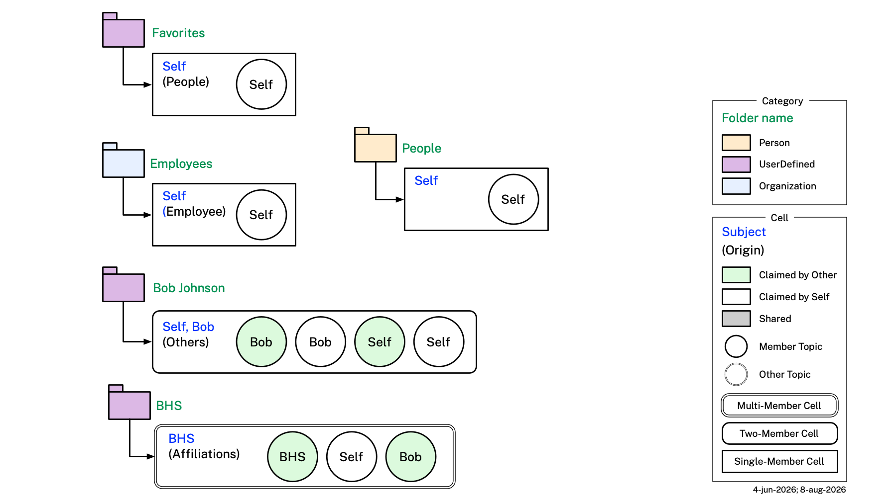</p>

The first, "Work", is a `cat:CategoryDefined` representing `cat:Work` (a `cat:Person` subclass) with no override label. The second, "Organization / Acme", is a `cat:CategoryDefined` representing `cat:Organization`, `cat:label`-renamed to "Acme". The third, "Favorites", is a hypothetical `cat:UserDefined` category with no canonical counterpart at all, `cat:label`-renamed to "Favorites" (not tied to any real example data). The fourth, "Person / Bob Johnson", is a `c:TwoParty` cell between the user and another Mia user, Bob — shown with all four self-vs-other classified topics filled (self-by-self, other-by-self, self-by-other, other-by-other), all linked via the cell's `c:partyTopics` (its `c:subject` is `:Self` and `:Bob_Johnson`). The last, "Affiliations / Boston Hub Society", is a `c:ThreePlusParty` cell with two other-party members, Carol and BHS. 

The blue text in the upper left of the cell is the 1-2 subject(s) of the cell. If a `c:TwoParty` cell has a single subject this subject must be the subject of a topic graph in the c`:otherTopics`. And if `c:TwoParty` cell has two subjects they must be two distinct subjects of the 2..4 topic graphs pointed to by `c:partyTopics`. A TwoParty cell with two subjects is essentially about the connection/relationship between the two parties.

Each of these five example cells contains topic graphs shown as circles. White circles are topic graphs whose triples are claimed by the self (the user). Green circles are topic graphs whose triples are claimed by a person other than the self, by an organization (`o:Organization`), or by a group (`g:Group`), and synchronized with the user's Mia instance over the PDN. For example the BHS cell at the bottom has three topics: Self (the user)'s BHS profile, the BHS group's own profile and Bob Johnson's BHS member profile as claimed by Bob.

A class's template cell (`cell-templates.ttl`) may also carry validation metadata declared in the paired `cell-templates-shacl.ttl`. This metadata lives on the class-level template only.

#### Cell Notes and Cell Folders

`c:note` and `c:folder` are file paths that point into two separate but parallel folder structures in local storage. The Mia app actively adjusts these two structures to stay isomorphic with the user's tree of `cat:CategoryDefined` nodes with its associated links to `cat:Category` entities — when a category is created, renamed, or deleted, Mia updates both hierarchies automatically.

In the center of the diagram below is a three level snippet of the user's category tree. It shows how that snippet maps to (and controls) the file and notes hierarchies to its left and right. Essentially when the user looks in a cell, say the middle one above, they see only the files, folders, notes of the corresponding color not the surrounding files and folders associated with the category/cell above and the category/cell below. Logically these same-colored files and folders are considered to be a part of the cell even though physically are external to it.

<p align="center"></p>

Canonical categories are not instantiated into a user's tree ahead of time. Mia instantiates a canonical category — cloning the `c:TCell` its class carries via `cat:templateCell` into a new cell, if that class has one — into the tree, and creates its `c:note`/`c:folder` paths, only once the user actually has content for it. 

The **notes hierarchy** mirrors the category tree structure. It exists as a folder structure, rooted at a folder named **`Cells`** underneath the *files root* (e.g. ~/Cells on a MacOS). A couple of details:

- In addition to notes (.md files) within a folder, one special *folder note* acts as a note about the folder itself. These so-called 'folder notes' are stored as a file named `X.md` inside the `X` folder. Using the same name as the folder matches the convention used by PKM (Personal Knowledge Management) tools such as Obsidian (using the Folder Notes plugin), Logseq, Foam and others. 
- Files that live outside the *notes root* folder are ignored by Mia.

The **files hierarchy** is lives under the `Files root` folder (e.g. ~Cells on a Mac). These folders mirror the category tree's structure. Each folder may hold arbitrary files, and may also contain additional subfolders (to any depth) that are not part of the category tree. Any file or folder directly inside the files root that is not a recognized top-level category folder likewise falls outside the category tree and is ignored by Mia.

The two roots are stored separately so the notes hierarchy can be opened as a standalone PKM vault without exposing the files hierarchy. Two user-configurable settings define where each root lives on disk:

- **Files root** — default on macOS: `~/Cells`
- **Notes root** — default on macOS: `~/NotesVault/Cells`

We have made a *provisional* decision that all `c:note` values are relative paths from the notes root, and all `c:folder` values are relative paths from the files root. 

In the normal case `c:note` and `c:folder` are technically redundant — both paths can be derived from the category tree plus the two configured roots. They are retained for three reasons:

1. **Divergence detection** — if a stored path no longer matches the derived path, Mia knows the user has manually renamed or rearranged folders outside of Mia and can alert them or attempt reconciliation rather than failing silently.
2. **Graceful degradation** — Mia can continue to locate a cell's folder or note via the stored path even when the folder hierarchy has drifted out of sync with the category tree.
3. **Intentional overrides** — a user may deliberately want a cell's folder to live somewhere other than the derived location (e.g. `~/Pictures/Immediate Family/` rather than the default `~/Enclave/People/Immediate Family/`). The explicit link records that intentional deviation without disrupting the category tree.

This third case above presents use cases and situations that have not fully been discussed and resolved nor have our principles have not been clearly articulated. For example, must all files and folders live strictly within the two roots, or are overrides allowed?

### Cell DataBooks

Every category node has one or more associated **cell DataBooks** (`.databook.md` files with `type: cell-databook`) — the relationship is many-to-one, not 1:1: more than one cell may share the same category node, each an independent piece of content at that one tree position. (The example tree currently shows only one cell per category, but that's incidental to the data shown so far, not a constraint.) A cell DataBook's `id`/filename is its category's `id`/filename with a `-cell` suffix — with a further distinguishing suffix, e.g. `-cell-2`, if a second cell shares the same category — and it lives in the same folder as its category. This association is recorded on the category, not the cell — see [Cell/Category Split](#cellcategory-split) for why.

#### Properties

The following properties are defined in `cell.ttl` and represented as `mia.` YAML fields in cell DataBooks:

| YAML field | Ontology property | Cardinality | Meaning |
|------------|-------------------|-------------|---------|
| `mia.parties` | `c:parties` | 1 | The concrete `c:ACell` subclass this DataBook instantiates, as a class value (e.g. `"c:OneParty"`) |
| `mia.note` | `c:note` | 0..1 | Relative path to a markdown notes file for this cell (e.g. `People/Paula Walker/Paula Walker.md`) |
| `mia.folder` | `c:folder` | 0..1 | Relative path to a folder of arbitrary files for this cell (e.g. `People/Paula Walker`) |
| `mia.creator` | `c:creator` | 0..1 | Who created this cell's content — a `p:Person`, `g:Group`, or `o:Organization` |
| `mia.subject` | `c:subject` | 1..2 | The resource(s) (e.g. `:Self`, `:Bob_Johnson`) the cell's content is about |
| `mia.shape` | `c:shape` | 0..1 | Optional `sh:NodeShape` validating this specific cell's own content directly |

Note files live in a folder hierarchy whose structure mirrors the category hierarchy; associated file folders live in a parallel hierarchy whose names match the category names.

#### Subject and Topic Link Properties

Each cell DataBook carries one or two `c:subject` values identifying who or what the cell is about, plus one or more `c:partyTopics` links (the required per-party baseline) and any number of `c:otherTopics` links (additional topics beyond that baseline) to the actual topic DataBook container(s) backing its content:

| Property | Value | Cardinality | Applies to | Meaning |
|----------|-------|-------------|------------|---------|
| `c:subject` | `xsd:anyURI` | 1 on `OneParty`/`ThreePlusParty`; 1..2 on `TwoParty` (required) | Any `c:ACell` | The resource(s) (typically a `p:Person`/`g:Group`/`o:Organization`) the cell's relationship is about — not a topic container |
| `c:partyTopics` | `t:SCTopicGraph` | 1 on `OneParty`; 2..4 on `TwoParty`; 3..N on `ThreePlusParty` (required) | Any `c:ACell` | The required baseline of self-vs-other classified topics backing this cell's content — at least one per party in the relationship (up to all four self-vs-other combinations for `TwoParty`) — distinguished by each linked topic's own `subject`/`claimant` combination rather than by separate properties or classes |
| `c:otherTopics` | `t:SCTopicGraph` | 0..N (optional), uniformly regardless of party count | Any `c:ACell` | Any number of additional topics beyond the `c:partyTopics` baseline — e.g. extra notes or supplementary claims not tied to a specific self-vs-other combination |

`c:subject`, `c:partyTopics`, and `c:otherTopics`'s domain is the broader `c:ACell` rather than `c:MultiParty`, unlike the four properties `c:topics` (via its predecessor `c:secondary`) replaced (`c:sbs`/`c:obs`/`c:sbo`/`c:obo`) — a `OneParty` cell can hold a self-by-self topic through `c:partyTopics`, not just a `TwoParty`/`ThreePlusParty` cell. `c:partyTopics`'s and `c:subject`'s per-party-count cardinality *is* enforced by `cell-shacl.ttl`, via three shapes targeting `cell:OneParty`/`cell:TwoParty`/`cell:ThreePlusParty` directly (`:OnePartyShape`, `:TwoPartyShape`, `:ThreePlusPartyShape`) — this replaced the single `c:topics` property's old blanket "at least one, no upper bound" rule, which didn't vary by party count. `c:otherTopics` stays uniform and unbounded across all party counts, enforced only by the general `:ACellShape` (each value must be a `t:SCTopicGraph`, no cardinality restriction).

### Cell Ontology File

**`cell.ttl`** — The Cell ontology, defining:
  - *Classes*: `c:Cell` (formerly `c:Parties`), splitting into two orthogonal facets, `c:TCell` (abstract, template facet) and `c:ACell` (abstract, actual/instantiated facet); `c:OneParty`, `c:MultiParty` (abstract), `c:TwoParty`, `c:ThreePlusParty` — all now subclasses of `c:ACell` rather than `c:Cell` directly (cell.ttl 3.7.0).
  - *Annotation properties*: `c:label` (default display name for a concrete `c:Cell` subtype, asserted on the class), `c:note` (path to markdown notes file), `c:folder` (path to associated file folder), `c:abstract` (marks a class as not directly instantiated in DataBooks), `c:subject` (domain `c:ACell`; range `xsd:anyURI` — one or two resource IRIs identifying who or what the cell is about; not an object property since its range is a datatype, mirroring `topic:subject`'s identical pattern).
  - *Object properties*: `c:templateShape` (domain `c:TCell`); `c:parties`/`c:creator`/`c:partyTopics`/`c:otherTopics`/`c:shape` (domain `c:ACell` — a cell isn't typed `c:ACell`, and so carries none of these, until it has real content). `c:creator`'s range is a union of `p:Person`, `g:Group`, and `o:Organization` — the same union-range pattern used by `topic:claimant` (see [Topic Ontology File](#topic-ontology-file)). `c:parties`'s range is `c:ACell` itself: its value is the concrete subclass (`c:OneParty`/`c:TwoParty`/`c:ThreePlusParty`), not a string — class-value punning, mirroring `cat:category`'s pattern (category.ttl). `c:templateShape`'s and `c:shape`'s ranges are both `sh:NodeShape` — see [Cell Ontology](#cell-ontology) above — but on different domains: `templateShape` describes what a topic filed under a *template* category should look like, while `shape` validates an *actual* cell's own content directly. `c:partyTopics`/`c:otherTopics`'s range is `t:SCTopicGraph` — the former is the required per-party baseline (split from the single `c:topics` property, cell.ttl 3.14.0), the latter any number of additional topics beyond it. `c:Cell` carries no property pointing back to a node at all — that link is asserted only on the category side, as `cat:cell` (see [Category Ontology File](#category-ontology-file)).
  These terms are referenced by name in the YAML frontmatter of each cell DataBook file. `cell.ttl` imports `topic.ttl` (for `c:partyTopics`/`c:otherTopics`'s range, `t:SCTopicGraph`); `topic.ttl` in turn imports `cell.ttl` back, solely to reuse `c:abstract` — a mutual import. `category.ttl` also imports `cell.ttl` (for `cat:cell`'s range, `c:ACell`, and to reuse `c:abstract`), but `cell.ttl` does not import `category.ttl` back — none of `cell.ttl`'s properties' domains/ranges ever reference a `cat:` term, even though some doc comments mention `cat:templateCell` descriptively. `cell.ttl` references `p:Person`, `g:Group`, and `o:Organization` by name in `c:creator`'s range without importing `persona.ttl`, `group.ttl`, or `organization.ttl` — the same choice `topic.ttl` makes for `topic:claimant`.

**`cell-shacl.ttl`** — SHACL shapes for cell DataBook instances, split across shapes matching `cell.ttl`'s facet split: `:CellShape` (target `c:Cell`) constrains `c:note` and `c:folder` to at most one value each; `:TCellShape` (target `c:TCell`) constrains `c:templateShape` to at most one value; `:ACellShape` (target `c:ACell`) constrains `c:creator` to at most one value which, if present, must be a `p:Person`, `g:Group`, or `o:Organization`, `c:parties` to exactly one value which must be the class `c:OneParty`, `c:TwoParty`, or `c:ThreePlusParty`, `c:subject` values to each be an IRI (`sh:nodeKind sh:IRI`, not `sh:class`, since its range is `xsd:anyURI` not `t:SCTopicGraph`), `c:otherTopics` values (if any) to each be a `t:SCTopicGraph`, and `c:shape` to at most one value. Cardinality for `c:subject` and `c:partyTopics` is no longer enforced uniformly on `:ACellShape` — instead three new shapes, `:OnePartyShape`/`:TwoPartyShape`/`:ThreePlusPartyShape` (targeting `c:OneParty`/`c:TwoParty`/`c:ThreePlusParty` directly, since `yaml-to-rdf.py` types every cell individual with its concrete party class), enforce `c:subject` as exactly 1/1..2/exactly 1 and `c:partyTopics` as exactly 1/2..4/at least 3 respectively — replacing the single `c:topics` property's old blanket "at least one, no upper bound" rule, which didn't vary by party count. `c:templateShape`/`c:shape` are deliberately not constrained to `sh:class sh:NodeShape`: the individuals they point at are only typed `sh:NodeShape` in `cell-templates-shacl.ttl`, which Tier 1 validation deliberately excludes from its merged-data run (see [Validation](#validation)), so that constraint would spuriously fail there.

### Cell Ontology Validation

Cell DataBook instances are validated by `cell-shacl.ttl`, for the same reason and via the same mechanism as [Category Ontology Validation](#category-ontology-validation) above: `parties`/`subject`/`partyTopics`/`otherTopics`/`note`/`folder`/`creator`/`shape` exist solely as `mia.` YAML frontmatter fields on cell DataBooks, so `yaml-to-rdf.py` synthesizes the corresponding `c:` triples (`rdf:type c:Cell`, plus `rdf:type c:ACell`/the concrete party class/`c:parties`/`c:creator`/`c:subject`/`c:partyTopics`/`c:otherTopics`/`c:shape` once `parties` is set) directly from frontmatter, letting `:CellShape`/`:ACellShape`/the per-party-count shapes actually fire against real instance data — see [Tier 1](#validation). A cell-databook with no `mia.parties` value (a pure tree-position placeholder with nothing filed under it yet) is synthesized as a bare `c:Cell` only, so it is not subject to `:ACellShape`'s or the per-party shapes' required `c:subject`/`c:partyTopics`. (`c:TCell` individuals live only in `cell-templates.ttl`, a plain `.ttl` file rather than a DataBook excluded from Tier 1's merge entirely — see [Validation](#validation) — so they need no such synthesis either.)

## Topic Ontology

The topic ontology defines *topics* (`t:TopicGraph`) — named graphs containing sets of claims about some resource; that resource need not be a person (see `t:subject` below). Topics are referenced by cells described in the Cell Ontology.

### Topics

A topic is a container of information related to an interaction with, or relationship to, another person, group, or organization. This information is expressed as a named graph of triples — typically using the Persona, Organization, and Group ontologies when the topic is about a person, group, or organization, though the ontology does not require this — and stored in a **[DataBook](https://github.com/w3c-cg/holon/tree/main/architectures/databook)** (`.databook.md`) file that describes one facet of its subject (called the `subject` of the topic). These claims may have originated from other topics about the same subject. 

<p align="center"></p>

One property applies to every `t:TopicGraph`:

**`t:template`** — present only on topic files that contain instances of a template; its value is the name of a `p:PersonaTemplate` subclass (e.g. `"persona:BirthCertificateDocument"`, `"persona:JSContactCard"`, `"persona:DriversLicenseDocument"`, `"persona:PassportDocument"`, `"persona:MedicalAppointmentRecord"`).

A topic carries no field pointing back at the cell that references it — that link is asserted only on the cell side, via `c:partyTopics`/`c:otherTopics` (see the Cell Ontology section below).

Two more properties apply to every topic linked from a cell, since every `c:partyTopics`/`c:otherTopics` value is classified as `t:SCTopicGraph`:

**`t:subject`** — The resource the topic file is about. Value is any resource IRI — the ontology does not require it to be a `p:Person`, `g:Group`, or `o:Organization`, though in this example every `subject` value happens to be one of those three:
- `:Self` — the topic is about the Mia user.
- a named individual of `p:Person` — the topic is about another human Mia user.
- a named individual of `g:Group` — the topic is about a group of Mia users.
- a named individual of `o:Organization` — the topic is about an organization (legal corporation or government agency).

**`t:claimant`** — Who is making the claim. Values are local IRIs of `p:Person`, `g:Group`, or `o:Organization` individuals:
- `:Self` — the Mia user that is entering the data, even if the underlying information originates from some other party such as a company, government agency, or another person.
- a named individual of class `p:Person` — another Mia user is claiming the data directly.
- a named individual of class `g:Group` — a group of Mia users is claiming the data.
- a named individual of class `o:Organization` — an organization is claiming the data.

The diagram below shows four kinds of topics related to a hypothetical Mia user, Alice, and her interactions with a Department of Motor Vehicles (DMV) agency. Across the top are two topics where the DMV itself is the subject, and at the bottom where Alice is the subject. At the left are topics where Alice has made the claims (e.g. Alice's Mia has written the claims into the topic) and at the right are topics where the DMV as the "other" has written the claims. 

<p align="center">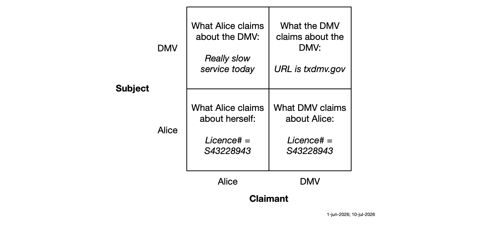</p>

The lower left shows a topic that Alice might share with other people or companies. In it, she claims that her driver's license number is S43228943, having copied that number from her physical driver's license. The topic in the lower right carries the same information as the lower left, but because it is being claimed by the DMV it is more likely to be trusted by a recipient (especially if this information is conveyed via secure channel and the claims are cryptographically bound to the identity of the DMV).

### Topic DataBooks

The description of the topic container itself is carried in the DataBook's YAML front matter under the `mia:` key. The topic ontology (`topic.ttl`) defines the controlled vocabularies that those YAML fields reference:

- `mia:template` = `t:template`
- `mia.subject` = `t:subject`
- `mia.claimant` = `t:claimant`

### Topic Ontology File

**`topic.ttl`** — the Topic ontology, defines:
  - *Classes*: `t:TopicGraph`, `t:SCTopicGraph` (Subject-Claimant topic graph; the concrete class every self-vs-other classified topic DataBook is typed as directly — it has no subclasses; carries the `t:subject`/`t:claimant` annotations — every topic reachable from a cell, via `c:partyTopics`/`c:otherTopics`, is a `t:SCTopicGraph`).
  - *Annotation properties*: `t:template` (domain `t:TopicGraph`), `t:claimant` (range a union of `p:Person`, `g:Group`, `o:Organization`), `t:subject` (domain `t:SCTopicGraph`; range `xsd:anyURI` — any resource IRI, not necessarily a `p:Person`/`g:Group`/`o:Organization`).
  These terms are referenced by name in the YAML frontmatter of each DataBook file. `topic.ttl` imports `cell.ttl` to reuse `c:abstract` on `t:TopicGraph`/`t:SCTopicGraph`.

**`topic-shacl.ttl`** — SHACL shapes for topic DataBook instances: `:SCTopicGraphShape` (target `t:SCTopicGraph`) constrains `t:claimant` to exactly one value, which must be a `p:Person`, `g:Group`, or `o:Organization`, and `t:subject` to exactly one value, which must be an IRI.

### Topic Ontology Validation

Topic file metadata (claimant, subject) is declared in YAML frontmatter. `topic-shacl.ttl`'s `:SCTopicGraphShape` (see above) targets `topic:SCTopicGraph`, but that typing is itself only ever asserted via the `mia.claimant`/`mia.subject` YAML fields, never as a literal `rdf:type topic:SCTopicGraph` triple in a topic file's extracted Turtle body. `yaml-to-rdf.py` synthesizes it directly from frontmatter — `rdf:type topic:SCTopicGraph` plus `topic:claimant`/`topic:subject`, asserted on the topic DataBook's plain `id`, not the `#graph`-suffixed `graph.named_graph` IRI (see `topic.ttl` 1.11.0) — so `:SCTopicGraphShape` actually fires against real instance data; see [Tier 1](#validation). The remaining classification fields live on the associated category and cell DataBooks, synthesized the same way: `catType`/`child`/`label`/`category`/`cell` on category DataBooks (see [Category Ontology Validation](#category-ontology-validation)); `parties`/`subject`/`partyTopics`/`otherTopics`/`note`/`folder`/`creator`/`shape` on cell DataBooks (see [Cell Ontology Validation](#cell-ontology-validation)).

## Persona Ontology

The Persona ontology defines a formal, machine-readable model of a person. It is used by triples stored in `t:TopicGraph` instances. 

We represent a person with the `p:Person` class — a Mia-specific subclass of CCO `Person` (`cco:ont00001262`).  The Mia user's own `p:Person` individual always uses the IRI `:Self` across all of their cell's topic files; other people, groups, and organizations are assigned locally-minted named IRIs (e.g. `:Bob_Johnson`). `:Self`'s type declaration (`rdf:type owl:NamedIndividual, persona:Person`) is asserted in `example/topics/self.ttl` (see the [Validation](#validation) section for how `self.ttl` is merged in alongside topic data). These topic files, referenced by cells, function as *named-graph slices* — each is an independent facet of an identity in a specific relationship or institutional topic, carrying the claims relevant to that topic: names, addresses, phone numbers, SSNs, physical characteristics, parent-child relationships, social connections, payment cards, and more. The Persona ontology reuses existing well-known ontologies wherever possible and defines new terms only where no suitable existing term exists.

<p align="center"></p>

### Key Properties and Classes

This section describes the most fundamental properties and classes in the Persona ontology. A person's identity data is spread across multiple named-graph slice files, each containing one `p:Person` individual. The Mia user's slices share the IRI `:Self`; each other person's slices share their locally-assigned named IRI.

**Classes:**

- `p:Person` — a Mia-specific subclass of CCO `Person` (`cco:ont00001262`). Each topic file (named-graph slice) contains exactly one `p:Person` individual. The Mia user's own `p:Person` always uses the IRI `:Self`, shared across all of their topic files. Other people, groups, and organizations are assigned locally-minted named IRIs (e.g. `:Bob_Johnson`, `:Paula_Walker`). `:Self` is a local IRI and is never exposed externally over the PDN, so there are no collisions between Mia instances. All identity data — names, identifiers, addresses, social networks, payment cards, and more — attaches to this individual.

### Social Classes and Properties

This section describes classes and properties related to a person's social network.

**Classes:**

- `cco:ont00001183` — Social Network

**Properties:**

- `p:hasSocialNetwork` — a social network — other people known by the `p:Person` carrying the social network. The holder is not included as a member part of the social network object, but *is* considered to be a part of it by virtue of holding the network entity.
- `BFO_0000115` — has member part. Links to `p:Person` members of this network.

### Possession-Related Classes and Properties

This section describes properties and classes related to things a person has, holds, possesses, purchased, or rents.

- Physical plastic/paper cards are `MaterialArtifact` subclasses that include driver's license, health insurance card, payment card, etc.
- Physical wallets — cards may be placed in a wallet (via BFO `continuant part of`) or held directly by the `p:Person` (via `p:hasPhysicalCard`).

<p align="center"></p>

**Classes:**

- `p:PhysicalCard` — a physical plastic or paper card (held in a wallet or carried directly).
- `p:PhysicalHealthInsuranceCard` (subclass of `p:PhysicalCard`) — a physical health insurance membership card.
- `p:PhysicalDriversLicense` (subclass of `p:PhysicalCard`) — a state-issued driver's license card.
- `p:PhysicalPaymentCard` (subclass of `p:PhysicalCard`) — a physical credit or debit card.
- `p:PhysicalSocialSecurityCard` (subclass of `p:PhysicalCard`) — a paper or plastic card issued by the Social Security Administration.
- `p:Wallet` — a physical wallet that can hold cash as well as various kinds of paper or plastic identity or payment cards.

**Properties:**

- `is carrier of` (from BFO) — used to link a physical card to its corresponding `p:Person` in another topic.
- `p:hasWallet` — links a `p:Person` to a physical wallet (see Possessions below).
- `p:hasImageScan` — a link to a scanned image of this card.
- `p:hasPhysicalCard` — links a `p:Person` to a `p:PhysicalCard` carried outside of a wallet (see Possessions below).

### Accounts

This section describes properties and classes related to a person's relationship with an online service provider. An online service account (`OnlineServiceAccount`, CCO `ont00000033`) records a person's credentials and identity with an online service provider such as Google or AT&T.

**Properties:**

- `holds user account` (CCO) — links a `p:Person` to an `OnlineServiceAccount`.
- `has service name` (CCO) — the name of the online service (e.g. "Google").
- `has service URI` (CCO) — the URI of the online service.
- `has user handle` (CCO) — the user's handle or username on the service.
- `p:hasPassword` — the password credential for an `OnlineServiceAccount` (Persona ontology extension).

### Finance-Related Classes and Properties

This section describes properties and classes related to a person's interactions with financial institutions.

**Classes:**

- `p:CheckingAccount` — a bank checking account held by a person, linked to a debit card.
- `p:CheckingAccountNumber` — an identifier designating a bank checking account, connected via `designated by` (`ont00001879`).
- `p:RoutingNumber` — an ABA routing transit number identifying the financial institution, connected via `designated by`.

**Properties:**

- `p:hasBankAccount` — links a `p:Person` to a `p:CheckingAccount` it records.
- `p:accessesBankAccount` — links a DebitCard to the `p:CheckingAccount` it draws funds from.

### Modeling Details

This section describes a few details related to modeling names and addresses.

**Peer name pattern**: All name types (FullName, GivenName, FamilyName, AlternateName) connect directly to a `p:Person` via `designated by` (`ont00001879`). They are siblings, not nested under a PersonName parent. Legal names belong to the birth certificate topic file (annotated `t:template p:BirthCertificateDocument`); a preferred/goes-by name (AlternateName) belongs to each social or professional topic where it applies.

**Address history**: Each address topic file carries a `p:Person` with a USPostalAddress and an `AddressDesignation` with a `TemporalInterval` (start date required; no end date = current address).

### Persona Templates

`p:PersonaTemplate` is an abstract classification class that serves as the common superclass for all reusable, topic-type-specific template labels. These labels are defined in `persona-templates.ttl`. A topic file declares its template in the YAML frontmatter as `mia.template` rather than by typing its `p:Person` individual. Four of the five per-template SHACL shapes (`p:BirthCertificateDocument`, `p:DriversLicenseDocument`, `p:PassportDocument`, `p:MedicalAppointmentRecord`) live in `cell-templates-shacl.ttl`, each directly linked from its class-level `c:TCell` template (in `cell-templates.ttl`) via `c:templateShape` (`cell.ttl`) — so the shape is reachable by RDF traversal from the corresponding `cat:Category` class (`cat:BirthCertificate`, `cat:DriversLicense`, `cat:Passport`, `cat:MedicalAppointmentInfo`) via `cat:templateCell` — see [Lazy Instantiation](#lazy-instantiation); `p:JSContactCard`'s shape remains a standalone file in `shacl/`, since it's reused across many unrelated tree positions with no single `cat:Category` class of its own to attach to.

<p align="center"></p>

**Government-issued identity documents** — `p:BirthCertificateDocument`, `p:DriversLicenseDocument`, and `p:PassportDocument` are subclasses of both `p:PersonaTemplate` (template label use) and `p:IdentityDocument` (artifact instance use). `p:IdentityDocument` is the class for government-issued documents that formally identify a person. The property `p:hasIdentityDocument` (domain: `p:Person`, range: `p:IdentityDocument`) links a person to the government document they hold. Each government-ID topic file declares one named individual of the document type and links it from `:Self`. `p:JSContactCard` is a format label only — not a government-issued document — and is a subclass of `p:PersonaTemplate` only.

The five currently defined subclasses of `p:PersonaTemplate` are:

- `p:BirthCertificateDocument` — label for topic files that carry a person's legal birth name record as issued by a state agency. Also a subclass of `p:IdentityDocument`. Declared in the YAML frontmatter as `mia.template: "persona:BirthCertificateDocument"`. SHACL shape `:BirthCertificateDocumentShape` (in `cell-templates-shacl.ttl`, alongside `cat:BirthCertificate`'s template cell in `cell-templates.ttl`) targets the `p:BirthCertificateDocument` document individual and validates the holding `p:Person` via `^persona:hasIdentityDocument`:
  - **Required**: either a `FullName` designator **or** both a `GivenName` and a `FamilyName` designator (via `designated by`, `ont00001879`) — expressed with `sh:or`.
  - **Optional**: `AdditionalName` (middle name), `AlternateName` (e.g. maiden name), `Nickname`, and `Legal Name` designators.

- `p:JSContactCard` — label for topic files that carry professional contact details in the JSContact (RFC 9553) format. A digital contact format (RFC 9553) — not a government-issued identity document, and therefore not a subclass of `p:IdentityDocument`. Declared in the YAML frontmatter as `mia.template: "persona:JSContactCard"`. SHACL shape `:JSContactCardPersonShape` (in `shacl/jscontactcard-shacl.ttl`) enforces:
  - **Required**: exactly one `OrganizationName` designator; at least one `Email` or `TelephoneNumber` designator.
  - **Optional**: all name components, `OrganizationUnit`, `JobTitle`, addresses, online services, anniversaries, personal info, photo.
  - **Max 1** on all single-valued name and organization components.
  See the [JSContact field coverage table](#jscontact-field-coverage) below for the complete mapping.

- `p:DriversLicenseDocument` — label for topic files that carry the identity claims on a state-issued driver's license. Also a subclass of `p:IdentityDocument`. Declared in the YAML frontmatter as `mia.template: "persona:DriversLicenseDocument"`. SHACL shape `:DriversLicenseDocumentShape` (in `cell-templates-shacl.ttl`, alongside `cat:DriversLicense`'s template cell in `cell-templates.ttl`) targets the `p:DriversLicenseDocument` document individual and validates the holding `p:Person` via `^persona:hasIdentityDocument`:
  - **Required**: `FullName` **or** (`GivenName` + `FamilyName`); exactly one `Birthdate` (`cco:ent00000046`); exactly one Drivers License Number (`cco:ent00000065`); exactly one expiration date (`cco:ent00000070` → Calendar Date Identifier `cco:ont00001340`).
  - **Optional**: `AdditionalName`; Issuing Jurisdiction (`cco:ent00000068`); `PostalAddress`; `p:hasPhoto`.
  Note: `p:PhysicalDriversLicense` (in `persona.ttl`) models the physical card object held in a wallet — `p:DriversLicenseDocument` is the template label that marks a topic file as carrying driver's license identity data.

- `p:PassportDocument` — label for topic files that carry the identity claims on a government-issued passport. Also a subclass of `p:IdentityDocument`. Declared in the YAML frontmatter as `mia.template: "persona:PassportDocument"`. SHACL shape `:PassportDocumentShape` (in `cell-templates-shacl.ttl`, alongside `cat:Passport`'s template cell in `cell-templates.ttl`) targets the `p:PassportDocument` document individual and validates the holding `p:Person` via `^persona:hasIdentityDocument`:
  - **Required**: `FullName` **or** (`GivenName` + `FamilyName`); exactly one `Birthdate` (`cco:ent00000046`); exactly one Passport Number (`cco:ent00000066`); exactly one expiration date (`cco:ent00000070` → Calendar Date Identifier `cco:ont00001340`).
  - **Optional**: `AdditionalName`; issue date (`cco:ent00000069`); Issuing Jurisdiction (`cco:ent00000068`, collapsed from the former IssuingCountry); Place of Birth (`cco:ent00000067`); `p:GenderMarker`; `p:hasPhoto`.

- `p:MedicalAppointmentRecord` — label for topic files that carry the claims needed to arrange a medical appointment on behalf of someone else, shared between the parties coordinating that care. Not a subclass of `p:IdentityDocument`. Declared in the YAML frontmatter as `mia.template: "persona:MedicalAppointmentRecord"`. SHACL shape `:MedicalAppointmentRecordShape` (in `cell-templates-shacl.ttl`, alongside `cat:MedicalAppointmentInfo`'s template cell in `cell-templates.ttl`) targets the `p:MedicalAppointmentRecord` record individual directly — the claims below are properties of the record, not of the patient's `p:Person`:
  - **Required**: exactly one `p:forPatient` link; exactly one `p:insuranceProvider`; exactly one `p:insurancePolicyNumber`.
  - **Optional**: `p:hasPrimaryCarePhysician`; `p:medicalHistoryNote`; `p:insuranceGroupNumber`; `p:preferredPharmacy`; repeatable `p:currentMedication` and `p:allergy`.

#### JSContact Field Coverage

The table below maps every JSContact (RFC 9553) property to its representation in the Persona ontology. Properties defined in `persona-templates.ttl` for JSContact alignment are marked **JSC**.

| JSContact Property | Card. | Ontology Representation | Via | SHACL constraint |
|---|:---:|---|---|:---:|
| `name.full` | 0..1 | `cco:ent00000001` FullName | `designated by` | max 1 |
| `name.given` | 0..1 | `cco:ent00000002` GivenName | `designated by` | max 1 |
| `name.surname` | 0..1 | `cco:ent00000004` FamilyName | `designated by` | max 1 |
| `name.given2` | 0..1 | `cco:ent00000003` AdditionalName | `designated by` | max 1 |
| `name.surname2` | 0..1 | `cco:ent00000058` Surname2 | `designated by` | max 1 |
| `name.prefix` | 0..1 | `cco:ent00000057` Title/HonorificPrefix | `designated by` | max 1 |
| `name.suffix` | 0..1 | `cco:ent00000005` Suffix (Jr., Sr., III) | `designated by` | max 1 |
| `name.credential` | 0..1 | **JSC** `p:Credential` (MD, PhD, Esq.) | `designated by` | max 1 |
| `nicknames` | 0..1 | `cco:ont00000990` Nickname | `designated by` | max 1 |
| `name.altName` | 0..1 | `cco:ent00000006` AlternateName | `designated by` | max 1 |
| `emails` | 0..N | `cco:ent00000024` EmailAddress | `designated by` | — |
| ↳ `contexts` | 0..N | **JSC** `p:contactContext` annotation | annotation property | — |
| `phones` | 0..N | `cco:ent00000023` TelephoneNumber | `designated by` | — |
| ↳ `contexts` | 0..N | **JSC** `p:contactContext` annotation | annotation property | — |
| ↳ `features` | 0..N | **JSC** `p:phoneFeature` annotation | annotation property | — |
| `addresses` | 0..N | `cco:ent00000010` USPostalAddress | (address pattern) | — |
| ↳ `contexts` | 0..N | **JSC** `p:contactContext` annotation | annotation property | — |
| `anniversaries` (birth) | 0..1 | `cco:ent00000046` Birthdate | `designated by` | max 1 |
| `anniversaries` (other) | 0..N | **JSC** `p:Anniversary` | `p:hasAnniversary` | — |
| ↳ `kind` | — | **JSC** `p:anniversaryKind` | datatype property | — |
| ↳ `date` | — | **JSC** `p:anniversaryDate` | datatype property | — |
| ↳ `label` | — | **JSC** `p:anniversaryLabel` | datatype property | — |
| `organizations[].name` | 0..1 | `cco:ent00000047` OrganizationName | `designated by` | max 1 |
| `organizations[].units` | 0..1 | **JSC** `p:OrganizationUnit` | `designated by` | max 1 |
| `titles[].name` | 0..1 | **JSC** `p:JobTitle` | `designated by` | max 1 |
| `onlineServices` (account) | 0..N | `cco:ont00000033` OnlineServiceAccount | `holds user account` | — |
| `onlineServices` (URL) | 0..N | **JSC** `p:WebURL` | `designated by` | — |
| ↳ `service` | 0..N | **JSC** `p:serviceLabel` annotation | annotation property | — |
| `personalInfo` | 0..N | **JSC** `p:PersonalInfo` | `p:hasPersonalInfo` | — |
| ↳ `kind` | — | **JSC** `p:personalInfoKind` | datatype property | — |
| ↳ `value` | — | **JSC** `p:personalInfoValue` | datatype property | — |
| ↳ `level` | — | **JSC** `p:personalInfoLevel` | datatype property | — |
| `photos[].uri` | 0..N | **JSC** `p:hasPhoto` (xsd:anyURI) | datatype property | — |
| `legalName` | 0..1 | `cco:ont00001331` Legal Name | `designated by` | — |
| `uid` | 1 | IRI of the `p:Person` individual | — | — |
| `notes` | 0..N | `Person` Note via `has text value` | `designated by` | — |
| `relatedTo` | 0..N | `BFO_0000115` (member) | object property | — |
| `updated` | 0..1 | `version:` in the DataBook YAML frontmatter | YAML field | — |
| `language` | 0..1 | *(not yet mapped)* | — | — |
| `cells` | 0..N | *(not yet mapped)* | — | — |
| `preferredLanguages` | 0..N | *(not yet mapped)* | — | — |

### Persona Ontology Files

- **`persona.ttl`** — The Persona ontology. Imports the domain ontologies above and documents which classes and properties Mia uses (required vs. optional). Defines `p:Person` (Mee-specific subclass of CCO `Person`), Mia-specific extension properties (`p:hasSocialNetwork`, `p:hasPaymentCard`, `p:hasBankAccount`, etc.), and the core data model classes (physical card classes, banking classes, and others).
- **`persona-templates.ttl`** — Defines `p:PersonaTemplate` (abstract classification superclass) and the five concrete subtypes `p:BirthCertificateDocument`, `p:JSContactCard`, `p:DriversLicenseDocument`, `p:PassportDocument`, and `p:MedicalAppointmentRecord`. These are used as values of `mia.template` in the DataBook YAML frontmatter — they classify the topic file, not the `p:Person` individual inside it. Also defines `p:IdentityDocument` (superclass for government-issued identity document artifacts) and `p:hasIdentityDocument` (links a `p:Person` to a `p:IdentityDocument` individual they hold); `p:BirthCertificateDocument`, `p:DriversLicenseDocument`, and `p:PassportDocument` are subclasses of both `p:PersonaTemplate` and `p:IdentityDocument`. Also defines related designator classes (`p:DriversLicenseNumber`, `p:IssuingJurisdiction`, `p:PassportNumber`, `p:IssuingCountry`, `p:PlaceOfBirth`, `p:GenderMarker`, `p:IssueDate`, `p:Credential`, `p:WebURL`, `p:OrganizationUnit`, `p:JobTitle`), complex information classes (`p:Anniversary`, `p:PersonalInfo`), annotation properties for JSContact channel labels (`p:contactContext`, `p:phoneFeature`, `p:serviceLabel`), `p:hasPhoto`, and the `p:MedicalAppointmentRecord` claim properties (`p:forPatient`, `p:hasPrimaryCarePhysician`, `p:currentMedication`, `p:allergy`, `p:medicalHistoryNote`, `p:insuranceProvider`, `p:insurancePolicyNumber`, `p:insuranceGroupNumber`, `p:preferredPharmacy`). Imported by `persona.ttl` so all topic files inherit these classes transitively.

- **`cell-templates.ttl`** — Class-level `c:Cell` templates for `cat:Category` subclasses. Holds one template cell individual per templated class: `cat:Passport`, `cat:BirthCertificate`, `cat:DriversLicense`, `cat:MedicalAppointmentInfo`. Each is pointed at by its class's own `cat:templateCell` value, which is asserted in `category.ttl` itself, alongside the class's declaration (not here). Each individual is what a `cat:CategoryDefined` node's `cat:category` value indirectly points at, and what Mia clones into a new cell when that category is first instantiated into a user's tree (Lazy Instantiation). Each is multi-typed `c:Cell, c:TCell, c:ACell, c:OneParty` (cell.ttl 3.7.0's facet split) — simultaneously reusable template content (`c:TCell`, carrying `c:templateShape` to its SHACL shape in `cell-templates-shacl.ttl`) and real party-classified content (`c:OneParty`, a `c:ACell` subclass, carrying `c:parties`). Imports `cell.ttl` directly (not `category.ttl` — no mutual import here).

- **`cell-templates-shacl.ttl`** — SHACL shapes for birth certificate, driver's license, passport, and medical appointment topic files, each directly linked from its `cell-templates.ttl` template cell via `c:templateShape` (not merely co-located by naming convention):
  - `:BirthCertificateDocumentShape` (`t:template p:BirthCertificateDocument`) targets `p:BirthCertificateDocument` document individuals directly — all identity claims (names) are properties of the document individual, not the `p:Person`. Enforces: FullName OR (GivenName + FamilyName) required; optional AdditionalName, AlternateName, Nickname, Legal Name.
  - `:DriversLicenseDocumentShape` (`t:template p:DriversLicenseDocument`) targets `p:DriversLicenseDocument` document individuals directly. Enforces: FullName OR (GivenName + FamilyName) required; Birthdate, DriversLicenseNumber, ExpirationDateIdentifier required (1..1 each); IssuingJurisdiction, PostalAddress, and hasPhoto optional.
  - `:PassportDocumentShape` (`t:template p:PassportDocument`) targets `p:PassportDocument` document individuals directly. Enforces: FullName OR (GivenName + FamilyName) required; Birthdate, PassportNumber, ExpirationDateIdentifier required (1..1 each); IssueDate, IssuingCountry, PlaceOfBirth, GenderMarker, and hasPhoto optional.
  - `:MedicalAppointmentRecordShape` (`t:template p:MedicalAppointmentRecord`) targets `p:MedicalAppointmentRecord` record individuals directly — the claims needed to arrange the appointment are properties of the record, not of the patient's `p:Person`. Enforces: exactly one `forPatient`, `insuranceProvider`, and `insurancePolicyNumber` required; `hasPrimaryCarePhysician`, `medicalHistoryNote`, `insuranceGroupNumber`, `preferredPharmacy` optional; `currentMedication` and `allergy` repeatable.

- **`shacl/jscontactcard-shacl.ttl`** — SHACL shapes for JSContactCard topic files (`t:template p:JSContactCard`) — remains a standalone file, since JSContactCard is reused across many unrelated tree positions with no single `cat:Category` class of its own to attach a template cell to. Validates `p:Person` instances:
  - OrganizationName required (1..1); at least one Email or TelephoneNumber required; all name components and OrganizationUnit/JobTitle optional (0..1 each).

- **`persona-shacl.ttl`** — SHACL constraint rules for all `p:Person` individuals across all topic files. Validates properties including:
  - *All `p:Person` instances*: SSN format (`NNN-NN-NNNN`), email format, phone (E.164), address cardinality, payment cards, wallet, social network, bank account
  - *US Postal Address*: required street, city, state (USPS 2-letter), ZIP; optional country
  - *`p:Person`*: scalp hair (0..1); `has mother` / `is mother of` range must be a `p:Person`
  - *Social Network*: sub-groups (via `has part`) must be Social Networks; members (via `has member part`) must be `p:Person` instances
  - *Debit Card*: card number and expiration date required; CVV optional
  - *`p:Wallet`*: items declaring themselves `continuant part of` this wallet must be `p:PhysicalCard` instances
  - *`p:PhysicalCard`*: image scan, if present, must be `xsd:anyURI` (max 1); `continuant part of` target, if present, must be a `p:Wallet` (max 1)

### Persona Ontology Validation

`persona-shacl.ttl` runs against merged data from all topic files (Tier 1 validation). Per-template SHACL files in `shacl/` run against individual topic files (Tier 2): birth certificate, JSContactCard, driver's license, passport, and medical appointment each have their own shape file and are validated separately to avoid their `sh:targetClass` constraints firing on every relevant slice in the merged dataset. See the [Validation](#validation) section for commands.

## Organization Ontology

The Organization ontology models organizations — companies, government agencies, nonprofits, and other institutions — that participate in the Personal Data Network.

<p align="center"></p>

**Classes**

* `o:Organization` — an organization (company, government agency, corporation, nonprofit, etc.) on the Personal Data Network.

### Organization Ontology File

- **`organization.ttl`** — The Organization ontology.

### Organization Ontology Validation

`organization-shacl.ttl` targets `o:Organization` instances but currently has no property constraints of its own.

## Group Ontology

The Group ontology introduces the concept of a *shared* group (`g:Group`) whose members are individuals and/or organizations. The group entity *itself* as well as any attached properties are shared with all of its members.

<p align="center"></p>

**Classes**

* `g:Group` — a group of people and/or organizations on the Personal Data Network.

### Group Ontology File

- **`group.ttl`** — The Group ontology.

### Group Ontology Validation

`group-shacl.ttl` validates `g:Group` instances. Key constraint: all members (via BFO `has member part`) must be `p:Person` or `o:Organization` instances.

## Illustrative Example: Alice 

This section describes the local Mia dataset for a hypothetical user, Alice Walker. Alice's data lives in multiple topic DataBooks linked to by a tree structure of category DataBooks, each associated with one or more cell DataBooks holding its content. 

### Alice's Cells and Topics

Alice interacts with other people, organizations and groups in topics of different types, with each topic file holding a named graph.

Alice's topic DataBooks are in `example/topics/`. Some are authored by Alice (self-claimed data — data she entered herself into her Mia app); others contain data received from peer Mia users or organizational peers over PDN and stored locally. In either case, Alice is the Mia user, so the `p:Person` that represents her uses the IRI `:Self` across all of her topic files. Other people — Bob Johnson, Paula Walker — and groups such as BHS use locally-assigned named IRIs (e.g. `:Bob_Johnson`, `:Paula_Walker`, `:BHS`). When data arrives from a peer's Mia (where that peer was `:Self` in their own instance), Alice's Mia assigns them a locally-minted identifier; once a PDN connection is established, that identifier resolves to their PDN id.

Alice's category DataBooks are in `example/categories/`. The full tree can be walked starting from `example/categories/categories.databook.md`. It contains two kinds of entries:

- **`cat:CategoryDefined` categories** (`mia.catType` set to the specific class it was instantiated from, e.g. `People`, `Employees`, `Others`, `BankingPayments`) — this covers both the 19 top-level categories and their child categories, and most specific people/companies/agencies Alice interacts with (e.g. `bob-johnson(others)`, instantiated from `Others`; `citibank(banking-payments)`, instantiated from `BankingPayments`). Each carries a `category:` property naming the `cat:Category` class it represents (e.g. `category: "cat:People"`) — this single value both classifies the node and records which class it was instantiated from. Topic links (`c:partyTopics`/`c:otherTopics`), and the resource(s) each cell is about (`c:subject`), are attached to each category's *associated cell DataBook*, not the category itself.
- **`cat:UserDefined` categories** (`mia.catType: Category`, no `category:` value) — for an entity with no canonical counterpart at all. This example tree doesn't currently have one: even `acme(work)` (Alice's employer, which has no specific canonical class of its own) is a `cat:CategoryDefined` whose own `cat:category` is the abstract `cat:Organization` — the most specific applicable classification — with `cat:label` "Acme" recording the rename.

Every category DataBook here is a `cat:CategoryDefined` (a `cat:UserDefined` node, for a category with no canonical counterpart at all, is also possible but not currently used in this example tree), associated, in the same folder, with a cell DataBook (filename/id with a `-cell` suffix) holding its content — the association is recorded as `mia.cell` on the category, the same way it is for every canonical category too.

#### Category, Cell and Topic Diagrams

The following sequence of diagrams maps out the categories, cells and topics of our Alice example. We start with the People cell — Alice's relationship with someone she knows named Bob Johnson. Bob is someone Alice knows but who isn't family or a close friend, so she has filed him under the Others cell rather than Friends.

<p align="center">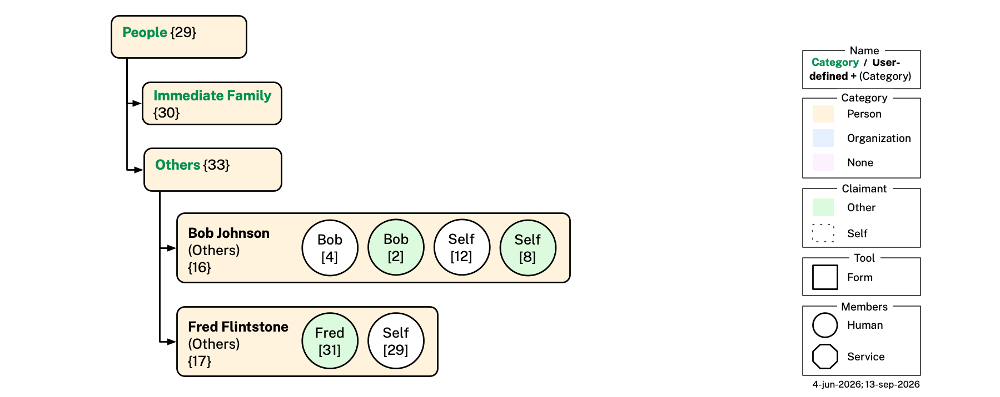</p>

Alice's mother, Paula Walker, is filed under Immediate Family. Alice's own Health & Wellness cell — Medical, Dental, Vision, and Wellness — is nested within Paula's own cell, since caring for Paula's health is central to why Alice tracks health information at all. Under Medical > Providers, Alice keeps a record of Dr. Jane Kolpakova, Paula's primary care physician (topic #25). Alice and her sister, Carol, are also taking care of their mother Paula Walker and need to arrange medical appointments for her. To do so, they need to share and synchronize medical information about Paula including her list of medications, medical history, health insurance policy, contact information and so on. Alice creates a two-party Medical Appointment Info cell with Carol, also filed under Medical > Providers, that they use to share information about Paula. The Paula's medical information is captured in topic #26. Of the many claims, one of them will be the name of Paula's doctor (primary care physician), copied from the Dr. Jane Kolpakova cell shown in the same diagram. The resulting tree, from People down through both provider cells, is shown below:

<p align="center">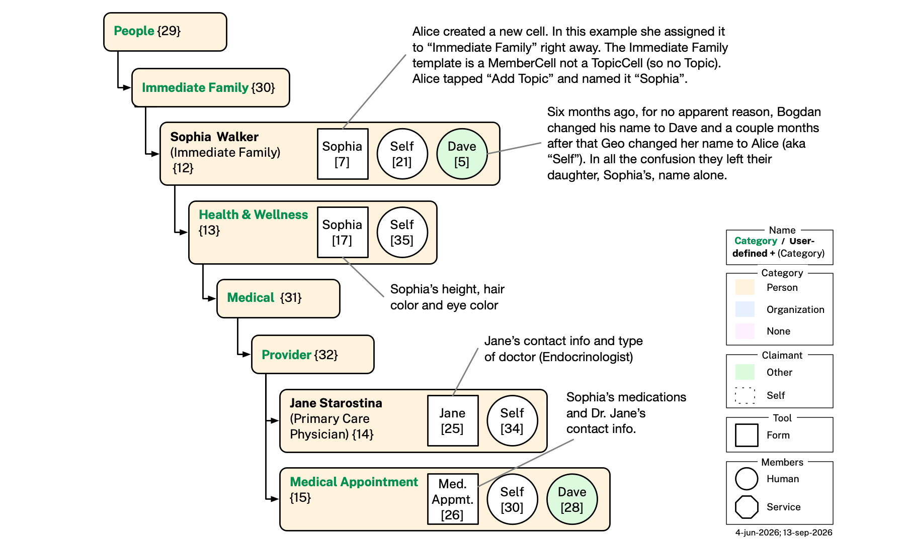</p>

*(This diagram is a work in progress and will be expanded to show the Health & Wellness cell in more detail.)*

<p align="center">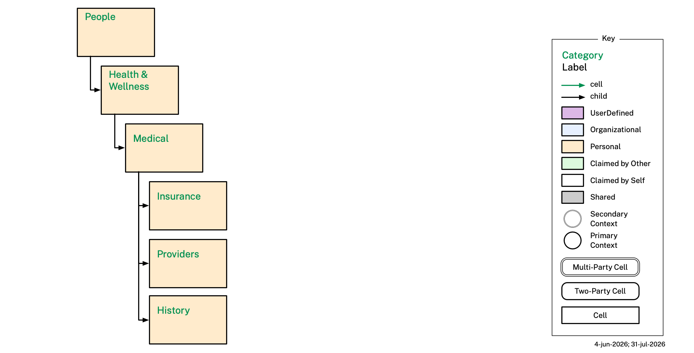</p>

Alice is an employee of Acme, so under her Work cell she has created a user-defined cell called Acme to represent her employer. Since Acme is an organization, Alice has under her Acme cell switched from adding `cat:Person` categories to `cat:Organization` categories (light blue color) and added an Employees cell which acts as a parent holding an Employee cell for each person there she tracks, including herself. Her own "Alice Walker" cell holds her Business Card claims — job title at Acme, work telephone number, work email, etc. One of the employees she works with is Paula Walker, so she adds a Paula Walker cell too.
<p align="center">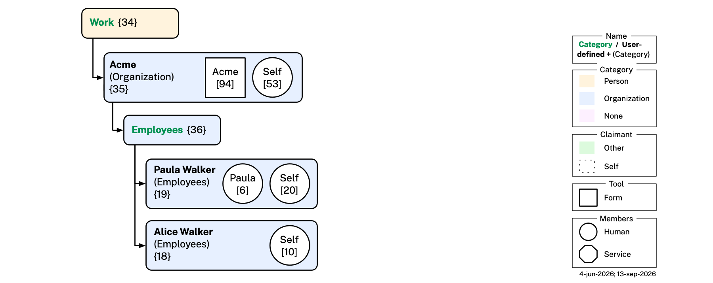</p>

Alice has relationships with two companies, Google and AT&T:
<p align="center">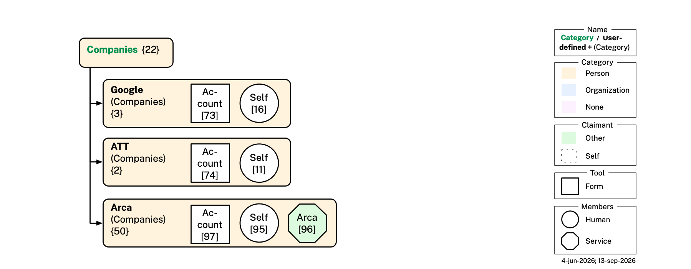</p>

Alice has a relationship with Citibank. In our example Citibank exists as a node on the PDN and directly claims information about their customer, Alice in topic #9.
<p align="center">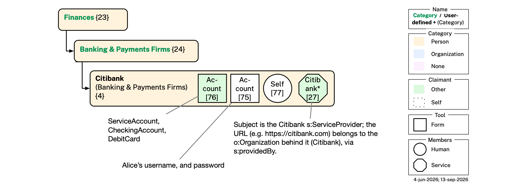</p>


Here are the cells related to Alice's interactions with various state governments:
<p align="center">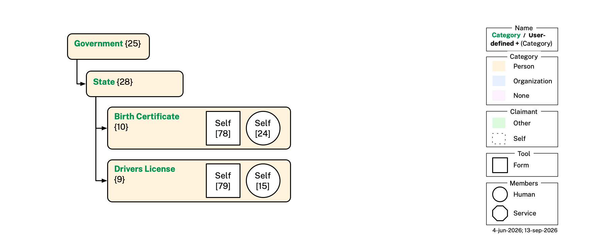</p>
Here are the cells related to Alice's interactions with the federal government:
<p align="center">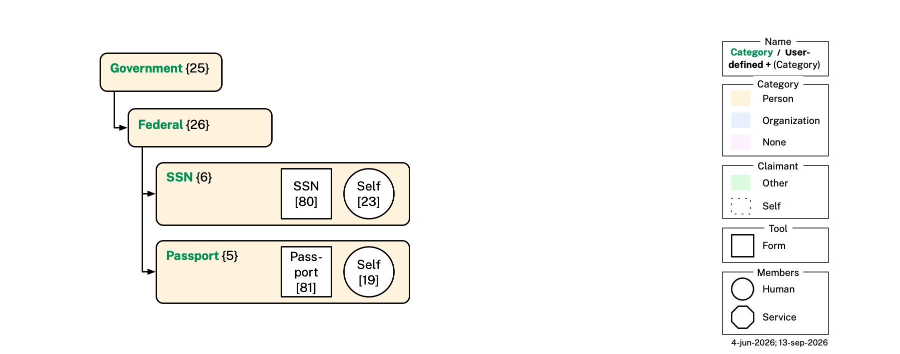</p>

Here are the cells related to Alice's interactions with two municipal governments:

<p align="center">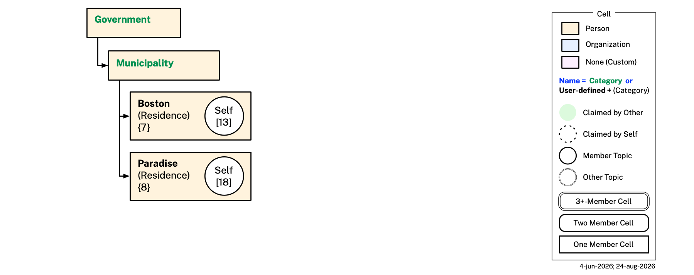</p>

Here are Alice's cells related to her personal health and her possessions:
<p align="center">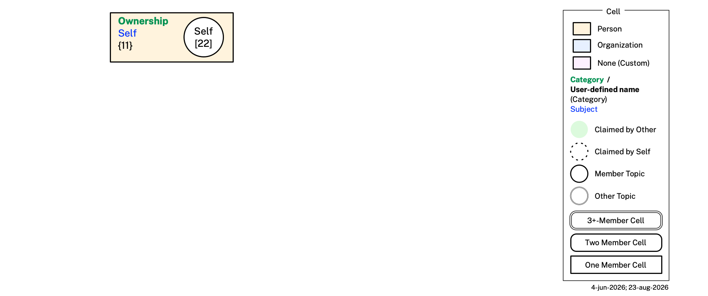</p>

The last diagram shows Alice's membership in the Boston Hub Society, an informal professional social network that exists as a `g:Group` node on the PDN:
<p align="center">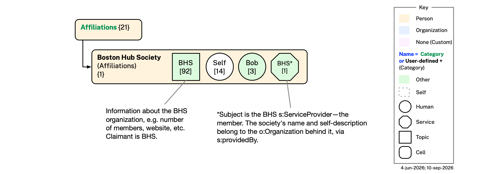</p>

The topics in the table below are *about* Alice and claimed *by* Alice. All `.databook.md` files are in the `example/topics/` folder.

| #  | DataBook file                                                                          | Topic type | Key data                                                         | Diagram |
|--- |:--------------------------------------------------------------------------------------|:-------------|:-----------------------------------------------------------------|:--------|
| 10 | [self.self(alice-walker)(acme)(10)](example/topics/self.self(alice-walker)(acme)(10).databook.md) | Employee     | Business card — given name, family name, email, phone, employer  | [view](example/topics/images/self.self(alice-walker)(acme)(10).png) |
| 11 | [self.self(att)(companies)(11)](example/topics/self.self(att)(companies)(11).databook.md)                     | Companies    | Phone number                                                     | [view](example/topics/images/self.self(att)(companies)(11).png) |
| 12 | [self.self(bob-johnson)(others)(12)](example/topics/self.self(bob-johnson)(others)(12).databook.md)                     | Others       | Alice's 1:1 topic with Bob; social network with Bob as member  | [view](example/topics/images/self.self(bob-johnson)(others)(12).png)|
| 13 | [self.self(boston)(municipality)(13)](example/topics/self.self(boston)(municipality)(13).databook.md)               | Municipality | Previous address — Boston, MA (2020–2025) with temporal interval | [view](example/topics/images/self.self(boston)(municipality)(13).png) |
| 14  | [self.self(boston-hub-society)(affiliations)(14)](example/topics/self.self(boston-hub-society)(affiliations)(14).databook.md)                     | Affiliations | BHS profile: email, phone and current address                    | [view](example/topics/images/self.self(boston-hub-society)(affiliations)(14).png)|
| 15 | [self.self(california-dmv)(state)(15)](example/topics/self.self(california-dmv)(state)(15).databook.md) | State      | California driver's license — legal name, DOB, DL#, expiry, photo | [view](example/topics/images/self.self(california-dmv)(state)(15).png) |
| 16 | [self.self(google)(companies)(16)](example/topics/self.self(google)(companies)(16).databook.md)               | Companies    | Gmail address                                                    | [view](example/topics/images/self.self(google)(companies)(16).png) |
| 17 | [self.self(health-wellness)(17)](example/topics/self.self(health-wellness)(17).databook.md)                 | Health & Wellness     | Physical body — height (68 in.), blue eyes, grey hair            | [view](example/topics/images/self.self(health-wellness)(17).png) |
| 18 | [self.self(paradise)(municipality)(18)](example/topics/self.self(paradise)(municipality)(18).databook.md)           | Municipality | Current address — Paradise, CA (2025–present)                    | [view](example/topics/images/self.self(paradise)(municipality)(18).png) |
| 19 | [self.self(passport)(federal)(19)](example/topics/self.self(passport)(federal)(19).databook.md)             | Federal    | US passport — legal name, DOB, passport#, issue/expiry, place of birth, gender marker, photo | [view](example/topics/images/self.self(passport)(federal)(19).png) |
| 20 | [self.self(paula-walker)(acme)(20)](example/topics/self.self(paula-walker)(acme)(20).databook.md)                   | Employee     | Acme employee topic; company email; works with Paula           | [view](example/topics/images/self.self(paula-walker)(acme)(20).png)|
| 21 | [self.self(paula-walker)(immediate-family)(21)](example/topics/self.self(paula-walker)(immediate-family)(21).databook.md)   | Immediate Family       | Alice as a family member                       | [view](example/topics/images/self.self(paula-walker)(immediate-family)(21).png) |
| 22 | [self.self(ownership)(22)](example/topics/self.self(ownership)(22).databook.md)     | Ownership  | Wallet (driver's license + payment card); health ins., SSN card  | [view](example/topics/images/self.self(ownership)(22).png) |
| 23 | [self.self(social-security-administration)(federal)(23)](example/topics/self.self(social-security-administration)(federal)(23).databook.md)                     | Federal      | Social security number (SSN)                                     | [view](example/topics/images/self.self(social-security-administration)(federal)(23).png) |
| 24 | [self.self(texas-vital-records)(state)(24)](example/topics/self.self(texas-vital-records)(state)(24).databook.md) | State        | Legal names, maiden name                                         | [view](example/topics/images/self.self(texas-vital-records)(state)(24).png) |

The following table lists topics that are *about* Alice but claimed by others.

| #  | DataBook file                                                                         | Topic type | Key data                             | Diagram |
|--- |:-------------------------------------------------------------------------------------|:-------------|:-------------------------------------|:--------|
| 8  | [self.bob-johnson(bob-johnson)(others)(08)](example/topics/self.bob-johnson(bob-johnson)(others)(08).databook.md)                         | Others            | Alice as seen by Bob                 | [view](example/topics/images/self.bob-johnson(bob-johnson)(others)(08).png)|
| 9 | [self.citibank(citibank)(banking-payments)(09)](example/topics/self.citibank(citibank)(banking-payments)(09).databook.md)     | Banking & Payments Firms | Debit card                           | [view](example/topics/images/self.citibank(citibank)(banking-payments)(09).png) |

The following table lists topics about other people (Paula and Bob) or groups (Boston Hub Society) in Alice's Mia. All files are in `example/topics/`.

| #  | DataBook file                                                                                     | Topic type | Key data                                                         | Diagram |
|--- |:-------------------------------------------------------------------------------------------------|:-------------|:-----------------------------------------------------------------|:--------|
| 1  | [bhs-group.members(boston-hub-society)(affiliations)(01)](example/topics/bhs-group.members(boston-hub-society)(affiliations)(01).databook.md)             | Affiliations | BHS group instance with Alice and Bob as members                | [view](example/topics/images/bhs-group.members(boston-hub-society)(affiliations)(01).png) |
| 2  | [bob-johnson.bob-johnson(bob-johnson)(others)(02)](example/topics/bob-johnson.bob-johnson(bob-johnson)(others)(02).databook.md)                     | Others       | Bob's self-claimed Bob persona                                 | [view](example/topics/images/bob-johnson.bob-johnson(bob-johnson)(others)(02).png)|
| 3  | [bob-johnson.bob-johnson(boston-hub-society)(affiliations)(03)](example/topics/bob-johnson.bob-johnson(boston-hub-society)(affiliations)(03).databook.md)                     | Affiliations | Bob's BHS member persona (name, email, phone, address)          | [view](example/topics/images/bob-johnson.bob-johnson(boston-hub-society)(affiliations)(03).png) |
| 4  | [bob-johnson.self(bob-johnson)(others)(04)](example/topics/bob-johnson.self(bob-johnson)(others)(04).databook.md)                 | Others       | Alice's notes about Bob; fav drink: oat milk cappuccino         | [view](example/topics/images/bob-johnson.self(bob-johnson)(others)(04).png) |
| 5  | [paula-walker.paula-walker(paula-walker)(immediate-family)(05)](example/topics/paula-walker.paula-walker(paula-walker)(immediate-family)(05).databook.md) | Immediate Family       | Paula's own family persona; social network with Alice       | [view](example/topics/images/paula-walker.paula-walker(paula-walker)(immediate-family)(05).png)|
| 6  | [paula-walker.self(paula-walker)(acme)(06)](example/topics/paula-walker.self(paula-walker)(acme)(06).databook.md)           | Employee     | Paula as Alice's Acme colleague (Alice-claimed)                | [view](example/topics/images/paula-walker.self(paula-walker)(acme)(06).png)|
| 7  | [paula-walker.self(paula-walker)(immediate-family)(07)](example/topics/paula-walker.self(paula-walker)(immediate-family)(07).databook.md) | Immediate Family       | Paula as Alice's family member (Alice-claimed)           | [view](example/topics/images/paula-walker.self(paula-walker)(immediate-family)(07).png)|
| 25 | [jane-kolpakova.self(jane-kolpakova)(25)](example/topics/jane-kolpakova.self(jane-kolpakova)(25).databook.md) | Primary Care Physician       | Alice's record of Dr. Jane Kolpakova, Paula Walker's primary care physician           | [view](example/topics/images/jane-kolpakova.self(jane-kolpakova)(25).png)|
| 26 | [paula-walker.self(alice-carol-about-mom)(health)(26)](example/topics/paula-walker.self(alice-carol-about-mom)(health)(26).databook.md) | Medical Appointment       | Alice and Carol's shared claims for Paula's medical appointment — medications, allergies, insurance, PCP reference           | [view](example/topics/images/paula-walker.self(alice-carol-about-mom)(health)(26).png)|
| 28 | [carol-walker.carol-walker(alice-carol-about-mom)(health)(28)](example/topics/carol-walker.carol-walker(alice-carol-about-mom)(health)(28).databook.md) | Medical Appointment       | Carol's own self-claimed persona and contact info — one of this cell's two parties, alongside Alice (topic 30)           | [view](example/topics/images/carol-walker.carol-walker(alice-carol-about-mom)(health)(28).png) |
| 30 | [self.self(alice-carol-about-mom)(health)(30)](example/topics/self.self(alice-carol-about-mom)(health)(30).databook.md) | Medical Appointment       | Alice's own self-claimed contact info — the other of this cell's two parties, alongside Carol (topic 28)           | [view](example/topics/images/self.self(alice-carol-about-mom)(health)(30).png) |
| 27 | [citibank.self(citibank)(banking-payments)(27)](example/topics/citibank.self(citibank)(banking-payments)(27).databook.md) | Banking & Payments Firms | Alice's own self-claimed notes about Citibank as an institution, alongside Citibank's own claimed record about her (topic 09) | [view](example/topics/images/citibank.self(citibank)(banking-payments)(27).png) |


### Named Graph Scoping and Topic-Specific Membership

A `BFO_0000115` (has member part) triple on a Social Network individual — for example, `:Alice_Family_Network BFO_0000115 :Paula_Walker` in topic 21 — targets `:Paula_Walker` as a person entity, not as a topic-specific slice of her data. The named graph architecture provides the isolation: that triple lives inside topic 21's named graph, and when an application needs "Paula Walker's family topic data" it queries topic 21's graph together with topic 5's graph, rather than the full merged dataset.

This is the correct design for three reasons:

- **BFO semantics**: changing the range of `BFO_0000115` to a DataBook document IRI (e.g. `<https://www.example.org/mia/topics/paula-walker.self(paula-walker)(immediate-family)(07)>`) would be a semantic error — the range of `has member part` must be a continuant (a person or group), not a document.
- **Model simplicity**: introducing topic-specific "view" individuals (e.g. `:Paula_Walker_Family`) would reintroduce the layered complexity that the removal of `p:Persona` was designed to eliminate.
- **Tooling maturity**: annotating the triple with RDF-star (`<< :Alice_Family_Network BFO_0000115 :Paula_Walker >> mia:inContext <...>`) is a valid future option, but is not yet supported by Protégé and remains non-standard.

The practical implication is that **Tier 1 validation** (which merges all graphs) correctly finds all reachability links across the full dataset, while **application queries** that display a social network's members should join against specific topic named graphs rather than the full triplestore merge.

## Diagrams

`draw.py` generates a Mermaid (`.mmd`) and PNG diagram from any topic DataBook file:

```bash
python3 draw.py example/topics/self.citibank(citibank)(banking-payments)(09).databook.md
python3 draw.py example/topics/self.self(paradise)(municipality)(18).databook.md
```

Both output files are written to the same `images/` directory as the existing PNG diagrams.

**Dependencies** (one-time setup):
```bash
pip install rdflib pyyaml
npm install -g @mermaid-js/mermaid-cli
```

Each diagram shows the `p:Person` individual (yellow), supporting named individuals (white boxes), class labels (plain text), blank-node designator chains, and literal values (green).

## Validation

Validation requires [Apache Jena](https://jena.apache.org/) (`riot`, `shacl`), the [DataBook CLI](https://github.com/kurtcagle/databook) (`databook`; install: `git clone https://github.com/kurtcagle/databook.git && cd databook && npm install && npm install -g .`) — the CLI's reference implementation moved here from `w3c-cg/holon`, which retired its two previously-vendored copies in favor of this single upstream source — and `pyyaml` for `yaml-to-rdf.py` (`pip install pyyaml`). SHACL shapes remain plain Turtle (`.ttl`).

### Quick check — DataBook syntax

Verify that every DataBook file has valid YAML frontmatter and well-formed block annotations:

```bash
for f in $(find example -name "*.databook.md" \
             -not -path "*/under-development/*" | sort); do
  databook head "$f" -q > /dev/null || echo "FAIL: $f"
done
```

A file that fails here will also fail silently in `databook extract`, producing no Turtle output and causing downstream `riot` or SHACL errors that are harder to trace.

### Tier 1 — general validation (all topic files)

`persona-shacl.ttl` applies to every `p:Person` individual across all topic files.

```bash
# Step 1 — extract turtle from every DataBook file (excluding under-development)
for f in $(find example -name "*.databook.md" \
             -not -path "*/under-development/*" | sort); do
  databook extract "$f" 2>/dev/null
done > /tmp/mia-data.ttl

# Step 1b — synthesize cat:/c:/topic: triples from category, cell, and
# topic DataBook YAML frontmatter (mia.* fields). databook extract only
# pulls fenced Turtle blocks, which category/cell DataBooks don't carry —
# without this step, cat:Node/c:Cell individuals and topic:SCTopicGraph's
# subject/claimant never reach the merged graph, and category-shacl.ttl,
# cell-shacl.ttl, and topic-shacl.ttl's :SCTopicGraphShape never fire against
# real instance data. See yaml-to-rdf.py.
python3 yaml-to-rdf.py . > /tmp/mia-yaml.ttl

# Step 2 — merge data with all ontology files, foundation ontologies, and self.ttl
# (cell-templates.ttl is deliberately excluded here, unlike Tier 2's base merge
# below: its 4 template individuals are generic, reusable content with no real
# person bound to them, so they can't sensibly carry cell-shacl.ttl's required
# c:subject/c:partyTopics — they're validated only via cell-templates-shacl.ttl, in Tier 2)
riot --output=turtle \
  project_files/bfo-core.ttl \
  project_files/PersonOntology.ttl \
  project_files/AddressOntology.ttl \
  project_files/StagingOntology.ttl \
  persona.ttl persona-templates.ttl topic.ttl cell.ttl category.ttl \
  group.ttl organization.ttl \
  example/topics/self.ttl \
  /tmp/mia-data.ttl \
  /tmp/mia-yaml.ttl \
  2>/dev/null > /tmp/mia-merged.ttl

# Step 3 — collect shapes (shacl/jscontactcard-shacl.ttl and cell-templates-shacl.ttl
# excluded — see Tier 2; both target document classes and would fire incorrectly on all
# individuals when applied to merged data. pdn-identity-shacl.ttl is also excluded: its
# ontology, pdn-identity.ttl, isn't part of the Step 2 merge — nothing here ever
# references an identity: term, see persona.ttl 4.0.6)
grep -v 'owl:imports' persona-shacl.ttl > /tmp/mia-shapes.ttl
grep -v 'owl:imports' topic-shacl.ttl >> /tmp/mia-shapes.ttl
grep -v 'owl:imports' category-shacl.ttl >> /tmp/mia-shapes.ttl
grep -v 'owl:imports' cell-shacl.ttl >> /tmp/mia-shapes.ttl
grep -v 'owl:imports' group-shacl.ttl >> /tmp/mia-shapes.ttl
grep -v 'owl:imports' organization-shacl.ttl >> /tmp/mia-shapes.ttl

# Step 4 — validate
shacl validate --shapes /tmp/mia-shapes.ttl --data /tmp/mia-merged.ttl --text
```

Expected output: `Conforms`

### Tier 2 — per-template validation (individual topic files)

Four of the five per-template shapes (BirthCertificate, DriversLicense, Passport, MedicalAppointment) live in `cell-templates-shacl.ttl`; JSContactCard's shape remains a standalone file in `shacl/` (it has no `cat:Category` class of its own — see [Persona Templates](#persona-templates)). Each is run against only the relevant topic file merged with the foundation ontologies.

```bash
# Shared base: foundation ontologies + application ontologies + self.ttl
riot --output=turtle \
  project_files/bfo-core.ttl \
  project_files/PersonOntology.ttl \
  project_files/AddressOntology.ttl \
  project_files/StagingOntology.ttl \
  persona.ttl persona-templates.ttl topic.ttl cell.ttl category.ttl cell-templates.ttl \
  group.ttl organization.ttl \
  example/topics/self.ttl \
  2>/dev/null > /tmp/mia-base.ttl

# BirthCertificate — self.self(texas-vital-records)(state)(24).databook.md
databook extract "example/topics/self.self(texas-vital-records)(state)(24).databook.md" 2>/dev/null > /tmp/data-birth-cert-raw.ttl
riot --output=turtle /tmp/mia-base.ttl /tmp/data-birth-cert-raw.ttl 2>/dev/null > /tmp/data-birth-cert.ttl
grep -v 'owl:imports' cell-templates-shacl.ttl > /tmp/shapes-cell-templates.ttl
shacl validate --shapes /tmp/shapes-cell-templates.ttl --data /tmp/data-birth-cert.ttl --text

# JSContactCard — self.self(alice-walker)(acme)(10).databook.md
databook extract "example/topics/self.self(alice-walker)(acme)(10).databook.md" 2>/dev/null > /tmp/data-jscontact-raw.ttl
riot --output=turtle /tmp/mia-base.ttl /tmp/data-jscontact-raw.ttl 2>/dev/null > /tmp/data-jscontact.ttl
grep -v 'owl:imports' shacl/jscontactcard-shacl.ttl > /tmp/shapes-jscontact.ttl
shacl validate --shapes /tmp/shapes-jscontact.ttl --data /tmp/data-jscontact.ttl --text

# DriversLicense — self.self(california-dmv)(state)(15).databook.md
databook extract "example/topics/self.self(california-dmv)(state)(15).databook.md" 2>/dev/null > /tmp/data-dl-raw.ttl
riot --output=turtle /tmp/mia-base.ttl /tmp/data-dl-raw.ttl 2>/dev/null > /tmp/data-dl.ttl
shacl validate --shapes /tmp/shapes-cell-templates.ttl --data /tmp/data-dl.ttl --text

# Passport — self.self(passport)(federal)(19).databook.md
databook extract "example/topics/self.self(passport)(federal)(19).databook.md" 2>/dev/null > /tmp/data-passport-raw.ttl
riot --output=turtle /tmp/mia-base.ttl /tmp/data-passport-raw.ttl 2>/dev/null > /tmp/data-passport.ttl
shacl validate --shapes /tmp/shapes-cell-templates.ttl --data /tmp/data-passport.ttl --text

# MedicalAppointment — paula-walker.self(alice-carol-about-mom)(health)(26).databook.md
databook extract "example/topics/paula-walker.self(alice-carol-about-mom)(health)(26).databook.md" 2>/dev/null > /tmp/data-medical-appt-raw.ttl
riot --output=turtle /tmp/mia-base.ttl /tmp/data-medical-appt-raw.ttl 2>/dev/null > /tmp/data-medical-appt.ttl
shacl validate --shapes /tmp/shapes-cell-templates.ttl --data /tmp/data-medical-appt.ttl --text
```

Expected output for each: `Conforms`
