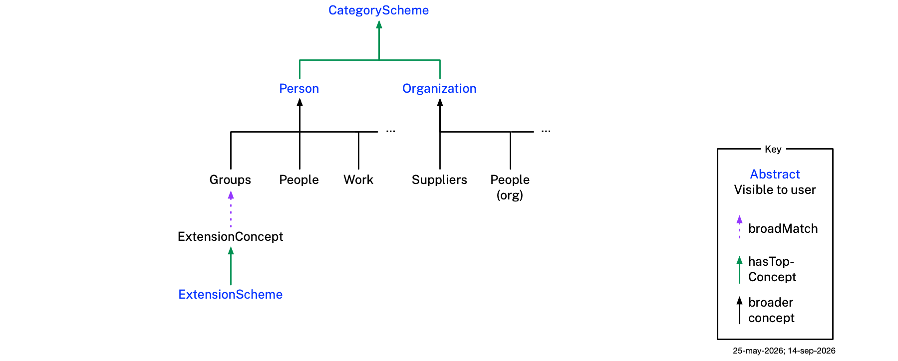
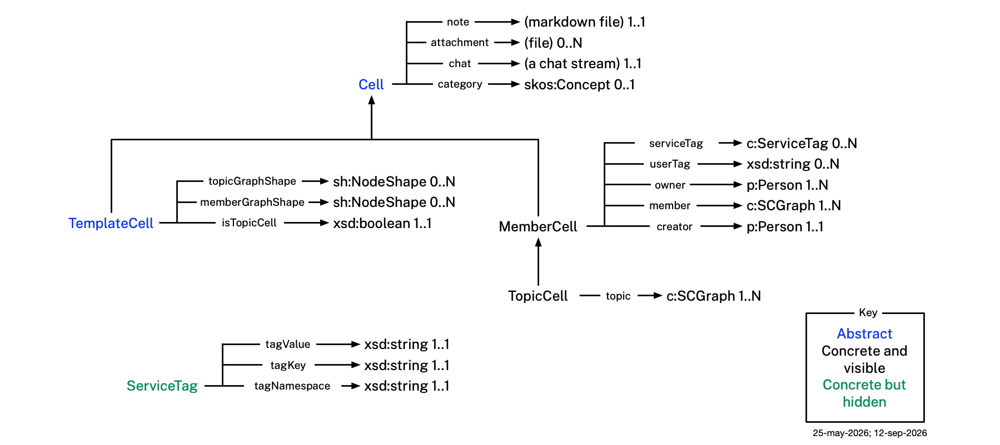
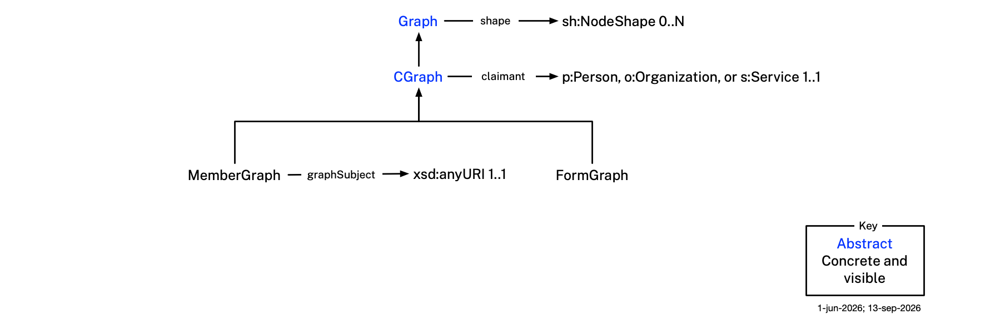
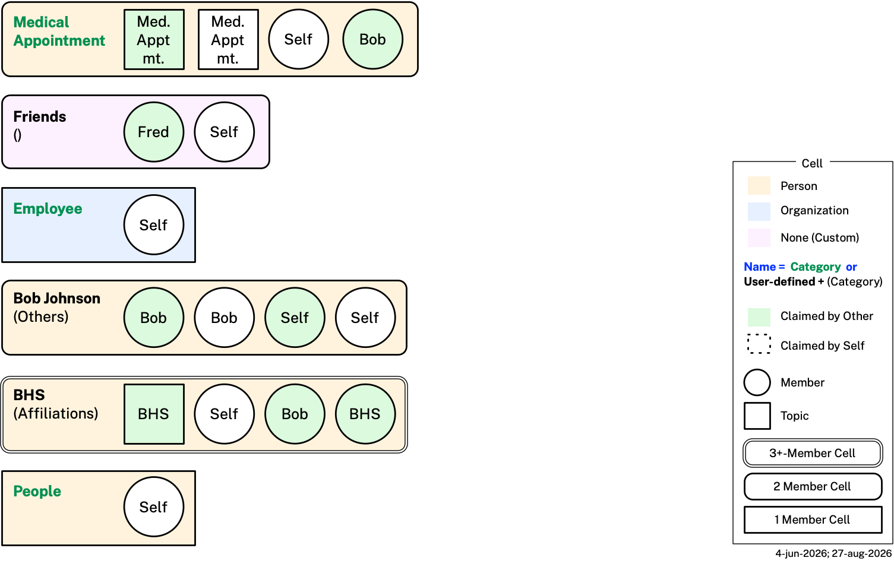
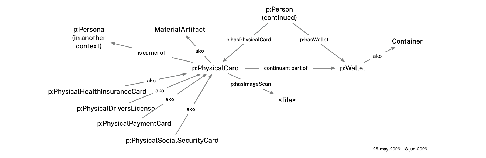
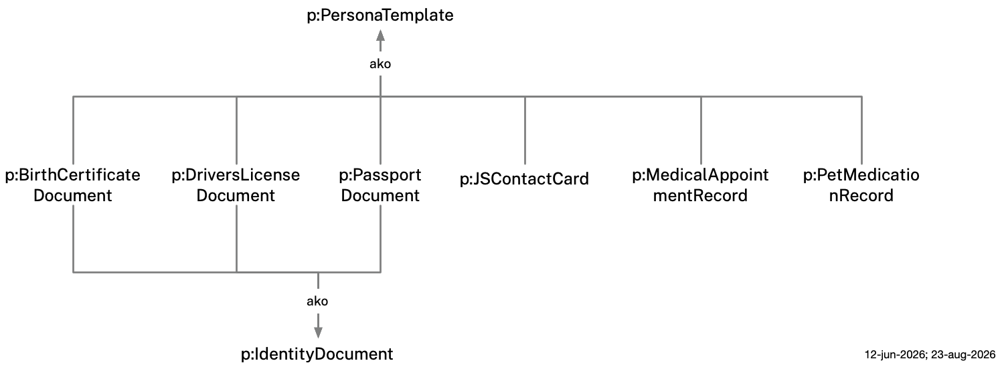

# Cellula Ontologies

This document describes the ontologies used by Cellula, a free, open-source application under development at The Mee Foundation. The app lets the user create *cells* — private, secure collaboration spaces which can be joined by other users and/or nodes on the Mee Personal Data Network (PDN) hosted by organizations.

The following **domain ontologies** model claims about people, organizations, and other subjects — these claims live in `c:SCGraph` instances. They import and profile existing ontologies — documenting which of their classes and properties the app requires or uses — and extend them with app-specific classes and properties.

- **Persona ontology** — models a person: names, addresses, phone numbers, relationships, payment cards, and more. It is built on BFO (Basic Formal Ontology) and CCO (Common Core Ontologies) as the upper ontological foundation, and on domain ontologies that extend CCO:
  - **PersonOntology** — person, name types, parent-child relationships
  - **AddressOntology** — postal address structure
  - **StagingOntology** — staging area for terms pending promotion (phone numbers, email addresses, user accounts, etc.)
  - **AgentOntology** — a *different, imported* ontology from the [Agent ontology](#agent-ontology) below: this is CCO's own agents-and-properties vocabulary, imported transitively via PersonOntology, not this project's `agent.ttl`/`a:Agent`
- **Organization ontology** — models organizations (companies, government agencies, nonprofits, etc.)
- **Agent ontology** (this project's own `agent.ttl`, not the imported CCO `AgentOntology` bullet above) — models AI agents (e.g. an LLM-based assistant such as ChatGPT) that a person or organization invites to collaborate inside a shared cell — a third kind of first-class, member-capable participant, peer to the Persona and Organization ontologies. See [Agent Ontology](#agent-ontology).
- **Other domain ontologies** (`other/`) — a growing family of small, independent peer ontologies for domains a person merely *has* (a pet, a vehicle) rather than *is*. The Persona ontology stays mostly about a person's own identity: `persona.ttl` holds only a thin `hasX` link property into each of these domains (e.g. `p:hasPet`, domain `p:Person`, range that domain's own class, referenced by name with no `owl:imports` in either direction), never the domain's own modeling. Each `other/*.ttl` file instead holds the actual "what is a pet / vehicle / etc." vocabulary — mostly vendored from real external ontologies rather than invented locally, the same way `persona.ttl` itself imports and profiles existing domain ontologies. This content can only ever reach a cell through its `c:topic` (never its `c:member`, which are always real relationship participants — see [Topic Cell](#topic-cell)):
  - **Pets ontology** (`other/pets.ttl`) — models what a pet *is*: name, species, breed, birth date, body weight, sex, spay/neuter status, and medications. See [Pets Ontology](#pets-ontology).
  - **Vehicles ontology** (`other/vehicles.ttl`) — models what a vehicle *is*: vehicle type, make, model, model year, VIN, color, body type, fuel type, drive wheel configuration, odometer reading, and engine specification. See [Vehicles Ontology](#vehicles-ontology).

Also included are the Category and Cell **metadata ontologies**. A *cell* is the atomic unit of information. A cell is implemented as a filesystem folder holding exactly one cell DataBook file and potentially other (non-cell) attachments, the parent folder and databook file together forming one atomic tree node. Cells nest inside cells, forming a tree. Cells have different types, called *Categories*, described in the category ontology. A cell contains various kinds of content including markdown notes, chat streams, and other file attachments. It also contains structured information blocks (called *graphs*, defined as part of the Cell ontology — see [Graphs](#graphs)) whose schemas differ based on the cell's category.

Throughout this document we use these short-hands:

- `cat:` for the `category:` namespace (`http://mee.foundation/ontologies/category#`)
- `c:` for the `cell:` namespace (`http://mee.foundation/ontologies/cell#`) — also used for the graph-DataBook terms (`c:Graph`, `c:SCGraph`, `c:template`, `c:subject`, `c:claimant`) that live in `cell.ttl`
- `p:` for the `persona:` namespace (`http://mee.foundation/ontologies/persona#`)
- `o:` for the `organization:` namespace (`http://mee.foundation/ontologies/organization#`)
- `a:` for the `agent:` namespace (`http://mee.foundation/ontologies/agent#`) — see [Agent Ontology](#agent-ontology)
- `pets:` for the `other/pets.ttl` namespace (`http://mee.foundation/ontologies/pets#`) — see [Pets Ontology](#pets-ontology)
- `v:` for the `other/vehicles.ttl` namespace (`http://mee.foundation/ontologies/vehicles#`) — see [Vehicles Ontology](#vehicles-ontology)

See [**EXAMPLE.md**](EXAMPLE.md) for an illustration of the use of these ontologies by a hypothetical user, Alice, along with diagram-generation and validation instructions for the example dataset, and [**APP-BEHAVIOR.md**](APP-BEHAVIOR.md) for how the app behaves on top of this data — cell naming/renaming/sharing, storage, permissions, and filing heuristics.

## Category Ontology

To help the user organize their information, the app comes with a pre-defined tree structure of categories. Although the user is free to organize their cells however they like, we think many users will choose to create their own tree of cells based on the pattern of the tree of category concepts. Cells that are created based on a pre-defined category have a `c:category` property whose value is that category.

These categories vary in scope from broad groupings of information to narrower ones. In the social domain, for example, a category might be about "People", or more narrowly about "Immediate Family", and ultimately about just one family member. All predefined categories are *symmetric*. For example, "Extended Family" is symmetric because if Alice is a member of Bob's extended family, the reverse is also always true.

The category tree is modeled as a `skos:ConceptScheme` (`cat:CategoryScheme`), not an OWL class hierarchy — each category is a plain `skos:Concept` individual, connected to its parent via `skos:broader`, rooted at two top concepts, `cat:Person` and `cat:Organization` (`skos:hasTopConcept`). This is a deliberate choice: an OWL class hierarchy would carry real subsumption semantics — `cat:Pets rdfs:subClassOf cat:Person` would mean "every Pet is a Person," which is never what's intended. `skos:broader` carries no such entailment: `cat:Pets skos:broader cat:Person` means only that Pets is a narrower *topic* within the Person-rooted branch of information a user tracks about themselves — a taxonomy of information *about* a person or organization, not a taxonomy of *kinds of* person. Some concepts in this scheme have "starter" content, found via `cell-templates.ttl`: each of its `c:TemplateCell` individuals carries its own `c:category` value naming the concept it's a template for — the *cell template* for that concept.

When a new cell is created, the app looks for a `c:TemplateCell` whose `c:category` matches the concept being instantiated and clones it, if one exists, into that cell's DataBook — this is how a **cell template** becomes the starter content for a newly-created cell (see [Lazy Instantiation](APP-BEHAVIOR.md#lazy-instantiation) in APP-BEHAVIOR.md).

As we've mentioned, the user is free to create cells not included in the predefined categories. These, by the way, need not be symmetric, and simply carry no `c:category` value. The user is also free to rearrange their cells as they wish, adding new cells and moving others around. They can do this using the app or entirely as a file system operation.

### Personal Categories

`cat:Person` categories organize a person's mostly non-employment-related information:

1. **People** (`cat:People`) — people in your social or professional life. Use this category for people not otherwise tied to a specific domain — a bookkeeper you know belongs under Finances (Advisory Firms), and your primary care physician belongs under Health & Wellness (Medical > Provider > Primary Care Physician), rather than here.
    - **Immediate Family** (`cat:ImmediateFamily`) — your closest living relatives, which generally include parents, siblings, spouses/partners, and children.
    - **Extended Family** (`cat:ExtendedFamily`) — relatives outside the immediate nuclear group, such as grandparents, aunts, uncles, cousins, nieces and nephews.
    - **In-Laws / Step-Family** (`cat:InLawsStepFamily`) — relatives gained through marriage or legal guardianship, including a spouse's parents and siblings, or children from a previous relationship.
    - **Others** (`cat:Others`) — people you know socially or professionally who are not part of your family — acquaintances, friends, neighbors, or other connections.
1. **Affiliations** (`cat:Affiliations`) — a catch-all for clubs, charities, faith groups, and other group affiliations that are not covered by a more specific category (e.g. `cat:SportsEntertainment`, `cat:Food`, etc.) 
1. **Health & Wellness** (`cat:HealthWellness`) — personal health and wellness information. Medical history, allergies, medications, vaccinations, prescriptions, eyeglasses, ethnicity, gender, age.
    - **Medical** (`cat:Medical`) — medical (as opposed to dental or vision) care — diagnoses, treatments, providers, and insurance.
        - **History** (`cat:MedicalHistory`) — past diagnoses, conditions, surgeries, and treatments.
        - **Insurance** (`cat:MedicalInsurance`) — medical health insurance policies, providers, and coverage.
        - **Provider** (`cat:MedicalProvider`) — medical providers and practices you see for care.
            - **Primary Care Physician** (`cat:PrimaryCarePhysician`) — your primary care doctor, the physician you generally see first for checkups, referrals, and everyday health concerns, including name, contact information, and the name of the provider they are associated with.
            - **Medical Appointment** (`cat:MedicalAppointment`) — a medical appointment and associated information required by the provider to arrange this appointment.
    - **Dental** (`cat:Dental`) — dental care — diagnoses, treatments, providers, and insurance.
        - **History** (`cat:DentalHistory`) — past dental treatments, procedures, and conditions.
        - **Insurance** (`cat:DentalInsurance`) — dental insurance policies, providers, and coverage.
        - **Provider** (`cat:DentalProvider`) — dental providers and practices you see for care.
            - **Dentist** (`cat:Dentist`) — a dentist you see for care, including name, contact information, and the name of the provider they are associated with.
            - **Dental Appointment** (`cat:DentalAppointment`) — a dental appointment and associated information required by the provider to arrange this appointment.
    - **Vision** (`cat:Vision`) — vision and eye care — diagnoses, treatments, providers, and insurance.
        - **History** (`cat:VisionHistory`) — past eye-care prescriptions, treatments, and conditions.
        - **Insurance** (`cat:VisionInsurance`) — vision insurance policies, providers, and coverage.
        - **Provider** (`cat:VisionProvider`) — vision care providers and practices you see for care.
            - **Eye Doctor** (`cat:EyeDoctor`) — an eye doctor you see for care, including name, contact information, and the name of the provider they are associated with.
            - **Vision Appointment** (`cat:VisionAppointment`) — a vision appointment and associated information required by the provider to arrange this appointment.
    - **Fitness** (`cat:Fitness`) — general fitness and preventive physical health — exercise, gyms, trainers, and other non-clinical wellbeing information.
        - **Provider** (`cat:FitnessProvider`) — fitness providers and practices you see for care, e.g. gyms, trainers, and coaches.
            - **Personal Trainer** (`cat:PersonalTrainer`) — a personal trainer you see for care, including name, contact information, and the name of the provider they are associated with.
    - **Nutrition** (`cat:Nutrition`) — nutritionists and dietitians.
        - **History** (`cat:NutritionHistory`) — past nutritional consultations, diet plans, and dietary conditions.
        - **Provider** (`cat:NutritionProvider`) — nutritionists and dietitians you see for care.
    - **Mental Health** (`cat:MentalHealth`) — mental and behavioral health care.
        - **History** (`cat:MentalHealthHistory`) — past diagnoses, treatments, and mental health conditions.
        - **Insurance** (`cat:MentalHealthInsurance`) — mental health insurance policies, providers, and coverage.
        - **Provider** (`cat:MentalHealthProvider`) — mental health providers and practices you see for care, e.g. therapists, counselors, and psychiatrists.
            - **Therapist** (`cat:Therapist`) — a therapist you see for care, including name, contact information, and the name of the provider they are associated with.
    - **Physical Therapy** (`cat:PhysicalTherapy`) — physical therapy and rehabilitative care.
        - **History** (`cat:PhysicalTherapyHistory`) — past physical therapy treatments, injuries, and rehabilitation plans.
        - **Provider** (`cat:PhysicalTherapyProvider`) — physical therapy providers and practices you see for care.
1. **Personality** (`cat:Personality`) — self-assessments of personality, temperament, or social style — e.g. Myers-Briggs (MBTI) type, Big Five, DISC, Enneagram, or similar self-assessment instruments.
1. **Finances** (`cat:Finances`) — information about personal finances, bookkeeping, budgets, payment cards, bank accounts, brokerage accounts, insurance policies, financial advisors, etc.
    - **Bookkeeping** (`cat:Bookkeeping`) — budgeting, expense tracking, income, debts, IOUs, and savings goals.
    - **Banking & Payments Firms** (`cat:BankingPayments`) — firms that help you store, access, and move your cash for daily living. These include Retail Banks & Credit Unions, which provide checking accounts, savings accounts, and debit cards. These also include Payment Processors like Visa, Mastercard, or PayPal that let you buy things online and in stores, and Remittance Firms like Western Union or Wise used to send money to family or friends, especially overseas.
    - **Investment Firms** (`cat:Investing`) — firms that help you buy assets, so your money can grow over time for goals like buying a house or retiring. These include Brokerage Firms like Charles Schwab or Robinhood where you buy and sell stocks, bonds, and ETFs; Robo-Advisors, computer-run investing platforms like Betterment or Wealthfront that manage your portfolio for a low fee; and Mutual Fund companies like Vanguard or Fidelity that pool your money with other investors to buy a large bundle of stocks.
    - **Lending & Credit Firms** (`cat:LendingCredit`) — firms that lend you money when you need to buy something expensive that you cannot pay for all at once. These include Mortgage Lenders, banks or specialized companies that give you loans specifically to buy a home; Consumer Finance Companies, that give out personal loans, auto loans, or student loans; and Credit Card Issuers, banks that give you a plastic card to borrow money on the spot for daily purchases.
    - **Insurance Firms** (`cat:Insurance`) — firms that protect you and your family from financial ruin if something bad happens. These include Life & Health Insurance firms that cover medical bills or provide money to your family if you pass away, and Property & Casualty Insurance firms that insure your car, home, or apartment against accidents and theft.
    - **Advisory Firms** (`cat:Advisory`) — firms and individuals who do not just hold your money, but tell you the best ways to use it. These include Financial Planners (Wealth Advisors), human experts who help you build a custom roadmap for taxes, retirement, and budgeting, and Estate Planners, specialized professionals who help you write wills and plan how to pass your money to your children. Also includes Accountants and Bookkeepers, who track your income and expenses and prepare your taxes.
1. **Pets** (`cat:Pets`) — care instructions, veterinarians, medicines, food providers.
    - **Medical** (`cat:PetsMedical`) — a pet's medical care — veterinarians, prescriptions, medications and dosing instructions, devices, diagnoses, and treatments.
        - **Veterinarians** (`cat:PetsVeterinarians`) — veterinary practices and providers a pet sees for care.
        - **Devices** (`cat:PetsDevices`) — medical devices and supplies used in a pet's care, e.g. syringes, nebulizers, and injection solutions.
    - **Care & Feeding** (`cat:PetsCareAndFeeding`) — day-to-day instructions for someone else to take care of a pet — a pet's diet, food providers, feeding instructions and schedule, dietary restrictions, where they sleep, and other routine care.
1. **Home** (`cat:Home`) — owning or renting a home, apartment, or other dwelling. Leases, deeds, utility accounts, real estate brokers.
    - **Previous** (`cat:Previous`) — a previous home or residence, no longer current.
1. **Work** (`cat:Work`) — professional roles. Employment history, resume/CV, job level, job function, industry.
1. **Things** (`cat:Things`) — owned assets, property, vehicles, and other possessions.
    - **Vehicles** (`cat:Vehicles`) — related to owning and maintaining a vehicle. Vehicle insurance, repairs, mechanics, garages. 
1. **Travel** (`cat:Travel`) — travel plans, trips, and related information. Loyalty programs, airlines, bus lines, trains.
    - **Trips** (`cat:Trips`) — an individual trip being planned or taken — its own itinerary, dates, and destination-specific details, as distinct from `cat:Travel`'s broader loyalty-program/airline/general travel information.
1. **Food** (`cat:Food`) — food preferences, dietary restrictions, favorite restaurants, recipes, shopping lists, and other food-related interests
1. **Sports & Entertainment** (`cat:SportsEntertainment`) — sports events (watching or participating) and entertainment (movies, plays, jazz clubs). Favorite teams/groups, venues, streaming services, ticketing. See `cat:Information` for other interests.
1. **Education** (`cat:Education`) — educational history and ongoing learning — schools, degrees, certifications, transcripts, and enrolled courses.
1. **Legal** (`cat:Legal`) — legal matters, contracts, agreements, trusts, wills, and professional legal relationships. Includes durable power of attorney and healthcare proxy agreements.
1. **Projects** (`cat:Projects`) — involvement in a specific project or initiative.
1. **Events** (`cat:Events`) — participation in or relationship to a specific event or gathering.
1. **Information** (`cat:Information`) — information about anything; articles, web links, documents, images. Includes graphs that interest and inspire you (e.g. drawing, painting, dancing, religion, gaming, music). See `cat:SportsEntertainment` for sports and entertainment, and `cat:Affiliations` for formal memberships tied to a hobby or interest.
1. **Government** (`cat:Government`) — government-issued credentials, tax records, and civic relationships.
    - **Federal** (`cat:Federal`) — federal government graph (e.g. passport, federal tax records).
        - **SSN** (`cat:SSN`) — social security number issued by the federal Social Security Administration.
        - **Passport** (`cat:Passport`) — passport issued by the Department of State.
    - **State** (`cat:State`) — state government graph (e.g. driver's license, state tax records).
        - **Birth Certificate** (`cat:BirthCertificate`) — a birth certificate issued by a state agency that issues and holds these records.
        - **Drivers License** (`cat:DriversLicense`) — a driver's license issued by a state agency that issues and holds these records.
1. **Companies** (`cat:Companies`) — a catch-all for your relationships with companies and organizations that provide services and/or products to you that are not included in more specific categories such as `cat:Finances`, `cat:HealthWellness`, `cat:Home`, `cat:Food`, etc.

### Organizational Categories

`cat:Organization` categories organize a person's professional and organizational-role information:

1. **Customers** (`cat:Customers`) — customer organizations. Rename to "Clients", etc.
1. **Marketing** (`cat:Marketing`) — marketing activities, campaigns, and related organizations.
    - **Prospects** (`cat:Prospects`) — customer prospects. Rename to "Client prospects", etc.
1. **Partners** (`cat:Partners`) — firms that provide goods and services.
1. **People (org)** (`cat:People(org)`) — people the organization interacts with in a working capacity.
    - **Employees** (`cat:Employees`) — related to employees.
        - **Employee** (`cat:Employee`) — detailed information about a specific employee.
    - **Consultants** (`cat:Consultants`) — engaged consultants.
    - **Others (org)** (`cat:Others(org)`) — people associated with the organization who don't fit Employees, Consultants, or Colleagues.
    - **Colleagues** (`cat:Colleagues`) — coworkers and peers within the organization not tracked as formal Employee records.
    - **Advisors** (`cat:Advisors`) — individuals who advise the organization in a non-employee capacity.
    - **Board of Directors** (`cat:BoardOfDirectors`) — the organization's board members.
    - **Direct Reports** (`cat:DirectReports`) — employees who report directly to a specific manager or role within the organization.
    - **Manager(s)** (`cat:Managers`) — the manager or managers a specific employee or role reports to within the organization.
1. **KB** (`cat:KB`) — corporate knowledge bases.
1. **Projects (org)** (`cat:Projects(org)`) — projects related to R&D, manufacturing, sales, marketing, operations, HR, etc.
1. **Meetings** (`cat:Meetings`) — face-to-face or online meetings, whether internal or with clients/customers. See also Events (org) for external, travel-to or larger-scale gatherings.
1. **Events (org)** (`cat:Events(org)`) — external events that people travel to, or larger-scale gatherings — conferences, webinars, town halls, and similar events. See also Meetings for ordinary internal or client/customer meetings.
    - **Conferences** (`cat:Conferences`) — a conference or professional gathering.
1. **Suppliers** (`cat:Suppliers`) — companies that supply goods or services to this organization.
1. **Legal (org)** (`cat:Legal(org)`) — contracts and agreements.
1. **Government (org)** (`cat:Government(org)`) — interactions with government organizations.
1. **Finances (org)** (`cat:Finances(org)`) — corporate finance-related matters.
    - **Banking & Payments (org)** (`cat:BankingPayments(org)`) — firms that help organizations store, access, and move their cash. These include Retail Banks & Credit Unions, which provide checking accounts, savings accounts, and debit cards. These also include Payment Processors like Visa, Mastercard, or PayPal.
    - **Investing (org)** (`cat:Investing(org)`) — These include Investment firms, Private Equity firms, Venture Capitalists, Brokerage Firms like Charles Schwab and Mutual Fund companies like Vanguard or Fidelity.
    - **Lending & Credit (org)** (`cat:LendingCredit(org)`) — banks or specialized companies that give loans for specific purposes and Credit Card Issuers that give employees a card for travel and related expenses.
    - **Insurance (org)** (`cat:Insurance(org)`) — firms that protect organizations from risks. 
    - **Advisory (org)** (`cat:Advisory(org)`) — Financial Planners, outsourced CFO consultants, Accountants and Bookkeepers and Tax preparers.

### Category Ontology File

**`category.ttl`** — The Category ontology, defining a `skos:ConceptScheme` rather than an OWL class hierarchy:
  - *Individuals*: `cat:CategoryScheme` (a `skos:ConceptScheme`), `cat:Person`/`cat:Organization` (its two `skos:hasTopConcept` top concepts), and every other category concept — each a plain `skos:Concept`, with a `skos:prefLabel` for its display name, a `skos:broader` value naming its parent concept, and `skos:inScheme cat:CategoryScheme`. There is no `cat:Category` class at all — a category concept's type is just `skos:Concept`, scoped to the app's own scheme via `skos:inScheme` rather than a dedicated class.
  - No `cat:` property of its own — each `cell-templates.ttl` template cell instead carries its own `c:category` value naming the concept it's a template for (see [Cell Ontology File](#cell-ontology-file) below).

## Cell Ontology

### Introduction to Cells

A cell is a secure **container of information** that can remain private to the user or be shared with other users and/or organizations. A **regular cell** holds various kinds of information, organized into a set of tabs:

* **Members** tab:
  * Structured information (fields and values) about the member(s) of the cell. If the cell hasn't been shared, it has only one member.
* **Note** tab:
  * A Markdown document about the cell. It may contain links to other cells. 
* **Attachments** tab (📎):
  * An optional set of file attachments. Analogous to email attachments.
* **Chat** tab:
  * A chat stream shared with all members.

A **topic cell** adds a **Topic** tab:
  * Structured information about a single topic that is the focus of the cell. This topic could be a person who is not a member of the cell, or information about a project that the members of the cell are working on (e.g. organizing a medical appointment for someone who is not a member of the cell).

The app contains two pre-defined, non-user-editable taxonomies of **categories**. One is focused on helping organize the information in a person's personal life (Family, Home, Pets, etc.), and the other on their work life (Employer, Employees, etc.). For some of these categories, the app includes a *template cell* which may contain some starter content (or may be empty) and/or may have a schema for the structured fields and values that a cell of this category might contain.  

A cell has a **name**. Often this name is just a copy of the name of the category. For example, if the category was "People", the cell might be called "People". However, the user can give the cell a name of their own choosing. 

A cell usually has a **category**. A category is a string, which identifies which kind of personal information (e.g. "People", "Pets", "Things") the cell holds. For some categories we have a pre-defined template cell that may provide some starter content. 

A cell has a **creator**, which is the identity of the user who created it. This creator is automatically considered to be a cell **owner**. Any owner can invite/promote other members to be/become owners. A cell owner has an elevated set of permissions for managing cell contents.

A cell can be **shared**. The creator of a cell can invite people (or organizations compatible with the Mee PDN protocols, or agents) to join the cell. When they do, they gain access to the cell. Cells are alive; any changes made to its contents by any member are visible to all members. Cells are self-contained and may be nested inside of other cells by any app user. The organization of these multi-cellular structures is personal to the app user and not shared. The structures will be similar between users to the extent that they are leveraging the app's built-in tree of categories.

Cells can be **linked**. Cells have globally unique identifiers. This allows the note of a "source" cell to include a link to a "target" cell. The user can follow a link in a (source) cell, if they also have access to the target cell.

### Diving Deeper

The Cell class splits into two disjoint kinds: `c:TemplateCell`, a reusable, class-level *template* cell, and `c:MemberCell`, an *actual* cell instantiated in a user's own tree. `c:MemberCell` further specializes into `c:TopicCell` for a member cell that actually carries a `c:topic` value.

A cell is an atomic unit of information that the app manages for the user. This unit consists of a filesystem folder holding exactly one cell DataBook file, folder and file together forming one node — cells nest inside cells, forming the tree.

`c:Cell` (below) still models only the content *facet* carried by the cell DataBook file's own triples, and stores no property recording the cell's own tree position: the folder<->cell-databook pairing is always one-to-one (see [Filesystem Persistence](APP-BEHAVIOR.md#filesystem-persistence) in APP-BEHAVIOR.md), so a cell's position in the tree is simply wherever its folder currently sits — moving or renaming that folder is a pure filesystem operation that never requires updating anything asserted on the cell itself.

A cell's own Markdown folder note is displayed in the **Note tab** (not the Attachments tab); clicking a link in it to a note that doesn't exist yet creates a new, category-less cell for it — see [Wikilink-Triggered Cell Creation](APP-BEHAVIOR.md#wikilink-triggered-cell-creation) in APP-BEHAVIOR.md. See [Documentation-only Properties](#documentation-only-properties) below for what counts as a cell's attachments, shown in the app's **Attachments tab**.

#### Cell Properties

- **`c:category`** — The category concept this cell was originally instantiated as, else nil — a genuine `skos:Concept` individual in `cat:CategoryScheme` (category.ttl), not a class. For one of the templated concepts (e.g. `cat:Passport`, `cat:BirthCertificate`, `cat:DriversLicense`, `cat:MedicalAppointment`, `cat:Vehicles`, `cat:Pets`, `cat:PetsMedical`, `cat:People`, `cat:ImmediateFamily`, `cat:ExtendedFamily`, `cat:InLawsStepFamily`, `cat:Others`), this is literally the concept whose `c:TemplateCell` template was cloned into this cell via [Lazy Instantiation](APP-BEHAVIOR.md#lazy-instantiation) (APP-BEHAVIOR.md); for any other cell, it's simply the category the cell was created to represent, asserted directly with no template involved. Either way the value is fixed at that point — it is not re-derived from the folder's current name, so it needs no update if the folder is later renamed or moved elsewhere in the tree. When a cell is shared with another member, the recipient's app can look at this value (if not nil) and use it as a hint as to which folder in the recipient's own tree it should be filed under. Domain `c:Cell`, range `skos:Concept` (referenced by name, no `owl:imports`), at most one value (0..1) — see [Cell Ontology File](#cell-ontology-file) below.

#### Documentation-only Properties

Three more concepts appear off `Cell` in `images/cell-ontology/cell.png`'s diagram, described here for their intended semantics, but documentation only — none is an actual property declared in `cell.ttl`, and none is ever reified as a triple in any real graph (see `CLAUDE.md`'s Check 12 for this open, accepted discrepancy):

- **`c:note`** — a cell's single Markdown folder note, shown in the app's **Note tab**, 1..1. See [Introduction to Cells](#introduction-to-cells) above for the folder-note convention (linking, sharing, PKM-vault compatibility) and [Wikilink-Triggered Cell Creation](APP-BEHAVIOR.md#wikilink-triggered-cell-creation) in APP-BEHAVIOR.md.

- **`c:attachment`** — a cell's flat set of file attachments, shown in the app's **Attachments tab** (📎), 0..N. Attachments are the plain files found directly inside a cell's own folder, excluding (1) any subfolder — always either a **descendant cell** (a nested folder that is itself a cell, holding its own cell DataBook: a separate node in the tree of cells, never counted as part of its ancestor's content even though it physically sits inside the ancestor's folder) or a bare pass-through directory with no DataBook of its own (a folder without a matching cell DataBook is simply a regular file system folder, not a cell — even if it contains nested cells of its own — existing only to reach a descendant cell nested deeper still; see CLAUDE.md's Check 11) — and (2) the cell's own Markdown folder note — exactly one per cell; it is displayed in the **Note tab** for that cell (not the Attachments tab). Attachments are flat, like email attachments: no subfolder is ever counted as one, on disk or in the model.

- **`c:chat`** — a cell's single chat stream, 1..1. Every cell always has one, even if empty.

### TemplateCell

A `c:TemplateCell` individual, identified by its own `c:category` value naming a category concept, serves as a **cell template** — a reusable, typically empty shape that the application clones into a new cell whenever that concept is first instantiated into a user's tree (see [Lazy Instantiation](APP-BEHAVIOR.md#lazy-instantiation) in APP-BEHAVIOR.md); finding the template for a given concept is a reverse lookup (which `c:TemplateCell` carries this `c:category` value?), since `category.ttl` carries no forward pointer of its own. Such a cell is typed `c:TemplateCell` only. An ordinary, already-instantiated cell is typed `c:MemberCell` instead, carrying real member composition, creator, and content. `c:TemplateCell` and `c:MemberCell` are disjoint: a template cell is never also typed `c:MemberCell` or `c:TopicCell` — see [Cell Ontology File](#cell-ontology-file) below.

#### Properties

Every real `c:TemplateCell` carries a `c:category` value naming the concept it's a template for (see [Cell Properties](#cell-properties) above — the same property is asserted on both kinds of cell). If it also has a `c:memberGraphShape`/`c:topicGraphShape` value, then when a `c:MemberCell` is later created for that same category (see [Lazy Instantiation](APP-BEHAVIOR.md#lazy-instantiation) in APP-BEHAVIOR.md), the app derives each new `c:member`/`c:topic` graph's own `c:template` value from whichever of the two properties matches the list it belongs to, by this same reverse lookup rather than copying anything — there is no `c:shape` property on `c:MemberCell` (see [MemberCell](#membercell) below). If the template's `c:isTopicCell` value is `true`, the new cell is also typed `c:TopicCell` from the start.

- **`c:memberGraphShape`** — links a `c:TemplateCell` individual to the `sh:NodeShape`(s) describing the content expected of a `c:member` graph filed under its category, and sets that graph's own `c:template` value — e.g. `ctpl:PassportTemplateCell` (which also carries `c:category cat:Passport`) carries `pshapes:PassportDocumentShape`. An `owl:ObjectProperty`, domain `c:TemplateCell`, range `sh:NodeShape`, zero or more values, no fixed upper bound.

- **`c:topicGraphShape`** — the same, but for a `c:topic` graph instead of a `c:member` graph — e.g. `ctpl:MedicalAppointmentTemplateCell` (which also carries `c:category cat:MedicalAppointment`) carries `pshapes:MedicalAppointmentRecordShape`. An `owl:ObjectProperty`, domain `c:TemplateCell`, range `sh:NodeShape`, zero or more values, no fixed upper bound.

- **`c:isTopicCell`** — a boolean flag telling Lazy Instantiation whether the cell it clones from this template is expected to end up typed `c:TopicCell` — i.e. to carry a `c:topic` value once real content is filed under it — as opposed to staying a bare concrete member-count cell with no `c:topic`. An `owl:DatatypeProperty`, domain `c:TemplateCell`, range `xsd:boolean`, required, exactly one value — every template cell must declare it explicitly: `true` on 12 of the 103 templates, every one of them a real document or account rather than a purely organizational node — `ctpl:PassportTemplateCell`/`SSNTemplateCell`/`BirthCertificateTemplateCell`/`DriversLicenseTemplateCell` (Alice's own government documents), `ctpl:MedicalAppointmentTemplateCell` (Paula), `ctpl:PetMedicationsTemplateCell`/`ctpl:PetProfileTemplateCell` (Ginger), `ctpl:VehicleProfileTemplateCell` (the RAV4), `ctpl:CompaniesTemplateCell`/`ctpl:BankingPaymentsTemplateCell` (a company's own service account, plus a bank's debit card/checking account), `ctpl:HomeTemplateCell` (a residence, current or previous), and `ctpl:TripsTemplateCell` (a trip itinerary) — `false` on the other 91: `ctpl:PeopleTemplateCell` and its four direct `skos:broader` children, every other templated category (each a purely organizational category with no document/account of its own — see Check 29 in CLAUDE.md, which requires every `category.ttl` concept except `cat:Person`/`cat:Organization` to have a template), plus `ctpl:UserDefinedTemplateCell` (the no-category fallback, likewise with nothing beyond a business-card member).

### MemberCell

A `c:MemberCell` is a cell instantiated in a user's own tree — one of the two disjoint kinds of an abstract `c:Cell`, the other being `c:TemplateCell`. It carries `c:creator`, `c:owner`, and `c:member`. Every cell in a user's own tree is typed `c:MemberCell`, never `c:TemplateCell` — there is no bare tree-position-only cell with no member content; a purely organizational cell with nothing substantive to say still carries a minimal stub `c:member` entry (claimed by and about `:Self`, who is then also that cell's sole `c:owner`) rather than omitting member content altogether.

Reusable class-level templates (`cell-templates.ttl`) are the exception: each is typed solely `c:TemplateCell`, never `c:MemberCell` or its `c:TopicCell` mixin — `c:TemplateCell` and `c:MemberCell` are disjoint, so a template cell carries no member composition of its own.

#### Properties

- **`c:member`** — one or more values, required, no fixed upper bound. It's a list of `c:SCGraph`s (see [Graphs](#graphs) below for details). For an N-member `c:MemberCell`, there are N subjects (one per member) and between N and N² `c:SCGraph`s. The floor of N `c:SCGraph`s obtains if each member self-asserts information about themselves but makes no claims about any other member. The ceiling of N² obtains when every member makes claims about every other member. In practice, we expect the number to be on average only slightly above N.

- **`c:creator`** — required, exactly one value. Identifies who created this cell's content: a single `p:Person` or `o:Organization`.

- **`c:owner`** — one or more values, required, no fixed upper bound. Identifies which of the cell's members hold the owner role, as opposed to the regular (non-owner) member role every other member defaults to. Always includes `c:creator`'s own value — the creator is always the cell's initial (and, until any promotion, sole) owner — and any current owner may promote any other current regular member (a `p:Person` or `o:Organization`, never an `a:Agent` — the same narrower union `c:creator`'s own range uses) to owner; there is no demotion mechanism. An owner has full read/write access to the cell's note and may delete any member's claim or attachment, not only their own; see [Permissions](APP-BEHAVIOR.md#permissions) in APP-BEHAVIOR.md for the full app-level rule.

 Note: A `c:MemberCell`'s applicable validation shape is derived: reverse-lookup the `c:TemplateCell` sharing this cell's own `c:category` value and read whichever of its `c:memberGraphShape` (for one of this cell's own `c:member` graphs) or `c:topicGraphShape` (for one of its `c:topic` graphs) values applies, depending on which list the graph in question belongs to.

### Topic Cell

A `c:TopicCell` is a subclass of `c:MemberCell` that adds the concept of a *topic* for the cell. This topic is carried by the `c:topic` property. This topic is often about a third party who is not a member of the cell, such as a non-member `p:Person`/`o:Organization` that is representable by the Persona or Organization Ontologies, but it may also be about some entity described by one of the `other/` domain ontologies (e.g. a pet, via [Pets Ontology](#pets-ontology)'s `pets:Pet`). 

#### Properties

- **`c:topic`** — one or more `c:SCGraph` values all of which share the same subject (the topic of the cell) and each of which is asserted by a different claimant. The minimum number of `c:SCGraph`s is one, and the maximum for an N member cell is N. The maximum obtains when every cell member creates its own `c:SCGraph` whose subject is the topic and whose claimant is themselves. Domain `c:TopicCell`.

### Graphs

Cells link to *graphs* (`c:Graph`) — named graphs containing sets of claims about some resource; that resource need not be a person (see `c:subject` below).

A graph is a container of structured information about another person, organization, or any other topic. This information is expressed as a named graph of triples — typically using the Persona and Organization ontologies when the graph is about a person or organization, though the ontology does not require this — and stored in a **[DataBook](https://github.com/w3c-cg/holon/tree/main/architectures/databook)** (`.databook.md`) file that describes one facet of its subject (called the `subject` of the graph). These claims may have originated from other graphs about the same subject.

One property applies to every `c:Graph`:

**`c:template`** — present only on graphs that contain instances of a template; its value is the name of a `p:PersonaTemplate` subclass (e.g. `"persona:BirthCertificateDocument"`, `"persona:JSContactCard"`, `"persona:DriversLicenseDocument"`, `"persona:PassportDocument"`, `"persona:MedicalAppointmentRecord"`).

A graph carries no field pointing back at the cell that references it — that link is asserted only on the cell side, via `c:member`/`c:topic` (see above).

Two more properties apply to every graph linked from a cell, since every `c:member`/`c:topic` value is classified as `c:SCGraph`:

**`c:subject`** — The resource the graph is about. Value is any resource IRI — the ontology does not require it to be a `p:Person` or `o:Organization`, though in this example every `subject` value happens to be one of those two:
- `:Self` — the graph is about the user.
- a named individual of `p:Person` — the graph is about another user.
- a named individual of `o:Organization` — the graph is about an organization (legal corporation or government agency).

Not to be confused with a *cell's* own subject — see [Graph Link Properties](#graph-link-properties) below for how the two relate; a cell has no `c:subject` value of its own.

**`c:claimant`** — Who is making the claim. Values are local IRIs of `p:Person`, `o:Organization`, or `a:Agent` individuals:
- `:Self` — the user that is entering the data, even if the underlying information originates from some other party such as a company, government agency, or another person.
- a named individual of class `p:Person` — another user is claiming the data directly.
- a named individual of class `o:Organization` — an organization is claiming the data.
- a named individual of class `a:Agent` — an invited AI agent is claiming the data, e.g. its own `c:member` self-claim or a `c:topic` graph it drafted (see [Agent Ontology](#agent-ontology)).

The diagram below shows four kinds of graphs related to a hypothetical user, Alice, and her interactions with a Department of Motor Vehicles (DMV) agency. Across the top are two graphs where the DMV itself is the subject, and at the bottom where Alice is the subject. At the left are graphs where Alice has made the claims (e.g. Alice's own app instance has written the claims into the graph) and at the right are graphs where the DMV as the "other" has written the claims.

The lower left shows a graph that Alice might share with other people or companies. In it, she claims that her driver's license number is S43228943, having copied that number from her physical driver's license. The graph in the lower right carries the same information as the lower left, but because it is being claimed by the DMV it is more likely to be trusted by a recipient (especially if this information is conveyed via a secure channel and the claims are cryptographically bound to the identity of the DMV).

### Representative Cells

The diagram below shows six representative cells.

Each cell's fill color and cell name text color follow a display convention rooted in the cell's own DataBook — see [Filesystem Persistence](APP-BEHAVIOR.md#filesystem-persistence) in APP-BEHAVIOR.md for the full rules. In short: tan fill for `People`/`Bob Johnson`/`BHS`/`Medical Appointment` (Person-rooted category), light blue for `Employee` (Organization-rooted category), purple for `Friends` (no category at all, Custom); `Bob Johnson`'s category is `cat:Others`, so its name doesn't match the label and is shown in black text, while `People`'s name matches its own category's label and is shown in green. This is purely a display choice about the cell's own DataBook box and name, not a separate RDF property.

Regular cells contain one or more circles that represent structured information about the cell members. A Topic Cell also contains a square "topic" that contains structured information about a non-member person, organization or any other topic.

For both square topics and circular members, the fill color indicates who claimed that graph: green fill for a graph claimed by someone other than the self (another person or an `o:Organization`); gray fill for a graph claimed by a delegate — an invited `a:Agent` (see [Agent Ontology](#agent-ontology)); a dashed/outlined (unfilled) shape for a graph claimed by the self (the user). For example, the `Bob Johnson` cell has four circles — two claimed by Bob, two claimed by Self. The `BHS` cell, a Topic Cell, has three circles (Self, Bob, and BHS's own member graphs) plus one square (BHS's organization profile, linked via `c:topic`). The `Medical Appointment` cell shows that `c:topic` isn't capped at one value: it has two squares (one claimed by each side) alongside its two member circles. The `Kyoto Trip 2027` cell (see EXAMPLE.md's [Planning a Trip with an Agent](EXAMPLE.md#planning-a-trip-with-an-agent)) shows the gray/delegate fill in practice: one of its three member circles is Alice's own invited travel agent, and one of its two topic squares — both about the same trip — is claimed by that agent rather than by Alice.

Cell box border style does not vary by member count — every cell box uses one uniform style. A cell's member count is never stored at all; it is simply derived by counting distinct subjects among its members/topic graphs when needed, and is not visualized in any diagram.

A class's template cell (`cell-templates.ttl`) may also carry validation metadata declared in the paired `cell-templates-shacl.ttl`. This metadata lives on the class-level template only.

#### DataBook YAML Properties

The following properties are defined in `cell.ttl` and represented as `mia.` YAML fields in cell DataBooks:

| YAML field | Ontology property | Cardinality | Meaning |
|------------|-------------------|-------------|---------|
| `mia.category` | `c:category` | 0..1 | The category concept this cell was originally instantiated as — a `skos:Concept` individual in `cat:CategoryScheme` (e.g. `"cat:Others"`); absent otherwise. Fixed at creation, not re-derived from the folder's current name. A hint for a recipient's app when this cell is shared with another member |
| `mia.creator` | `c:creator` | 1 | Who created this cell's content — a `p:Person` or `o:Organization` |
| `mia.owner` | `c:owner` | 1+ (required, no upper bound) | Which of the cell's members hold the owner role — always includes `mia.creator`'s own value; a `p:Person` or `o:Organization`, never an `a:Agent` |

There is no `mia.subject` field — who or what a cell's content is about is derived from `mia.member`/`mia.graph` rather than asserted independently (see [Graph Link Properties](#graph-link-properties) below).

#### Graph Link Properties

Each cell DataBook carries one or more `c:member` links (the required per-member baseline) and, on the minority of cells typed `c:TopicCell`, one or more `c:topic` links (graphs beyond that baseline) to the actual graph DataBook container(s) backing its content:

| Property | Value | Cardinality | Meaning |
|----------|-------|-------------|---------|
| `c:member` | `c:SCGraph` | 1+ (required, no upper bound) | The required baseline of self-vs-other classified graphs backing this cell's content — one or more per member in the relationship — distinguished by each linked graph's own `subject`/`claimant` combination rather than by separate properties or classes |
| `c:topic` | `c:SCGraph` | 0 on a bare `MemberCell`; 1+ (required) once the cell is typed `c:TopicCell`, capped in practice at the cell's own member count (see [Topic Cell](#topic-cell) above) | One or more additional graphs beyond the `c:member` baseline |

How a cell maps onto an actual filesystem folder — naming, category-derived fill color, custom-cell identification, and the cell DataBook/folder-note file layout — plus how cell naming, renaming, and sharing work (who can rename a cell, sibling-uniqueness collision handling, and the bare-two-member-cell (not also `c:TopicCell`) per-member-name exception) are app/display-level behavior, not ontology rules; see [Filesystem Persistence](APP-BEHAVIOR.md#filesystem-persistence) and [Naming, Renaming, and Sharing](APP-BEHAVIOR.md#naming-renaming-and-sharing) in APP-BEHAVIOR.md.

### Cell Ontology File

**`cell.ttl`** — The Cell ontology, defining:
  - *Classes*: `c:Cell`, splitting into two disjoint kinds, `c:TemplateCell` (abstract, reusable class-level template) and `c:MemberCell` (concrete, actual cell instantiated in a user's own tree) — a cell is always exactly one, never both (`owl:disjointWith`); `c:TopicCell` — a subclass of `c:MemberCell` (the subclass for a member cell that actually carries a `c:topic` value). Also `c:Graph` and `c:SCGraph` (Subject-Claimant graph; the concrete class every self-vs-other classified graph DataBook is typed as directly — it has no subclasses; carries the `c:subject`/`c:claimant` annotations — every graph reachable from a cell, via `c:member`/`c:topic`, is a `c:SCGraph`) — a graph DataBook only ever exists to be linked from a cell, so its classes live here too rather than in a separate file.
  - *Annotation properties*: `c:abstract` (marks a class as not directly instantiated in DataBooks); `c:template` (domain `c:Graph`, range `p:PersonaTemplate` — present only on graphs that contain instances of a template); `c:subject` (domain `c:SCGraph`, range `xsd:anyURI` — the resource a graph is about; any resource IRI, not necessarily a `p:Person`/`o:Organization`); `c:claimant` (domain `c:SCGraph`, range a union of `p:Person`, `o:Organization`, `a:Agent` — who is making the graph's claims). There is no *cell-level* subject property — who or what a cell's own relationship is about is derived from `c:member`/`c:topic`'s linked graphs' own `c:subject` values, rather than independently asserted on the cell itself (see [Graph Link Properties](#graph-link-properties)); `c:subject` itself, above, is a real, asserted property, just scoped to `c:SCGraph` rather than `c:Cell`/`c:MemberCell`.
  - *Object properties*: `c:category` (domain `c:Cell`, range `skos:Concept` — the category concept this cell was originally instantiated as, else nil; fixed at creation, not re-derived from the folder's current name; at most one value; asserted on both kinds of cell — a real `c:MemberCell` and, for a templated concept, the `c:TemplateCell` it was cloned from); `c:memberGraphShape`/`c:topicGraphShape` (domain `c:TemplateCell`, zero or more values each — see [TemplateCell](#templatecell) above); `c:creator`/`c:owner`/`c:member` (domain `c:MemberCell` — every cell in a user's own tree is typed `c:MemberCell`, never `c:TemplateCell`, so every such cell carries all three; the reusable class-level templates in `cell-templates.ttl` are typed `c:TemplateCell` instead and carry none of them); `c:topic` (domain `c:TopicCell`, the subclass reserved for cells that actually carry it). There is no `c:shape` property — a `c:MemberCell`'s validation shape is derived via a reverse lookup on its own `c:category` value (see [MemberCell](#membercell) above), never stored.
  - *Datatype properties*: `c:isTopicCell` (domain `c:TemplateCell`, range `xsd:boolean`; required, exactly one value; flags whether Lazy Instantiation's clone of this template should be typed `c:TopicCell`).
  `c:creator`'s range is a union of `p:Person` and `o:Organization` — the same union-range pattern used by `c:claimant`, above, though `c:claimant`'s own range is wider, also admitting `a:Agent`; `c:owner`'s range is the same union as `c:creator`'s, never `a:Agent`. `c:category`'s range is `skos:Concept` — `category.ttl`'s tree is a SKOS concept scheme, not an OWL class hierarchy, so its value is a genuine individual, not a class-value-punned class. `c:memberGraphShape`'s and `c:topicGraphShape`'s range is `sh:NodeShape` — see [Cell Ontology](#cell-ontology) above — describing what a `c:member`/`c:topic` graph (respectively) filed under a *template* category should look like. `c:member`/`c:topic`'s range is `c:SCGraph` — the former is the required per-member baseline, the latter one or more additional graphs beyond it, present only on `c:TopicCell`. `c:Cell` carries no property pointing back to its own folder at all — a cell IS its folder together with this DataBook file, not two separately-associated things, so there is no distinct folder individual to point at; `c:category`'s range is the classificatory `skos:Concept`, not a tree position — it records what kind of thing a cell is, not where it lives, letting a recipient's app use it as a filing hint when a cell is shared with another member.
  These terms are referenced by name in the YAML frontmatter of each cell DataBook file. `cell.ttl` carries no `owl:imports` of its own for any of this — `p:`/`o:`/`agent:` (for `c:creator`/`c:owner`/`c:claimant`'s ranges) and `persona:PersonaTemplate` (for `c:template`'s range) are all referenced by name only. `category.ttl` carries no `owl:imports` of its own at all — `c:category`'s range `skos:Concept` is referenced by name only, the same by-name pattern.

**`cell-shacl.ttl`** — SHACL shapes for cell DataBook instances, split across shapes matching `cell.ttl`'s two-kind split: `:CellShape` (target `c:Cell`) constrains `c:category` to at most one value (0..1 — constrained via `sh:class skos:Concept` plus a nested `skos:inScheme cat:CategoryScheme` check) and requires `rdf:type` to be exactly one of `c:TemplateCell`/`c:MemberCell` (`sh:xone`, mirroring `cell.ttl`'s `owl:disjointWith` — never both, never neither); `:TemplateCellShape` (target `c:TemplateCell`) constrains `c:memberGraphShape` and `c:topicGraphShape`, each to zero or more values, no fixed upper bound, and `c:isTopicCell` to exactly one value, which must be a boolean; `:MemberCellShape` (target `c:MemberCell`) constrains `c:creator` to exactly one value, which must be a `p:Person` or `o:Organization`, `c:owner` to one or more values (each a `p:Person` or `o:Organization`, no fixed upper bound), and `c:member` to one or more values (each a `c:SCGraph`, no fixed upper bound) — a `c:MemberCell`'s validation shape is derived, never stored, so there's nothing to constrain. `:TopicCellShape` (target `c:TopicCell`) constrains `c:topic` to at least one value, each of which must be a `c:SCGraph` — this is what makes a cell's derived subject well-defined whenever `c:topic` is present (see [Graph Link Properties](#graph-link-properties)). SHACL enforces only that minimum; `c:topic`'s real upper bound — one value per cell member, each with a distinct claimant — is a cross-property invariant SHACL can't express, so it's checked by CLAUDE.md's Check 25 instead. `c:memberGraphShape`/`c:topicGraphShape` are deliberately not constrained to `sh:class sh:NodeShape`: the individuals they point at are only typed `sh:NodeShape` in `cell-templates-shacl.ttl`, which Tier 1 validation deliberately excludes from its merged-data run (see [Validation](EXAMPLE.md#validation)), so that constraint would spuriously fail there. There is no cell-level subject shape, since a cell's own subject is derived, not stored — `:SCGraphShape`, below, constrains the graph-level `c:subject` instead. `:SCGraphShape` (target `c:SCGraph`) constrains `c:claimant` to exactly one value, which must be a `p:Person`, `o:Organization`, or `a:Agent`, and `c:subject` to exactly one value, which must be an IRI.

### Cell Ontology Validation

Cell DataBook instances are validated by `cell-shacl.ttl`: `category`/`owner`/`member`/`graph`/`creator` exist solely as `mia.` YAML frontmatter fields on cell DataBooks, so `yaml-to-rdf.py` synthesizes the corresponding `c:` triples (`rdf:type c:Cell`, `c:category` if present, plus `rdf:type c:MemberCell`/`c:creator`/`c:owner`/`c:member` unconditionally, and `rdf:type c:TopicCell`/`c:topic` once `mia.graph` is present) directly from frontmatter, letting `:CellShape`/`:MemberCellShape`/`:TopicCellShape` actually fire against real instance data — see [Tier 1](EXAMPLE.md#validation). `c:category` is asserted on every `c:Cell` regardless of kind, since its domain is `c:Cell` itself, not `c:MemberCell`. Every cell-databook is always typed `rdf:type c:MemberCell` unconditionally by `yaml-to-rdf.py` — satisfying `:CellShape`'s `c:TemplateCell`/`c:MemberCell` `sh:xone` requirement via the `c:MemberCell` branch — so `:MemberCellShape`'s required `c:owner`/`c:member` always applies; a category node with nothing substantive to say uses a minimal stub `c:member` entry (and matching `c:owner` value) rather than omitting member content (and, having no third party to link, stays a bare `c:MemberCell`, never also `c:TopicCell`). (`c:TemplateCell` individuals live only in `cell-templates.ttl`, a plain `.ttl` file rather than a DataBook excluded from Tier 1's merge entirely — see [Validation](EXAMPLE.md#validation) — so they need no such synthesis either.) There is no `mia.subject`/cell-level `c:subject` to synthesize — a cell's own subject is derived, not stored.

`:SCGraphShape` (see above) targets `c:SCGraph`, but that typing is itself only ever asserted via the `claimant`/`subject` fields of a `mia.graphs[]` entry, never as a literal `rdf:type c:SCGraph` triple in the graph's own extracted Turtle body. `yaml-to-rdf.py` synthesizes it directly from the cell-databook's frontmatter — `rdf:type c:SCGraph` plus `c:claimant`/`c:subject`, asserted on the graph's plain `id` (the `mia.graphs[].id` value), not the `#graph`-suffixed `graph.named_graph` IRI — so `:SCGraphShape` actually fires against real instance data; see [Tier 1](EXAMPLE.md#validation).

**Tier 2 validation** — the per-template SHACL shapes referenced throughout this document — is driven entirely by each graph's own `c:template` value, processed one cell at a time: for every graph in a cell that carries a `c:template` value, `validate-tier2.py` validates that graph against the shape the template resolves to, targeting whichever individual(s) the shape's own logic selects — by `rdf:type`, for a narrow document/account class (e.g. `p:PassportDocument`, asserted on a reified document individual, not necessarily the graph's own `c:subject`), or by carrying real content rather than just the bare `rdf:type` triple the self-containment convention re-asserts, for the one broad `p:Person`-targeting shape (`JSContactCardPersonShape`) — never simply the graph's declared `c:subject` itself, since `c:subject` can legitimately name a party the shape isn't about (e.g. an `a:Agent` member whose own JSContactCard-conformant content sits on a different individual in the same graph). A graph with no `c:template` value needs no Tier 2 validation at all. See [Tier 2](EXAMPLE.md#validation) for the full mechanism and commands.

## Persona Ontology

The Persona ontology defines a formal, machine-readable model of a person. It is used by triples stored in `c:Graph` instances. 

We represent a person with the `p:Person` class — an app-specific subclass of CCO `Person` (`cco:ont00001262`).  The user's own `p:Person` individual always uses the IRI `:Self` across all of their graphs; other people and organizations are assigned locally-minted named IRIs (e.g. `:Bob_Johnson`). 

The persona ontology is used to describe the contents of **graphs** of **cells** (see [Cell Ontology](#cell-ontology), including its [Graphs](#graphs) subsection). These graphs, when describing people, function as *named-graph slices* — each is an independent facet of an identity in a specific cell context, carrying the claims relevant to that graph: names, addresses, phone numbers, SSNs, physical characteristics, parent-child relationships, social connections, payment cards, and more. The Persona ontology reuses existing well-known ontologies wherever possible and defines new terms only where no suitable existing term exists.

### Key Properties and Classes

This section describes the most fundamental properties and classes in the Persona ontology. A person's identity data is spread across multiple named-graph slices — each a graph embedded in some cell-databook — each containing one `p:Person` individual. The user's slices share the IRI `:Self`; each other person's slices share their locally-assigned named IRI.

**Classes:**

- `p:Person` — an app-specific subclass of CCO `Person` (`cco:ont00001262`). Each graph (named-graph slice) contains exactly one `p:Person` individual. The user's own `p:Person` always uses the IRI `:Self`, shared across all of their graphs. Other people, groups, and organizations are assigned locally-minted named IRIs (e.g. `:Bob_Johnson`, `:Paula_Walker`). `:Self` is a local IRI and is never exposed externally over the PDN, so there are no collisions between instances of the app. All identity data — names, identifiers, addresses, social networks, payment cards, and more — attaches to this individual.

### Social Classes and Properties

This section describes classes and properties related to a person's social network.

**Classes:**

- `cco:ont00001183` — Social Network

**Properties:**

- `p:hasSocialNetwork` — a social network — other people known by the `p:Person` carrying the social network. The holder is not included as a member part of the social network object, but *is* considered to be a part of it by virtue of holding the network entity.
- `BFO_0000115` — has member part. Links to `p:Person` members of this network.

#### Named Graph Scoping and Graph-Specific Membership

A `BFO_0000115` (has member part) triple on a Social Network individual — for example, `:Alice_Family_Network BFO_0000115 :Paula_Walker` in a graph about Alice's immediate family — targets `:Paula_Walker` as a person entity, not as a graph-specific slice of her data. The named graph architecture provides the isolation: that triple lives inside its own named graph, and when an application needs "Paula Walker's family graph data" it queries that graph together with Paula's own family graph, rather than the full merged dataset. (See graphs #21 and #5 in the [Illustrative Example](EXAMPLE.md#illustrative-example-alice) for the concrete instance of this pattern.)

This is the correct design for three reasons:

- **BFO semantics**: changing the range of `BFO_0000115` to a DataBook document IRI (e.g. `<http://www.example.org/mia/graphs/graph-07>`) would be a semantic error — the range of `has member part` must be a continuant (a person or group), not a document.
- **Model simplicity**: introducing graph-specific "view" individuals (e.g. `:Paula_Walker_Family`) would reintroduce the layered complexity that the removal of `p:Persona` was designed to eliminate.
- **Tooling maturity**: annotating the triple with RDF-star (`<< :Alice_Family_Network BFO_0000115 :Paula_Walker >> mia:inContext <...>`) is a valid future option, but is not yet supported by Protégé and remains non-standard.

The practical implication is that **Tier 1 validation** (which merges all graphs) correctly finds all reachability links across the full dataset, while **application queries** that display a social network's members should join against specific graph named graphs rather than the full triplestore merge.

### Possession-Related Classes and Properties

This section describes properties and classes related to things a person has, holds, possesses, purchased, or rents.

- Physical plastic/paper cards are `MaterialArtifact` subclasses that include driver's license, health insurance card, payment card, etc.
- Physical wallets — `p:hasPhysicalCard` records that a `p:Person` possesses a card, wallet-contained or not; BFO `continuant part of` separately records that a specific card is currently inside a specific `p:Wallet`. These are independent, complementary facts, not alternatives — a wallet-contained card carries both.

**Classes:**

- `p:PhysicalCard` — a physical plastic or paper card (held in a wallet or carried directly).
- `p:PhysicalHealthInsuranceCard` (subclass of `p:PhysicalCard`) — a physical health insurance membership card.
- `p:PhysicalDriversLicense` (subclass of `p:PhysicalCard`) — a state-issued driver's license card.
- `p:PhysicalPaymentCard` (subclass of `p:PhysicalCard`) — a physical credit or debit card.
- `p:PhysicalSocialSecurityCard` (subclass of `p:PhysicalCard`) — a paper or plastic card issued by the Social Security Administration.
- `p:Wallet` — a physical wallet that can hold cash as well as various kinds of paper or plastic identity or payment cards.

**Properties:**

- `is carrier of` (from BFO) — used to link a physical card to its corresponding `p:Person` in another graph.
- `p:hasWallet` — links a `p:Person` to a physical wallet (see Possessions below).
- `p:hasImageScan` — a link to a scanned image of this card.
- `p:hasPhysicalCard` — links a `p:Person` to a `p:PhysicalCard` they possess, whether carried directly or held inside a wallet (see Possessions below).
- `p:hasPet` — links a `p:Person` to a `pets:Pet` individual (range referenced by name only, no `owl:imports`). What a pet *is* — species, breed, medications — is modeled entirely in the [Pets Ontology](#pets-ontology) below, a separate `other/pets.ttl` peer ontology; `persona.ttl` holds only this thin link, keeping it scoped to a person's own identity rather than accumulating unrelated domains.
- `p:hasVehicle` — links a `p:Person` to a `v:Vehicle` individual (range referenced by name only, no `owl:imports`). What a vehicle *is* — type, make, model, specifications — is modeled entirely in the [Vehicles Ontology](#vehicles-ontology) below, a separate `other/vehicles.ttl` peer ontology, following the exact same thin-link pattern as `p:hasPet`.

### Accounts

This section describes properties and classes related to a person's relationship with an online service provider. An online service account (`OnlineServiceAccount`, CCO `ent00000033`) records a person's credentials and identity with an online service provider such as Google or AT&T. `p:ServiceAccount` (`persona-templates.ttl` — see [Persona Templates](#persona-templates) below) is the template label for a graph whose purpose is to carry one of these accounts' login credentials; the individual it labels is always multi-typed `ent00000033` as well, so the properties below apply to it directly, with no change to any of their domains.

**Properties:**

- `holds user account` (CCO) — links a `p:Person` to an `OnlineServiceAccount`.
- `has service name` (CCO) — the name of the online service (e.g. "Google").
- `has service URI` (CCO) — the URI of the online service.
- `has user handle` (CCO) — the user's handle or username on the service.
- `p:hasPassword` — the password credential for an `OnlineServiceAccount` (Persona ontology extension).

### Finance-Related Classes and Properties

This section describes properties and classes related to a person's interactions with financial institutions.

**Classes:**

- `p:CheckingAccount` — a bank checking account held by a person, linked to a debit card.

**Properties:**

- `p:hasBankAccount` — links a `p:Person` to a `p:CheckingAccount` it records.
- `p:accessesBankAccount` — links a DebitCard to the `p:CheckingAccount` it draws funds from.

### Contact-Related Classes and Properties

The table below maps every JSContact (RFC 9553) property to its representation in the Persona ontology. Properties defined in `persona-templates.ttl` for JSContact alignment are marked **JSC**.

| JSContact Property | Card. | Ontology Representation | Via | SHACL constraint |
|---|:---:|---|---|:---:|
| `name.full` | 0..1 | `cco:ent00000001` FullName | `designated by` | max 1 |
| `name.given` | 0..1 | `cco:ent00000002` GivenName | `designated by` | max 1 |
| `name.surname` | 0..1 | `cco:ent00000004` FamilyName | `designated by` | max 1 |
| `name.given2` | 0..1 | `cco:ent00000003` AdditionalName | `designated by` | max 1 |
| `name.surname2` | 0..1 | `cco:ent00000058` Surname2 | `designated by` | max 1 |
| `name.prefix` | 0..1 | `cco:ent00000057` Title/HonorificPrefix | `designated by` | max 1 |
| `name.suffix` | 0..1 | `cco:ent00000005` Suffix (Jr., Sr., III) | `designated by` | max 1 |
| `name.credential` | 0..1 | **JSC** `p:Credential` (MD, PhD, Esq.) | `designated by` | max 1 |
| `nicknames` | 0..1 | `cco:ont00000990` Nickname | `designated by` | max 1 |
| `name.altName` | 0..1 | `cco:ent00000006` AlternateName | `designated by` | max 1 |
| `emails` | 0..N | `cco:ent00000024` EmailAddress | `designated by` | — |
| ↳ `contexts` | 0..N | **JSC** `p:contactContext` annotation | annotation property | — |
| `phones` | 0..N | `cco:ent00000023` TelephoneNumber | `designated by` | — |
| ↳ `contexts` | 0..N | **JSC** `p:contactContext` annotation | annotation property | — |
| ↳ `features` | 0..N | **JSC** `p:phoneFeature` annotation | annotation property | — |
| `addresses` | 0..N | `cco:ent00000010` USPostalAddress | (address pattern) | — |
| ↳ `contexts` | 0..N | **JSC** `p:contactContext` annotation | annotation property | — |
| `anniversaries` (birth) | 0..1 | `cco:ent00000046` Birthdate | `designated by` | max 1 |
| `anniversaries` (other) | 0..N | **JSC** `p:Anniversary` | `p:hasAnniversary` | — |
| ↳ `kind` | — | **JSC** `p:anniversaryKind` | datatype property | — |
| ↳ `date` | — | **JSC** `p:anniversaryDate` | datatype property | — |
| ↳ `label` | — | **JSC** `p:anniversaryLabel` | datatype property | — |
| `organizations[].name` | 0..1 | `cco:ent00000047` OrganizationName | `designated by` | max 1 |
| `organizations[].units` | 0..1 | **JSC** `p:OrganizationUnit` | `designated by` | max 1 |
| `titles[].name` | 0..1 | **JSC** `p:JobTitle` | `designated by` | max 1 |
| `onlineServices` (account) | 0..N | `cco:ent00000033` OnlineServiceAccount | `holds user account` | — |
| `onlineServices` (URL) | 0..N | **JSC** `p:WebURL` | `designated by` | — |
| ↳ `service` | 0..N | **JSC** `p:serviceLabel` annotation | annotation property | — |
| `personalInfo` | 0..N | **JSC** `p:PersonalInfo` | `p:hasPersonalInfo` | — |
| ↳ `kind` | — | **JSC** `p:personalInfoKind` | datatype property | — |
| ↳ `value` | — | **JSC** `p:personalInfoValue` | datatype property | — |
| ↳ `level` | — | **JSC** `p:personalInfoLevel` | datatype property | — |
| `photos[].uri` | 0..N | **JSC** `p:hasPhoto` (xsd:anyURI) | datatype property | — |
| `legalName` | 0..1 | `cco:ont00001331` Legal Name | `designated by` | — |
| `uid` | 1 | IRI of the `p:Person` individual | — | — |
| `notes` | 0..N | `Person` Note via `has text value` | `designated by` | — |
| `relatedTo` | 0..N | `BFO_0000115` (member) | object property | — |
| `updated` | 0..1 | `version:` in the DataBook YAML frontmatter | YAML field | — |
| `language` | 0..1 | *(not yet mapped)* | — | — |
| `cells` | 0..N | *(not yet mapped)* | — | — |
| `preferredLanguages` | 0..N | *(not yet mapped)* | — | — |

### Personality-Related Classes and Properties

This section describes the class and properties, defined in `persona-templates.ttl`, that model a self-assessed personality result from a named framework (MBTI, Big Five, DISC, Enneagram, etc.).

**Classes:**

- `p:PersonalityAssessment` — a self-assessment of personality, temperament, or social style from a named framework.

**Properties:**

- `p:hasPersonalityAssessment` — links a `p:Person` to one of its `p:PersonalityAssessment` individuals; repeatable (a person may record results from more than one framework).
- `p:personalityFramework` — the named framework or instrument (e.g. `"MBTI"`, `"Big Five"`, `"DISC"`, `"Enneagram"`) (domain `p:PersonalityAssessment`).
- `p:personalityResult` — the self-assessed result or type code within that framework, e.g. `"INFJ"` (domain `p:PersonalityAssessment`).
- `p:personalityAssessmentDate` — the date the self-assessment was taken or last confirmed (domain `p:PersonalityAssessment`).

### Modeling Details

This section describes a few details related to modeling names and addresses.

**Peer name pattern**: All name types (FullName, GivenName, FamilyName, AlternateName) connect directly to a `p:Person` via `designated by` (`ont00001879`). They are siblings, not nested under a PersonName parent. Legal names belong to the birth certificate graph (annotated `c:template p:BirthCertificateDocument`); a preferred/goes-by name (AlternateName) belongs to each social or professional graph where it applies.

**Address history**: Each address graph carries a `p:Person` with a USPostalAddress and an `AddressDesignation` with a `TemporalInterval` (start date required; no end date = current address).

### Persona Templates

`p:PersonaTemplate` is an abstract classification class that serves as the common superclass for all reusable, graph-type-specific template labels. These labels are defined in `persona-templates.ttl` (`p:CheckingAccount` is the one exception — defined in `persona.ttl` itself, alongside its other banking classes, but still `rdfs:subClassOf p:PersonaTemplate`). A graph declares its template as the `template` field of its `mia.graphs[]` entry (inside its owning cell DataBook's frontmatter) rather than by typing its `p:Person` individual; `c:template` is 0..N, so a single graph may declare more than one value when it holds more than one template's worth of content at once (e.g. Citibank's own claimed graph carries `persona:ServiceAccount`, `persona:DebitCard`, and `persona:CheckingAccount` together).

Seven of the ten per-template SHACL shapes (`p:BirthCertificateDocument`, `p:DriversLicenseDocument`, `p:PassportDocument`, `p:MedicalAppointmentRecord`, `p:ServiceAccount`, `p:Residence`, `p:Itinerary`) live in `cell-templates-shacl.ttl`, each directly linked from its class-level `c:TemplateCell` template (in `cell-templates.ttl`) via `c:topicGraphShape` (`cell.ttl`) — every one of these seven is filed as a `c:topic` graph, alongside a separate bare-given-name `c:member` stub — so the shape is reachable by looking up the `c:TemplateCell` whose own `c:category` value names the corresponding concept (`cat:BirthCertificate`, `cat:DriversLicense`, `cat:Passport`, `cat:MedicalAppointment`, `cat:Companies`, `cat:Home`, `cat:Trips`) — see [Lazy Instantiation](APP-BEHAVIOR.md#lazy-instantiation) in APP-BEHAVIOR.md. Three more (`p:DebitCard`, `p:CheckingAccount`, and the SSN designator class `cco:ent00000008` — which has no `p:PersonaTemplate` label of its own, since it's just a designator on `:Self` directly) reuse existing shapes from `persona-shacl.ttl` rather than adding a new one. `p:JSContactCard`'s shape remains a standalone file in `shacl/`, since it's reused across many unrelated tree positions with no single category concept of its own to attach to. The Pets ontology (`other/pets.ttl`) and Vehicles ontology (`other/vehicles.ttl`) each define their own analogous template classes (`pets:Pet`, `pets:PetMedicationRecord`, `v:Vehicle`) — see the [Pets Ontology](#pets-ontology) and [Vehicles Ontology](#vehicles-ontology) sections.

**Government-issued identity documents** — `p:BirthCertificateDocument`, `p:DriversLicenseDocument`, and `p:PassportDocument` are subclasses of both `p:PersonaTemplate` (template label use) and `p:IdentityDocument` (artifact instance use). `p:IdentityDocument` is the class for government-issued documents that formally identify a person. The property `p:hasIdentityDocument` (domain: `p:Person`, range: `p:IdentityDocument`) links a person to the government document they hold. Each government-ID graph declares one named individual of the document type and links it from `:Self`, filed as that cell's `c:topic` graph. `p:JSContactCard` is a format label only — not a government-issued document — and is a subclass of `p:PersonaTemplate` only.

The ten currently defined subclasses of `p:PersonaTemplate` are (`other/pets.ttl`'s `pets:Pet`/`pets:PetMedicationRecord` and `other/vehicles.ttl`'s `v:Vehicle` are also `rdfs:subClassOf persona:PersonaTemplate`, referenced by name — see [Pets Ontology](#pets-ontology) and [Vehicles Ontology](#vehicles-ontology) — but are not listed here since they're not declared in `persona-templates.ttl`/`persona.ttl`):

- `p:BirthCertificateDocument` — label for graphs that carry a person's legal birth name record as issued by a state agency. Also a subclass of `p:IdentityDocument`. Declared as `template: "persona:BirthCertificateDocument"` in the graph's `mia.graphs[]` entry. SHACL shape `:BirthCertificateDocumentShape` (in `cell-templates-shacl.ttl`, alongside `cat:BirthCertificate`'s template cell in `cell-templates.ttl`) targets the `p:BirthCertificateDocument` document individual and validates the holding `p:Person` via `^persona:hasIdentityDocument`:
  - **Required**: either a `FullName` designator **or** both a `GivenName` and a `FamilyName` designator (via `designated by`, `ont00001879`) — expressed with `sh:or`.
  - **Optional**: `AdditionalName` (middle name), `AlternateName` (e.g. maiden name), `Nickname`, and `Legal Name` designators.

- `p:JSContactCard` — label for graphs that carry professional contact details in the JSContact (RFC 9553) format. A digital contact format (RFC 9553) — not a government-issued identity document, and therefore not a subclass of `p:IdentityDocument`. Declared as `template: "persona:JSContactCard"` in the graph's `mia.graphs[]` entry. SHACL shape `:JSContactCardPersonShape` (in `shacl/jscontactcard-shacl.ttl`) enforces:
  - **Required**: exactly one `GivenName` designator.
  - **Optional**: `OrganizationName`, all other name components, `OrganizationUnit`, `JobTitle`, contact channels (`Email`/`TelephoneNumber`), addresses, online services, anniversaries, personal info, photo.
  - **Max 1** on all single-valued name and organization components.
  See the [JSContact field coverage table](#contact-related-classes-and-properties) above for the complete mapping.

- `p:DriversLicenseDocument` — label for graphs that carry the identity claims on a state-issued driver's license. Also a subclass of `p:IdentityDocument`. Declared as `template: "persona:DriversLicenseDocument"` in the graph's `mia.graphs[]` entry. SHACL shape `:DriversLicenseDocumentShape` (in `cell-templates-shacl.ttl`, alongside `cat:DriversLicense`'s template cell in `cell-templates.ttl`) targets the `p:DriversLicenseDocument` document individual and validates the holding `p:Person` via `^persona:hasIdentityDocument`:
  - **Required**: `FullName` **or** (`GivenName` + `FamilyName`); exactly one `Birthdate` (`cco:ent00000046`); exactly one Driver's License Number (`cco:ent00000065`); exactly one expiration date (`cco:ent00000070` → Calendar Date Identifier `cco:ont00001340`).
  - **Optional**: `AdditionalName`; Issuing Jurisdiction (`cco:ent00000068`); `PostalAddress`; `p:hasPhoto`.
  Note: `p:PhysicalDriversLicense` (in `persona.ttl`) models the physical card object held in a wallet — `p:DriversLicenseDocument` is the template label that marks a graph as carrying driver's license identity data.

- `p:PassportDocument` — label for graphs that carry the identity claims on a government-issued passport. Also a subclass of `p:IdentityDocument`. Declared as `template: "persona:PassportDocument"` in the graph's `mia.graphs[]` entry. SHACL shape `:PassportDocumentShape` (in `cell-templates-shacl.ttl`, alongside `cat:Passport`'s template cell in `cell-templates.ttl`) targets the `p:PassportDocument` document individual and validates the holding `p:Person` via `^persona:hasIdentityDocument`:
  - **Required**: `FullName` **or** (`GivenName` + `FamilyName`); exactly one `Birthdate` (`cco:ent00000046`); exactly one Passport Number (`cco:ent00000066`); exactly one expiration date (`cco:ent00000070` → Calendar Date Identifier `cco:ont00001340`).
  - **Optional**: `AdditionalName`; issue date (`cco:ent00000069`); Issuing Jurisdiction (`cco:ent00000068`, collapsed from the former IssuingCountry); Place of Birth (`cco:ent00000067`); `p:GenderMarker`; `p:hasPhoto`.

- `p:MedicalAppointmentRecord` — label for graphs that carry the claims needed to arrange a medical appointment on behalf of someone else, shared between the members coordinating that care. Not a subclass of `p:IdentityDocument`. Declared as `template: "persona:MedicalAppointmentRecord"` in the graph's `mia.graphs[]` entry. SHACL shape `:MedicalAppointmentRecordShape` (in `cell-templates-shacl.ttl`, alongside `cat:MedicalAppointment`'s template cell in `cell-templates.ttl`) targets the `p:MedicalAppointmentRecord` record individual directly — the claims below are properties of the record, not of the patient's `p:Person`:
  - **Required**: exactly one `p:forPatient` link; exactly one `p:insuranceProvider`; exactly one `p:insurancePolicyNumber`.
  - **Optional**: `p:hasPrimaryCarePhysician`; `p:medicalHistoryNote`; `p:insuranceGroupNumber`; `p:preferredPharmacy`; repeatable `p:currentMedication` and `p:allergy`.

- `p:ServiceAccount` — label for graphs that carry the login credentials for one of a person's online service accounts (e.g. a Google account). Not a subclass of `p:IdentityDocument`. Unlike every other subtype, it carries no claim properties of its own beyond `p:hasPassword` — the individual it labels is always multi-typed `cco:ent00000033` (Online Service Account) as well, so its service name, username, and service URI reuse that class's own existing properties directly (see [Accounts](#accounts) above). Declared as `template: "persona:ServiceAccount"` in the graph's `mia.graphs[]` entry. SHACL shape `:ServiceAccountShape` (in `cell-templates-shacl.ttl`, alongside `cat:Companies`'s and `cat:BankingPayments`'s template cells in `cell-templates.ttl`) targets the `p:ServiceAccount` individual directly:
  - **Required**: exactly one `has user handle` (username); exactly one `p:hasPassword`.
  - **Optional**: `has service name`; `has service URI`.

- `p:DebitCard` — label for graphs that carry one of a person's debit cards. Not a subclass of `p:IdentityDocument`. Multi-typed alongside `cco:ent00000051` (Debit Card) — reuses that class's own card-number/CVV/expiration-date designators directly, plus `persona:accessesBankAccount` linking to a `p:CheckingAccount`. Declared as `template: "persona:DebitCard"` in the graph's `mia.graphs[]` entry. Reuses the existing SHACL shape `:DebitCardShape` (`persona-shacl.ttl`, already targeting `cco:ent00000051` directly) rather than adding a new one, alongside `cat:BankingPayments`'s template cell in `cell-templates.ttl`:
  - **Required**: exactly one card number (PAN); exactly one expiration date.
  - **Optional**: CVV; a linked `p:CheckingAccount` (max 1).

- `p:CheckingAccount` — a bank checking account held by a person, linked to a debit card (defined in `persona.ttl`, not `persona-templates.ttl`, alongside its other banking classes — see [Finance-Related Classes and Properties](#finance-related-classes-and-properties)). Also `rdfs:subClassOf p:PersonaTemplate` — the same dual role `p:MedicalAppointmentRecord`/`p:PassportDocument` already play as both a real content class and a `cell:template` value. Not a subclass of `p:IdentityDocument`. Declared as `template: "persona:CheckingAccount"` in the graph's `mia.graphs[]` entry. Reuses the existing SHACL shape `:CheckingAccountShape` (`persona-shacl.ttl`, already targeting `persona:CheckingAccount` directly), alongside `cat:BankingPayments`'s template cell in `cell-templates.ttl`:
  - **Required**: exactly one Checking Account Number; exactly one Routing Number.

- `p:Residence` — label for graphs that carry one of a person's residences, current or past. Not a subclass of `p:IdentityDocument`. Multi-typed alongside `cco:ent00000016` (AddressDesignation) — reuses that class's own address/participant/temporal-region properties directly. Declared as `template: "persona:Residence"` in the graph's `mia.graphs[]` entry. SHACL shape `:ResidenceShape` (in `cell-templates-shacl.ttl`, alongside `cat:Home`'s template cell in `cell-templates.ttl`) targets the `p:Residence` individual directly:
  - **Required**: exactly one address; exactly one temporal-region interval.
  - **Optional**: a linked participant (the resident, usually `:Self`).

- `p:Itinerary` — label for graphs that carry one of a person's trip itineraries. Not a subclass of `p:IdentityDocument`, and unlike every other subtype, not multi-typed alongside any existing CCO/domain class — no domain ontology models trip-planning data yet. Declared as `template: "persona:Itinerary"` in the graph's `mia.graphs[]` entry. SHACL shape `:ItineraryShape` (in `cell-templates-shacl.ttl`, alongside `cat:Trips`'s template cell in `cell-templates.ttl`) targets the `p:Itinerary` individual directly:
  - **Required**: at least one of `rdfs:label` or `rdfs:comment` (a human-readable description).

### Persona Ontology Files

- **`persona.ttl`** — The Persona ontology. Imports the domain ontologies above and documents which classes and properties the app uses (required vs. optional). Defines `p:Person` (Mee-specific subclass of CCO `Person`), app-specific extension properties (`p:hasSocialNetwork`, `p:hasBankAccount`, etc.), and the core data model classes (physical card classes, banking classes, and others).
- **`persona-templates.ttl`** — Defines `p:PersonaTemplate` (abstract classification superclass) and eight of its ten concrete subtypes: `p:BirthCertificateDocument`, `p:JSContactCard`, `p:DriversLicenseDocument`, `p:PassportDocument`, `p:MedicalAppointmentRecord`, `p:ServiceAccount`, `p:DebitCard`, `p:Itinerary` (the other two, `p:CheckingAccount`, live in `persona.ttl` instead, alongside its other banking classes). These are used as values of a graph's `mia.graphs[].template` field — they classify the graph, not the `p:Person` individual inside it. Also defines `p:IdentityDocument` (superclass for government-issued identity document artifacts) and `p:hasIdentityDocument` (links a `p:Person` to a `p:IdentityDocument` individual they hold); `p:BirthCertificateDocument`, `p:DriversLicenseDocument`, and `p:PassportDocument` are subclasses of both `p:PersonaTemplate` and `p:IdentityDocument`. Also defines related designator classes (`p:DriversLicenseNumber`, `p:IssuingJurisdiction`, `p:PassportNumber`, `p:IssuingCountry`, `p:PlaceOfBirth`, `p:GenderMarker`, `p:IssueDate`, `p:Credential`, `p:WebURL`, `p:OrganizationUnit`, `p:JobTitle`), complex information classes (`p:Anniversary`, `p:PersonalInfo`, `p:PersonalityAssessment` — see [Personality-Related Classes and Properties](#personality-related-classes-and-properties)), annotation properties for JSContact channel labels (`p:contactContext`, `p:phoneFeature`, `p:serviceLabel`), `p:hasPhoto`, and the `p:MedicalAppointmentRecord` claim properties (`p:forPatient`, `p:hasPrimaryCarePhysician`, `p:currentMedication`, `p:allergy`, `p:medicalHistoryNote`, `p:insuranceProvider`, `p:insurancePolicyNumber`, `p:insuranceGroupNumber`, `p:preferredPharmacy`). `p:ServiceAccount`/`p:DebitCard`/`p:Itinerary` carry no claim properties of their own — see [Persona Templates](#persona-templates) above. Carries no `owl:imports` of its own, keeping this file scoped to a person's own identity documents — `pets:PetMedicationRecord`/`pets:Medication` and the DrOn/ChEBI reuse they bring in live in `other/pets.ttl` instead (see [Pets Ontology](#pets-ontology)).

- **`cell-templates.ttl`** — Class-level `c:Cell` templates for category concepts, 103 in total. Holds one template cell individual per `category.ttl` concept except the two SKOS top concepts `cat:Person`/`cat:Organization` themselves (see CLAUDE.md's Check 29 — no real leaf cell is ever instantiated as bare "Person" or "Organization") — plus one, `ctpl:UserDefinedTemplateCell`, with **no** `c:category` value at all, the fallback for a cell created with no category selected (the Custom/UserDefined case — see [Lazy Instantiation](APP-BEHAVIOR.md#lazy-instantiation) in APP-BEHAVIOR.md). Each of the other 102 carries its own `c:category` value naming the concept it's a template for — the sole route to a template individual (Lazy Instantiation clones it into a new cell when a cell matching that concept is first created in a user's tree). Each is typed solely `c:TemplateCell` — `c:TemplateCell` and `c:MemberCell` are disjoint, so a template cell carries no member composition of its own, just its shape property/properties pointing to SHACL shape(s) — in `cell-templates-shacl.ttl` or directly in `persona-shacl.ttl` for a `persona:PersonaTemplate`-typed template, in `other/pets-shacl.ttl` for `ctpl:PetMedicationsTemplateCell`/`ctpl:PetProfileTemplateCell` (both `pets:`-typed), or in `other/vehicles-shacl.ttl` for `ctpl:VehicleProfileTemplateCell` (`v:`-typed) — following two patterns: (1) `c:memberGraphShape pshapes:JSContactCardPersonShape` plus `c:topicGraphShape` carrying the category's own record shape, for the 12 whose real content is filed as a `c:topic` graph (Passport, SSN, BirthCertificate, DriversLicense, MedicalAppointment, PetMedications, PetProfile, VehicleProfile, Companies, BankingPayments, Home, Trips) — `cat:BankingPayments` alone carries three `c:topicGraphShape` values at once (`ServiceAccountShape`, `DebitCardShape`, `CheckingAccountShape`), since a single Citibank-claimed topic graph there holds all three templates' content together; (2) `c:memberGraphShape pshapes:JSContactCardPersonShape` alone, with no `c:topicGraphShape` at all, for every other templated category (90 of them, including `ctpl:PeopleTemplateCell` and its four direct `skos:broader` children), plus `ctpl:UserDefinedTemplateCell` — each either a purely organizational category or the no-category fallback, with no document type or topic content of its own. There is no longer a pattern where `c:memberGraphShape` carries a template's own document shape directly (Passport/BirthCertificate/DriversLicense used to work this way before all three were flipped to pattern (1) above). `c:memberGraphShape pshapes:JSContactCardPersonShape` itself is asserted directly and identically on all 103 individuals with no exception (CLAUDE.md's Check 30) — not hoisted onto the `c:TemplateCell` class via an OWL restriction, since nothing in this project's validation pipeline runs a reasoner to materialize such an entailment. The required `c:isTopicCell` is `true` on the 12 pattern-(1) templates, `false` on the other 91. Imports `cell.ttl` directly — `category.ttl` is referenced by name only in each `c:category` value, no `owl:imports` either direction.

- **`cell-templates-shacl.ttl`** — SHACL shapes for birth certificate, driver's license, passport, medical appointment, service account, residence, and itinerary graphs, each linked from its `cell-templates.ttl` template cell via `c:topicGraphShape` (not merely co-located by naming convention) — every one of these seven templates now files its real content as a `c:topic` graph, alongside a separate bare-given-name `c:member` stub. Three more templates (`cat:BankingPayments`'s `DebitCard`/`CheckingAccount`, and `cat:SSN`) reuse shapes already defined directly in `persona-shacl.ttl` instead, rather than duplicating one here. The Pets shapes (pet identity and pet medication) live in `other/pets-shacl.ttl` instead — see [Pets Ontology](#pets-ontology):
  - `:BirthCertificateDocumentShape` (`c:template p:BirthCertificateDocument`) targets `p:BirthCertificateDocument` document individuals directly — all identity claims (names) are properties of the document individual, not the `p:Person`. Enforces: FullName OR (GivenName + FamilyName) required; optional AdditionalName, AlternateName, Nickname, Legal Name.
  - `:DriversLicenseDocumentShape` (`c:template p:DriversLicenseDocument`) targets `p:DriversLicenseDocument` document individuals directly. Enforces: FullName OR (GivenName + FamilyName) required; Birthdate, DriversLicenseNumber, ExpirationDateIdentifier required (1..1 each); IssuingJurisdiction, PostalAddress, and hasPhoto optional.
  - `:PassportDocumentShape` (`c:template p:PassportDocument`) targets `p:PassportDocument` document individuals directly. Enforces: FullName OR (GivenName + FamilyName) required; Birthdate, PassportNumber, ExpirationDateIdentifier required (1..1 each); IssueDate, IssuingCountry, PlaceOfBirth, GenderMarker, and hasPhoto optional.
  - `:MedicalAppointmentRecordShape` (`c:template p:MedicalAppointmentRecord`) targets `p:MedicalAppointmentRecord` record individuals directly — the claims needed to arrange the appointment are properties of the record, not of the patient's `p:Person`. Enforces: exactly one `forPatient`, `insuranceProvider`, and `insurancePolicyNumber` required; `hasPrimaryCarePhysician`, `medicalHistoryNote`, `insuranceGroupNumber`, `preferredPharmacy` optional; `currentMedication` and `allergy` repeatable.
  - `:ServiceAccountShape` (`c:template p:ServiceAccount`) targets `p:ServiceAccount` individuals directly — also typed `cco:ent00000033` (Online Service Account), so this shape constrains that class's own existing properties without changing their domain. Enforces: exactly one `has user handle` (username) and `p:hasPassword` required; `has service name` and `has service URI` optional.
  - `:ResidenceShape` (`c:template p:Residence`) targets `p:Residence` individuals directly — also typed `cco:ent00000016` (AddressDesignation). Enforces: exactly one address and one temporal-region interval required; a linked participant optional.
  - `:ItineraryShape` (`c:template p:Itinerary`) targets `p:Itinerary` individuals directly — not multi-typed with anything, since no domain ontology models trip data yet. Enforces: at least one of `rdfs:label`/`rdfs:comment` required.

- **`shacl/jscontactcard-shacl.ttl`** — SHACL shapes for JSContactCard graphs (`c:template p:JSContactCard`) — remains a standalone file, since JSContactCard is reused across many unrelated tree positions with no single category concept of its own to attach a template cell to. Validates `p:Person` instances:
  - OrganizationName required (1..1); at least one Email or TelephoneNumber required; all name components and OrganizationUnit/JobTitle optional (0..1 each).

- **`persona-shacl.ttl`** — SHACL constraint rules for all `p:Person` individuals across all graphs. Validates properties including:
  - *All `p:Person` instances*: SSN format (`NNN-NN-NNNN`), email format, phone (E.164), address cardinality, payment cards, wallet, social network, bank account
  - *US Postal Address*: required street, city, state (USPS 2-letter), ZIP; optional country
  - *`p:Person`*: scalp hair (0..1); `has mother` / `is mother of` range must be a `p:Person`
  - *Social Network*: sub-groups (via `has part`) must be Social Networks; members (via `has member part`) must be `p:Person` instances
  - *Debit Card*: card number and expiration date required; CVV optional
  - *`p:Wallet`*: items declaring themselves `continuant part of` this wallet must be `p:PhysicalCard` instances
  - *`p:PhysicalCard`*: image scan, if present, must be `xsd:anyURI` (max 1); `continuant part of` target, if present, must be a `p:Wallet` (max 1)

### Persona Ontology Validation

`persona-shacl.ttl` runs against merged data from all graphs (Tier 1 validation). The birth certificate, driver's license, passport, medical appointment, and service account shapes (`cell-templates-shacl.ttl`) and JSContactCard's shape (its own file, `shacl/jscontactcard-shacl.ttl`) instead run against individual graphs (Tier 2), selected purely by each graph's own `c:template` value — see [Cell Ontology Validation](#cell-ontology-validation) above and [Tier 2](EXAMPLE.md#validation) for the mechanism and commands.

## Pets Ontology

The Pets ontology (`other/pets.ttl`) is the first of this project's `other/` peer ontologies (see also the [Vehicles Ontology](#vehicles-ontology)) — small, mostly-vendored ontologies for domains a person merely *has* (a pet, a vehicle) rather than *is*. Keeping this content out of `persona.ttl`/`persona-templates.ttl` means those files stay scoped strictly to a person's own identity; `persona.ttl` holds only the thin `p:hasPet` link (domain `p:Person`, range `pets:Pet`, referenced by name — see [Possession-Related Classes and Properties](#possession-related-classes-and-properties)) connecting a person to this ontology's own classes.

`pets:Pet` and `pets:PetMedicationRecord` are both `rdfs:subClassOf persona:PersonaTemplate`, referenced by name only (no `owl:imports` in either direction) — this keeps `c:template`'s range (`persona:PersonaTemplate`) as the one shared classification root every domain's template classes plug into, the same role `cat:CategoryScheme` plays for every category concept (see [Persona Templates](#persona-templates) above).

Throughout this section, `pets:` is short for the `pets:` namespace (`http://mee.foundation/ontologies/pets#`).

### Pet-Related Classes and Properties

This section describes the classes and properties, defined in `other/pets.ttl`, that identify a pet — its name, what kind of animal it is, and, optionally, its birth date, current body weight, sex, and spay/neuter status.

**Classes:**

- `pets:Pet` — subclass of `p:PersonaTemplate`; template label for a graph that identifies a pet, and also the actual `rdf:type` of the pet individual itself (a pet has no `p:Person` individual of its own — see `p:hasPet` above).
- `pets:BodyWeight` — a pet's body weight as of a single current measurement (not a weigh-in history); multi-typed as CCO's Information Bearing Entity (`cco:ont00000253`) and Ratio Measurement Information Content Entity (`cco:ont00001283`), the same reification style `pets:DosageAmount` already uses.

**Properties:**

- `pets:name` — the pet's own name, e.g. `"Ginger"` (`xsd:string`); required, exactly one value. A plain string property, not the CCO designated-by/Designative-Name machinery used for a *person's* name — a pet has no FullName/GivenName/FamilyName structure to model.
- `pets:hasSpecies` — links a `pets:Pet` directly to an [NCBI Taxonomy](https://www.ncbi.nlm.nih.gov/taxonomy) (NCBITaxon) class IRI (e.g. `NCBITaxon:9685` for *Felis catus*, the domestic cat); required, exactly one value.
- `pets:hasBreed` — links a `pets:Pet` directly to a [VBO](https://github.com/monarch-initiative/vertebrate-breed-ontology) (Vertebrate Breed Ontology) class IRI (e.g. `VBO:0100221` "Siamese (Cat)"); optional, at most one value. Assert one of VBO's own per-species "Mixed Breed" classes (e.g. `VBO:0100262` "Mixed Breed (Cat)") when the pet is known or assumed to be a non-purebred mixture; omit the property entirely when breed is simply not recorded at all.
- `pets:birthDate` — the pet's date of birth; optional, at most one value, and — unlike a strict single datatype — accepts either a full `xsd:date` (e.g. `"2020-06-15"`) when known exactly, or a bare `xsd:gYear` (e.g. `"2020"`) when only the approximate year is known (common for adopted/rescue pets), mirroring `p:anniversaryDate`'s own dual-precision (`xsd:date`/`xsd:gMonthDay`) treatment.
- `pets:hasBodyWeight` — links a `pets:Pet` to its `pets:BodyWeight` individual; optional, at most one value. The linked `pets:BodyWeight` carries exactly one `cco:ont00001769` ("has decimal value") and exactly one `cco:ont00001863` ("uses measurement unit") pointing at a real CCO Measurement Unit individual (e.g. `cco:ont00001477` "Kilogram Measurement Unit" or `cco:ont00001728` "Pound Measurement Unit") — unlike `pets:DosageAmount`, the unit here is required, since a bare number alone is meaningless for a weight.
- `pets:sex` — the pet's biological sex (`xsd:string`); optional, at most one value, constrained by SHACL to exactly `"Male"` or `"Female"`.
- `pets:isSpayedOrNeutered` — whether the pet has been surgically sterilized (`xsd:boolean`); optional, at most one value. A single boolean rather than two sex-specific properties, since `pets:sex` already records which term (spayed vs. neutered) applies.

### Medication-Related Classes and Properties

This section describes the classes and properties, all defined in `other/pets.ttl` (migrated here from `persona-templates.ttl`), that model a single medication entry — what drug, how much, and how often — reusing external vocabulary wherever one fits rather than inventing flat strings.

**Classes:**

- `pets:PetMedicationRecord` — subclass of `p:PersonaTemplate`; template label for a graph that carries a pet's list of medications, and also the class of the record individual itself (a pet has no `p:Person` individual of its own, so `pets:hasMedication` links hang off this record rather than off a person).
- `pets:Medication` — a single medication entry: what drug, how much, and how often.
- `pets:DosageAmount` — how much of a `pets:Medication` is given per dose; multi-typed as CCO's Information Bearing Entity (`cco:ont00000253`) and Ratio Measurement Information Content Entity (`cco:ont00001283`).
- `pets:MedicationAdministration` — how often, and over what period, a `pets:Medication` is given; subclass of DrOn's "drug administration" process class (`DRON:00000031`).

**Properties:**

- `pets:hasMedication` — links a `pets:PetMedicationRecord` to one of its `pets:Medication` entries (domain `pets:PetMedicationRecord`, range `pets:Medication`); repeatable.
- `pets:hasActiveIngredient` — links a `pets:Medication` directly to a ChEBI chemical-substance class IRI (e.g. `CHEBI:2676` for amoxicillin); repeatable for combination drugs.
- `pets:hasDoseForm` — links a `pets:Medication` to a DrOn dose-form class IRI (e.g. `DRON:00000022` "drug tablet"); omitted for a true measured quantity (e.g. a teaspoon of liquid) rather than a count of discrete units.
- `pets:hasDosageAmount` — links a `pets:Medication` to its `pets:DosageAmount` (domain `pets:Medication`, range `pets:DosageAmount`).
- `pets:hasAdministration` — links a `pets:Medication` to its `pets:MedicationAdministration` (domain `pets:Medication`, range `pets:MedicationAdministration`).
- `pets:medicationFrequencyPerDay` — free-text frequency, e.g. `"2"` or `"as needed"` (domain `pets:MedicationAdministration`).
- `pets:medicationBrandName` — free-text marketed brand name, e.g. `"Clavamox"` (domain `pets:Medication`) — kept as a plain string since DrOn embeds brand names only inside auto-generated RxNorm product-class labels, not as a reusable property.
- `pets:medicationManufacturer` — free-text manufacturer name, e.g. `"Zoetis"` (domain `pets:Medication`) — kept as a plain string since DrOn has no manufacturer/labeler class.
- `pets:medicationDuration` — free-text alternative to a fixed end date, e.g. `"10 days"` (domain `pets:Medication`), for courses with no fixed calendar end date.

`pets:DosageAmount` also carries exactly one of CCO's `cco:ont00001769` ("has decimal value") or `cco:ont00001773` ("has integer value"), and optionally `cco:ont00001863` ("uses measurement unit") pointing at a CCO Measurement Unit individual (e.g. "Teaspoon Measurement Unit", `cco:ont00001573`) — omitted for a count of discrete dose-form units. `pets:MedicationAdministration` carries `pets:medicationFrequencyPerDay` plus exactly one `BFO_0000199` ("occupies temporal region") link to a `BFO_0000038` temporal-interval individual carrying `cco:ent00000017`/`cco:ent00000018` ("has start/end date") — the same `AddressDesignation` temporal-interval pattern used for address history above; an absent end date means the medication is ongoing.

### Reused External Vocabulary

The external ontologies reused above, and one deliberately not used:

- **[NCBI Taxonomy](https://www.ncbi.nlm.nih.gov/taxonomy) (NCBITaxon)** — the standard taxonomic identifier for a species. A hand-curated subset covering 33 common pet species — mammals (cat, dog, rabbit, guinea pig, golden hamster, gerbil, chinchilla, ferret, hedgehog, fancy rat, fancy mouse), birds (budgerigar, cockatiel, canary, lovebird, African grey parrot, zebra finch), reptiles/amphibians (red-eared slider, leopard gecko, bearded dragon, ball python, corn snake, green iguana, White's tree frog, axolotl), and aquarium fish (goldfish, betta, zebrafish, Japanese rice fish, guppy, neon tetra, angelfish, koi) — is vendored at `project_files/ncbitaxon-subset.ttl` and `owl:import`ed from `other/pets.ttl`; NCBITaxon's full distribution (~2.7 million classes, all of life) is not vendored, and never realistically could be. CC0/public domain.
- **[VBO](https://github.com/monarch-initiative/vertebrate-breed-ontology) (the Vertebrate Breed Ontology)** — the only breed vocabulary found published as a real, resolvable OWL ontology (FCI/AKC/DAD-IS breed lists exist only as HTML/CSV, with no ontology IRIs). VBO's real full release turned out to be a genuine middle case — 19,961 classes across 49 species, ~78% of which (cattle, sheep, chicken, horse, pig, goat, and more) is livestock/poultry/game with no place in a *Pets* ontology — so rather than hand-picking a handful of illustrative breeds, `project_files/vbo-subset.ttl` extracts **every real breed** (2,822 classes) under the 9 companion-pet species this project names (dog, cat, rabbit, guinea pig, golden hamster, goldfish, zebrafish, zebra finch, Japanese rice fish), preserving VBO's own `subClassOf` breed tree (species-group → breed → sub-breed/variety, e.g. "Dog breed" → "Chihuahua" → "Chihuahua, Long-Haired") including its per-species "Mixed Breed" classes — comprehensive for every real pet species this app models, without dragging in irrelevant livestock breeds. `owl:import`ed from `other/pets.ttl`. Licensed CC-BY 4.0 — attributed in the vendor file's own header and per-class comments.
- **[DrOn](https://github.com/mcwdsi/dron) (the Drug Ontology)** — the only drug-domain ontology actually built on BFO, the same upper ontology CCO (and therefore this project) already uses. A small, hand-curated subset of its upper module — `pets:hasDoseForm`'s target classes ("drug tablet", "drug capsule") and `pets:MedicationAdministration`'s superclass ("drug administration") — is vendored at `project_files/dron-upper.ttl` and `owl:import`ed from `other/pets.ttl`; DrOn's real per-product classes (auto-generated from RxNorm, hundreds of thousands of them, ~300MB) are not vendored, since nothing here needs them.
- **[ChEBI](https://www.ebi.ac.uk/chebi/)** (Chemical Entities of Biological Interest) — `pets:hasActiveIngredient`'s values are real ChEBI class IRIs (e.g. `CHEBI:2676` for amoxicillin), cited directly, not imported (ChEBI is far larger than DrOn) — the same move DrOn itself makes for chemical-substance identity rather than modeling chemistry on its own.
- **CCO's already-vendored, already-transitively-imported `UnitsOfMeasureOntology.ttl`/`InformationEntityOntology.ttl`** (via `PersonOntology.ttl`'s own `owl:imports` chain) — supplies `pets:DosageAmount`'s value/unit-linking properties and real unit individuals (Teaspoon/Tablespoon/Milliliter/Milligram Measurement Unit).
- **FHIR RDF was deliberately not used** — despite HL7 FHIR's `Quantity`/`Dosage` datatypes being a natural-looking fit on paper, FHIR RDF is not BFO-aligned (HL7's own documentation concedes the mismatch and describes FHIR RDF as record/transaction-oriented, "should not be directly interpreted as stating facts"), is ~6MB/1000+ classes, and validates natively via ShEx rather than SHACL — a poor fit for this project's architecture. Only its general shape (value+unit, frequency+period) served as informal inspiration for `pets:DosageAmount`/`pets:MedicationAdministration`'s design, with no RDF-level dependency.
- `persona:usesDrOnClass`/`persona:usesChEBIClass` (annotation properties, `persona.ttl`, mirroring `persona:usesCCOClass`) document exactly which DrOn/ChEBI classes are actually referenced, asserted on `other/pets.ttl`'s own ontology header.

### Pets Ontology Files

- **`other/pets.ttl`** — Defines `pets:Pet` and `pets:PetMedicationRecord`/`pets:Medication` and their properties (see above), both `rdfs:subClassOf persona:PersonaTemplate` referenced by name only. `owl:imports` `project_files/dron-upper.ttl`, `project_files/ncbitaxon-subset.ttl`, and `project_files/vbo-subset.ttl`.
- **`project_files/ncbitaxon-subset.ttl`** — A hand-curated subset of NCBI Taxonomy covering 33 common pet species, cited by their real upstream IRIs with real upstream labels/definitions, not a full mirror. `owl:import`ed by `other/pets.ttl`.
- **`project_files/vbo-subset.ttl`** — A real, programmatically-filtered *extraction* of VBO — every breed (2,822 classes) under the 9 companion-pet species this project names, preserving VBO's own breed tree — not hand-picked, and not a full mirror of VBO's 19,961-class release either (which is ~78% livestock/poultry/game breeds out of scope for a *Pets* ontology). `owl:import`ed by `other/pets.ttl`.
- **`project_files/dron-upper.ttl`** — A hand-curated subset of [DrOn](https://github.com/mcwdsi/dron) (the Drug Ontology)'s upper module — five classes ("drug product", "active ingredient", "drug tablet", "drug capsule", "drug administration"), cited by their real upstream IRIs with real upstream labels/definitions, not a full mirror (DrOn's full distribution is ~300MB of RxNorm-derived per-product classes not relevant here). `owl:import`ed by `other/pets.ttl`. The first non-CCO/non-`mee.foundation` external ontology this project has ever vendored.
- **`other/pets-shacl.ttl`** — SHACL shapes for pet identity and pet medication graphs, each directly linked from its `cell-templates.ttl` template cell via `c:topicGraphShape`:
  - `:PetShape` (`c:template pets:Pet`) targets `pets:Pet` individuals directly. Enforces: exactly one `name` (`xsd:string`) required; exactly one `hasSpecies` (IRI) required; at most one `hasBreed` (IRI) optional; at most one `birthDate` optional, and if present must be `xsd:date` or `xsd:gYear`; at most one `hasBodyWeight` (`pets:BodyWeight`) optional; at most one `sex` optional, constrained to `"Male"`/`"Female"`; at most one `isSpayedOrNeutered` optional (`xsd:boolean`). `:BodyWeightShape` targets `pets:BodyWeight`: exactly one "has decimal value" and exactly one "uses measurement unit" (IRI), both required — unlike `:DosageAmountShape`, the unit isn't optional here.
  - `:PetMedicationRecordShape` (`c:template pets:PetMedicationRecord`) targets `pets:PetMedicationRecord` record individuals directly — the medication list is a property of the record, not of the pet (which has no `p:Person` individual). Enforces: at least one `hasMedication` link. `:MedicationShape` targets each linked `pets:Medication` individual: at least one `hasActiveIngredient` (IRI); exactly one `hasDosageAmount` (`pets:DosageAmount`) and `hasAdministration` (`pets:MedicationAdministration`); optionally `hasDoseForm` (IRI), `medicationBrandName`, `medicationManufacturer`, `medicationDuration`. `:DosageAmountShape` targets `pets:DosageAmount`: exactly one of "has decimal value"/"has integer value" (`sh:xone`), optionally "uses measurement unit". `:MedicationAdministrationShape` targets `pets:MedicationAdministration`: optional `medicationFrequencyPerDay`; exactly one "occupies temporal region" link to a `BFO_0000038` interval.

### Pets Ontology Validation

`other/pets-shacl.ttl` runs against individual graphs (Tier 2), selected the same `c:template`-driven way as the Persona template shapes above — `pets:Pet` (identity) and `pets:PetMedicationRecord` (medications) each have their own shape and target class. See [Tier 2](EXAMPLE.md#validation) for the mechanism and commands.

## Vehicles Ontology

The Vehicles ontology (`other/vehicles.ttl`) is the second of this project's `other/` peer ontologies (after the [Pets Ontology](#pets-ontology)) — small, mostly-vendored ontologies for domains a person merely *has* rather than *is*. Keeping this content out of `persona.ttl`/`persona-templates.ttl` means those files stay scoped strictly to a person's own identity; `persona.ttl` holds only the thin `p:hasVehicle` link (domain `p:Person`, range `v:Vehicle`, referenced by name — see [Possession-Related Classes and Properties](#possession-related-classes-and-properties)) connecting a person to this ontology's own classes.

`v:Vehicle` is `rdfs:subClassOf persona:PersonaTemplate`, referenced by name only (no `owl:imports` in either direction) — the same pattern `pets:Pet`/`pets:PetMedicationRecord` already establish, keeping `c:template`'s range (`persona:PersonaTemplate`) as the one shared classification root every domain's template classes plug into.

Unlike the Pets ontology (which never vendors an upstream class for "Pet" itself), `v:Vehicle` and its four vehicle-kind classes are also invented locally — named after [schema.org](https://schema.org/Vehicle)'s own `Vehicle`/`Car`/`BusOrCoach`/`Motorcycle`/`MotorizedBicycle` vocabulary for familiarity, but not formally grounded in it (no `owl:imports` or `subClassOf` of schema.org terms). Only the make/model controlled vocabulary is vendored, from Wikidata.

Throughout this section, `v:` is short for the `vehicles:` namespace (`http://mee.foundation/ontologies/vehicles#`) — `other/vehicles.ttl`'s own real Turtle prefix stays the verbose `vehicles:` internally (matching `agent.ttl`'s `a:`/`agent:` split), but every doc mention uses the short `v:` alias.

### Vehicle-Related Classes and Properties

This section describes the classes and properties, defined in `other/vehicles.ttl`, that identify a vehicle — its kind, make, model, and model year, and, optionally, its VIN, color, body type, fuel type, drive wheel configuration, odometer reading, and engine specification.

**Classes:**

- `v:Vehicle` — subclass of `p:PersonaTemplate`; template label for a graph that identifies a vehicle, and also the actual `rdf:type` of the vehicle individual itself (a vehicle has no `p:Person` individual of its own — see `p:hasVehicle` above).
- `v:VehicleType` (abstract) — parent of the four concrete vehicle-kind classes below; never itself instantiated.
- `v:Car`, `v:BusOrCoach`, `v:Motorcycle`, `v:MotorizedBicycle` — the four vehicle kinds, each a concrete subclass of `v:VehicleType` with no properties of its own; used solely as `v:hasVehicleType` values (class-value-punning, the same style `c:category` and `pets:hasSpecies`/`pets:hasBreed` already use).
- `v:Make` — the type of every individual vendored in `project_files/wikidata-vehicle-makes-subset.ttl`, a real vehicle manufacturer.
- `v:Model` — the type of every individual vendored in `project_files/wikidata-vehicle-models-subset.ttl`, a real vehicle model.
- `v:OdometerReading` — a vehicle's current odometer reading; multi-typed as CCO's Information Bearing Entity (`cco:ont00000253`) and Ratio Measurement Information Content Entity (`cco:ont00001283`), the same reification style `pets:BodyWeight` already uses.
- `v:EngineSpecification` — a vehicle's engine details (type and displacement); a lighter-weight class than `v:OdometerReading`, with no CCO measurement-unit reification, since displacement is near-universally expressed in liters with no real unit ambiguity to guard against.

**Properties:**

- `v:hasVehicleType` — links a `v:Vehicle` to one of the four vehicle-kind classes (class-value-punned, not an instance); required, exactly one value.
- `v:hasMake` — links a `v:Vehicle` directly to a [Wikidata](https://www.wikidata.org) manufacturer individual (e.g. `wd:Q53268` for Toyota); required, exactly one value.
- `v:hasModel` — links a `v:Vehicle` directly to a Wikidata model individual (e.g. `wd:Q819982` for the Toyota RAV4); required, exactly one value.
- `v:modelMake` — links a `v:Model` individual back to its `v:Make` individual; asserted once per model in `project_files/wikidata-vehicle-models-subset.ttl` itself.
- `v:modelYear` — the vehicle's model year (`xsd:gYear`); required, exactly one value.
- `v:vehicleIdentificationNumber` — the vehicle's VIN (`xsd:string`); optional, at most one value — kept as a flat string since CCO has no reusable VIN designator class (only an informal mention as a `skos:example`).
- `v:color` — the vehicle's exterior color, free text; optional, at most one value.
- `v:bodyType` — the vehicle's body style (e.g. `"SUV"`, `"Sedan"`), free text — mirroring schema.org's own `bodyType`, which is likewise left as Text; optional, at most one value.
- `v:fuelType` — the vehicle's fuel type; optional, at most one value, constrained by SHACL to a small controlled vocabulary (`Gasoline`, `Diesel`, `Electric`, `Hybrid`, `PlugInHybrid`, `Hydrogen`) rather than a vendored external class list.
- `v:driveWheelConfiguration` — which wheels receive power; optional, at most one value, constrained by SHACL to `FWD`/`RWD`/`AWD`/`4WD`.
- `v:hasOdometerReading` — links a `v:Vehicle` to its `v:OdometerReading` individual; optional, at most one value. The linked `v:OdometerReading` carries exactly one `cco:ont00001769` ("has decimal value") and exactly one `cco:ont00001863` ("uses measurement unit") pointing at a real CCO Measurement Unit individual (e.g. `cco:ont00001433` "Mile Measurement Unit" or `cco:ont00001598` "Kilometer Measurement Unit") — the unit is required, since a bare number alone is ambiguous between miles and kilometers.
- `v:hasEngineSpecification` — links a `v:Vehicle` to its `v:EngineSpecification` individual; optional, at most one value. Carries `v:engineType` (free text, e.g. `"Internal Combustion"`) and `v:engineDisplacementLiters` (`xsd:decimal`), both optional.

### Reused External Vocabulary

- **[Wikidata](https://www.wikidata.org)** — a hand-curated selection of 35 major consumer vehicle manufacturers (car, motorcycle, and bus) and 21 current/recent flagship models, each a real Wikidata individual cited by its real Q-ID (e.g. `wd:Q53268` for Toyota, `wd:Q819982` for the Toyota RAV4) — verified live against Wikidata's own SPARQL endpoint and search API. Not a full extraction (unlike `project_files/vbo-subset.ttl`'s real full extraction of VBO's pet-relevant breed tree) — Wikidata has no bounded "vehicle manufacturer"/"vehicle model" scope the way VBO's pet breeds did, so this stays a hand-picked illustrative set, like `project_files/dron-upper.ttl`/`ncbitaxon-subset.ttl`. Deliberately typed as individuals rather than classes (unlike `pets:hasSpecies`/`pets:hasBreed`'s class-value-punning): Wikidata itself models a manufacturer or model as an instance of a class, not as a class in its own right. CC0/public domain, so no attribution obligation applies.
- **[schema.org](https://schema.org/Vehicle)** — the inspiration for `v:Vehicle`'s vehicle-kind naming (`Car`, `BusOrCoach`, `Motorcycle`, `MotorizedBicycle`) and several property names (`bodyType`, `fuelType`, `driveWheelConfiguration`, `vehicleIdentificationNumber`) — not formally imported or subclassed; `other/vehicles.ttl` defines its own local classes/properties rather than reusing schema.org's real IRIs directly.

### Vehicles Ontology Files

- **`other/vehicles.ttl`** — Defines `v:Vehicle` and its properties (see above), `rdfs:subClassOf persona:PersonaTemplate` referenced by name only. `owl:imports` `project_files/wikidata-vehicle-makes-subset.ttl` and `project_files/wikidata-vehicle-models-subset.ttl`.
- **`project_files/wikidata-vehicle-makes-subset.ttl`** — A hand-curated subset of Wikidata covering 35 major consumer vehicle manufacturers, cited by their real upstream Q-IDs with real upstream labels, not a full extraction. `owl:import`ed by `other/vehicles.ttl`.
- **`project_files/wikidata-vehicle-models-subset.ttl`** — A hand-curated subset of Wikidata covering 21 current/recent flagship models across the manufacturers above, cited by their real upstream Q-IDs, each linked back to its manufacturer via `v:modelMake`. `owl:import`ed by `other/vehicles.ttl`.
- **`other/vehicles-shacl.ttl`** — SHACL shapes for vehicle identity graphs, directly linked from its `cell-templates.ttl` template cell via `c:topicGraphShape`:
  - `:VehicleShape` (`c:template v:Vehicle`) targets `v:Vehicle` individuals directly. Enforces: exactly one `hasVehicleType` (`v:VehicleType`), `hasMake` (IRI), `hasModel` (IRI), and `modelYear` (`xsd:gYear`), all required; at most one each of `vehicleIdentificationNumber`, `color`, `bodyType`, `fuelType` (constrained to a small `sh:in` list), `driveWheelConfiguration` (constrained to a small `sh:in` list), `hasOdometerReading` (`v:OdometerReading`), and `hasEngineSpecification` (`v:EngineSpecification`), all optional. `:OdometerReadingShape` targets `v:OdometerReading`: exactly one "has decimal value" and exactly one "uses measurement unit" (IRI), both required. `:EngineSpecificationShape` targets `v:EngineSpecification`: at most one `engineType` and at most one `engineDisplacementLiters`, both optional.

### Vehicles Ontology Validation

`other/vehicles-shacl.ttl` runs against individual graphs (Tier 2), selected the same `c:template`-driven way as `other/pets-shacl.ttl` — `v:Vehicle` has its own shape and target class. See [Tier 2](EXAMPLE.md#validation) for the mechanism and commands.

## Organization Ontology

The Organization ontology models organizations — companies, government agencies, nonprofits, and other institutions — that participate in the Personal Data Network.

**Classes**

* `o:Organization` — an organization (company, government agency, corporation, nonprofit, etc.) on the Personal Data Network.

### Organization Ontology File

- **`organization.ttl`** — The Organization ontology.

### Organization Ontology Validation

`organization-shacl.ttl` targets `o:Organization` instances but currently has no property constraints of its own.

## Agent Ontology

The Agent ontology models AI agents (e.g. an LLM-based assistant such as ChatGPT) that a `p:Person` or `o:Organization` invites to collaborate inside a shared cell — a third kind of first-class, member-capable participant, peer to the Persona and Organization ontologies.

An `a:Agent` is never a `c:creator` (see [Cell Ontology](#cell-ontology)) — a cell is always created by a real relationship party — but it can be a genuine `c:member` participant, and a `c:claimant` (see [Graphs](#graphs)) of the graphs it contributes, including a `c:topic` graph about whatever the cell's relationship concerns. Each member of a shared cell can independently bring their own agent: when the cell's creator invites their agent in, it becomes a real member, distinct from any agent a different member separately invites.

**Classes**

* `a:Agent` — an AI agent invited to collaborate inside a shared cell.

**Properties**

- **`a:actsFor`** — required, exactly one value. Identifies the member (a `p:Person` or `o:Organization`) this agent is a delegate/collaborator for — e.g. Alice's own travel agent carries `a:actsFor :Self`. An `owl:ObjectProperty`, domain `a:Agent`, range the union `p:Person`/`o:Organization` — the same union-range pattern used by `c:creator` and `c:claimant`.

**PROV-O alignment.** `a:Agent`/`a:actsFor` are aligned with the [W3C PROV Ontology](https://www.w3.org/TR/prov-o/) (PROV-O), the standard vocabulary for describing provenance and delegation, rather than inventing an equivalent from scratch: `a:Agent rdfs:subClassOf prov:SoftwareAgent`, and `a:actsFor rdfs:subPropertyOf prov:actedOnBehalfOf` — both narrower `rdfs:subClassOf`/`rdfs:subPropertyOf` relations, not `owl:equivalentClass`/`owl:equivalentProperty`, since `a:Agent`'s membership ("invited to collaborate inside a shared cell") is narrower than any `prov:SoftwareAgent`, and `a:actsFor`'s domain/range are narrower than PROV-O's own `prov:Agent`-to-`prov:Agent` relation. This is the same external-vocabulary-reuse pattern already used for DrOn/NCBITaxon/VBO ([Pets Ontology](#pets-ontology)) and Wikidata ([Vehicles Ontology](#vehicles-ontology)): a hand-curated subset — `project_files/prov-upper.ttl` — vendors just `prov:Agent`, `prov:SoftwareAgent`, `prov:Person`, `prov:Organization`, and `prov:actedOnBehalfOf`, each cited under its real upstream IRI.

See EXAMPLE.md's [Planning a Trip with an Agent](EXAMPLE.md#planning-a-trip-with-an-agent) for a worked example of an agent joining a cell as a real member.

### Agent Ontology File

- **`agent.ttl`** — The Agent ontology, defining `a:Agent` and `a:actsFor`. Referenced by name from `cell.ttl` (`c:member`'s and `c:owner`'s comments, and `c:claimant`'s range) with no `owl:imports` either direction — the same convention `cell.ttl` already uses for `p:Person`/`o:Organization` (`persona.ttl`/`organization.ttl`). Does, however, `owl:import` `project_files/prov-upper.ttl` (via `http://mee.foundation/ontologies/prov-upper-subset`) — its only import — for the PROV-O alignment described above.
- **`project_files/prov-upper.ttl`** — A hand-curated subset of the [W3C PROV Ontology](https://www.w3.org/TR/prov-o/) (PROV-O) — `prov:Agent`, `prov:SoftwareAgent`, `prov:Person`, `prov:Organization`, and `prov:actedOnBehalfOf`, cited by their real upstream IRIs with definitions adapted from the PROV-O Recommendation, not a full mirror (PROV-O also defines `prov:Entity`/`prov:Activity` and the relations connecting them, e.g. `prov:wasGeneratedBy`/`prov:used`, none of which is referenced anywhere in this project yet). Published under the W3C Document License. `owl:import`ed by `agent.ttl`.

### Agent Ontology Validation

`agent-shacl.ttl`'s `:AgentShape` (target `a:Agent`) constrains `a:actsFor` to exactly one value, which must be a `p:Person` or `o:Organization`.

---

See [**EXAMPLE.md**](EXAMPLE.md) for a worked illustrative example (Alice Walker) showing how these ontologies are used together in practice, plus diagram-generation instructions and the full validation pipeline for the example dataset, and [**APP-BEHAVIOR.md**](APP-BEHAVIOR.md) for how the app behaves on top of this data.
